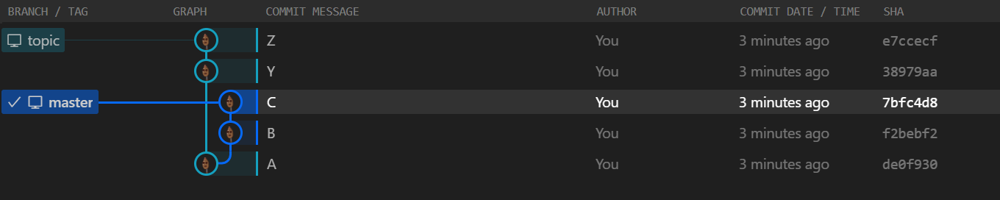

# はじめに

恥ずかしながら未だに Git のマージの挙動に慣れていないのですが、とりあえず以下を参考に挙動を確認してみた、という記事です。

- [Git のブランチ機能 - ブランチとマージの基本](https://git-scm.com/book/ja/v2/Git-%E3%81%AE%E3%83%96%E3%83%A9%E3%83%B3%E3%83%81%E6%A9%9F%E8%83%BD-%E3%83%96%E3%83%A9%E3%83%B3%E3%83%81%E3%81%A8%E3%83%9E%E3%83%BC%E3%82%B8%E3%81%AE%E5%9F%BA%E6%9C%AC)
- [Git のブランチ機能 - リベース](https://git-scm.com/book/ja/v2/Git-%E3%81%AE%E3%83%96%E3%83%A9%E3%83%B3%E3%83%81%E6%A9%9F%E8%83%BD-%E3%83%AA%E3%83%99%E3%83%BC%E3%82%B9)

なおここでは話を簡単にするためにコンフリクトは発生しないこととしています。
またブランチ戦略等のお作法も一旦忘れます。

# 前提条件

いろいろなオプションを指定したマージの挙動を確認したいので、まずは同じ初期状態を再現するためのコマンドを用意してみました。
master ブランチと topic ブランチに分岐してそれぞれ２つ Commit が進んだ状態になります。

```bash
mkdir temp
cd temp
git init

echo A > A.txt
git add .
git commit -m "A"

git branch topic

echo B > B.txt
git add .
git commit -m "B"

echo C > C.txt
git add .
git commit -m "C"

git checkout topic

echo Y > Y.txt
git add .
git commit -m "Y"

echo Z > Z.txt
git add .
git commit -m "Z"

git checkout master
```

この状態を元にいろいろなマージを試してみるのですが、その前後の状態を確認するために Visual Studio Code の [GitLens](https://marketplace.visualstudio.com/items?itemName=eamodio.gitlens) Extension を使用しています。

# ３方向のマージ 

まず先ほどの初期化コマンドを流した直後は以下の状態になっていました。



## merge

マージ先となる master ブランチ（コミット C）は、マージ元の topic ブランチ（コミット Z）の直接の祖先ではないため Fast-Forward のマージが出来ないはずです。
このため `--no-ff` オプションを付けて topic ブランチをマージすると、、、

```bash
git checkout master
git merge --no-ff topic
```

コミット C とコミット Z を親とするマージコミットが作成されます。
Topic ブランチで作成したコミット Y と Z も維持されていることが分かります。


# 何も考えずにマージ

`git reset` で以前の状態に戻してもいいのですが、ここでは別の歴史をつくります。
改めて、先ほどの初期化コマンドを流した直後は以下の状態になっていました。
このため各コミットのハッシュは変わっています。


## merge

特にオプションを付けずに master ブランチに対して topic ブランチをマージすると、、、

```bash
git checkout master
git merge topic
```

先ほどの `--no-ff` オプションを付けたマージと同じく、コミット C とコミット Z を親とするマージコミットが作成され、Topic ブランチで作成したコミット Y と Z も維持されていることが分かります。


`git merge` コマンドの [リファレンス](https://git-scm.com/docs/git-merge) によると、
既定では `--ff` オプションが指定されることになっているのですが、Fast Forward が可能な状態じゃないので、Non Fast Forward と同じ挙動になったということですね。


# 履歴を圧縮してマージ

改めて、先ほどの初期化コマンドを流した直後は以下の状態になっていました。


## merge

今度は `--squash` オプションを付けて master ブランチに対して topic ブランチをマージしてみましょう。

```bash
git checkout master
git merge --squash topic
```

master ブランチの HEAD （コミット C）を親とする、コミット Y や Z とは紐付かない新しい変更が追加され、未コミット状態になります。


## commit

この状態でコミットすると、、、

```bash
git commit 
```

コミット C のみを親とするコミットが作成されます。


このケースではコミット Y と Z の 2 つだけですが、作業中のブランチのコミット履歴が多くなりすぎると追いかけるのが大変なので、１つのコミットとして纏められるのは便利そうです。
ただ後から master 側の履歴を見ると（ topic ブランチとは紐付いていないので）、イキナリ master ブランチにコミットが追加されたような感じになっていますね。


# Fast Forward なマージ

改めて、先ほどの初期化コマンドを流した直後は以下の状態になっていました。


## rebase

topic ブランチのベースを master ブランチに合わせると、、、

```bash
git checkout topic
git rebase master
```

コミット Y と Z が C の後ろにぶら下がり、履歴が一本になります。
またコミット Y と Z のハッシュも書き換わっていることが分かります。
先祖が変われば子孫も変わるということでしょうか。


## merge

この状態で通常のマージをすると、

```bash
git checkout master
git merge topic
```

master ブランチの HEAD と topic ブランチの HEAD がどちらもコミット Z を指しすようになります。


後から見るとどこで作業が分岐したのかが分からず、マージが行われたのか否かもわからない、といったところでしょうか。

# リベースはするけどマージコミットが欲しい

改めて、先ほどの初期化コマンドを流した直後は以下の状態になっていました。


## rebase

topic ブランチのベースを master ブランチに合わせると、、、

```bash
git checkout topic
git rebase master
```

コミット Y と Z が C の後ろにぶら下がり、履歴が一本になります。


## merge

この状態で `--no-ff` オプションを付けてマージすると、、、

```bash
git checkout master
git merge --no-ff topic
```

コミット C とコミット Z を親とするマージコミットが作成され、master ブランチの HEAD が進みます。
コミット Y と Z は維持されておりハッシュは書き換わっていますが、 topic は Z を指し示したままになっています。


