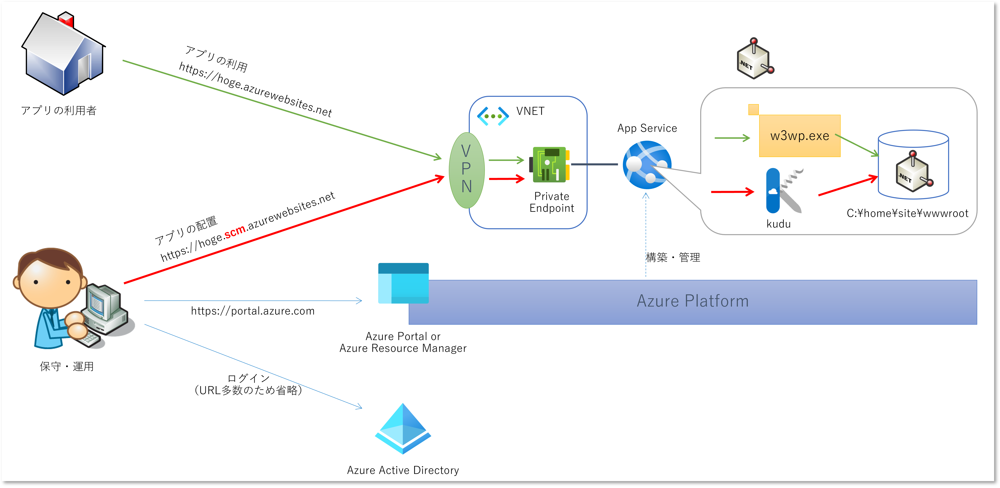
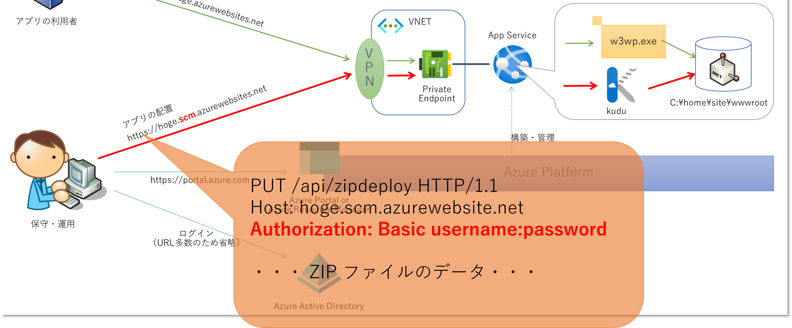
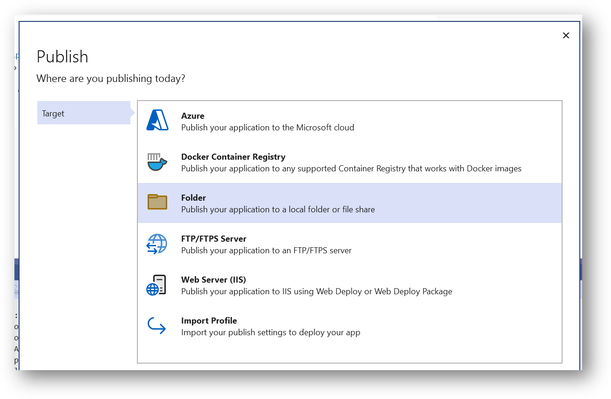
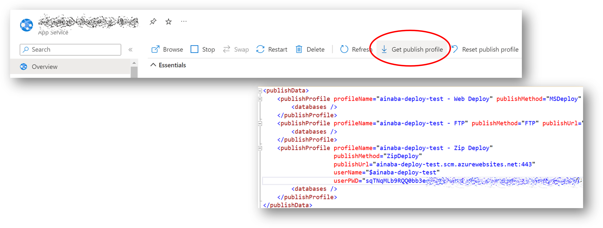

# はじめに

こちらで紹介している内容は、
**あくまでも一時的な回避策であって、全くおススメの方法とかではありません。**
折角調べましたし、同じような状況に陥って困る人もいるかもしれないので、記事にしてみましたが、
最終的にはどうにかして各種のブロッカー要因を取り除くことをおススメします。

# 問題の背景

昨今は Azure の Compute 系の PaaS もかなり種類が増えてきましたが、昔は Azure の PaaS といえば Azure App Service でした。
Web Apps とか Websites という名前で呼ばれたりもします。
最初期からあり歴史も長い故に機能追加と拡張を繰り返してきました。
が、基本的なアーキテクチャも安定しており、今現在でもおススメの PaaS です。
特に仮想ネットワークを使用した閉域化のオプションが充実して以降、企業内 IT での利用もかなり増えてきた印象です。

基本的な利用方法としては Azure 上に App Service を作成し、そこにユーザーが開発したアプリケーションコンテンツをデプロイするだけです。
App Service を作成した時点で Web サーバーやアプリケーションサーバーはセットアップされていますので、
あとは特定のディレクトリ、Windows 版であれば C:¥home¥site¥wwwroot、Linux 版であれば /home/site/wwwroot 配下にファイルを置いてあげれば良いわけです。
しかし仮想マシンとは異なり、直接リモートデスクトップ接続や SSH 接続することは出来ず、コンテンツを配置する方法が定められています。
その根幹を担っているのが 
[Kudu](https://learn.microsoft.com/ja-jp/azure/app-service/resources-kudu) 
というアプリケーションです.
Kudu 提供している GUI ないしは API に対してコンテンツを投げつけると、最終的には先ほどのディレクトリにコンテンツを配置してくれるわけです。

さて、ここからが本題です。
社内利用の Web アプリケーションの場合、App Service への接続経路はインターネットではなく、閉域ネットワークが必要とされることが多くなります。
Azure 仮想ネットワークを作成し、オフィス環境などからは VPN や ExpressRoute で接続、
[App Service の Private Endpoint](https://learn.microsoft.com/ja-jp/azure/app-service/networking/private-endpoint)
仮想ネットワーク内に設置することで Private IP アドレス経由で利用する、というのが代表的なアーキテクチャになります。



このようなアーキテクチャでは、アプリケーションの保守・運用を行う端末はセキュリティ制限が非常に厳しく、
インターネット上の様々なサイトにアクセスることができない、ということが往々にしてあります。
流石に App Service にアクセス出来なければどうしようもありませんが、
複雑怪奇なセキュリティルールにより Azure Potal や Azure Active Directory の一部あるいは部分的にアクセスできない、ということがたまによくあります。
本来でいえば保守・運用に必要な経路なので最終的にはどうにかしないといけないのですが、
ファイアウォールのルール変更とその申請・承認のプロセスを通すとなると時間がかかってしまう、というのが現実ではないでしょうか。
しかし開発・テストのスケジュールは待ってくれません。
どうしましょう。

# アプリ配置方式の選択

このような状況ではドキュメントに記載された様々な
[アプリケーションの配置方式](https://learn.microsoft.com/ja-jp/azure/app-service/deploy-run-package) 
のかなりの部分が制限を受けることに注意が必要です。

WebDeploy は Visual Studio ないしは msbuild.exe といったクライアントツールから実行することが一般的です。
保守・運用端末に Visual Studio や .NET SDK のインストールが許可されるとも思えません。
そもそも保守・運用業務を行う担当者がライセンス（Visual Studio Subscriber）を持っていない可能性もあります。
現実的ではないでしょう。

FTPS なら Windows Explorer から接続することも出来るので、専用のソフトウェアは不要です。
しかし Private Endpoint に対応しておらず、インターネット経由でアクセスする必要がありますので、根底から方針が覆ってしまいます。
ダメですね。

そもそも保守・運用端末のセキュリティ制限が厳しすぎてには Azure CLI や Azure PowerShell のインストールすらさせてもらえないかもしれません。
インストールできたとしても最初に Azure AD へのログイン(`az login` や `Connect-AzAccount`)が必要です。
Azure を利用するなら流石にこれはどうにかしてほしいところですが、先ほどの前提条件からするとこちらも除外します。

閉域化された App Service へのアプリのデプロイといえば、Github Actions の
[Self-hosted Runner](https://docs.github.com/ja/actions/hosting-your-own-runners/about-self-hosted-runners) や
Azure DevOps Pipeline の
[Self-hosted Agent](https://learn.microsoft.com/en-us/azure/devops/pipelines/agents/agents?view=azure-devops&tabs=browser#install)
です。
ただこれらはインターネットの先にあるクラウドサービス側にアウトバウンド接続が必要です。
とんでもないですね。

上記のような App Service へコンテンツを Push する方式ではなく、App Service から Pull すればいいかもしれません。
具体的には App Service for Conateiner、 OneDrive とのクラウド同期、あるいはソースコードレポジトリとの同期を使う方式などですが、
以下のような課題が発生することが想定されるので諦めます。

- 保守・運用端末から外部のリポジトリ等にアクセスする経路が追加で必要になるので敷居が上がる
- 外部リポジトリに配置用のコンテンツにアップロードする許可が出ない可能性がある
- 保守・運用端末から外部アクセスが制限されているのに App Service から外部リポジトリにアクセスしてよいのか
- App Service にリポジトリの情報を登録するのは Kudu ではなく Azure Resource Manager 経由なので無理では

# Kudu の Basic 認証によるアプリの配置

さてここまで一通りの選択肢を潰してきましたが、
幸いにして（？） Kudu は App Servie 上で単独で動く Web アプリケーションおよび Web API で、Private Endpoint をサポートしています。
また [Basic 認証にも対応](https://github.com/projectkudu/kudu/wiki/Accessing-the-kudu-service)しているので、
Azure AD 等の認証サービスにアクセスする必要もありません。
つまり 技術的には App Service まで HTTPS を飛ばす通信経路だけが確保できていれば、アプリのデプロイが可能ということです。
これであれば OS 標準搭載のブラウザから、あるいは Windows PowerShell の Invoke-RestMethod 、Windows コマンドプロンプトや Linux の Shell から利用できる curl で十分です。
おそらくこれが最後の手段でしょう。



## 配置用のアプリケーションコンテンツの準備

まず配置するコンテンツを作ります。
流石にこれは保守・運用端末で生成することはなく、開発環境のビルドマシンやソースコードリポジトリから取得することになるでしょう。
前述の c:\home\site\wwwroot に配置さえすれば動く状態のファイルをかき集めます。
.NET SDK なら `dotnet publish` コマンドで生成できます。
Visual Studio なら発行ウィザードで、出力先でフォルダーを選択します。
それ以外の開発環境や言語の場合はドキュメント等をご参照ください。



次にこれを Zip で固めておきます。
Explore の標準機能を使ってもいいですし、フリーソフトなどを使ってもいいでしょう。
コマンドラインでやるなら出力ディレクトリから以下のように実行します。

```powershell
# Bash
zip -r <file-name>.zip .

# PowerShell
Compress-Archive -Path * -DestinationPath <file-name>.zip
```

この Zip ファイルを配置端末に持ち込んでおいてください。

## Basic 認証で使用する資格情報

つぎにユーザー名とパスワードを準備します。
Azure Portal や Azure CLI 等が必要になりますので、アクセスが制限された保守・運用端末ではない、Azure の環境構築などが出来る端末などで実行します。

Azure Portal で行う場合は、App Service 開くと発行プロファイルをダウンロードできます。
こちらのファイルを開くと `publishMethod = ZipDeploy` である `publishProfile` がありますので、この `userName` および `userPWD` を控えておきます。



## Kudu Web UI を使用した ZipDeploy

Azure Portal は開けない前提なので、直接 Kudu の URL をブラウザに入力します。
通常の URL だと Azure AD 認証を要求されてしまうので、URL の最後に `basicauth` を付与します。

```
https://$webappName.scm.azurewebsites.net/basicauth
```

Basic 認証が要求されたら先ほどの発行プロファイルから控えたユーザー名とパスワードを入力します。
Kudu の画面が表示されたら、メニューから `Zip Push Deploy` を選択してください。
wwwroot のディレクトリ構造が表示されている辺りに、先ほど作成しておいた zip ファイルをドラッグアンドドロップしてやればデプロイ完了です。

## Kudu REST API を使用した ZipDeploy

運用環境への配置を毎回手動で実施するのは危険が危ないので、スクリプトによる自動化すると良いわけです。
先ほど Web UI から実施した ZipDeploy は [REST API](https://github.com/projectkudu/kudu/wiki/REST-API#zip-deployment) からも実行できます。
正確に言えば Web UI が内部的にこの REST API を使っているわけですが。

実行方法は簡単で Kudu の `/api/zipdeploy` パスに対して作成しておいた zip ファイルを HTTP PUT してやれば良いわけです。
その際に Basic 認証を通すためには HTTP リクエストの Authorization ヘッダーにユーザ名とパスワードを所定のフォーマットでくっつけてやる必要があります。

```powershell
$zipdeployUrl = "https://${webappName}.scm.azurewebsites.net/api/zipdeploy"

$userName = '$' + $webappName
$passWord = 'userPWD-from-publishprofile'
$authtoken = [Convert]::ToBase64String([Text.Encoding]::ASCII.GetBytes("${userName}:${passWord}"))
$header = @{ Authorization = "Basic ${authtoken}"}

Invoke-RestMethod -Method Put -Uri $zipdployUrl -Headers $header -InFile .\app.zip
```

curl でやる場合はもう少し簡単です。

```bash
curl -L -X PUT -u 'id:pass'  "https://webappName.scm.azurewebsites.net/api/zipdeploy --data-binary @./app.zip
```

# まとめ

App Service にアクセスできる経路さえあればアプリのデプロイが可能、というのはセキュリティ制限の厳しい環境では有効になるかもしれません。
あまりおススメしたくないとはいえ、「出来る」ことを知っているというのはいざというときの引き出しとしては重要だと思います。
この記事が皆様の参考になれば幸いです。
