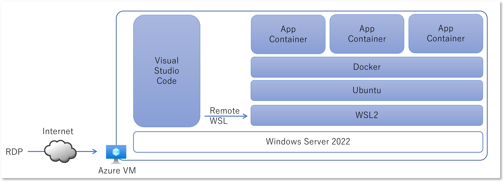
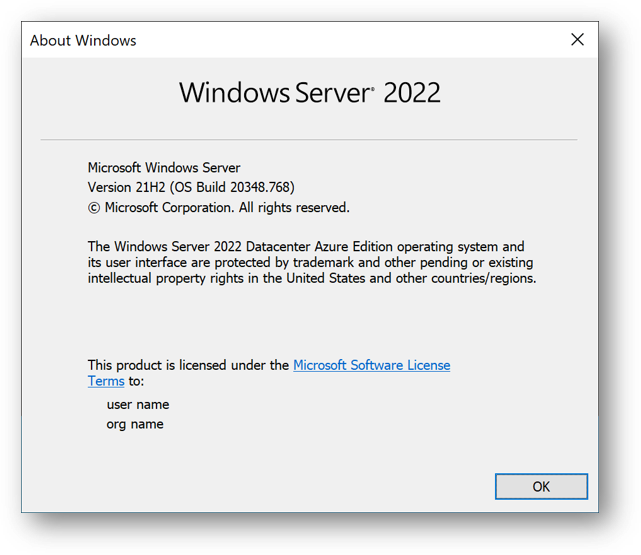
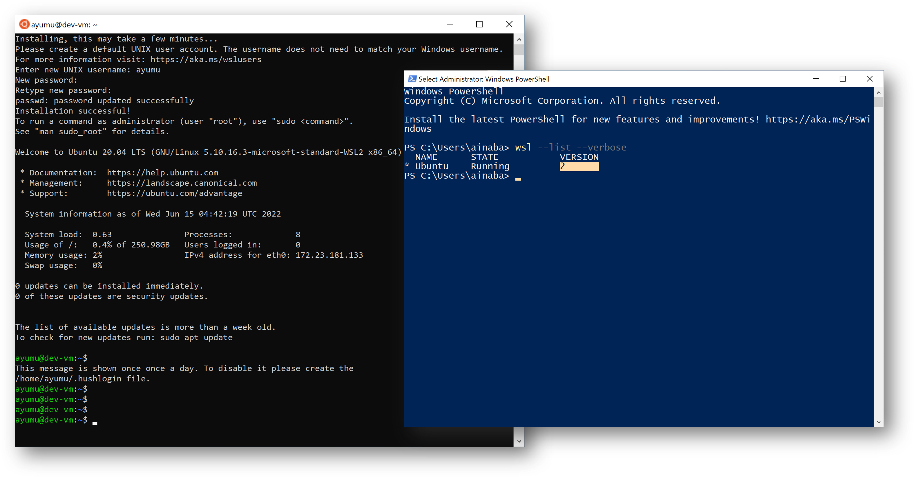
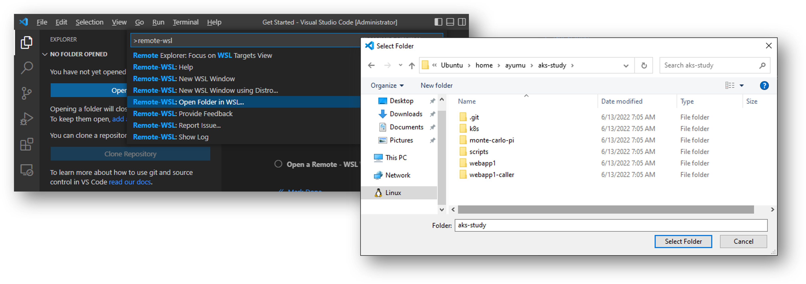

## はじめに

以前から割と気になっていたのですが Windows Server 上での LCOW : Linux Container on Windows はやり方がイマイチ安定せず、
これまでも紆余曲折を経つつ結局どうすればいいのか良くわからない状況だったと思います。
その辺の詳細は [こちら](https://zenn.dev/y_megane/articles/run-linux-container-on-windowsserver-20210722) などで紹介されています。

ところが、たまたま Twitter で ~~現実逃避~~ 情報収集をしていたところ、[下記の様な Tweet](https://twitter.com/EldenCluster/status/1529519883020832769) を見つけてしまいました。
これ、WSL2 に Docker インストールすればあっさり動くのでは？と思ったので試してみたら上手くいった、というのが本記事の趣旨になります。

<blockquote class="twitter-tweet"><p lang="en" dir="ltr">WSL2 now in Windows Server 2022!! WSL2 will be broadly available in the June cumulative update, for those looking to get it sooner it is available today by installing the 5C update here: <a href="https://t.co/ICZLBjz47j">https://t.co/ICZLBjz47j</a>...</p>&mdash; Elden Christensen (@EldenCluster) <a href="https://twitter.com/EldenCluster/status/1529519883020832769?ref_src=twsrc%5Etfw">May 25, 2022</a></blockquote> <script async src="https://platform.twitter.com/widgets.js" charset="utf-8"></script>

そもそも Linux コンテナなんだから Linux マシン上で動かせばいいじゃんというのは全くもってその通りなのですが、
コンテナの開発マシンを Azure 上に用意することを考えると、以下の観点でシンプルになるかなと思います。

- Windows PC よりも Windows Server の方がライセンス的な考慮がいらない（通常の Windows Server の従量課金で良い）
- 別途 Linux VM を作らなくて良いので管理とコストが楽になる

つまり下記の様なことがしたいわけです。



開発したコンテナイメージを Azure Container Registry で管理するなら同じ Azure リージョンから Push したほうが速くて安いですし、
Azure Kubernetes Service、Web Apps for Container、Azure Functions、Azure Batch、そして先日 GA した Azure Container Apps といった各種のコンテナアプリを動かすプラットフォームでテストもしやすいでしょう。
特に Enterprise 系のシステムですとこれらのサービスは Private Endpoint や VNET Injection 等を使用して閉域化されることが多いため、同じ VNET に接続できる Azure 仮想マシンで開発からテストまでやれると便利です。

## Azure 仮想マシンの作成

Windows Server 2022 な仮想マシンを作るところから始めます。
ポータルからポチポチやるとどのベースイメージが作られるかわかりにくいので、Azure CLI で作ってみます。

まずは利用できる VM イメージを確認してみましょう。
（実際にはもっと沢山でてきます）
なるべく最新版を選んで Windows Update と再起動の手間を省きたいものです。
本校執筆時点でも [June 14, 2022—KB5014678 (OS Build 20348.768)](https://support.microsoft.com/en-us/topic/june-14-2022-kb5014678-os-build-20348-768-3cec11a2-b5d6-40fa-b1f5-636283ccb7c4?preview=true) が最新みたいなので、
上記のリストで表示されている一番新しい `MicrosoftWindowsServer:WindowsServer:2022-datacenter-azure-edition:20348.768.220609` が良さそうですね。

```bash
$ az vm image list --publisher MicrosoftWindowsServer --offer WindowsServer --sku 2022-datacenter-azure-edition --all -o table

Offer          Publisher               Sku                                           Urn                                                                                                     Version
-------------  ----------------------  --------------------------------------------  ------------------------------------------------------------------------------------------------------  --------------------
WindowsServer  MicrosoftWindowsServer  2022-datacenter-azure-edition                 MicrosoftWindowsServer:WindowsServer:2022-datacenter-azure-edition:20348.469.220106                     20348.469.220106
WindowsServer  MicrosoftWindowsServer  2022-datacenter-azure-edition                 MicrosoftWindowsServer:WindowsServer:2022-datacenter-azure-edition:20348.473.220116                     20348.473.220116
WindowsServer  MicrosoftWindowsServer  2022-datacenter-azure-edition                 MicrosoftWindowsServer:WindowsServer:2022-datacenter-azure-edition:20348.524.220201                     20348.524.220201
WindowsServer  MicrosoftWindowsServer  2022-datacenter-azure-edition                 MicrosoftWindowsServer:WindowsServer:2022-datacenter-azure-edition:20348.587.220303                     20348.587.220303
WindowsServer  MicrosoftWindowsServer  2022-datacenter-azure-edition                 MicrosoftWindowsServer:WindowsServer:2022-datacenter-azure-edition:20348.643.220403                     20348.643.220403
WindowsServer  MicrosoftWindowsServer  2022-datacenter-azure-edition                 MicrosoftWindowsServer:WindowsServer:2022-datacenter-azure-edition:20348.707.220505                     20348.707.220505
WindowsServer  MicrosoftWindowsServer  2022-datacenter-azure-edition                 MicrosoftWindowsServer:WindowsServer:2022-datacenter-azure-edition:20348.768.220609                     20348.768.220609
```

また WSL は [BIOS で仮想化が有効になっていることや、CPU の機能などに一定の要件](https://docs.microsoft.com/ja-jp/windows/wsl/troubleshooting)があります。
よって Azure VM なら[入れ子になった仮想化（Nested Virtualization）](https://azure.microsoft.com/ja-jp/updates/nested-virtualization-in-azure/) をサポートする VM である必要があります。
各仮想マシンサイズで入れ子になった仮想化のサポート有無は[こちらのドキュメント](https://docs.microsoft.com/ja-jp/azure/virtual-machines/sizes-general)から確認できます。
例えば `Dv5` シリーズなどが該当します。

では下記の様なコマンドで仮想マシンをデプロイしていきます。
管理者パスワードを聞かれるので入力してください。

```bash
$ az group create --name container-dev-rg --location japaneast
$ az vm create --name dev-vm --resource-group container-dev-rg --admin-username admin --size Standard_D2_v5 \
               --image MicrosoftWindowsServer:WindowsServer:2022-datacenter-azure-edition:20348.768.220609 
```

## 開発環境の構築

前述の `az vm create` が正常終了すると Public IP Address が表示されているので、そちらを利用してリモートデスクトップ接続します。

```powershell
> mstsc /v:198.51.100.178
```

ここからは接続した RDP セッション内での作業になります。

### IE ESC の無効化

もう Internet Explorer は使わないのですが、この後の手順でインターネットアクセスする際に邪魔されることがあるので、IE ESC : Internet Explorer Enhanced Security Configuration を無効にしておきましょう。
Windows Server のデスクトップセッションに接続すると Server Manger が起動していると思いますので、そちらからすかさず無効化します。
[詳細な手順はこちら](https://docs.microsoft.com/ja-jp/troubleshoot/developer/browsers/security-privacy/enhanced-security-configuration-faq) などをご参照ください。

### Windows Server のバージョン確認

PowerShell ないしはコマンドプロンプトを起動して現在のバージョンを確認します。
もちろん `winver` でも構いません。

```powershell
> ver

Microsoft Windows [Version 10.0.20348.768]
```




### WSL : Windows Subsystem for Linux のインストール

次に WSL のインストールを行います。
すでに[英語版の公式ドキュメント](https://docs.microsoft.com/en-us/windows/wsl/install-on-server) には Windows Server 2022 用の手順が記載されていました。
日本語版もそのうち対応することでしょう。

```powershell
> wsl --install 

Installing: Virtual Machine Platform
Virtual Machine Platform has been installed.
Installing: Windows Subsystem for Linux
Windows Subsystem for Linux has been installed.
Downloading: WSL Kernel
Installing: WSL Kernel
WSL Kernel has been installed.
Downloading: Ubuntu
The requested operation is successful. Changes will not be effective until the system is rebooted.
```

上記の通り既定では Linux ディストリビューションとして Ubuntu がインストールされます。
私は特に拘りがないのでこのまま進めて再起動します。

```powershell
> shutdown /r /t 0
```

一度リモートデスクトップ接続が切れてしまいますが、少し間をおいて再接続しましょう。
すると自動的にペンギンアイコンで `wsl.exe` なコンソールが起動してセットアップが始まり、
その後 `Ubuntu` アイコンなコンソールが起動してセットアップが始まります。
上手くいくと Unix username と password の入力が求められますので、適宜入力してください。



また別途コマンドプロンプトないしは PowerShell から WSL のバージョンが 2 になっていることを確認しておきましょう。

```powershell
> wsl.exe --list --verbose

  NAME      STATE           VERSION
* Ubuntu    Running         2
```

### Docker のインストール

ここからは WSL2 で動作する Ubuntu コンソール上での作業です。
まず Ubuntu のバージョンを確認すると `20.04 LTS` でした。

```bash
$ cat /etc/os-release

NAME="Ubuntu"
VERSION="20.04 LTS (Focal Fossa)"
ID=ubuntu
ID_LIKE=debian
PRETTY_NAME="Ubuntu 20.04 LTS"
VERSION_ID="20.04"
HOME_URL="https://www.ubuntu.com/"
SUPPORT_URL="https://help.ubuntu.com/"
BUG_REPORT_URL="https://bugs.launchpad.net/ubuntu/"
PRIVACY_POLICY_URL="https://www.ubuntu.com/legal/terms-and-policies/privacy-policy"
VERSION_CODENAME=focal
UBUNTU_CODENAME=focal
```

対応する Linux ディストリビューション用の Docker のセットアップ手順を [公式ドキュメント](https://docs.docker.com/engine/install/ubuntu/) から探して実行してください。
とりあえずココでは一番楽そうなヤツでインストールします。

```bash
$ curl -fsSL https://get.docker.com -o get-docker.sh
$ sudo sh get-docker.sh
```

このあと滅茶苦茶 `docker` コマンドを打つことになるので、`sudo` なしで実行できるようにしておきます。
`docker` グループに自分を追加したあと、設定を反映するために一度 Ubuntu のターミナルを落とします。

```bash
$ sudo usermod -aG docker ${USER}
$ exit
```

再度起動した Ubuntu コンソールで `docker` サービスを起動して、テスト実行してみましょう。

```bash
$ sudo service docker start
 * Starting Docker: docker                                                                          [ OK ]

$ docker run hello-world
Unable to find image 'hello-world:latest' locally
latest: Pulling from library/hello-world
2db29710123e: Pull complete
Digest: sha256:80f31da1ac7b312ba29d65080fddf797dd76acfb870e677f390d5acba9741b17
Status: Downloaded newer image for hello-world:latest

Hello from Docker!
This message shows that your installation appears to be working correctly.

To generate this message, Docker took the following steps:
 1. The Docker client contacted the Docker daemon.
 2. The Docker daemon pulled the "hello-world" image from the Docker Hub.
    (amd64)
 3. The Docker daemon created a new container from that image which runs the
    executable that produces the output you are currently reading.
 4. The Docker daemon streamed that output to the Docker client, which sent it
    to your terminal.

To try something more ambitious, you can run an Ubuntu container with:
 $ docker run -it ubuntu bash

Share images, automate workflows, and more with a free Docker ID:
 https://hub.docker.com/

For more examples and ideas, visit:
 https://docs.docker.com/get-started/

```

### Visual Studio Code で開発する

ここまでで Linux コンテナの動作環境としてはセットアップが完了していますが、ここは開発環境ですので IDE が必要です。
[Visual Studio Code](https://code.visualstudio.com/) をインストールし、
さらに [Remote Development extension pack](https://marketplace.visualstudio.com/items?itemName=ms-vscode-remote.vscode-remote-extensionpack) もインストールします。

Visual Studio Code の Command Palette (Ctrl+Shift+p) から `Remote-WSL: Open Folder in WSL` を選択し、作業にディレクトリを指定すれば準備完了です。
もし Git リポジトリにソースコードが管理されているなら、別途 `git clone` しておいたディレクトリを選ぶだけですね



## まとめ

昨今は [Github Codespace](https://github.co.jp/features/codespaces) やら [vscode.dev](https://code.visualstudio.com/blogs/2021/10/20/vscode-dev) やら [Microsoft Dev Box](https://techcommunity.microsoft.com/t5/azure-developer-community-blog/introducing-microsoft-dev-box/ba-p/3412063) やら、開発ワークステーションとしてのクラウドサービスも拡充していく傾向にあり楽しい限りです。
一方で好き勝手にカスタマイズ可能な仮想マシンベースの開発環境も、まだまだ捨てがたいものがあると思いますので、本記事が参考になれば幸いです。


