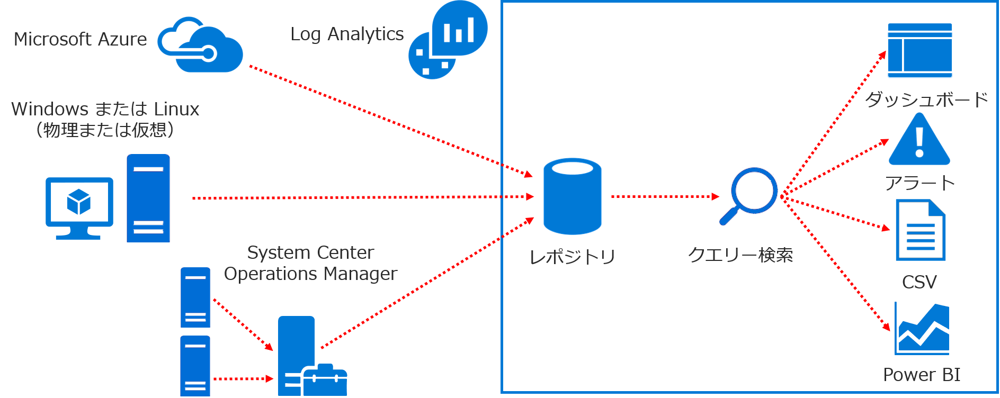

# Azure Monitor Log を使用したオンプレ環境のログ収集と解析

従来 Log Analytics と呼ばれていた Azure のサービスですが、
現在は Azure Monitor と呼ばれる監視系ソリューションの
[一部](https://docs.microsoft.com/ja-jp/azure/azure-monitor/azure-monitor-log-hub)
と位置付けられています。

意外と？誤解されやすいのですが Azure 上で発生するログを分析するためのサービスではなく、 
（Azure に限らず）任意の各種環境で生成されるログを分析するために Azure 上で動作しているサービスです。
端的に言うと、オンプレで動作する物理／仮想の PC やサーバー、Azure 以外で動作する仮想マシンなどを対象とすることが可能です。

## アーキテクチャ

Azure Monitor は各種ノード（PC やサーバー）にインストールされたエージェントがログを収集、インターネット経由で Azure にログを送信します。
つまり理論上は以下の 2 点がクリアできれば任意の環境を対象としたログ解析が可能です。
- エージェントが動作するプラットフォームであること
- インターネットへの接続経路があること
また各ノードが直接送信せずとも、System Cener Operations Manager が既に導入されている環境であれば、
SCOM を中継地点としてログをかき集めることも可能です。

## Microsoft Monitoring Agent のインストール

