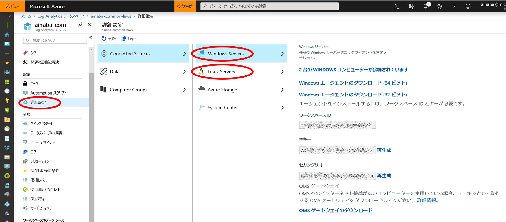

# Azure Monitor Log を使用したオンプレ環境のログ収集と解析

従来 Log Analytics と呼ばれていた Azure のサービスですが、
現在は Azure Monitor と呼ばれる監視系ソリューションの
[一部](https://docs.microsoft.com/ja-jp/azure/azure-monitor/azure-monitor-log-hub)
と位置付けられています。

意外と？誤解されやすいのですが Azure 上で発生するログを分析するためのサービスではなく、 
（Azure に限らず）任意の各種環境で生成されるログを分析するために Azure 上で動作しているサービスです。
端的に言うと、オンプレで動作する物理／仮想の PC やサーバー、Azure 以外で動作する仮想マシンなどを対象とすることが可能です。

## アーキテクチャ

Azure Monitor は各種ノード（PC やサーバー）にインストールされたエージェントがログを収集、インターネット経由で Azure にログを送信します。
つまり理論上は以下の 2 点がクリアできれば任意の環境を対象としたログの収集が可能です。

- エージェントが [動作するプラットフォーム](https://docs.microsoft.com/ja-jp/azure/azure-monitor/platform/log-analytics-agent#supported-windows-operating-systems) であること
- インターネットへの HTTPS 接続経路（Port 443）があること

また各ノードが直接送信せずとも、System Cener Operations Manager が既に導入されている環境であれば、
SCOM を中継地点としてログをかき集めることも可能です。
ログがデータベースに格納されれば、あとはクエリをかけたり、可視化したり、といったような形で分析をすればよいだけです。

本記事ではオンプレミス Windows 環境を対象としたログの収集・解析の一連の流れを紹介したいと思います。
（単に私が Windows PC しか持ってないからという話でもあります）

## エージェントのインストール

Azure 上に Log Analytics ワークスペースを作成したら、次はエージェントのインストールです。詳細設定の画面から Windows 用、Linux 用のエージェントをダウンロードすることが可能ですので、こちらをインストールします。

Windows 上にインストールを行うとコントロールパネルから Microsoft Monitoring Agent の状態が確認することができます。
この後、実際に分析を行うわけですが、ある程度ログが貯まっていないとあまり面白くありませんので、
試せる PC やサーバーに

