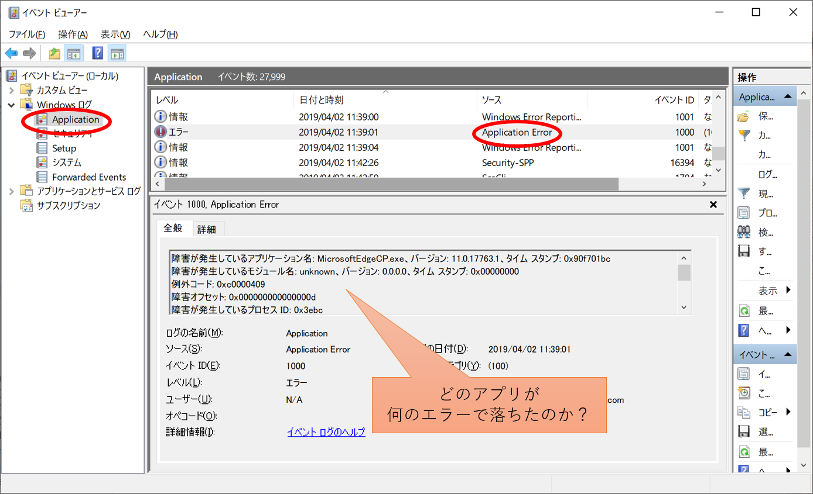
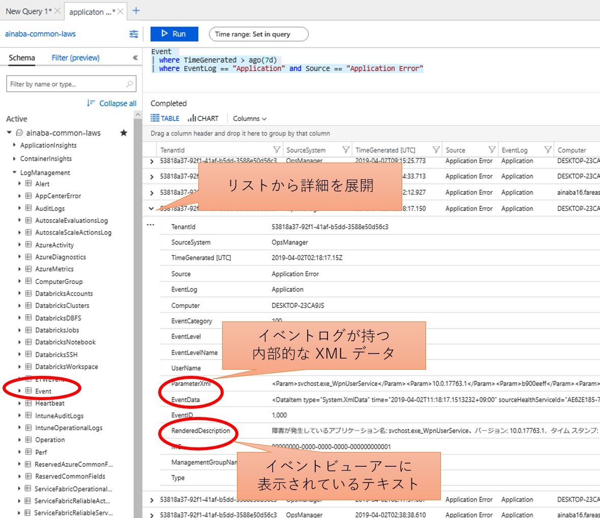
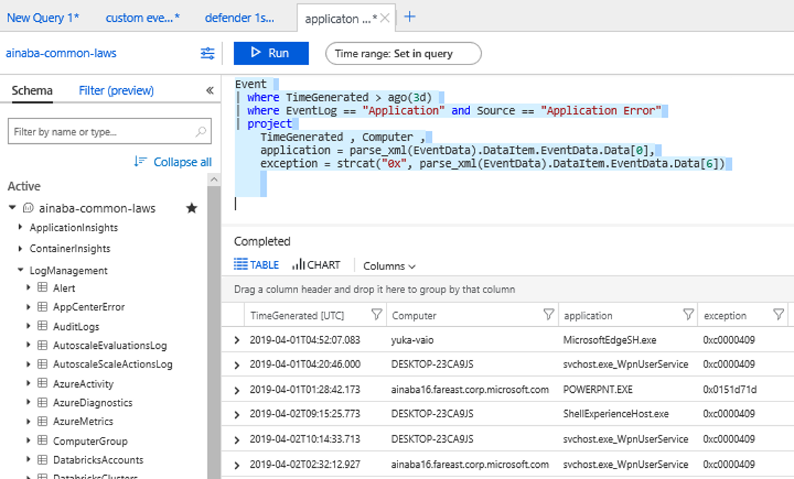
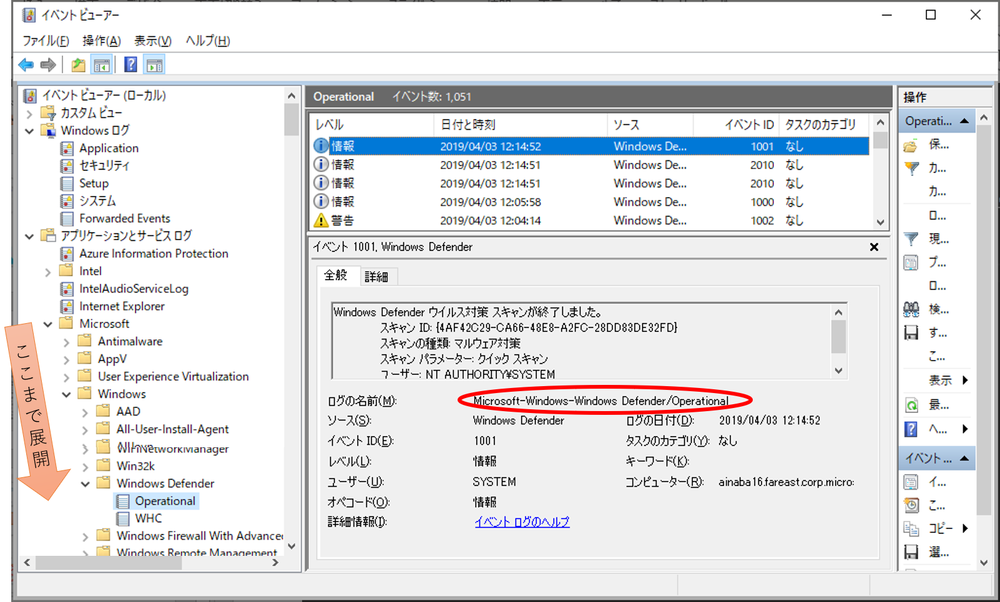
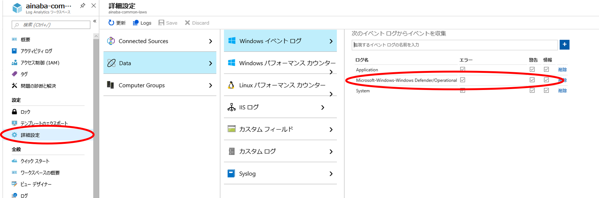
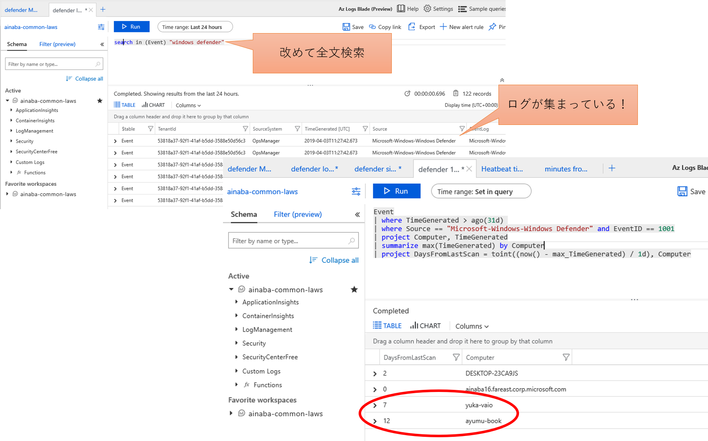

## はじめに

従来 Log Analytics と呼ばれていた Azure のサービスですが、
現在は Azure Monitor と呼ばれる監視系ソリューションの
[一部](https://docs.microsoft.com/ja-jp/azure/azure-monitor/azure-monitor-log-hub)
と位置付けられています。

意外と？誤解されやすいのですが Azure 上で発生するログを分析するためのサービスではなく、 
（Azure に限らず）任意の各種環境で生成されるログを分析するために Azure 上で動作しているサービスです。
端的に言うと、オンプレで動作する物理／仮想の PC やサーバー、Azure 以外で動作する仮想マシンなどを対象とすることが可能です。

## アーキテクチャ

Azure Monitor は各種ノード（PC やサーバー）にインストールされたエージェントがログを収集、インターネット経由で Azure にログを送信します。
つまり理論上は以下の 2 点がクリアできれば任意の環境を対象としたログの収集が可能です。

- エージェントが [動作するプラットフォーム](https://docs.microsoft.com/ja-jp/azure/azure-monitor/platform/log-analytics-agent#supported-windows-operating-systems) であること
- インターネットへの HTTPS 接続経路（Port 443）があること

また各ノードが直接送信せずとも、System Cener Operations Manager が既に導入されている環境であれば、
SCOM を中継地点としてログをかき集めることも可能です。
ログがデータベースに格納されれば、あとはクエリをかけたり、可視化したり、といったような形で分析をすればよいだけです。


本記事ではオンプレミス Windows 環境を対象としたログの収集・解析の一連の流れを紹介したいと思います。
（単に私が Windows PC しか持ってないからという話でもあります）

## エージェントのインストール

Azure 上に Log Analytics ワークスペースを作成したら、次はエージェントのインストールです。詳細設定の画面から Windows 用、Linux 用のエージェントをダウンロードすることが可能ですので、こちらをインストールします。


Windows 上にインストールを行うとコントロールパネルから Microsoft Monitoring Agent の状態が確認することができます。
この後、実際に分析を行うわけですが、ある程度ログが貯まっていないと面白くありませんので、
試せる PC やサーバーを何台か選んでエージェントを仕込んだ後、数日様子を見ることをお勧めします。


私は ~~嫁と子供に内緒で~~ 自宅で管理している PC が 4 台ほどあったので、それらにインストールして数日様子を見ました。

## 蓄積されたログの分析

蓄積されたログは Azure ポータルからクエリをかけることが出来るようになります。
エージェントは Windows サービスとして常駐し、起動中には Log Analytics ワークスペースに対して定期的に通信を行います。 
これは Heartbeat と呼ばれ、この通信が受信できているということは、少なくともそのマシンが起動してログが収集できていることが確認できます。
下記がその Heartbeat を特に加工せずクエリした例になります。


Log Analytics ワークスペースでは
[Kusto](https://docs.microsoft.com/ja-jp/azure/azure-monitor/log-query/query-language)
というクエリ言語を使用して解析を行うのですが、言語そのものの詳細は公式ドキュメントに譲るとして
以降ではいくつかのサンプルを紹介していきたいと思います。

### マシンの使用状況を見てみよう

まずは先ほどの Heartbeat をもう少しまじめに分析してみましょう。

```
Heartbeat
| where TimeGenerated > ago(7d)
| summarize count() by bin(TimeGenerated, 1h), Computer
| render barchart 
```

このクエリでは以下のような処理を行っています。

- ハートビートの中から
- タイムスタンプが 7 日前の日時よりも大きいもの（＝過去 1 週間以内のログ）を抽出し
- コンピューター単位 および 1 時間単位でその件数を数え
- さらにそれを棒グラフで表示する

実行結果は下記のようになります。


この図からは「ainaba16（薄い緑）」と「DESKTOP-23（薄い青）」という 2 台が支配的であることがわかります。
前者は私が仕事で使用しているマシンなので、常に使っている状態ではあるのですが、土日深夜には起動していないことがわかります。サラリーマンとして健全ですね。
日中でも途切れている時間帯がありますが、仕事中は移動も多いのでその時はオフラインになっているからでしょうか。さぼっているわけではありません。

後者は子供たちが使用している共用マシンなのですが、ほぼずーっと Heartbeat が届いていますね。
自宅にあるのでほぼオンラインであることは問題ないのですが、そもそも 1 日 1 時間までというルールになっているはずなのですが、これはいったいどういうことなのでしょうか？

もう 2 台、ところどころに現れる紫や紺のプロットは私と妻の自宅においてある PC です。
日中はお互い仕事をしており会社のマシンを使用している時間帯ですので、帰宅してから夜ちょこっと触るくらいしかできません。
使用状況としてはこんなものでしょうか。
ちょっともったいないので、どちらか 1 台はリタイアしてもいいのかもしれません。
ただ使用時間がほぼ同じタイミングなので、それも難しいでしょか・・・。

### なんかパソコン調子が悪いらしい

家族からは「最近パソコンの調子が悪い（からなんとかしろ）」というクレームを良くいただきます。
調子悪いって具体的になんだよ、と聞いてもまともな回答は帰ってきません。
困ったものです。アプリでもクラッシュしているのでしょうか？

Windows ではアプリケーションが異常終了した場合には、下記のようにイベントログが記録されているはずです。



ではこのログを Azure Monitor で探してみましょう。
今度は Heartbeat ではなく Event を使用して、まずは目的のログだけを抽出してリストで出してみます。

```
Event 
| where TimeGenerated > ago(7d)
| where EventLog == "Application" and Source == "Application Error"
```

- Event の中から
- 過去一週間ものを抽出し
- さらにイベントログが Application でソースが Application Error のもの



詳細データは XML か文章の中から抽出しないとダメそうですね。
これは若干気合が必要そうです。

```
Event 
| where TimeGenerated > ago(3d) 
| where EventLog == "Application" and Source == "Application Error"
| project
    TimeGenerated , Computer ,
    application = parse_xml(EventData).DataItem.EventData.Data[0],
    exception = strcat("0x", parse_xml(EventData).DataItem.EventData.Data[6])
```
- Event の中から
- 過去 3 日以内のものを抽出し
- さらにイベントログが Application でソースが Application Error のものを抽出し
- XML の文字列データをパースしたものから要素を抽出して射影する

という気合の結果は以下のようになります。



何種類かのアプリケーションがエラーコード 0xc0000409 で落ちてますね。
これは スタック バッファ オーバーラン でしょうか。
ブログなんて書いてないで帰宅してトラブルシュートしなければいけないような気がしてきました。

もうひとつ Power Point が妙なクラッシュをしていますね。
このエラーコードはインターネットで検索してもいまいち見つかりません。
あんまり続くようであればサポートに問い合わせたほうが良さそうです。

~~ブログを書くためだけにエージェントを仕込んだのですが、ちょっと気が滅入ってきました・・・~~


### ちゃんとウイルスチェックしてる？

気を取り直して、パソコンのウイルススキャンがちゃんと行われているか確認してみましょう。
いちいち私がパソコンにログインして手動でスキャンするのも手間ですし。
各パソコンには Windows Defender が動作しているはずなので、
ウイルススキャンが行われていれば以下のようなイベントログが記録されるはずです。

[こちら](https://docs.microsoft.com/ja-jp/windows/security/threat-protection/windows-defender-antivirus/troubleshoot-windows-defender-antivirus)
のドキュメントによれば `MALWAREPROTECTION_SCAN_COMPLETED` というログが記録されるようですね。
イベントビューアーで確認すると下記のようになります。



では Log Analytics で検索してみま1001

```
search in (Event) "windows defender" 
```

とりあえず全文検索をかけてみると、おそらくログが見つからないではないかと思います。
イベントビューアーで確認した通り Windows Defender の出力するログは Application ログではありません。
このようなカスタムログは、エージェントの既定の設定では収集されないので、明示的に収集対象となるように設定してやる必要があります。



ログの名前はイベントビューアーから確認したものをそのまま入力してやれば OK です。
このようにワークスペース側で設定してやれば、そこに接続しているエージェントが自動的に収集を始めてくれます。
各パソコンに設定して回る必要はないのでこれは楽ちんです。

ログが集まるまで数日待って、改めてクエリをかけてみましょう。
まずは前述の全文検索のクエリをかけてログが集まっていることを確認します。



```
Event
| where TimeGenerated > ago(31d) 
| where Source == "Microsoft-Windows-Windows Defender" and EventID == 1001
| summarize max(TimeGenerated) by Computer
| project DaysFromLastScan = toint((now() - max_TimeGenerated) / 1d), Computer
```

- Event の中から
- 過去 1 か月以内のものを抽出し
- さらにソースが Windows Defender でイベント ID が 1001 のものを抽出し
- 各コンピューターごとに最大のタイムスタンプ（＝もっとも最近のイベント）を集計
- 経過日数がわかるように現在日付から引き算する

4 台のうち 2 台のパソコンは 1 週間以上ウイルススキャンが行われていないことが判明しました。
この 2 台はハートビートの解析でも利用時間が少なかったものですので、おそらく短時間の使用中にスキャンが発生しないのでしょう。
やっぱり早く帰ってメンテナンスしなければならなさそうですね orz


## まとめ

本ブログでは 4 台のパソコンを使用してログ解析を行ってみましたが、やり方そのものはサーバーでも同様です。
管理対象の PC や サーバーの台数が多くなってくると、横断的にクエリがかけられることのメリットは非常に大きくなります。

ログ解析をしたくとも、具体的な要件まで明確に決まっているというケースは意外と少なかったりします。
しかしこの記事で紹介したように、収集するログ、あるいはクエリは後からでも追加・修正が可能です。
机上で出来る出来ないを評価する前に、まずはエージェントを導入してみていろいろ触ってみることをお勧めします。

本記事が皆様の運用負荷の軽減になれば幸いです。

