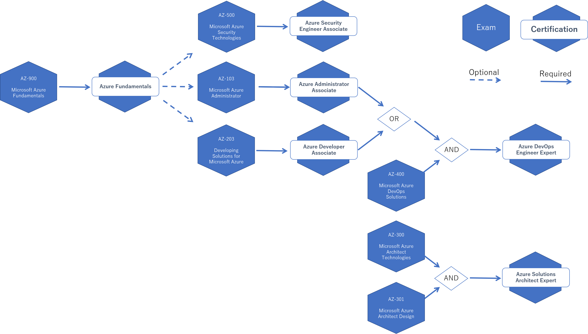

## はじめに

どの MCP 試験（[Exam](https://www.microsoft.com/en-us/learning/azure-exams.aspx)）に合格すれば
どの資格（[Certification](https://www.microsoft.com/en-us/learning/browse-all-certifications.aspx)を貰えるのか
良くわからなくなってきたのでちょっとまとめてみました。
自分用の整理なので興味があるものにだけ絞っています。
最近の MCP は変化が早くてしょっちゅう変わるので、あくまでも本記事を執筆した時点のものです。

## Application and Infrastructure 系列

まだ全部の Certification を取ったわけではないので偉そうなことは言えませんが、実際に Azure を利用されている方であれば、まずは受けてみることをお勧めします。
昔の MCP は 「そんなもん暗記してねーよ？！」 みたいな  **知識** を問われる問題があって苦労したのですが、問題自体が結構実用的になってきた印象です。

### 独断と偏見によるお勧め

Azure Solutions Architect Expert で求められる AZ-300 試験なんかは **実習** がありますので、実務で使ってない人には Expert 系列は相当厳しいのではないでしょうか。すでにバリバリ使っている人ならあっさり受かってしまうかもしれませんが。

これまで Azure を全然使ってこなかったけどこれからチャレンジするよ、すでに Azure 使い始めたけど基本をしっかり押さえておきたいよ、っていう人はまずは Associate を目指すと良いのかなと思います。

実際には Azure を使うわけじゃない（エンジニアじゃないとか）けどちょっとはクラウドも知っておかないと、っていう人はまずは Fundamentals を目指すと良いのかなと思います。

