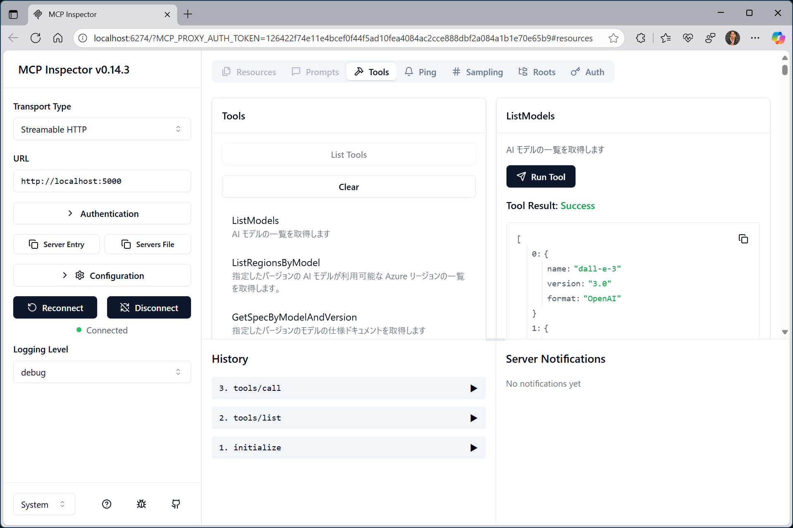
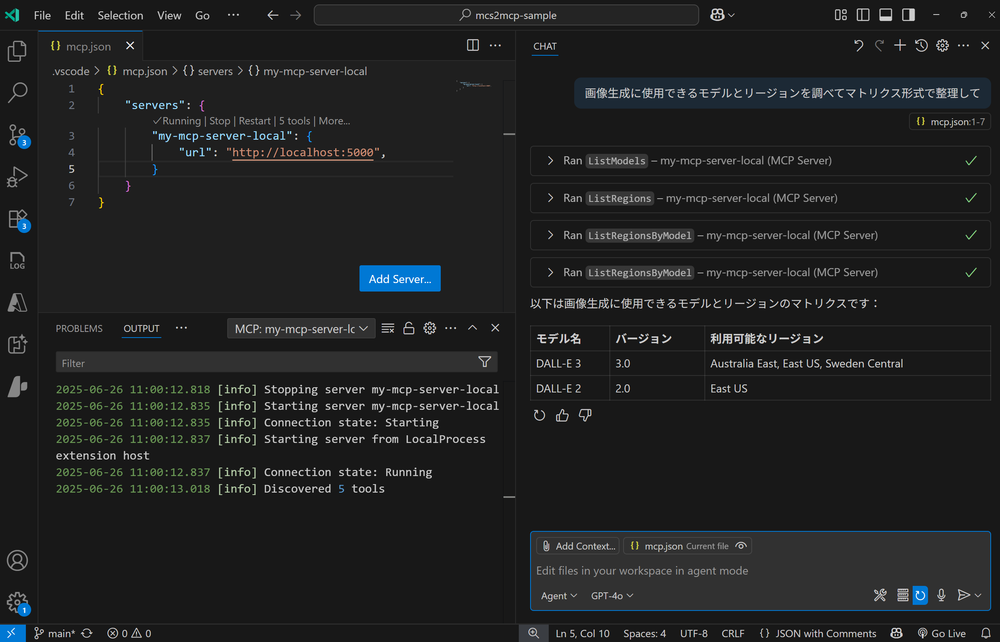
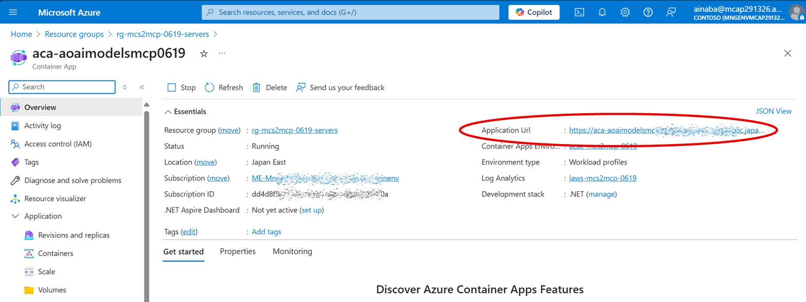
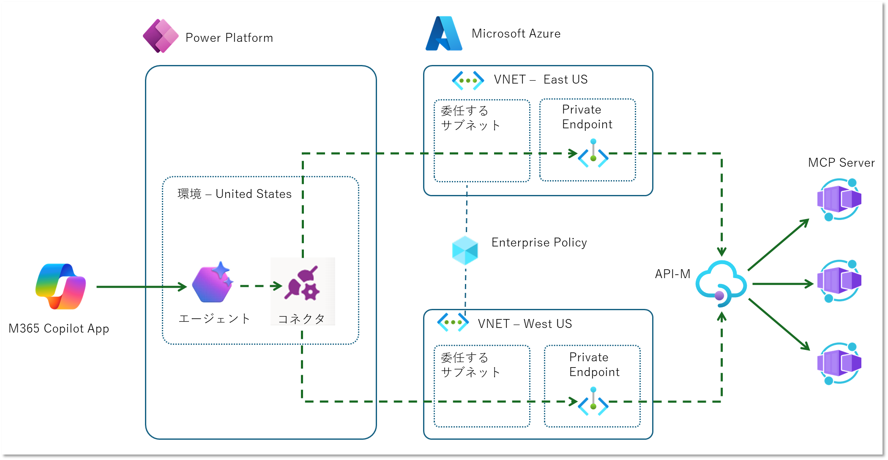
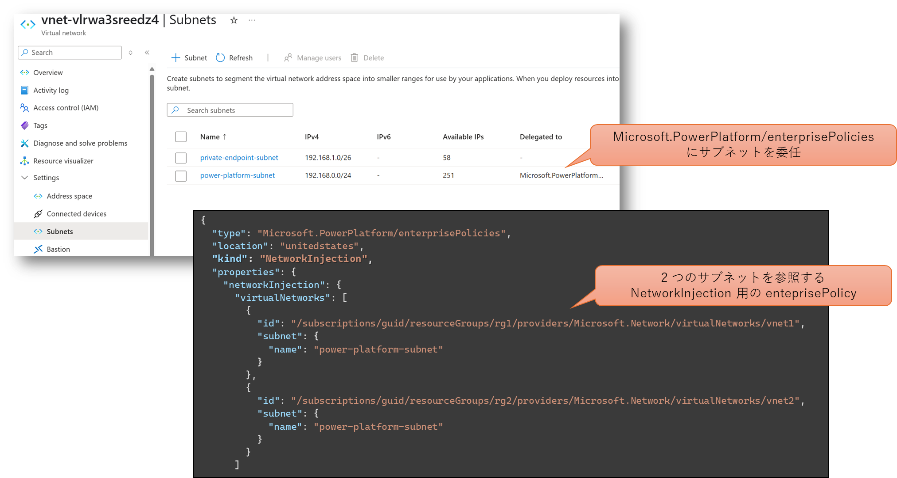
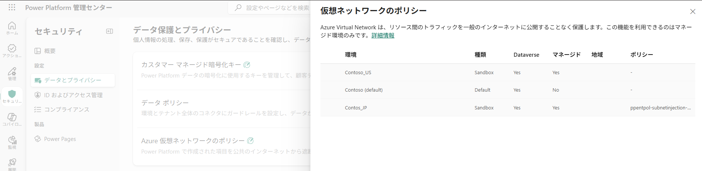
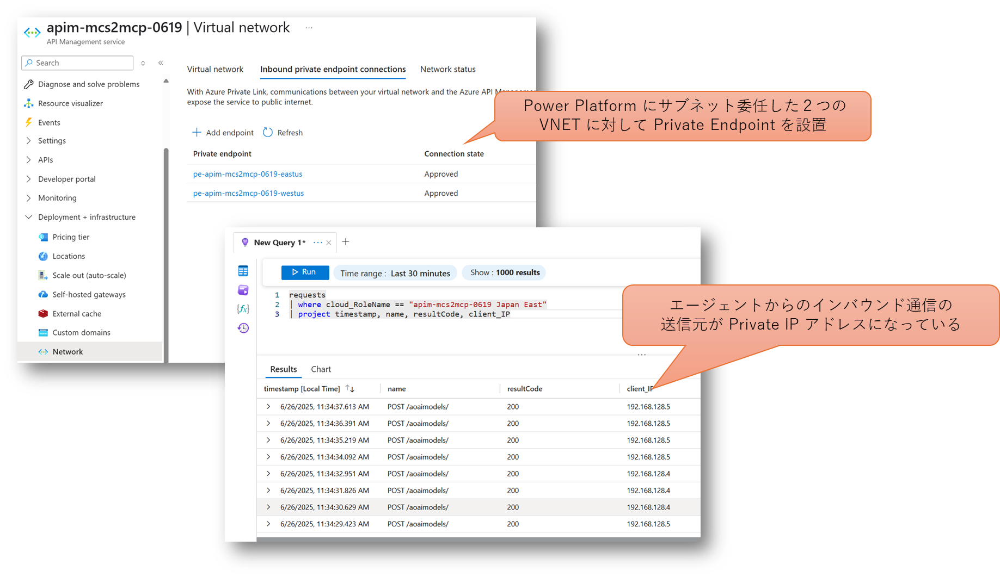

## はじめに

ここ最近 MCP : Model Context Protocol を調査したり調べていたりしたわけですが、その中で生まれたいくつかの疑問点として以下のようなものがありました。

- MCP 自体は IT 技術者だけに恩恵のある技術じゃないはずだけど、現状 IT 技術者に向けた情報が多い（仕方ないとは思うけど）
- Claude Desktop などは IT 技術者向けというほど特化してないけど、MCP の設定周りや管理周りは非技術者には厳しくないか
- ローカル PC で動作する MCP サーバーが多く、その出荷元の信頼性、アクセストークンを渡すのはリスクは無視されがちでは

安全に使用できる MCP なアーキテクチャってどんなもんだろうなと考えていたのですが、Microsoft Copilot Studio （以降 MCS）カスタムエージェントの MCP 対応が１つの答えになるかもと思っています。
~~サラリーマンですし。~~
ということで今回の記事はいろいろ試してみた雑記です。
結論としては微妙な部分もあり、これがべスプラですとかいうつもりはないですが、今後の改善とかで良くなっていくといいなあという期待。

### 目次

- [アーキテクチャ概要](#アーキテクチャ概要)
- [MCP Server on Azure](#mcp-server-on-azure)
- [M365 Copilot Agent as MCP Client](#m365-copilot-agent-as-mcp-client)
- [セキリティの考慮](#セキュリティの考慮)
- [まとめ](#まとめ)

## アーキテクチャ概要

まず、ざっくりした構成を考えてみます。


MCP という観点で調査をしていくと Visual Studio Code の GitHub Copilot Agent Mode や Claude Desktop など多数の選択肢が見つかりますが、
企業や組織における一般ユーザー（非エンジニア）を対象とした場合に、そもそも扱いやすいエージェント（MCP クライアントやホスト）って何だろう？と考えた場合、M365 Copilot は１つの選択肢でしょう。
既に Microsoft 365 が導入され組織として管理・運用されているケースではシームレスに組み込むことが出来ると思います。

そのうえで考慮すべきポイントとしては以下のようなものがあげられます。

- 独自作成した MCP サーバーを Azure でホストするのに適切なサービスは？
- 不正なクライアントから MCP サーバーへのアクセスを防ぐには？
- 野良 MCP サーバーを発生させないためには？
- うっかりエージェントが不正な MCP サーバーにつながないためには？

## MCP Server on Azure

主題が MCP サーバーということで、今回のようなアーキテクチャにおいて独自開発した MCP サーバーをどこでホストして行くべきかを考えてみます。
まあタイトルのように Microsoft Azure に誘導する流れなわけですが、特にセキュリティ面のメリットが大きいです。

- M365 も Azure もともに Entra ID を認証基盤として統一されており、アクセス制御回りが管理しやすい
- エージェントから MCP サーバーへの通信を VNET で閉域化出来るため、MCP サーバーをインターネットに晒さずに済む
- MCP サーバーから VNET を通じてオンプレリソースや外部インターネットへのアクセス制御も可能

M365 Copilot を前提に考えた場合、あえて外部にホストするメリットがあまりないというところでしょうか。

### MCP サーバーを開発する

昨今 MCP サーバーを開発するための SDK やらフレームワークは様々あると思いますが、現時点で Azure 上でホストすることを考えると、
[本家 Anthropic が提供している SDK](https://modelcontextprotocol.io/introduction) か、
[Azure Functions の MCP ツールバインディング](https://learn.microsoft.com/ja-jp/azure/azure-functions/functions-bindings-mcp?pivots=programming-language-csharp)
になるかと思います。
Azure Functions の MCP サーバーの開発としてはとても便利なんですが、その特性から標準入出力（STDIO）に対応できず HTTP を使用したリモート MCP のみとなります。
上記のアーキテクチャを鑑みた場合にはリモートのみでも問題ないと言えばないのですが、現状まだ SSE にしか対応していないことと、開発中は STDIO の方が動作確認やテストが便利です。
また MCP 自体もまだ過渡期と言える段階ですので、全てのプロトコルに対応し、かつ アップデートの早い本家の SDK の方に軍配が上がるかなと思います。

### サンプルコード（C#）

インターネットを検索すればサンプルコードはたくさん見つかりますが、ここでは C# のサンプルだけ紹介しておきます。
.NET としてはどちらも通常の Console アプリケーションになりますが、STDIO と HTTP の２つのプロトコルに対応するためにはホストの組み立てが異なってきます。
両対応させるなら MCP ツールとしてのコアロジックも [Dependency Injection](https://learn.microsoft.com/ja-jp/dotnet/core/extensions/dependency-injection) できるサービスとして作っておくといいでしょう。

まずは標準入出力を使うケースです。

```csharp
private static IHost BuildStdioServer(string[] args)
{
    var builder = Host.CreateApplicationBuilder(args);

    // ログを標準出力に出すと MCP の RPC-JSON と混じるので全て標準エラーに出す（コンソールにログに出さないようにしてもいいが、それはそれで不便）
    builder.Logging.AddConsole(opt =>
    {
        opt.LogToStandardErrorThreshold = LogLevel.Trace;
    });

    // OpenTelemetry を使用して Application Insights にログを出力する場合
    var tracerProvider = OpenTelemetry.Sdk.CreateTracerProviderBuilder()
        .AddAzureMonitorTraceExporter()
        .Build();
    var metricsProvider = OpenTelemetry.Sdk.CreateMeterProviderBuilder()
        .AddAzureMonitorMetricExporter()
        .Build();
    builder.Logging.AddOpenTelemetry(otlopt =>
    {
        otlopt.AddAzureMonitorLogExporter();
    });

    // 標準入出力を使用して、指定したクラスに記載されたツール（後述）を使用するように MCP サーバーを追加
    builder.Services
        .AddMcpServer()
        .WithStdioServerTransport()
        .WithTools<AoaiModelsServerTool>();

    // MCP のコアロジック部分（後述）もサービスとして追加
    builder.Services.AddSingleton<IAoaiModelInfoService, AoaiModelInfoService>();

    return builder.Build();;
}

```

HTTP を使用したい場合はこちら。

```csharp
private static IHost BuildHttpServer(string[] args)
{
    // 通常の ASP.NET Core アプリケーションと同様の組み立て
    var builder = WebApplication.CreateBuilder(args);

    // OpenTelemetry を使用して Application Insights へログやメトリックを転送
    builder.Services
        .AddOpenTelemetry()
        .UseAzureMonitor();

    // 標準入出力を使用して、指定したクラスに記載されたツール（後述）を使用するように MCP サーバーを追加
    builder.Services
        .AddMcpServer()
        .WithHttpTransport()
        .WithTools<AoaiModelsServerTool>();

    // MCP のコアロジック部分（後述）もサービスとして追加
    builder.Services.AddSingleton<IAoaiModelInfoService, AoaiModelInfoService>();

    var host = builder.Build();
    host.MapMcp();

    host.Services.GetRequiredService<ILogger<Program>>()
        .LogInformation("Starting AoaiModelsMcp Server as HTTP mode.");
    return host;
}
```

どちらの場合も ```IHost.Run()``` メソッドでサーバーが起動して MCP の待機状態になります。

さて上記の２つのコード参照されていたツール部分は以下のような実装になります。
このツールの実装方法の紹介が主題ではないので大まかな構成だけですが。

```csharp
// エージェントに通知されるスペックを Attribute で記載していく（ここが重要）
[McpServerToolType]
[Description("Azure で提供される各種の AI 言語モデルの情報を提供します")]
public class AoaiModelsServerTool
{
    // 実装部分は依存関係として挿入する
    private readonly IAoaiModelInfoService _infosvc;
    private readonly ILogger<AoaiModelsServerTool> _logger;

    public AoaiModelsServerTool(
        IAoaiModelInfoService infosvc,
        ILogger<AoaiModelsServerTool> logger)
    {
        _infosvc = infosvc;
        _logger = logger;
    }

    // 個々のツールのロジックをここで実装しても良いが、DI で挿入したインタフェースに転送するだけにしておいた方が後々取り回しが良い
    [McpServerTool]
    [Description("AI モデルを提供する Azure リージョンを取得します")]
    public IEnumerable<string> ListRegions()
    {
        _logger.LogInformation("ListRegions invoked");
        return _infosvc.ListRegions();
    }

    // 以下省略
}
```

各ツールの実装はサービスとして外部に切り離しているので、そちらの実装イメージがこちら。

```csharp
// McpServerToolType および McpServerTool で使用するためのインタフェースと実装
public interface IAoaiModelInfoService
{
    IEnumerable<string> ListRegions();
    // 以下省略
}

public class AoaiModelInfoService : IAoaiModelInfoService
{
    private ILogger<AoaiModelInfoService> _logger;
    public AoaiModelInfoService(ILogger<AoaiModelInfoService> logger)
    {
        _logger = logger;
    }

    public IEnumerable<string> ListRegions()
    {
        // ここでロジックを実装
    }

    // 以下省略
}
```

サービスとして切り離すことで実装としては若干煩雑になるのですが、以下のメリットがあります。

- MCP サーバーだけでなく普通の Web API としても流用できる（逆もしかり）
- Functions も DI を使用しているので、後で MCP ツールバインドに切り替えることも出来る
- 大変な実装部分は一般的なプログラミングスキルで対応できる
- 単体テストがやりやすい

### 開発端末上での稼働確認

さてコードが出来たらちゃんと動くのかを確認しておきたいですよね。

HTTP でホスト出来るように作ってありますので、```dotnet run``` コマンドや Visual Studio のデバッグ実行（F5）などでサーバーを起動できます。
待ち受けポートを確認したら、```http://localhost:port``` で MCP 対応エージェントから接続してやります。

動作確認としてオススメなのは以下の２つです。

- Anthropic が提供している [Inspector](https://modelcontextprotocol.io/docs/tools/inspector) を使用する
- 開発に Visual Studio Code を使用しているなら [GitHub Copilot の Agent Mode](https://code.visualstudio.com/docs/copilot/chat/mcp-servers) でエージェントの挙動も含めて試す

|Inspector|VS Code|
|---|---|
|||

なお Claude Desktop 現状では標準入出力にしか対応していないようですので、前述の標準入出力用のホストで実行してあげればよいことになります。
ただし、プロジェクトファイル(csproj)に対して ```dotnet run``` で起動すると、途中のコンパイラ出力などが出てしまうので、MCP サーバーとしてはプロトコル違反な挙動になります。
この場合は一度 ```dotnet publish``` で発行して実行可能ファイルの状態にしておき、その出力ファイルを Claude Desktop の設定ファイルに渡してあげると良いでしょう。

既に M365 Copilot を使用したエージェントが作られており、MCP サーバーを更新しているようなシチュエーションであれば、Visual Studio の[開発トンネル](https://learn.microsoft.com/ja-jp/aspnet/core/test/dev-tunnels)を経由して、M365 Copilot からインターネット経由で接続する、というやり方もあります。
こちらの方法ならば最終的なアーキテクチャと全く同じ構成で動作させることが出来るわけです。

### リモート MCP サーバーとして Azure Container Apps にデプロイ

上記のように作った HTTP でホストする MCP サーバーは、要は普通の ASP.NET Core アプリケーションです。
Azure 上で対応する PaaS サービスは各種ありますが、
[Azure Container Apps](https://learn.microsoft.com/ja-jp/azure/container-apps/overview) が良いかなと思います。

Azure Container Apps の観点で言えば MCP サーバー特有なものというのは特にありません。
適切に [Ingress](https://learn.microsoft.com/ja-jp/azure/container-apps/ingress-overview)を構成してあげて、その URL めがけて各種 MCP クライアントを接続してあげるだけです。
このタイミングでも Application URL を取得して前述と同様に動作確認をしておくと良いと思います。




そもそも今回ターゲットにしているのは、一般ユーザーがチャットで対話するエージェントの裏で動く MCP サーバーです。
ということは、ユーザーが話しかけない限り MCP サーバーが利用されることもありませんので、ホストはしているけど仕事していない時間の課金がもったいないことになります。
従量課金プランでゼロスケールに対応できる（＝ゼロコストにできる）というのはメリットが大きいでしょう。

それ以外にも認証機能（EasyAuth）、 VNET 内部へのデプロイ、Private Endpoint なども使えるという面も大きいです。
特にネットワーク周りに関しては個々のアプリではなく、それらをホストする [Azure Container App 環境](https://learn.microsoft.com/ja-jp/azure/container-apps/environment) レベルで構成することになります。
今後 MCP サーバーの種類が増えていったとしても個別に構成する必要が無く、ある種の Landing Zone として提供することができるということです。

野良 MCP サーバーを抑制するためには、「組織として認められている正しい MCP サーバーの提供方法を確立しておく」というのは重要だと思います。
そもそもルールを守るつもりのない人には効果は無いですが、一般的にはルールを守って（会社から怒られたりせずに） MCP サーバーを作りたい人の方が多いんじゃないかと思いますし。


## M365 Copilot Agent as MCP Client

さてようやく本題に近づいてきましたが、Copilot Studio で作ったエージェントから MCP サーバーを使う方法になります。

### エージェント開発環境の準備

Copilot Studio を使用する場合にはライセンスが必要になるのですが、無い場合は[試用版](https://learn.microsoft.com/ja-jp/microsoft-copilot-studio/sign-up-individual) を使うことができます。
試用期間は 30 日になりますので、より長期的に使用したい（かつライセンスを買うほどではない）という場合には、Azure Subscription と紐付けて従量課金で利用するのが良いでしょう。

環境セットアップに関しては下記のブログがめっちゃ詳しいので是非ご一読を。

- [【管理者向け】Copilot Studioの従量課金プランの設定](https://qiita.com/tomoyasasaki1204/items/1f9a5bcce51d3db3d17b)

手順の詳細は割愛しますが、大まかな要点は以下になります。

- エージェントを提供するリージョンを決める
    - 深層推論（Reasoning）モデルを使用したい場合は対応するリージョンを確認（[参考](https://learn.microsoft.com/ja-jp/microsoft-copilot-studio/authoring-reasoning-models)）
    - Azure 側のリージョンと一致させる必要はないが、リージョン越えの通信には帯域料金が発生する
- Azure サブスクリプションおよびリソースグループに紐付けるための請求プランを作成する（[参考](https://learn.microsoft.com/ja-jp/power-platform/admin/pay-as-you-go-set-up?tabs=new)）
    - 上記で決めたリージョンを選択すること
    - 対象の Power Platform 製品として `Copilot Studio` を選択
- エージェントを作るための Power Platform 環境を作る （[参考](https://learn.microsoft.com/ja-jp/microsoft-copilot-studio/environments-first-run-experience)）
    - VNET サポートを使用するためにはマネージド環境として作成する（[参考](https://learn.microsoft.com/ja-jp/power-platform/admin/managed-environment-overview)）
    - 上記で決めたリージョンを選択すること
    - `サンドボックス`または`運用` という種類の環境を作成
    - 上記で作成した請求プランと関連付ける
    - その環境にアクセスできるユーザーを表すセキュリティグループを割り当てる
- 作成した環境でエージェントを開発したいユーザーに `Copilot Studio 作成者` ロールを割り当てる

### エージェントから MCP サーバーに接続するためのコネクタ

MCP サーバーといっても HTTP でアクセスできる（REST ではなく）JSON-RPC を使用した Web API になります。
ということは、普通の Web API と同様に「カスタムコネクタ」を作ればよいことになります。

ただ REST API のように「パスでリソースのエンドポイントを表し、メソッドで処理を表現する」という概念はありません。
MCP では個々の処理は JSON-RPC で表現された HTTP のペイロード部分で表現されますので、HTTP 観点で言えば単一のエンドポイントに対して POST メソッドがあるだけです。

つまり、カスタムコネクタの Operation 部分の定義は全部同じになりますので、基本はコピーして説明文などを書き換えればよいでしょう。
参考にするコネクタの定義情報、というか Open API 形式の Spec は GitHub で公開されています。
現状 dev ブランチにしかないですが、いずれ master ブランチにマージされることでしょう。

なおMCP 界隈の傾向としては今後 Streamable HTTP が主流で SSE は非推奨になりましたし、Copilot Studio も正式サポートしているのが Streamable HTTP なので、特に理由が無ければ SSE を選択する必要はないでしょう。

- [MCP Streamable HTTP](https://github.com/microsoft/PowerPlatformConnectors/tree/dev/custom-connectors/MCP-Streamable-HTTP)
- [MCP SSE](https://github.com/microsoft/PowerPlatformConnectors/tree/dev/custom-connectors/MCP-SSE)

なおこちらは Power Platform のカスタムコネクタ作成時に参照できますので、そちらからインポートするのが楽です。


API の定義をインポートしてカスタムコネクタを作成したら、開発した MCP サーバーの情報に合わせていきます。
最低限の動作として `host` だけは MCP サーバーのドメイン（今回は ACA で作成した Ingress URL のドメイン）に書き換えましょう。
現実的には `title`、`description`、`summary` などを書き換えてやらないと、各 MCP サーバーのコネクタの区別がつかなくなりますので、これらは書き換えた方がいいです。

```yaml
swagger: '2.0'
info:
  title: MCP Server
  description: >-
    This MCP Server will work with Streamable HTTP and is meant to work with
    Microsoft Copilot Studio
  version: 1.0.0
host: aca-resource-name.unique-identifier.region-name.azurecontainerapps.io
basePath: /
schemes:
  - https
consumes: []
produces: []
paths:
  /:
    post:
      summary: Aoai Models Mcp Server - Http Streamable
      x-ms-agentic-protocol: mcp-streamable-1.0
      operationId: InvokeServer
      responses: {}
```

なお後述する API Management を挟んだ場合には、`api_key` の設定や `basePath` の調整なども必要になってきますが、ここではまず疎通することを目標に先に進みます。

### MCP サーバーをツールとして利用するエージェントの作成

さて準備が整ったのでエージェントを作りましょう。
他にも設定可能な項目はたくさんありますが、まずは最小限で動かしてみます。

|項目|参考画像|概要説明|
|---|---|---|
|概要||エージェントに名前を付けて[生成 AI を使用するオーケストレーション](https://learn.microsoft.com/ja-jp/microsoft-copilot-studio/nlu-gpt-overview)を有効にする|
|指示||エージェントの振る舞いを決めるためのプロンプトを記述|
|ツール||ツールとして MCP サーバーと接続するために作成したカスタムコネクタを設定|

準備が出来たら `テスト` をクリックしてエージェントに話しかけてみましょう。
MCP サーバーが使われる場合には、その内容と合わせて表示されます。


ちなみに先ほど C# で作った MCP サーバーは、以前 [別の記事](../check-azure-aimodel-details/) で紹介した Azure で利用可能なモデルの情報を提供する機能を MCP 化したものでした。
このためモデルについての質問に答えるために MCP が自動的に利用された、ということになります。
~~そういう MCP サーバーは既にあるよねとか、 Web の情報でグラウンディングすれば十分とか、そういう機能要件的なところは主題ではないので無視してください。~~

### エージェントの公開と利用

挙動が問題無さそうであれば作成したエージェントを公開することで、各種アプリケーションから利用することができます。
ここでは Teams や Microsoft 365 Copilot チャネルに公開してみます。


上記の画面で `Microsoft 365 でエージェントを表示する` とか `Teams でエージェントを表示する` の部分はクリックできるようになってますので、実際に各アプリからエージェントと対話することが出来るようになります。


### エージェントの監視（Copilot Studio）

各アプリケーションから利用したエージェントの活動状況も Copilot Studio で確認できます。


### エージェントの監視（Application Insights）

開発したエージェントの `設定` -> `上級` 画面から Application Insights を設定することが可能です。
接続文字列を指定した Application Insights には `custom event` としてテレメトリが転送されるようになります。
各イベントの `cloud_RoleInstance` プロパティにはエージェント名が記載されますので、それをフィルターにして挙動を確認するとよいでしょう。


## セキュリティの考慮

ここまでで Copilot Studio エージェントと MCP サーバーの疎通が取れましたが、セキュリティ周りを考慮していませんでした。
以降では追加のセキュリティ設定をしていきましょう。

### ファサード あるいは セキュリティ ゲートウェイとしての API Management

MCP サーバーとしての機能要件は Azure Container App だけで問題ないのですが、現状はなんのアクセス制御もかかっておらずインターネット上のありとあらゆる場所からアクセス可能な状態です。
またエージェント側もインターネット上の任意の MCP サーバーが使えるわけです。
この辺りの問題を API Management を挟むことで緩和していきましょう。


- MCP サーバーの保護
    - エージェントからのアクセスは API Management へ集約し API キーで保護
    - MCP サーバーは Entra ID 認証で保護して API Management のみをアクセス許可
- エンドポイントの共通化
    - MCP サーバーが増減してもアクセス先となる URL が 1 つなので通信制御が楽になる（後述）
    - カスタムコネクタの URL パターンも共通化されるため、DLP（データ損失防止ポリシー）による管理もしやすくなる
- MCP サーバーの集中管理
    - Azure Container App 以外で MCP サーバーをホストするときも差異を吸収できる
    - 多数のエージェントや MCP サーバー間の通信ログを収集監視できる

なお ACA （MCP サーバー）側でのエンドユーザー認証を設定してもいいのですが、~~ちょっと面倒なので~~ ここではまず簡易的な組み合わせで行きたいと思います。


#### API Management への API 登録とフロント側の認証

先ほどカスタムコネクタを作成したのと同様に、[MCP Streamable HTTP の OpenAPI 仕様](https://github.com/microsoft/PowerPlatformConnectors/tree/dev/custom-connectors/MCP-Streamable-HTTP) を入手して API 登録します。

- Operation 自体は１つなのでいたってシンプル
- 今後複数の MCP サーバーを登録できるように `API URL サフィックス`で区別
- MCP サーバー自体の URL は `Web service URL` として設定
- `Subscription Required` にして API キー認証を要求


アクセスに必要な API キーは API Management の Subscription メニューから個別に払い出すか、多数のエージェントに対応させるのであれば、開発者ポータルを有効にしてエージェント開発者にセルフサービスで管理させるのも良いでしょう。

#### カスタムコネクタの変更

現状ではカスタムコネクタは認証不要な ACA のエンドポイントを向いていますので、アクセス先を API Management に変更して API キーを指定できるようにしてやります。


なお実際の API キーはコネクタではなく「接続」の作成時に入力する必要があります。

#### API Management の Managed ID の有効化

今度は API Management が Azure Container App にアクセスするときの認証設定をしていきます。
Azure Container Apps が Entra ID 認証に対応しており、かつ、API Management も Azure サービスですので、Managed ID を使用すれば管理が楽になります。

まず API Management を表すアプリケーションの ID 情報を取得しましょう。


- Managed ID を有効にして Object ID を取得します
- これを Entra ID の画面で検索して、Application ID を調べます

これらが Azure Container Apps 側でアクセスを許可する対象となるわけです。

#### Azure Container Apps で Entra ID 認証の有効化

今度は Azure Container App 側での認証設定です。


- Entra ID を ID Provider として認証を強制する（未認証リクエストは拒否）
- 特定の API Management インスタンス（Managed ID）のみをアクセス許可（
- 認証の有効化と同時に Azure Container App を表す Application ID も払い出されるので控えておく

#### API Management で MCP サーバーアクセス時にアクセストークンを設定

またまた API Management 側の設定画面に戻ります。
API として登録した MCP サーバーへの転送設定のポリシーで、
[authentication-managed-identity ポリシー](https://learn.microsoft.com/ja-jp/azure/api-management/authentication-managed-identity-policy)
を使用して、Azure Container App へのアクセスに必要なアクセストークンを取得、バックエンド API へのアクセス時に使用します。


### API Management と Azure Container Apps 間の閉域化

API Management と Azure Container Apps 間は Managed ID を使用した Entra ID 認証で保護されていますので不正アクセスのリスクは低いですが、それでもネットワーク閉域化をしたいという場合もあるでしょう。
その場合は以下の構成を行うことが可能です。

- API Management の [VNET Injection ないしは VNET 統合](https://learn.microsoft.com/ja-jp/azure/api-management/virtual-network-concepts)を使用して、バックエンド API への呼び出しを VNET 内に引き込む
- Azure Container Apps を[独自の VNET 内部にデプロイ](https://learn.microsoft.com/ja-jp/azure/container-apps/networking?tabs=workload-profiles-env%2Cazure-cli)するか、API Management のバックエンド側 VNET に [Private Endpoint](https://learn.microsoft.com/ja-jp/azure/container-apps/how-to-use-private-endpoint?pivots=azure-portal) を設置する


### エージェントからの MCP サーバーアクセスを閉域化する

エージェントによる MCP サーバーへのアクセスは Power Platform カスタムコネクタを使用しています。
つまり [Azure VNET サポート](https://learn.microsoft.com/en-us/power-platform/admin/vnet-support-setup-configure?tabs=new)を利用することで、エージェントと MCP サーバー間の通信を閉域化すること可能です。

詳細な手順や構成は以下のブログが詳しいので是非ご参照ください。

- [Power Platform の Azure Virtual Network サポート (サブネット委任)](https://qiita.com/Isato-Hiyama/items/08cdca65f2abad9f8757)

詳細な手順は割愛しましたが、ここでは要点を整理しておきます。



#### Azure 側の準備

まずは Power Platform 環境から繋ぎこむために Azure 側のネットワークを構成します。

- Power Platform 環境のリージョンと対応する 2 の Azure リージョンに VNET を配置する （[リージョンの対応関係](https://learn.microsoft.com/en-us/power-platform/admin/vnet-support-overview#supported-regions)）
- それぞれに /24 以上のサブネットを作成して `Microsoft.PowerPlatform/enterprisePolicies` に委任
- `Microsoft.PowerPlatform/enterprisePolicies` リソースを作成して二つのサブネットを参照




さらに上記の ２つの VNET から API Management に閉域アクセスを可能とするように Private Endpoint を設置します。
この際、各 VNET 内で API Management の名前解決が出来るように DNS ゾーン `privatelink.azure-api.net` を構成する必要があります。
ただし、2 つのリージョンで VNET のアドレスレンジが異なるため、同一の名前 `yourApimName.azure-api.net` に対してそれぞれ異なる Private IP アドレスに解決してやる必要があります。
つまり Private DNS Zone を共有することができませんので、リソースグループを分ける必要が出てきますので、大まかには以下のような構成になるのではないでしょうか。

- Resource Group 1
    - VNET 1
        - Subnet A (Power Platform の Injection 用)
        - Subnet B (Private Endpoint 設置用)
    - DNS Zone (privatelink.azure-api.net) <- この名前がぶつかる
        - 各 Private Endpoint の IP アドレス（Subnet **B** のアドレスレンジ）を解決する A レコード
    - Enerprise Policy
- Resource Group 2
    - VNET 2
        - Subnet C (Power Platform の Injection 用)
        - Subnet D (Private Endpoint 設置用)
    - DNS Zone (privatelink.azure-api.net) <- この名前がぶつかる
        - 各 Private Endpoint の IP アドレス（Subnet **D** のアドレスレンジ）を解決する A レコード

何度も構成するようであれば上記などまとめてデプロイするための IaC を用意しておくと良いかと思います。
サンプルは[こちら](./iacsample)。

#### Power Platform 側

Azure 側の準備が完了したら、接続したい Power Platform 環境の `Azure 仮想ネットワークのポリシー` で上記の Enterprise Policy を参照してやります。



ところで困ったことに、このポリシーの割り当てはポータルから GUI 操作で可能なのですが、解除することができません。
解除したい場合には CLI で実行する必要があります。
とはいえそれなりに複雑なので、[GitHub で公開されているスクリプト](https://github.com/microsoft/PowerApps-Samples/tree/master/powershell/enterprisePolicies#9-remove-subnet-injection-from-an-environment)
を使用したほうが良いでしょう。

#### MCP サーバー側（API Management）

さてエージェントからの通信は 2 つのリージョンのいずれかの VNET 内にルーティングされるようになりましたので、MCP サーバーのファサードとなる API Management の Private Endpoint をそれぞれの VNET 内に設置していきます。

- Private Endpoint はリージョン、サブスクリプション、Entra ID テナントを[超えることが出来る](https://learn.microsoft.com/ja-jp/azure/private-link/private-link-faq)ため MCP サーバーの再利用がしやすくなる
- Power Platform に委任した VNET を他の VNET と接続（Peering）しなくて良いので、アドレスレンジの衝突を気にしなくてよい
- URL のドメイン部分が共通化されているため Private Link 用の DNS ゾーンのメンテナンスがほぼ不要になる




## まとめ

要所要所で若干手抜きというか簡易な選択肢を取っている部分もありますが、以下を実現することができました。
最低限のセキュリティを考慮した最小構成が概ねこの辺りになってくるんじゃないかなと思います。

- Azure 環境でのリモート MCP サーバーの作成と API としての集中管理
- Copilot Studio を使用したカスタムエージェントの作成
- エージェントと MCP サーバー間の通信閉域化と認証

ユーザー単位で認証したい場合どうするんだとか、エージェント自体の開発が結構難しいよねとか、いろいろ課題は残っているんですが、力尽きたのでこの辺でいったん終わりにします。
