## はじめに

Azure と Azure DevOps の関係がよくわからん、と言うご質問をいただくことが多いので、共通点や違いについて私なりに整理してみました。

## ざっくり

Azure と言うブランディングで提供されるサービス群の中の１つに DevOps サービスがあるわけですが、個人的には根本的には独立したサービスであるという理解が良いかなと思っています。
もちろん共通点が全くないわけではありませんし、親和性も高いのですが、開発者向けの SaaS サービスですので、どちらかと言えば Office 365 に近いと理解いただくと良いかと思います。

- Microsoft が提供するクラウドサービスであること
- Azure Active Directory を認証基盤としていること
- Azure のデータセンター上で稼働していること

以降では Azure と DevOps で区別しておいた方が良い点、と言うかありがちな勘違いをいくつかご紹介していきます。
なおクラウドサービスとして提供される方の Azure DevOps Service に絞っています。
インストールベースのサーバー製品である DevOps サーバーをいれるとわけがわからなくなりますので。

## 利用用途

DevOps はソフトウェアの開発に関わる技術者・非技術者向けが、その開発プロセスや品質を支援するためのサービスです。
このため DevOps で管理する資源とサービスは主に以下のようになります。

- ソースコード（Repos）
- バックログやバグなどのチケット（Boards）
- テストケースと実績（Test Plans）
- ソフトウェア成果物、開発（Artifacts）
- デプロイの自動化ツール（Pipelines）

対して Azure は上記のようにして開発されたソフトウェアを実行するための環境を提供するサービスです。
Azure はサービス数が多いのでここでは抜粋だけ。

- Virtual Machine（OS、ミドルウェア、ソフトウェア）
- Web App （Web アプリケーション）
- Storage（ソフトウェアが動作するために必要な非構造化データ）
- Database （ソフトウェアが動作するために必要な構造化データ）
- IoT （デバイスの管理とデータの収集）
- Analytics（収集したデータの分析）
- Machine Learning（データの学習と推論）

DevOpsだけ使う（実行環境は AWSを利用）とか、Azure だけ使う（開発環境はオンプレミス）と言う利用形態も可能ですし、実際に多いパターンだと思います。
もちろん両方をセットで使っていただくとメリットもありますが、必須でも制約でもありません。

またソフトウェア開発・管理のためのソフトウェアを Azure 仮想マシン上に構築したり、開発者の開発端末を Azure 仮想マシンとして利用したりと言うパターンも多く見受けられます。
これは目的特化型の SaaS である DevOps を使うのではなく、より汎用性やカスタマイズ性の高い IaaS/PaaS を提供している Azure を活用した、というユースケースですね。

## 利用開始

さて、どちらのクラウドサービスも初めて使うときにはサインアップが必要です。

Azure の場合は
[こちら](https://azure.microsoft.com/ja-jp/free/)
のページで「無料で始める」をクリックします。
DevOps の場合は
[こちら](https://azure.microsoft.com/ja-jp/services/devops/)
のページで「無料で始める」をクリックします。

|Sign-up Azure|Sign-up DevOps|
|:-:|:-:|
|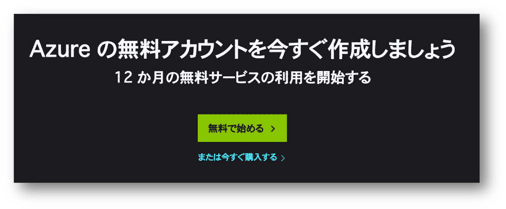||

サインアップ（≒利用開始の契約手続き）の流れは似ていて、まずは利用者のサインイン（≒本人性の確認）が求められます。
マイクロソフトアカウント、ないしは Azure Active Directory の組織アカウントでサインインして手続きを進めます。

## 管理者

サインアップに使用したアカウントがその後の利用における管理者になりますので重要です（あとで変更することも可能ですが）。

Azure の管理者は
[Account Admin](https://docs.microsoft.com/ja-jp/azure/cost-management-billing/manage/account-admin-tasks)
と呼ばれ、支払いの方法（クレジットカードとか）を管理したり、サブスクリプションを作成してその管理者を任命したり、と言う役割を担います。
DevOps の管理者は
[Orgnization Owner](https://docs.microsoft.com/en-us/azure/devops/organizations/accounts/change-organization-ownership)
と呼ばれ、Orgnization 全体に関わる設定を管理したり、Project を作成してその管理者を任命したり、と言う役割を担います。

|Azure の管理者|DevOpsの管理者|
|:-:|:-:|
|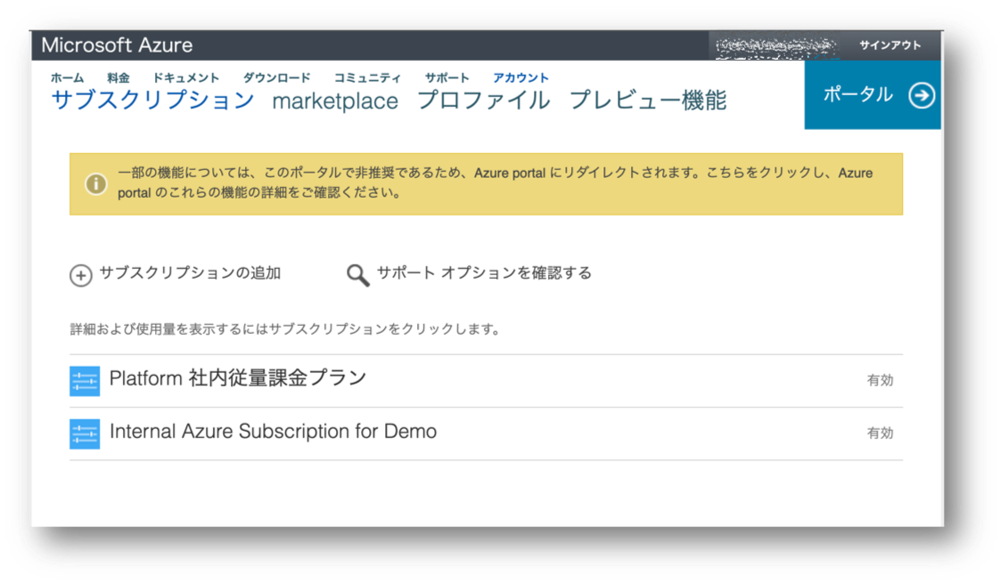|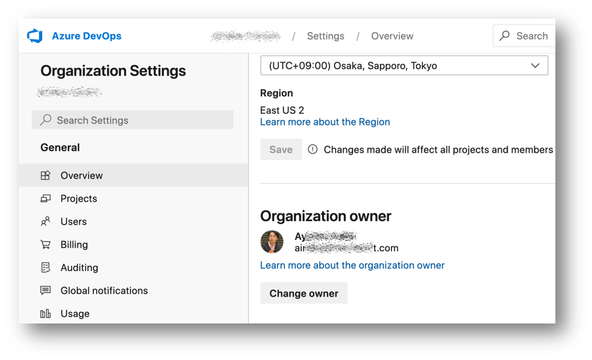|

特に企業や組織で業務用途で使うようなケースでは、その管理者の方が退職してサービスが使えなくなるような事態は避けるべきですので、業務用途であれば Azure Active Directory をお勧めします。
以降では Azure AD を前提として話を進めます。

## ユーザー管理

DevOps も Azure も Azure AD を認証基盤としています。
言い換えればユーザー管理は DevOps や Azure の機能ではなく、特定の Azure AD テナントに委任していることになります。
[Azure サブスクリプションが信頼するテナント](https://docs.microsoft.com/ja-jp/azure/active-directory/fundamentals/active-directory-how-subscriptions-associated-directory)
は既定では Account Addmin が所属するホームテナントになります。
[DevOps のテナント設定](https://docs.microsoft.com/ja-jp/azure/devops/organizations/accounts/access-with-azure-ad)
は前述の Orginization Owner が行います。

|Azure が信頼するテナント|DevOps が信頼するテナント|
|:-:|:-:|
|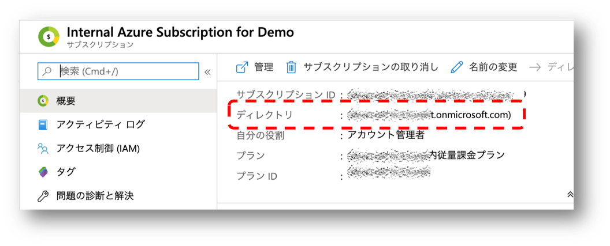|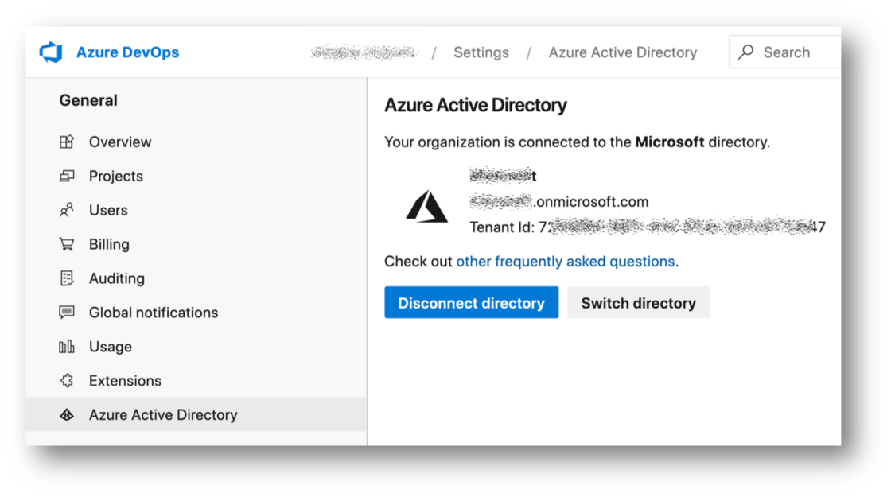|

パスワードポリシーを設定したい、多要素認証を構成したい、ログインの監査をしたい、といった要件がある場合は Azure Active Directory 側の機能をチェックしてみてください。
Azure AD による認証によって個人が特定できる状態になりますので DevOps や Azure で取得できるアクセスログや操作ログに意味が出てくるわけですね。

## 権限制御

Azure や DevOps の管理者（およびアクセス制御の管理を委任された利用者）は、その認証基盤となる Azure AD テナント上で管理されているユーザーに対して一定のアクセス権を付与することで、
利用者のアクセスを制限することができます。

Azure では
[RBAC:Role Based Access Control](https://docs.microsoft.com/ja-jp/azure/role-based-access-control/overview)
を使用して、サブスクリプションやその配下にあるリソースグループやリソースに対して、”誰が何をしていいのか” を管理・制御していきます。
DevOps では Orgnization やその配下の Projec、各 Projec 配下の Repos や Boards と言った各種サービスに対する
[Permission](https://docs.microsoft.com/en-us/azure/devops/organizations/security/permissions-access?view=azure-devops)
を設定することで、”誰が何をしていいのか” を管理・制御していきます。

|Azure の権限制御|DevOps の権限制御|
|:-:|:-:|
|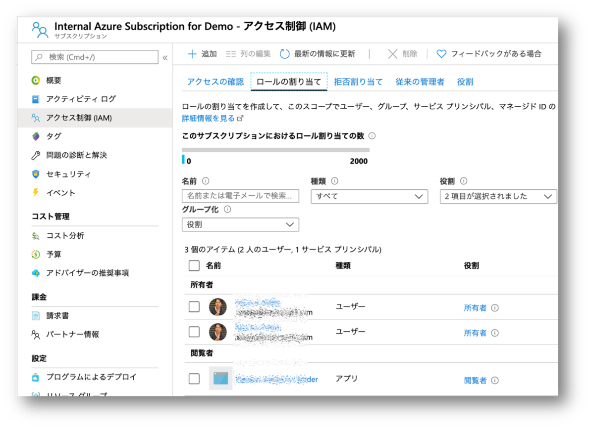|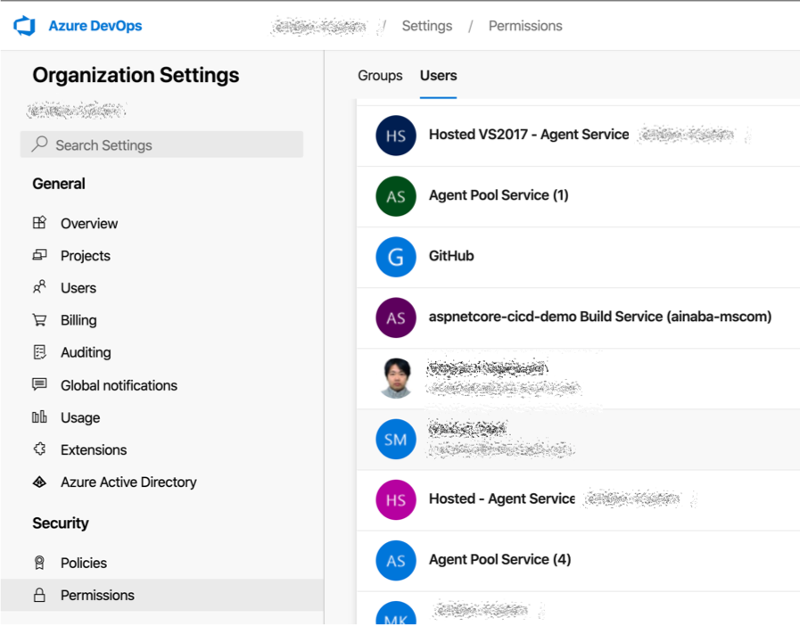|

Azure でも DevOps でも サインアップをした管理者でない限り、明示的に許可されていないユーザーはアクセス権を持ちません（RBAC も Permission も設定されていません）。
つまり Azure AD にサインインできたとしても Azure や DevOps に対しては何もできないわけです。
逆に言えば管理者によるアクセス制御は極めて重要な意味合いを持つことになります。

## ライセンス

DevOps にあって Azure にはない概念としてユーザーライセンスがあります。
これは Stake Holder, Basic, Basic+Test Plans, Visual Studio Subscfription の４段階の
[Access Level](https://docs.microsoft.com/en-us/azure/devops/organizations/security/access-levels?view=azure-devops) 
と言う名前で表現されます。
各ユーザーは自分に割り当てられた Access Level に含まれており、かつ、Permission で許可された対象の操作しか行うことができません。

## ポータル

利用者が DevOps のポータル [dev.azure.com](https://dev.azure.com) にアクセスするとサインインが求められ、
その利用者が Permission を付与されている Orgnization や Project にアクセスできます。
Azure のポータル [portal.azure.com](https://portal.azure.com) 
にアクセスするとサインインが求められ、その利用者が RBAC を付与されているサブスクリプションやリソースにアクセスできます。

|Azure のポータル|DevOps のポータル|
|:-:|:-:|
|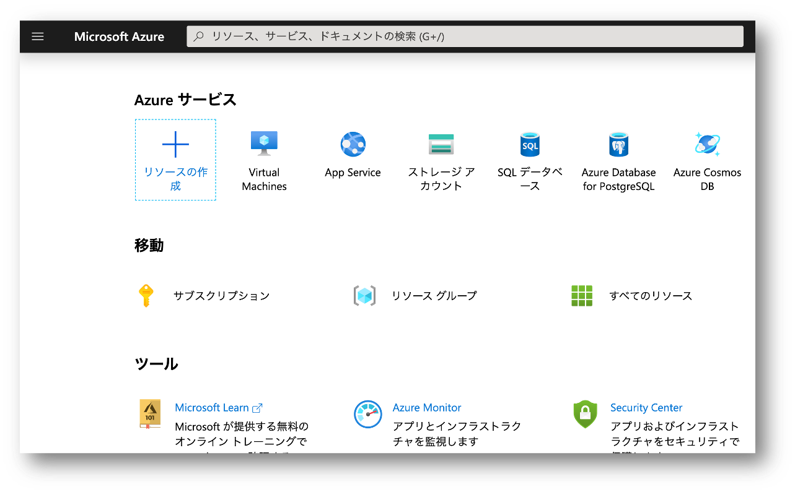|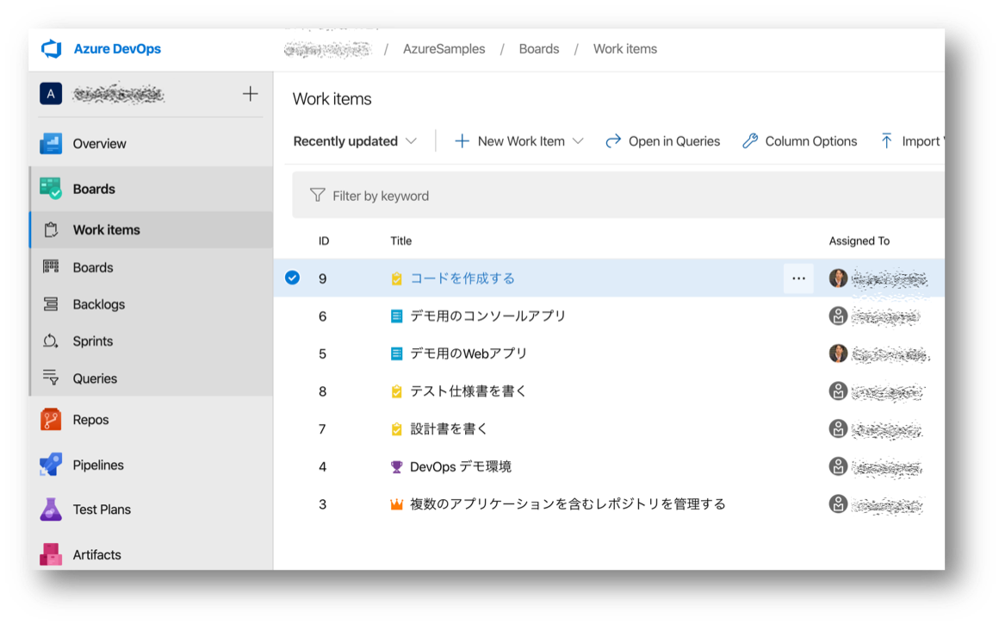|

## コマンドラインツール

ポータルのような GUI だけではなく、コマンドラインツールも用意されています。
Azure の場合は [Azure CLI](https://docs.microsoft.com/ja-jp/cli/azure/) や
[Azure PowerShell](https://docs.microsoft.com/ja-jp/powershell/azure/) を使用します。
DevOps の場合は前述の [Azure CLI の Extentision](https://docs.microsoft.com/en-us/azure/devops/cli/?view=azure-devops) として実装されています。

## シングルサインオン

Azure や DevOps が信頼するテナントが同一であり、利用者が双方に対して RBAC および Permision による権限が付与されている場合には、シングルサインオンで利用できるので便利です。

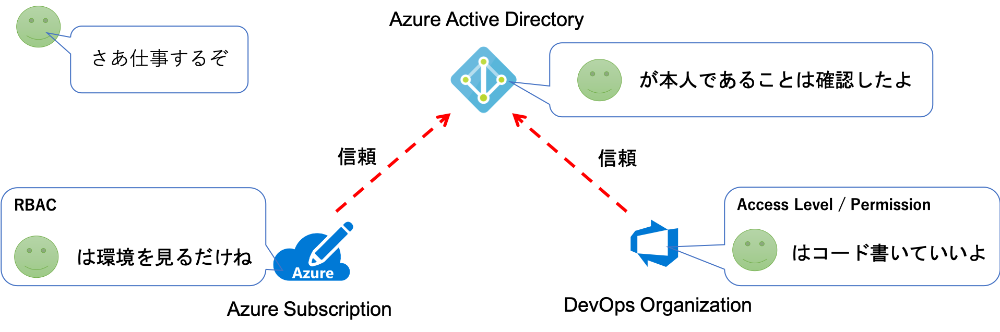

ただ便利と言うだけで必須というわけではなく、Azure と DevOps がそれぞれ信頼するテナントが別であっても構いません。
その場合は利用者はアクセスするサービスごとに認証情報を切り替える必要があります。
あるいは [Azure AD B2B](https://docs.microsoft.com/ja-jp/azure/active-directory/b2b/) の機能を使用することで、
テナントを横断したシングルサインオンを行うことも可能です。
特に後者の B2B を利用するパターンは、自信が所属する組織ではない「外部の組織の DevOps Orgnization」にアクセスする際に便利ですので覚えておいてください。

## 料金の支払い

Azure の場合、各サブスクリプション内の各種リソースの利用料金がアカウントに集約されます。
このためクレジットカードや請求書などの [支払い方法](https://docs.microsoft.com/ja-jp/azure/cost-management-billing/manage/change-credit-card) を
設定できるのは Account Admin になります。

DevOps では単独で利用料金を支払う手立てがありません。
このため無償枠を超える有償利用をしたい場合には、Orgnization Owner が Orgnization を
[Azure サブスクリプションと紐つけ](https://docs.microsoft.com/ja-jp/azure/devops/organizations/billing/overview?view=azure-devops)
る必要があります。
こうすることで DevOps の有償利用分に関しては Azure の毎月の請求明細の１項目として請求が来ることになります。

|Azure の支払い|DevOps の支払い|
|:-:|:-:|
|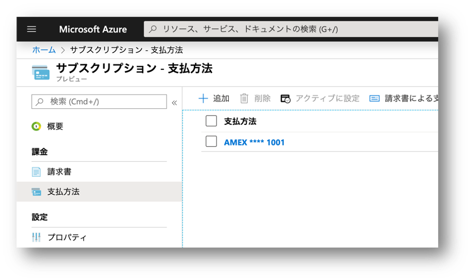|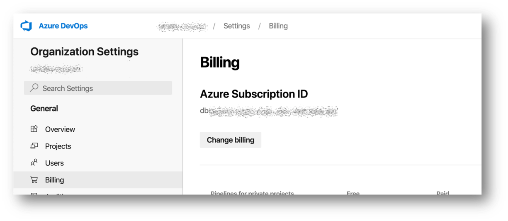|

無償枠でおさまる範囲であればこの紐つけは必要ありませんので、DevOps を使うからと言って必ずしも Azure の利用契約が必要になるわけではありません。

また DevOps は有償レベルまで使うけど、オンプレや外部クラウドで動かすためのソフトウェアを作っている（Azure は使わない）という場合は、
お手数ですが料金支払いのために Azure サブスクリプションを契約いただければと思います。
残念ではありますが、そのサブスクリプションで何らかの Azure サービスをご利用いただく必要はありません。

## アプリのデプロイ

DevOps で開発したアプリケーションは、当然どこかの実行環境で動作させないと意味がないわけです。
実行環境としての選択肢の１つとして Azure があるわけですが、別に必須ではなく、単に連携がさせやすいというだけです。

Repos 上で管理されたソースコードを、Pipeline Agent がビルドして（テストして）、その成果物を Azure の API を呼び出してデプロイするわけです。
このパイプラインを構成するのは Azure Pipeline に対して適切な Permission および Access Level を持つユーザーではあるのですが、
実際にこの Pipeline が動作して Azure の API を呼び出すときにはユーザーの資格情報を使うことはできません。

Azure Pipeline に限りませんが、このような「Azure を外部のアプリケーション等から無人操作する」ケースでは、以下のような構成が必要です。

- Azure AD にユーザーではなく[Servic Principal](https://docs.microsoft.com/ja-jp/azure/active-directory/develop/howto-create-service-principal-portal)を作成（アプリ登録）
- その Service Principal に操作対象となるサブスクリプションやリソース/リソースグループに対して適切な RBAC ロールを割り当てておく
- 外部アプリケーションはその Service Principal のクレデンシャルを使用して Azure AD で認可を受け Azure の API を操作する

Azure Pipeline ではこの Service Principal の認証情報を
[Service Connection](https://docs.microsoft.com/en-us/azure/devops/pipelines/library/connect-to-azure?view=azure-devops)
として管理することができます。
この Service Principal は操作対象となる Azure サブスクリプションが信頼するテナント上のオブジェクトである必要がありますが、
これは必ずしも DevOps Orgnization が信頼するテナントと同一である必要はありませんし、前述の支払いで紐つけたサブスクリプションである必要もありません。

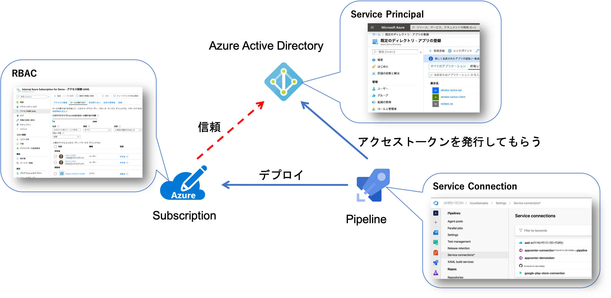

なお、Azure と DevOps をシングルサインオンできる状態で Azure 接続用の Service Connection を作成しようとすると、前述の３ステップを全自動でやってくれるので便利です。
ただ多くの企業ユーザーの場合、１つ目のステップで必要な権限（Azure AD へのアプリ登録）が与えられておらず、失敗することが多いようです。
この場合は Azure AD の管理権限を持ってい人にお願いして、サービスプリンシパルの作成とその情報の払い出してもらってください。
その情報を元に RBAC の設定や Service Connection の作成作業を行うことができます。

## ネットワーク

DevOps は物理的には Azure データセンター上で運用されている SaaS サービスと捉えると、Azure から見れば１つのユーザーテナントであると言えます。
つまり DevOps と Azure 間で発生する通信は 
[Azure グローバル ネットワーク](https://azure.microsoft.com/ja-jp/global-infrastructure/global-network/)
内部で完結し、パブリック IP アドレスを使用しますが、公衆インターネットを通るわけではありません。

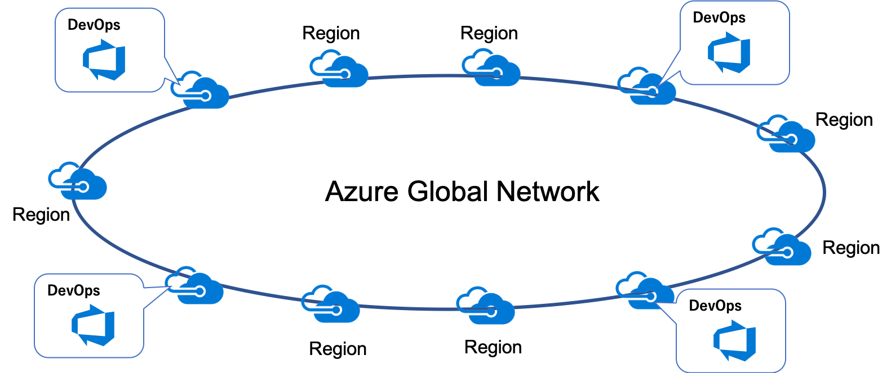

## プライベートネットワーク内のリソースアクセス

Pipeline でデプロイする先の実行環境がオンプレミスであったり IaaS 仮想マシンであるよう場合、パブリック IP アドレス空間からはそもそも到達不可能であるケースが多いと思います。
この場合はオンプレミスサーバーや仮想マシンの中で Pipeine の実行処理を動作させることが可能です。
これを [Self-hosted Agent](https://docs.microsoft.com/en-us/azure/devops/pipelines/agents/agents?view=azure-devops) と呼びますが、
要は Pipeline Agent と呼ばれるソフトウェアが動作する普通のサーバー、PC、あるいは Docker コンテナです。

この Agent マシンは DevOps Pipeline（Public IP） への送信接続を行いますので、オンプレミスであればインターネットへの HTTPS 接続ができる必要があります。
しかし Pipeline から Agent への送信接続は行いませんので、インターネットから当該エージェントマシンへ到達できる必要はありません。

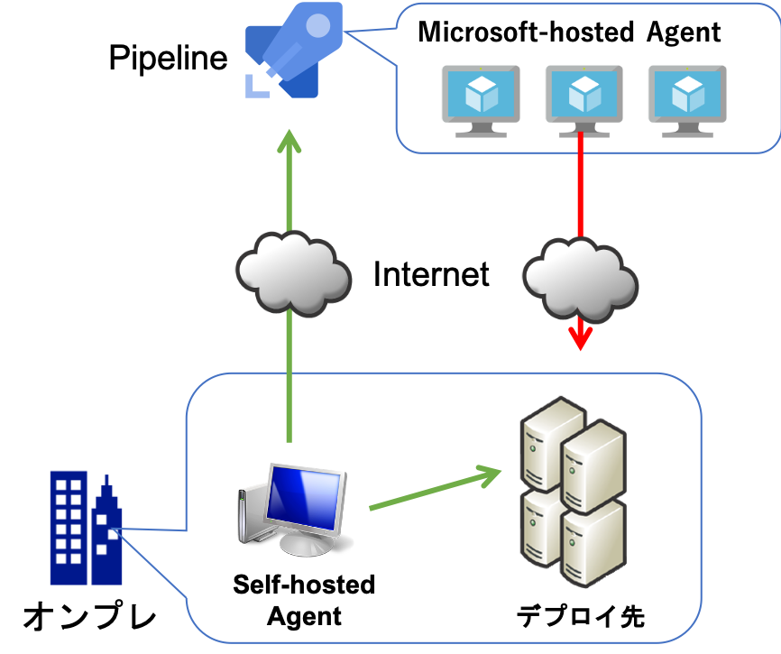

## まとめ

まとめるほどの内容でもないのですが。
- Azure と Azure DevOps は単独で使えますが、組み合わせて使うと便利です
- 同じ Azure AD テナントを信頼するとシングルサインオンで便利ですが、共有なのはユーザー情報だけで、権限制御は個別に行ってください
- どちらも無料で始められるので、まずはお試しください

