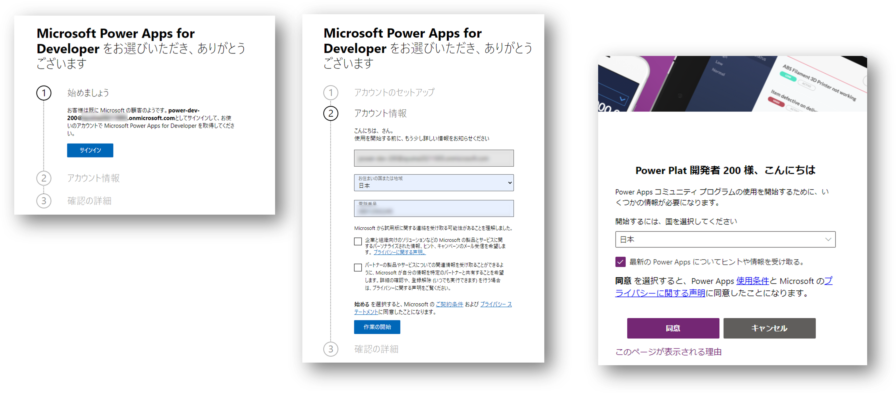
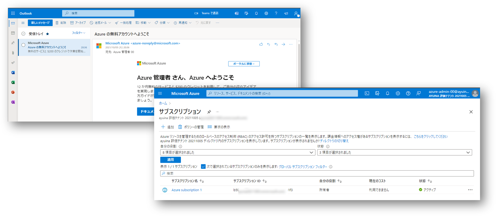

## はじめに

各種クラウドサービスは無償評価版などが提供されていることが多いので、実際に購入する前にサービスの価値を確認することが可能です。
もちろん Microsoft の各種クラウドサービスもそれぞれ無償評価版が提供されているわけですが、以下の理由から若干使いにくくなっているのではないかと思います。

- Microsoft が提供するクラウドサービスは複数あり、それぞれ評価版を利用するための手続きなどが異なる
- どのクラウドサービスも Azure Active Directory で認証する設計になっており、適当に評価版にサインアップすると勝手に Azure AD テナントが作られたりする
- 実務に使用している Azure AD テナントを用いての試用版の評価などはセキュリティやガバナンスの観点から困難

というわけで、以下では既存の環境に影響を与えずに、下記の Microsoft クラウド評価環境を **無償で** 構築する方法を整理していきたいと思います。

- Azure Active Directory
- Microsoft 365
- Power Apps
- Microsoft Azure

## 事前準備

さて評価環境そのものを構築する方は事前に以下のものをご用意ください。

- 送受信が可能なメールアドレス（仕事で使っているものでもフリーのものでも構いません）
- SMS が受信可能な電話番号（仕事で使っているものでも個人のものでも構いません）
- Edge や Chrome 等のモダンブラウザ（複数あると便利）
- アクセス先に制限の無いインターネット回線
- クレジットカード（Azure の評価を行う場合）

各評価版の期間はおおむね 30 日です。
作業を効率的に進めるために、評価項目や評価メンバーのアサインなども事前に行っておきましょう。

## Azure Active Directory 評価環境の構築

さて初めに [Azure Active Directory](https://docs.microsoft.com/ja-jp/azure/active-directory/fundamentals/active-directory-whatis) の環境を構築していきます。
多くの場合、本来の評価したい対象クラウドは Azure だったり Power Apps だったりすると思うのですが、管理やセキュリティ観点では Azure AD を自由にこねくり回して評価できた方がよい場合が多くあります。
また、そもそも評価を行う方が Azure AD の管理権限を持っていない場合には、各クラウドの無償評価サインアップ自体ができなかったりしますよね。
最悪壊してもよい環境というのは、評価作業を進めるにあたっての心理的安全性が極めて高いので、結果的に評価そのものも充実したものとなるでしょう。

### Azure AD テナントと初期管理者の作成

まず Microsoft Edge の InPrivate ブラウズや Chrome のシークレットウィンドウを起動して、URL に [https://account.azure.com/organization](https://account.azure.com/organization) を入力、下記の画面で必要情報を入力していきます。

- Azure を開始する
  - この画面では管理者の情報を登録します
  - `勤務先の電子メールアドレス` や `電話番号` は事前に用意しておいたものを使用します（有効なものであれば仕事用でなく個人用でも大丈夫です）
  - `会社名` は Azure AD のテナント名になりますので、実在の会社名ではなく「評価用の環境であること」がわかる名前を付けておくと良いでしょう
  - 組織の規模は適当なものを選んで大丈夫です（購入ライセンス数などとは関係ありません）
- ユーザー ID の作成
  - この画面ではテナントの管理者である一人目のユーザーと、テナントのドメイン名を決めていきます。
  - ユーザー名は「初期管理者であること」がわかる名前をつけ、会社名の部分は「評価環境であること」がわかる名前を付けましょう
  - 例) aad-admin@ainaba-eval-2110.onmicrosoft.com
  - パスワードはこの初期管理者のパスワードなので、**絶対に** 忘れないように控えておいてください。
- この情報を保存してください
  - この画面で「準備が整いました」ボタンをクリックすることで Azure AD テナントの出来上がりです。

このあと下記のような Microsoft Azure （!= Azure Active Directory）のサインアップ画面に進みますが、ここではサインアップをしません。
ブラウザを一度閉じてしまいましょう。

### Azure AD Premium P2 の有効化

Azure Active Directory の全機能を利用できる Premium P2 ライセンスの機能を 30 日間無償で評価することが可能です。
Premium P2 に含まれる機能が評価対象でなかったとしても、この後で構築する Microsoft 365、 Power Platform、Microsoft Azure などの評価環境をセキュアにする意味でも重要ですので、ここで無料試用版のライセンスを有効化してしまいましょう。

- あらためて InPrivate ブラウズの Edge やシークレットモードの Chrome を起動します
- Azure Portal (https://portal.azure.com) を開きます
- Azure AD の初期管理者のユーザー名とパスワードでサインインします
- Azure Portal 左上のハンバーガーメニュー 「`≡`」 から `Azure Active Directory` を選択します
  - この時点ではライセンスが Azure AD Free になっていることが確認できます
  - つまりこのテナントは期間限定の評価版ではなく「正規品の無償版」ですので、永続的に使用することも可能です
- 画面左側のメニューから `ライセンス` を選択します
- クイックタスクの中にある `無料試用版を入手する` を選択します
- Azure AD Premium P2 を `アクティブ化` します

このあとブラウザで再読み込みを行い、あらためて Azure Portal から Azure AD の管理画面を開くと、ライセンスが Azure AD Premium P2 になっていることが確認できるでしょう。

#### 注意事項

なお Azure AD Premium P2 の無償評価版などで検索すると、おそらく[こちら](https://azure.microsoft.com/ja-jp/trial/get-started-active-directory/)の情報にたどり着くと思います。
本記事の執筆時点（2021 年 10月）でリンクやスクリーンショット等の情報が古くなっていたため、上記の手順で有効化していただければと思います。

### クラウド評価ユーザーの追加

さて各クラウドの評価を行うためのユーザーを追加していきます。
初期管理者で全部やってしまっても良いのですが、ユーザーの役割を分離したほうがそれらしい評価になるでしょう。

- Azure AD 管理画面で `ユーザー` を選択
- `＋ 新しいユーザー` を選択
- ユーザー名と表示名を入力（ドメインは既定のまま）
- 自動生成されたパスワードを控える
- 必要なロールを割り当てる

この手順を繰り返して以下のように何人かユーザーを作っていきましょう。
（もちろん必要になってから後で作っても構いません）

|表示名|用途|ユーザー名|初期パスワード|ロール|
|---|---|---|---|---|
|Microsoft 365 管理者| M365 のアクティアクティベーションやライセンスの割り当てを行う |m365-admin@tenantname.onmicrosoft.com|(画面に表示されたもの)|グローバル管理者|
|Azure 管理者|Azure のアクティベーションやサブスクリプションの管理を行う|azure-admin@tenantname.onmicrosoft.com|(画面に表示されたもの)|なし|
|Power Apps 開発者| Power Apps 開発者プランにサインアップ、アプリの開発を行う|power-dev@tenantname.onmicrosoft.com|(画面に表示されたもの)|なし|
|Power Apps 利用者| Power Apps アプリの評価を行う|power-user-01@tenantname.onmicrosoft.com|(画面に表示されたもの)|なし|
|Power Apps 利用者| Power Apps アプリの評価を行う|power-user-02@tenantname.onmicrosoft.com|(画面に表示されたもの)|なし|

ユーザーが作り終わったらまたブラウザは閉じて置きましょう。

## Microsoft 365 評価環境の構築

さて次は Microsoft 365 です。
こちらもメインの評価対象ではない場合もあると思いますが、M365 の試用版を有効化しておくだけで Azure や Power Platform の評価の幅が広がります。
- Azure の場合
  - Azure Monitor の通知先としてメールや Teams が使えると便利
  - Outlook や Sharepoint の API 呼び出しの評価に
- Power Apps の場合
  - アプリ共有時に宛先のメールアドレスが必要
  - 標準コネクタの呼び出し先として

### Microsoft 365 管理者の初期サインイン

先ほど作ったばかりの Microsoft 365 管理者のユーザーアカウント`m365-admin`は、まだ完全には有効化されていない状態です。
ここで一度サインインしておいて、アカウントを有効な状態にしましょう。
あらためて InPrivate ブラウズの Edge やシークレットモードの Chrome を開き、アプリポータル（[https://myapps.microsoft.com](https://myapps.microsoft.com)）を開いてください。
サインインが求められたらユーザー名と初期パスワードを入力すると、パスワードの変更が求められますので、パスワードを忘れないように控えておきつつ、サインイン作業を続けます。
サインインが成功すると、下記のようなほぼ空っぽの状態のアプリポータル画面が開くはずです。

### 試用版サブスクリプションのサインアップ

一般法人向けの Microsoft 365 の試用版サブスクリプションにサインアップすることで 30 日間 25 ユーザーまでの評価利用が可能です。
詳細な手続きや注意事項などについては[こちら](https://docs.microsoft.com/ja-jp/microsoft-365/commerce/try-or-buy-microsoft-365?view=o365-worldwide)をご参照ください。

ドキュメントに記載のある[製品サイト](https://www.microsoft.com/ja-jp/microsoft-365/business/compare-all-microsoft-365-business-products?tab=2&rtc=1) に移動するといくつかのプランが表示されます。

`一般法人向け` のタブが選択されていることを確認し、必要な製品が含まれたプランの `または 1 か月間無料で試す` を選択します。

その後は表示される画面にしたがって手続きを進めます。

- 作成しておいた Microsoft 365 管理者用のアカウントでサインインしていることを確認します
- 事前に用意しておいた電話番号を入力して、ロボットではないことを証明してください
- 試用サブスクリプションの購入手続きを進めていきます

### ライセンスの割り当て

購入手続きが進むと Microsoft 365 管理センター（[https://admin.microsoft.com/](https://admin.microsoft.com/)）が表示されます。
左上のハンバーガーメニュー(`≡`)から`ライセンス`を選択し、`サブスクリプション`タブを開くと下記のライセンスが表示されているはずです。

- Azure Active Directory Premium P2
- Microsoft 365 Business Standard

このうちの Microsoft 365 のライセンス画面を表示して、各ユーザーに対してライセンスの割り当てを行うと、Microsoft 365 の評価が可能になります。
試用版サブスクリプションをサインアップした管理者はすでに１つライセンスが割り当てられているはずですので、残り 24 ユーザーまでライセンスを割り当てて Microsoft 365 の機能を利用させることが可能です。

### 動作確認と評価の開始

さて購入した試用版の動作確認をしておきましょう。
現状のブラウザは Microsoft 365 の管理者ユーザーでサインインしており、かつライセンスを持っている状態のはずです。
あらためて[アプリポータル](htps://myapps.microsoft.com) を表示すると、購入した Microsoft 365 に含まれるアプリが表示されます。
こちらから例えば Outlook を表示してメールの送受信などが可能であることを確認しておきましょう。

同様に Microsoft 365 の機能評価を行う各ユーザーも、Azure Active Directory にユーザーが作成されており、Microsoft 365 のライセンスが割り当てられていれば、同様にアプリポータルから評価作業を開始することができます。

## Power Apps 評価環境の構築

次に Power Apps です。
Microsoft 365 に付属のライセンスでも一定の利用は可能なのですが、その価値を最大限に評価する上では [開発者プラン](https://docs.microsoft.com/ja-jp/powerapps/maker/developer-plan) にサインアップすると良いでしょう。
この開発者プランは Power Apps だけでなく Power Automate や Dataverse も利用でき、また期間の縛りがありません。
（つまり試用版というよりは、開発用途に限定された無料のライセンスです）

### Power Apps 開発者の初期サインイン

先ほど作ったばかりの Power Apps 開発者のユーザーアカウントは、まだ完全には有効化されていない状態です。
InPrivate ブラウズの Edge やシークレットモードの Chrome を開き、アプリポータル（[https://myapps.microsoft.com](https://myapps.microsoft.com)）から一度サインインしておくことで、アカウントを有効な状態にしましょう。
初期パスワードの変更を求められるはずですので、忘れないように控えておいてくださいね。

### Power Apps 開発者プランのサインアップ

Power Apps 開発者のユーザーアカウントでサインインした状態のブラウザから、[開発者向けプラン](https://powerapps.microsoft.com/ja-jp/developerplan/)のページを開きます。

`無料で始める`を選択し、画面に表示される手続きにそってサインアップ作業を進めます。

- Power Apps 開発者のユーザーアカウントでサインインしていることを確認します
- 所在地や電話番号などを入力します
- 最後に`同意`することで利用可能になります

### Power Apps アプリの開発

それでは開発者向けプランを利用してみましょう。
このまま Power Apps 開発者のユーザーアカウントで [https://make.powerapps.com](https://make.powerapps.com) にサインインして開発作業を開始します。

- 環境が `Developer Environment` になっていることを確認
- 適当なキャンバスアプリを作成
- 出来上がったアプリを他のユーザーに`共有`

終わったらブラウザを閉じてください。

### 共有された Power Apps アプリの利用

それでは動作確認です。
InPrivate ブラウズの Edge やシークレットモードの Chrome を開き、先ほどアプリが共有されたユーザーで[アプリポータル](https://myapps.microsoft.com) にサインインしてください。

- Microsoft 365 のライセンスが割り当たっていればアプリポータルに `Outlook` が表示されているはずです
- Outlook を開くとアプリが共有された旨を通知するメールが届いていることと思います
- `アプリを開く` と先ほど開発して共有したアプリの動作が確認できます

## Microsoft Azure 評価環境の構築

最後に Microsoft Azure です。
Power Apps でアプリケーションを作っていると既存の API やデータでは物足りなくなり、独自の API やデータソースを活用したくなるのではないでしょうか。
Azure が提供する IaaS や PaaS を利用することで独自の API やデータソースをホストし、 Power Platform と組み合わせた横断的なソリューションの評価が可能になるわけです。

### Azure 管理者の初期サインイン

先ほど作ったばかりの Azure 管理者ののユーザーアカウントは、まだ完全には有効化されていない状態です。
InPrivate ブラウズの Edge やシークレットモードの Chrome を開き、アプリポータル（[https://myapps.microsoft.com](https://myapps.microsoft.com)）から一度サインインしておくことで、アカウントを有効な状態にしましょう。
初期パスワードの変更を求められるはずですので、忘れないように控えておいてくださいね。

### メールボックスの確認

Azure では何らかの障害やセキュリティインシデントが発生したときにはサブスクリプションの管理者にメールが送信されます。
これを受信できないことにはどうしようもないので、Azure 管理者には Microsoft 365 のライセンスを割り当てておきましょう。
ライセンスの割り当て後に [Outlook](https://outlook.office.com/mail/inbox) でメールが送受信できることを確認しましょう。

### 無償評価版のサインアップ

管理者アカウントの準備が整ったら [Azure Portal](https://portal.azure.com) を開きます。

- ハンバーガーメニューから `サブスクリプション` を選択すると、まだサブスクリプションを 1 つも持っていないことが確認できます。
- サブスクリプションの `追加` を選択し、`無料試用版` にサインアップします。

次に Azure 管理者のプロフィール情報などを入力します。

- `電子メールアドレス` には先ほどメールボックスを確認したメールアドレス（＝Azure管理者のユーザー名と同じになっているはず）を入力します
- `電話番号` には SMS や音声の着信が可能な電話番号を入力し、ボットで無いことを証明します
- そしてクレジットカード情報を入力して与信が通ればサインアップ完了です

サインアップが完了すると無償評価版が有効化されたことを通達するメールが届きます。
またサブスクリプション一覧にも表示されます（時間がかかる場合があるので、何度かブラウザを再読み込みしてみてください）

