## はじめに

API として機能やデータを提供するサービス側と、それを呼び出すクライアント側はその実装言語やフレームワークに応じて監視機能が備わっているものと思います。
ただその通信を中継し、様々なカスタマイズや保護を提供する API Gateway の監視が甘い状態だと、何か問題があった時のトラブルシュートが厄介になります。

Azure の場合は API Managemet の監視機能を使うことになるわけですが、最初の設定に漏れがあるといざ問題発生となった時には手遅れになってしまうわけですね。
公式ドキュメントにはその 
[チュートリアル](https://docs.microsoft.com/ja-jp/azure/api-management/api-management-howto-use-azure-monitor) 
が掲載されていますが、記載が不足していたり分散していたりとわかりにくい部分もあったので、この記事ではその検証結果などを紹介していきたいと思います。

## 概要

API Management は既定の状態でも監視系の機能が組み込まれており、API Gateway としての実行状況をある程度確認することが可能です。
しかしこれだけだと複雑な分析や監視データの活用が出来ませんので、[Azure Monitor](https://docs.microsoft.com/ja-jp/azure/azure-monitor/) も組み合わせて使っていくことになります。

|分類|監視機能の名前|ユーザーによる設定|リファレンス|
|---|---|---|---|
|API Management|API 分析|不要|https://docs.microsoft.com/ja-jp/azure/api-management/howto-use-analytics|
|API Management|問題の診断と解決|不要|https://docs.microsoft.com/ja-jp/azure/api-management/diagnose-solve-problems|
|Azure Monitor|メトリック エクスプローラー|不要|https://docs.microsoft.com/ja-jp/azure/azure-monitor/essentials/metrics-charts|
|Azure Monitor|リソース ログ|必要|https://docs.microsoft.com/ja-jp/azure/azure-monitor/essentials/resource-logs|
|Azure Monitor|Application Insights|必要|https://docs.microsoft.com/ja-jp/azure/azure-monitor/app/app-insights-overview|

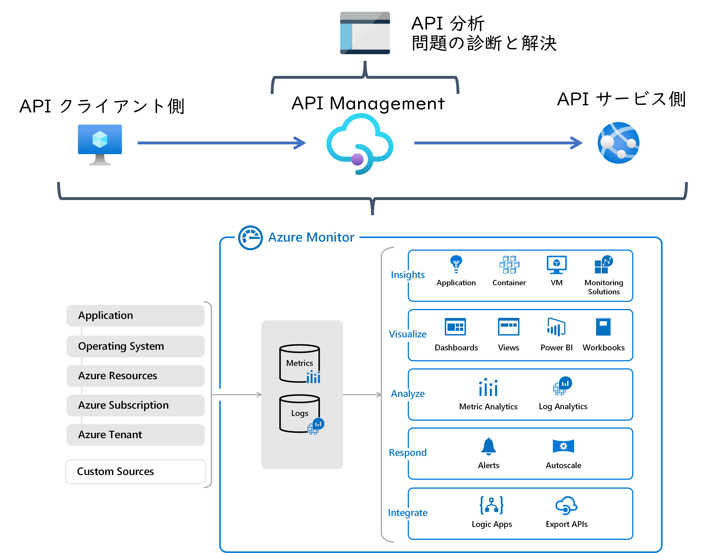

なお API Management の構成変更や設定が記録される
[アクティビティ ログ](https://docs.microsoft.com/ja-jp/azure/azure-monitor/essentials/activity-log) 
や、そこに含まれる 
[リソース 正常性](https://docs.microsoft.com/ja-jp/azure/service-health/resource-health-overview) 
については API Management 特有のものもないと思いますので、本記事では割愛します。

## API Management - API 分析

Azure Portal で API Management を表示して左側のメニューの中から ```分析``` を開くことで利用可能な機能です。
これは特に追加の設定など不要で利用できる機能です。
画面内には ```タイムライン```、```地理```、```API```、```操作```、```製品```、```サブスクリプション```、```ユーザー```、```要求``` というタブが設置されており、様々な視点から API の実行状況が分析できるようになっています。
基本的には分析対象の時間帯を設定し画面で表示して表示させるだけで簡単に利用できますので、API の実行状況を把握したいときはまずはここを開くのがおススメです。
ただ惜しむらくはデータのエクスポート機能がなく、カスタムのクエリや可視化ができないことでしょうか。

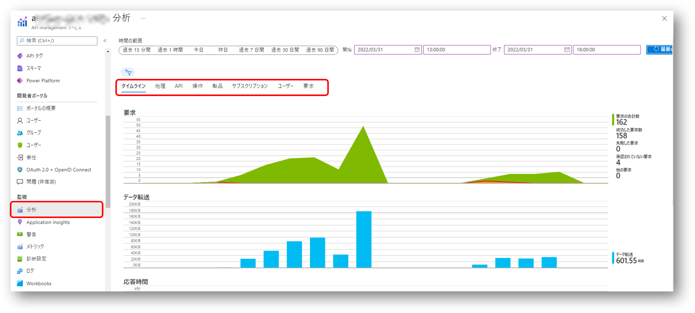

## API Management - 問題の診断と解決

Azure Portal で API Management を表示して左側のメニューの中から ```問題の診断と解決``` を開くことで利用可能な機能です。
こちらも特に追加の設定など不要で利用できる機能です。
API Management の運用中に問題になりがちな ```Availability and Performance```、```API Policies```、```Gateway Performance```、```Service Upgrade``` といった観点での分析情報だけでなく、その解決策のアドバイスなどもしてくれます。
エラーが発生しているとかパフォーマンスが悪いとか、トラブルシュートの第一歩としてはここを開いてみるのが良いでしょう。

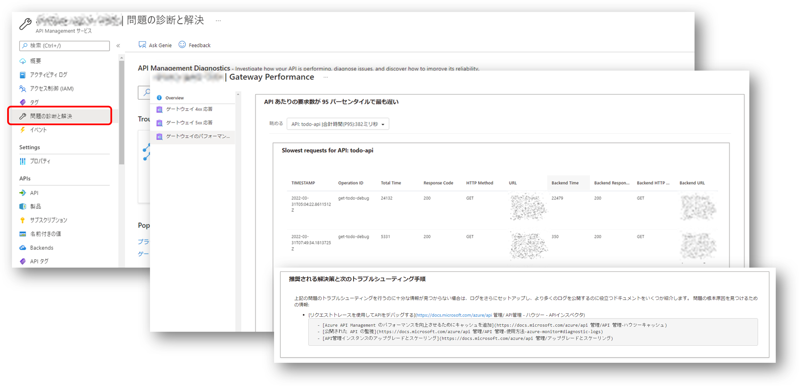

## Azure Monitor - メトリックエクスプローラー

Azure のその他のリソースと同様に API Management もメトリック エクスプローラー を使用して各種の数値データの可視化が可能です。
こちらを利用する場合も設定は不要です。
Azure Portal で API Management を表示して左側のメニューの中から ```メトリック``` を開くか、Azure Monitor 画面から該当する API Management リソースを選択してください。
[Microsoft.ApiManagement/service 名前空間](https://docs.microsoft.com/ja-jp/azure/azure-monitor/essentials/metrics-supported#microsoftapimanagementservice)
の中から着目したいメトリックを選択します。
こちらはプラットフォーム観点からメトリックを分析するツールになっているため、HTTP レスポンスコードや API Management インスタンスといったコントロールプレーン観点でみたディメンジョン分割には対応していますが、 API や操作といったデータプレーン観点での分割には対応していません。
こういった分析の観点に応じて、前述の API 分析や後述のリソース ログなどとの使い分けることになります。

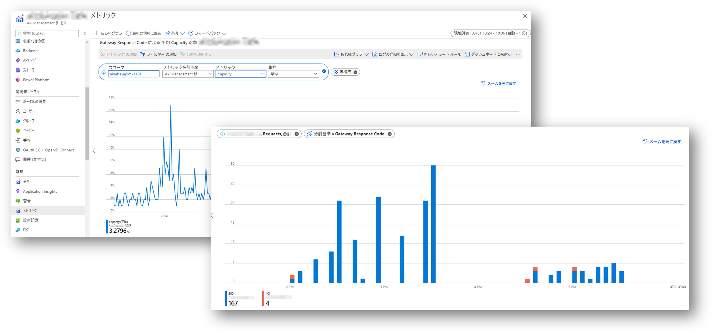

## Azure Monitor - リソースログ

API Management でホストされる各種 API 呼び出しの個々の実行履歴をテキストデータとして記録し、分析や問題解決に使用する場合にはリソース ログをエクスポートする必要があります。
その他の Azure リソースと同様にリソース ログは既定では記録されませんので、こちらは明示的に設定しておかないと、後でデータ分析が必要になったりトラブルシュートしたくなったときに困ったことになるわけです。
Azure Portal で API Management を表示して左側のメニューの中から ```診断設定``` を開き、```診断設定を追加する``` ことで Log Analytics や Blob といったエクスポート先を定義できます。

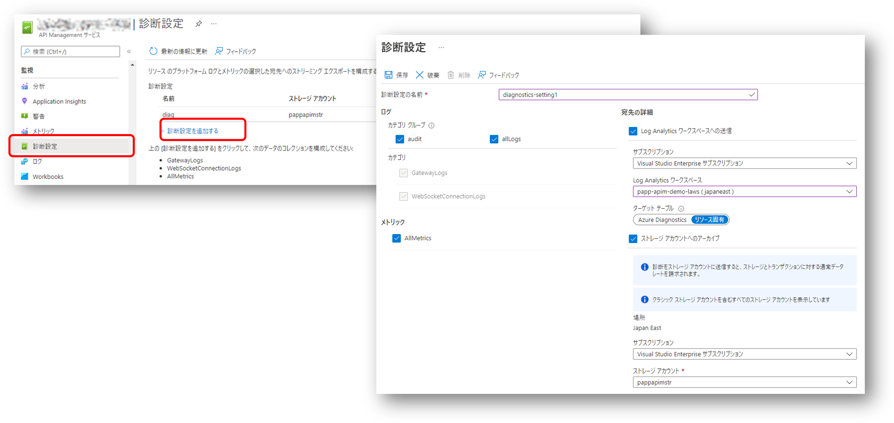

Log Analytics を使用する場合、 API Management のリソース ログは共通の ```AzureDiagnostics``` テーブルか、リソース固有のテーブルである ```ApiManagementGatewayLogs``` テーブルに記録する２つのモードを選択することができます。
最終的にはその他の Azure サービスもリソース固有モードに移行する予定ですので、現段階で特に理由がない場合はリソース固有モードを選択しましょう。
[API Management が記録するリソースログのスキーマ](https://docs.microsoft.com/en-us/azure/azure-monitor/reference/tables/apimanagementgatewaylogs)
に関しては ~~かなり不親切な~~ ドキュメントに記載がありますので、どんなデータが記録されるのか確認するためにも一度ご参照ください。

### 通信データの中身を記録したい場合

なんですが、実はリソース ログを診断設定でエクスポートしただけだと一部のデータが記録されていません。
具体的には ```RequestHeader``` や ```RequestBody``` といったような具体的な通信の中身です。
この辺はデータサイズも肥大化しがちなので、既定で無効になっているのは分からないでも無いのですが。

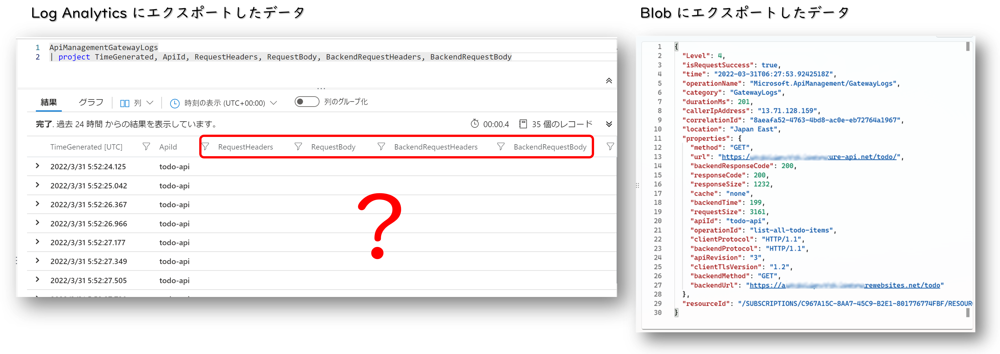

というかまあ、実はこのデータが取れなくて困った、というのが本記事を執筆する動機でした。（他の部分は調査の過程で得られた副産物）
Azure Portal で API Management を表示して左側のメニューの中から ```API``` を開くとホストする各 API の定義を確認出来るわけですが、その ```Settings``` タブの中に Azure Monitor に出力するログのオプション設定があります。
こちらでログに残したい Header の名前や Body 部分の最大サイズを設定しておくことで、リソース ログの一部としてエクスポートされるようになるわけです。
~~こんな項目あるのに気が付かなかっただけですが、多分ドキュメントに書いてないんですよね。~~

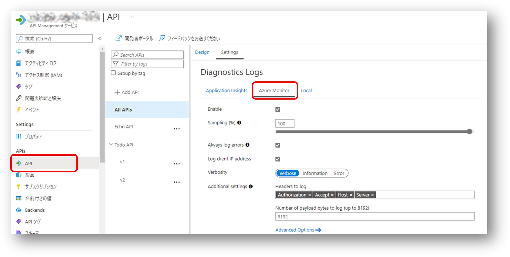

ちなみに上記のキャプチャでは　```All APIs``` の設定として全ての API 同じ設定を適用していますが、個々の API レベルの設定で上書きしてやることも可能です。
その場合は各 API の ```Settings``` タブを一番下までスクロールしてやると Diagnostics Logs という項目を探してください。
Body データまで常に記録してるとデータサイズ的にもセキュリティ的にも問題になるかもしれませんので、開発・テスト中はともかく運用中はこちらの個別 API レベルの設定で必要に応じて有効化するほうがいいかもしれません。

実際に取得できたデータは以下のようになります。
Body 部は表示を折り返していないので見切れてしまっていますが、エンコードされた JSON データが丸っと含まれてしまっていますので、データサイズが（最大 8KB とはいえ）が大きくなりことが想像できると思います。
しかも Front 側と Backend 側の Request と Response で 4 つのペイロード データです。
大量の記録が発生する運用環境では課金が心配ですので、この設定は十分に注意してご利用ください。

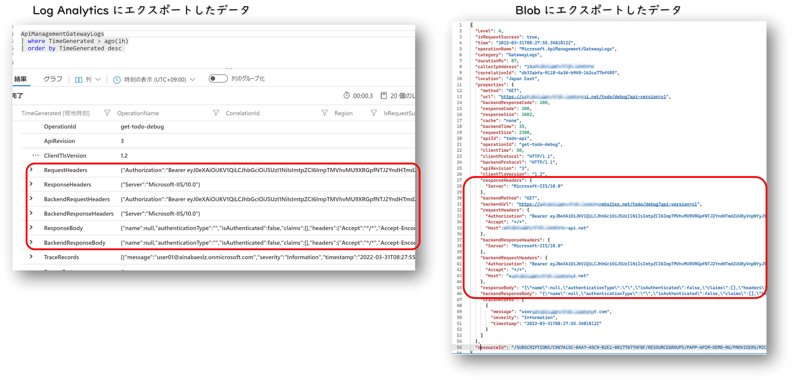

### カスタム トレース

先ほどの例ではしれっと ```Authorization ``` ヘッダーを出力していますが、こんな機微な情報をログに残してしまうのは危険が危ないですね。
ログに残したいのはこの中に含まれるユーザー名などの一部の情報だけでしょうから、そこだけ個別にログ出力するようにしてみましょう。
トレースを出力したい場合は
[trace ポリシー](https://docs.microsoft.com/ja-jp/azure/api-management/api-management-advanced-policies#Trace)
を使用します。
このメッセージ要素の中に
[ポリシー式](https://docs.microsoft.com/ja-jp/azure/api-management/api-management-policy-expressions)
を使用してトレースに残したい文字列を記録してやれば良いわけです。

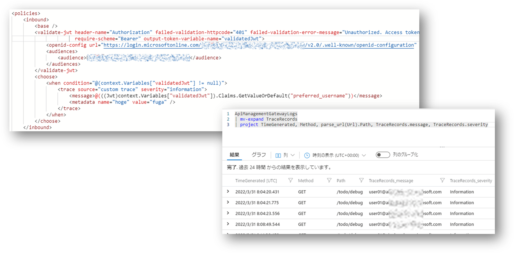

ちなみにこの例では
[validate-jwt ポリシー](https://docs.microsoft.com/ja-jp/azure/api-management/api-management-access-restriction-policies#ValidateJWT)
の ```output-token-variable-name``` を使用して JWT オブジェクトをコンテキスト変数 ```validatedJwt``` に格納したうえで、
その中に含まれる ```preferred_username``` クレームを出力しています。
また trace ポリシーで出力された各データ行は JSON 配列として 1 つのリソース ログ レコードに格納されますが、このままだとクエリを記述しにくいので 
[mv-expand 演算子](https://docs.microsoft.com/ja-jp/azure/data-explorer/kusto/query/mvexpandoperator)
を使用して配列データを複数のレコードに展開しています。

## Azure Monitor - Application Insights

最後に Application Insights ですが、こちらも明示的に設定してやる必要があります。
まず Azure Portal で API Management を表示して左側のメニューの中から ```Application Insights``` を開き、テレメトリデータを送信する予定の Application Insights インスタンスを ```追加``` しておきます。
さらに各 API で送信する対象の Application Insights インスタンスを選択することで、実際にテレメトリデータが送信されるようになります。

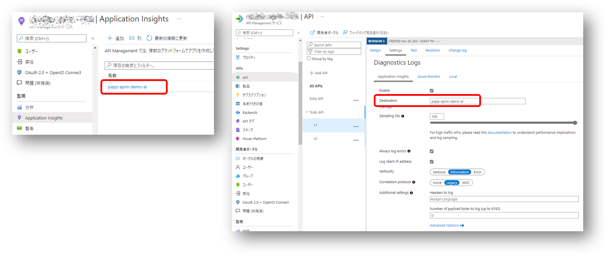

ここで着目したいのは、前述の Log Analytics ワークスペースと異なり、**API 毎に送信先の Application Insights を切り替えることが出来る** という点です。
クライアント側やサービス側のアプリケーションないしは実行環境が Application Insights SDK によるインストルメンテーションに対応していれば、それらのテレメトリを API Management と同じ Application Insights インスタンスに集約してやることで分散トレースを実現することが可能です。
API によって関連するクライアントやサービスは異なるでしょうから、集約したい対象も異なってきます。
このため API によって Application Insights を切り替えて使っていくのが１つのポイントになってきます。
（もちろん１つに集約してしまっても構わないのですが）

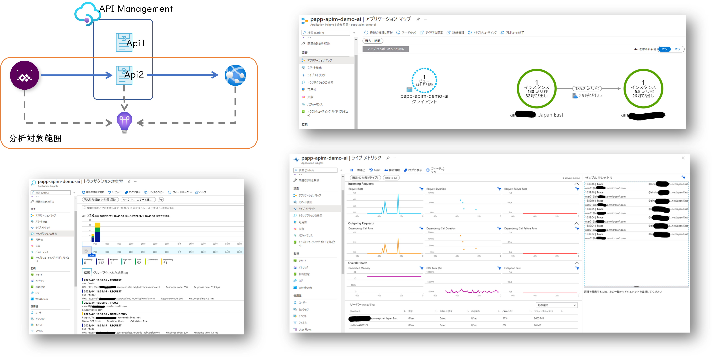

この記事では API Management の Application Insights の統合を主に紹介していますが、上記の画面キャプチャではクライアント側として Power Apps キャンバスアプリを、サービス側として App Service 上で動作する ASP.NET Core Web API のデータも同じ Application Insights にデータを送信するように構成した上で、取得できたデータを表示しています。

残念ながら Power Apps から API Management への依存関係呼び出しはうまくデータが出力されないようなのですが、API Management から ASP.NET Core Application への依存関係呼び出しのトラッキング、各ロールインスタンスで出力されたイベントデータが集約・分析できています。
先ほど API Management の trace ポリシーで出力したユーザー名も取得できています。

## まとめ

さらなる応用編としてはログを EventHub に送信してカスタムソリューションを構築するなどが考えられますが、
まずは標準機能と構成だけで監視可能な範囲について整理してみました。
Log Analytics を使用する場合と Application Insights を利用する場合で、機能的にはオーバーラップする部分があるので若干わかりにくいのですが、大まかには以下の様な使い分けになるのではないでしょうか。

- API の基盤を管理する立場の人はリソース ログを Log Analytics に格納して全体を俯瞰して監視を行う
- 個々の API を開発・運用・利用する立場では Application Insights にテレメトリを送信して機能要件に沿った監視を行う

この記事が皆様の参考になれば幸いです。