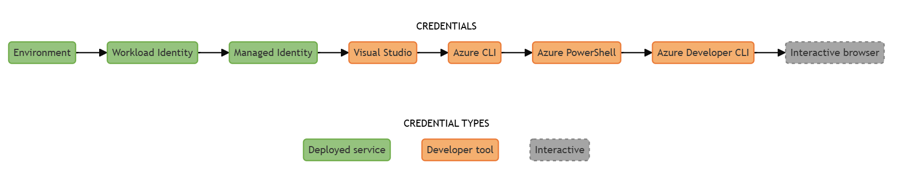
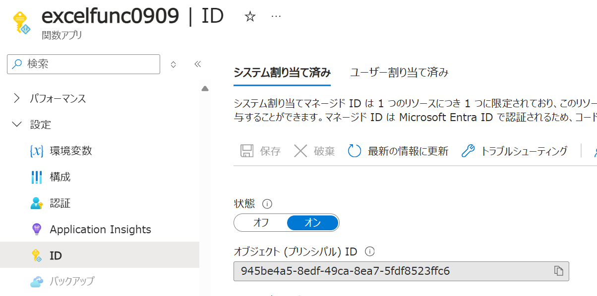
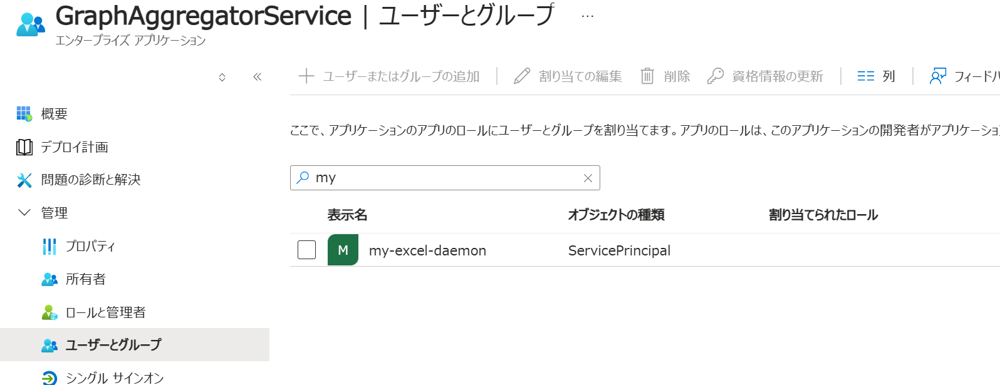
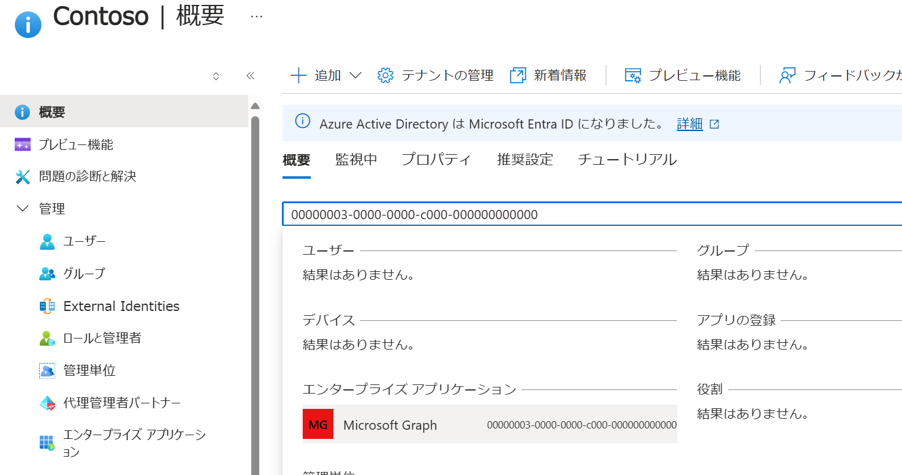
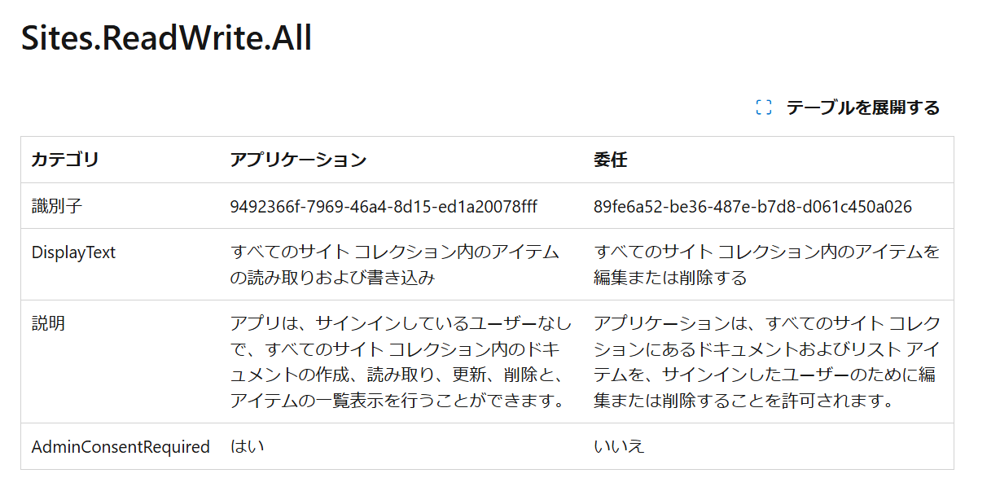
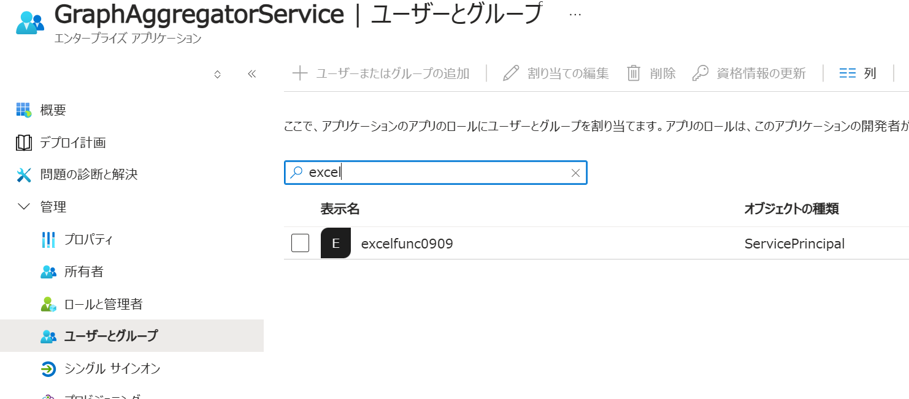

# はじめに

[前回の記事](../automate-excelfile-with-graphapi/) で Graph API にアクセスするアプリケーション開発について紹介しましたが、
この時は開発端末上でのローカル開発とデバッグを行うためにクライアントアプリはサービス プリンシパルを使用して認証を行っています。
このようにして作成したアプリの実運用環境として Microsoft Azure を選択する場合には [Managed ID](https://learn.microsoft.com/ja-jp/entra/identity/managed-identities-azure-resources/overview) を使用したいところです。
ということで今回は Graph API を利用する Functions アプリを作成する場合の方法について整理していきます。

# 設定方法の解説

以降ではコード部分は Azure Functions の .NET 8 分離モードを採用していますが、他の言語でもクレデンシャルの取得方法が異なるだけで、Entra の構成部分などは変わりがありませんので参考にしてみてください。

## Functions アプリのローカル開発時の認証方式

Azure 仮想マシン上で開発作業でもしていない限り、ローカル開発時には Managed ID は使用できません。
Graph API は[ユーザー委任](https://learn.microsoft.com/ja-jp/graph/auth-v2-user?view=graph-rest-1.0&tabs=http)でのアクセスと、
[ユーザー無し](https://learn.microsoft.com/ja-jp/graph/auth-v2-service?view=graph-rest-1.0&tabs=http)でのアクセスの許可が割とはっきりと分かれています。
今回は後者のユーザー無し（[Client Credentials flow](https://learn.microsoft.com/ja-jp/entra/identity-platform/v2-oauth2-client-creds-grant-flow)）で行いたいので、
開発端末においてもユーザーではなくアプリケーション認証で行いたいところです。

というわけで Functions アプリを手元の開発端末で開発している場合、開発中の各関数はサービスプリンシパルを使うことになります。
つまり前回の記事のように [EnvironmentCredential](https://learn.microsoft.com/ja-jp/dotnet/api/azure.identity.environmentcredential?view=azure-dotnet) 
もしくは [ClientSecretCredential](https://learn.microsoft.com/ja-jp/dotnet/api/azure.identity.clientsecretcredential?view=azure-dotnet) を使用することになります。
ただこの先 Azure にデプロイしたら [ManagedIdentityCredential](https://learn.microsoft.com/ja-jp/dotnet/api/azure.identity.managedidentitycredential?view=azure-dotnet) を使用するようになるわけですから
[DefaultAzureCredential](https://learn.microsoft.com/ja-jp/dotnet/api/azure.identity.defaultazurecredential?view=azure-dotnet)を使用して自動切換えできるようにしておくべきでしょう。

さて改めて [DefaultAzureCredential のフォールバックプロセス](https://learn.microsoft.com/ja-jp/dotnet/api/overview/azure/identity-readme?view=azure-dotnet) を確認してみます。
今回使用できそうなのは Environment と Managed ID ですね。



といわけで Functions のスタートアップコードでクライアントを依存関係として挿入してあげれば使えることになります。

```csharp
var cred = new DefaultAzureCredential();
// Graph API にアクセスする際の SDK クライアント
svc.AddSingleton<GraphServiceClient>(new GraphServiceClient(cred));
// 前回の記事のように REST API に直接アクセスが必要になるときは Credential も使えるようにしておく
svc.AddSingleton<TokenCredential>(cred);
```

開発端末の環境変数か `local.settings.json` に設定しておくと、`DefaultAzureCredential` のチェーンの先頭にある EnvironmentCredential がこれらの値を読み取って動作してくれます。

```json
{
    "Values": {
        "AZURE_TENANT_ID" : "Entra ID テナントの ID",
        "AZURE_CLIENT_ID" : "アプリ登録時に発行される Client ID（アプリID）",
        "AZURE_CLIENT_SECRET": "アプリのシークレット"
    }
}
```

## Functions アプリで動作させる際の Graph API 認証方式

前述のコードを Azure Functions 上にデプロイしたときはその環境変数に同様に設定しても動くのですが、
ここは本題の Managed ID を使用する方法を解説していきます。

### Managed ID の有効化

[Functions としては Managed ID を有効にしておけば](https://learn.microsoft.com/ja-jp/azure/app-service/overview-managed-identity?tabs=portal%2Chttp)
DefaultAzureCredential に含まれる ManagedIdentityCredential が自動的に読み取って認証を行ってくれます。



### Managed ID への Graph API アクセス許可は GUI では設定できない

ここで分かりにくいのがアプリケーションのアクセス許可です。
前回のように自前でアプリを登録した場合には、その登録画面から API のアクセス許可を構成することが出来ました。
ところが Managed ID にはこの画面が無いので、この設定を行うことができません。


Graph API 側はどうでしょうか。
Graph API もアプリ登録で確認することができませんが、サービスプリンシパル（エンタープライズ アプリケーション）は確認できます。
こちらを見るとクライアントアプリに対してロールの割り当てが行われていることが確認できます。
が、ここで出来るのはユーザーとグループの追加であって、アプリは追加できないのです。
困りました。



### コマンドラインによる Managed ID への Graph API アクセス許可

というわけで、コマンドラインで実施する必要があります。
この時に行う[クライアントアプリへのアプリロールのアサイン](https://learn.microsoft.com/ja-jp/graph/api/serviceprincipal-post-approleassignments?view=graph-rest-1.0&tabs=powershell)
も Graph API を使用した操作なので若干わかりにくいですが、要は以下のプロセスになります。

- クライアントツール（以下では PowerShell の Microsoft Graph クライアント）からユーザー認証を行う
- その際にアプリロールのアサインが可能なアクセス許可（AppRoleAssignment.ReadWrite.All と Application.Read.All）を委任する
- クライアントアプリに対して Graph API の必要なアプリロールを付与する

実際のスクリプトは以下のようになります。

```powershell
# 必要なモジュールをインポート
Import-Module Microsoft.Graph.Applications

# ユーザー認証して PowerShell クライアントに必要なアクセス許可を委任
Connect-MgGraph -Scopes AppRoleAssignment.ReadWrite.All, Directory.Read.All

# 必要な情報を変数に格納
$params = @{
    principalId = "クライアントとなる Managed ID のオブジェクト ID"
    resourceId = "当該テナント上の Microsoft Graph API を表すオブジェクト ID"
    appRoleId = "クライアントに許可したいアプリロールの ID"
}

# アサインを実行
New-MgServicePrincipalAppRoleAssignment -ServicePrincipalId $params.principalId -BodyParameter $params
```

パラメータに指定している値ですが、全てが GUID でややこしいので確認方法を整理しておきます。
なおコマンドラインで確認する方法もあるのですが、操作している際に混乱したので個人的には UI で確認するようにしています。

### principalId : クライアントとなる Managed ID のオブジェクト ID

こちらは Functions で Managed ID を有効化したときに表示される値を確認するとよいでしょう。


### resourceId : 当該テナント上の Microsoft Graph API を表すオブジェクト ID

Entra のホーム画面で Graph API のアプリケーション ID である `00000003-0000-0000-c000-000000000000` を検索するとエンタープライズ アプリケーションが出てきます。
これを開くと概要画面にオブジェクト ID が表示されます。



アプリケーション ID は全テナント共通ですが、エンタープライズ アプリケーション（サービスプリンシパル）は各テナント固有のオブジェクトなので、これに対するアクセス許可を与えたいわけですね。

### appRoleId : クライアントに許可したいアプリロールの ID

これは[アクセス許可のリファレンス](https://learn.microsoft.com/ja-jp/graph/permissions-reference?view=graph-rest-1.0#sitesreadwriteall)から探すのが簡単でしょう。
例えば今回付与している `Sites.ReadWrite.All` は



### 設定状況の確認

改めて Graph API サービスプリンシパルへのアクセス許可を確認すると、Managed ID が表示されていると思います。
これで設定は完了です。



# まとめ

Microsoft Graph API を使用することで、カスタムアプリケーションは Microsoft 365 に代表される様々な社内情報にアクセスすることが可能になります。
ユーザーが対話操作として使用するクライアントアプリの場合には、そのユーザーのアクセス許可を委任してあげることでアプリが代理として情報アクセスが可能です。
ただこの方式で可能なのはそのユーザーがそもそもアクセス権を持つ範囲になりますし、また基本的には対話操作中であることが前提になってきます。

今回のようなアプリ方式であればテナント内のデータに対して横断的なアクセスが可能になりますし、またユーザーの対話操作を必要としない無人実行のシナリオにも対応しやすくなります。
ただアクセス許可の範囲が広範囲に及ぶ可能性が高く、クレデンシャルの漏洩は極めて重篤なセキュリティインシデントにつながりかねません。
Managed ID であればこの「クレデンシャルの漏洩」のリスクが極めて小さくなりますので、こういった無人実行型のアプリを開発する際には是非 Azure 上での稼働をお勧めします。

