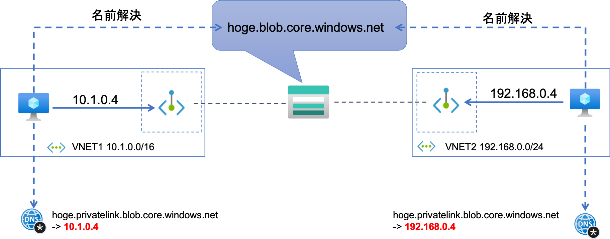
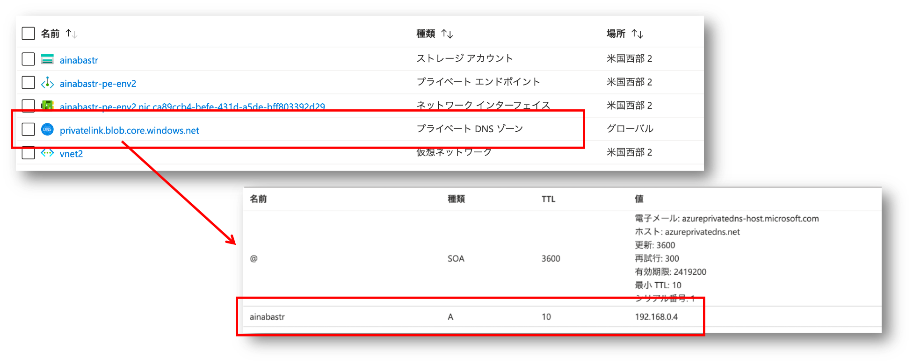
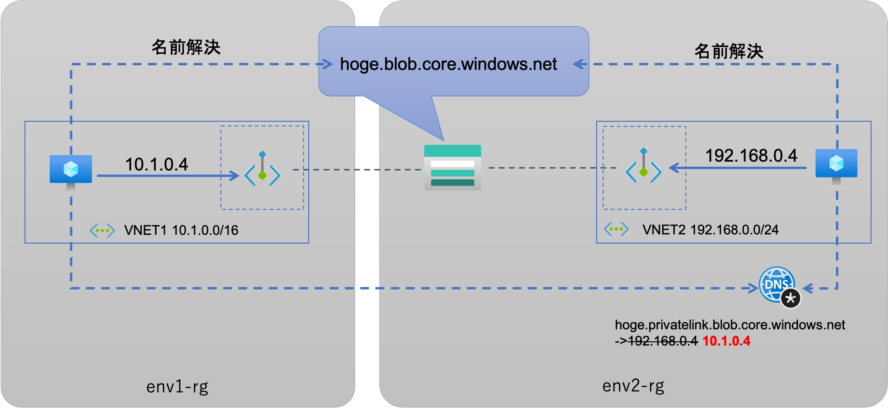
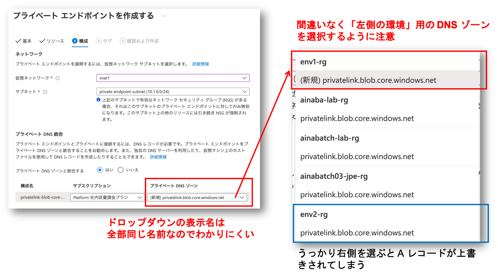
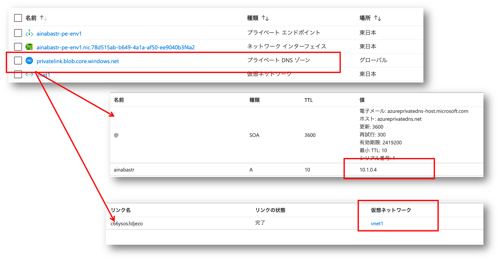
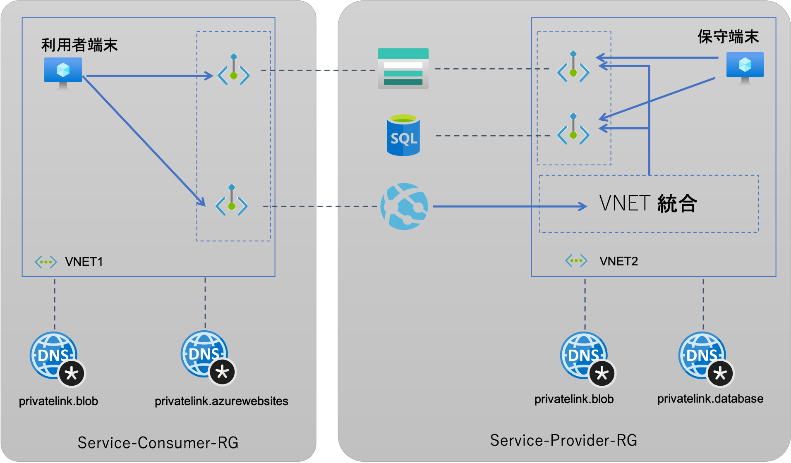

## はじめに

最近は [Azure Private Endpoint](https://docs.microsoft.com/ja-jp/azure/private-link/private-endpoint-overview) を使用して、
PaaS を使用しつつも閉域ネットワーク構成をとるアーキテクチャを多く取り扱うようになりました。
やはりオンプレミスと同様にプライベートネットワーク空間でサービスを利用したい／しなければならないという要件は非常に根強いものがあります。
ただある程度の規模の構成になってくると、Private Endpoint が 1 つでは足らず、複数の独立した仮想ネットワークから接続したいパターンが割と出てきます。
これを構成したい理由は色々あるのですが、実装しようとすると地味にハマるポイントがあり、設計段階で知っておいた方が良いかと思いますのでブログにしてみました。

## Private Endpoint の構成と挙動

例えば下図のような構成で、各仮想ネットワークの仮想マシンから Private Endpoint 経由で同じストレージアカウントにアクセスしたい場合の挙動を考えてみます

- ［左側］VM1 からのアクセス
	- hoge.blob.core.windows.net の名前解決を行うと　hoge.privatelink.blob.core.windows.net に解決される（CNAME レコード）
	- hoge.privatelink.blob.core.windows.net が VNET1 の Private IP アドレスである ***10.1.0.4*** に解決される（A レコード）
	- Private Endpoint の NIC にパケットが送信されストレージアカウントにルーティングされる
- ［右側］VM2 からのアクセス
	- hoge.blob.core.windows.net の名前解決を行うと　hoge.privatelink.blob.core.windows.net に解決される（CNAME レコード）
	- hoge.privatelink.blob.core.windows.net が VNET2 の Private IP アドレスである ***192.168.0.4*** に解決される（A レコード）
	- Private Endpoint の NIC にパケットが送信されストレージアカウントにルーティングされる

左右の環境での差異が発生するのは２段目です。
アクセス対象リソースに対して Private Endpoint を構成した時点で、対象リソースの FQDN は *privatelink* を含んだ CNAME に解決されるようになります。
この *privatelink* を含んだ FQDN を解決するための A レコードは、各仮想ネットワークで異なる Privafte IP アドレスを返す必要があるわけですが、この IP アドレスは左右で異なります。
つまり左右の環境では同じ ***hoge.privatelink.blob.core.windows.net*** という FQDN に対して異なる名前解決の仕組みを持つ必要があることになります。
この名前解決の仕組みは基本的に以下の３択です。

- Azure Private DNS Zone を使用する（最も一般的）
- カスタム DNS サーバーを用意する
- 各環境で hosts ファイルを配布する

２番目と３番目は独自に頑張る方法なので良いのですが、問題が発生しやすいのは1つ目のパターンです。
Private DNS Zone はそのリソース名が DNS ゾーン名に、具体的には ***privatelink.blob.core.windows.net*** になります。
つまり１つのリソースグループには Blob に対する Private DNS ゾーンは１つしか作ることができませんし、そしてそこには A レコード ***hoge*** も１つしか定義できません。
(実際に作ろうとすると hoge はなかなか使えないので、画面キャプチャ内では異なる名前 ainabastr になっています)

こちらのキャプチャは右側の環境になりますが、同じゾーン内には左側の環境で参照するための A レコードを登録することができません。
つまり左側の環境用に **同じ名前を持つ異なる DNS Private Zone リソース** を作成する必要がありますので、リソースグループを分ける必要が出てくるわけです。

## 構築時のポイント

構成がわかればあとは作成するだけですが、これをポータルで作業すると割とよく間違えます。
具体的に何を間違えるかというと、2つ目の Private Endpoint を作成する際に、1つ目の Private DNS ゾーンを使用してしまい、うっかり A レコードを上書きしてしまうんですね。
つまりこんな↓構成をうっかり作ってしまうと、左側の環境からは使えるようになるのですが、右側の環境からアクセスができなくなってしまうわけです。

構築時のポイントは Private Endpoint 作成時に選択する ***統合する Private DNS Zone を選択するドロップダウン** です。

見ての通り、Private DNS ゾーンを選択するドロップダウンがあるのですが、接続するリソース種別が同じ（この場合は blob）であれば、全部同じゾーン名なのでリソース名も同じになり、
ドロップダウンを開いてみてリソースグループまで確認してやらないとわからないという、大変不親切な画面デザインになっています。困ったもんです。
スクリプトやARMでやれば良いのですが、まあ試行錯誤するときはポータルが便利ですよね、ということで。
作成できたら左右の環境の DNS Private Zone を開き、A レコードの値とともに、リンクされた仮想ネットワークなどを確認しておきましょう。

## 補足

なお上記の問題に関しては設計上のテクニックとして、「双方の仮想ネットワークアドレスレンジを合わせて、同一の Private IP を使用する」というのも考えられるのですが、これは以下の理由からお勧めしません。
- Private Endpoint に割り当てられる IP アドレスを明示できないので、作成順序を揃えるなど無駄な手間が発生し、保守も難しくなる
- 左右の環境で必要となる Private Endpoint が完全一致するとは限らない

具体例がないと分かりにくいかもしれ前んが、例えば以下のように、左側の環境をサービス利用側、右側の環境をサービス提供側、とした構成を考えてみてください。

左側からアクセスする利用者に対しては **提供したいサービスの Private Endpoint** 、ここでは Blob と Web Apps へのアクセス経路のみが提供されています。
しかし右側の環境では **一般ユーザーには提供されないサービスの Private Endpoint** 、ここでは SQL Database へのアクセス経路が用意されており、保守担当者の直接アクセスや、Web Apps からバックエンドサービスとしてアクセスすることができるようになっています。
双方で共有しているリソースは Blob サービスのみで、これが本記事でトピックとしていた **分離された複数の仮想ネットワークから各々 Private Endpoint が必要になる** ケースです。

