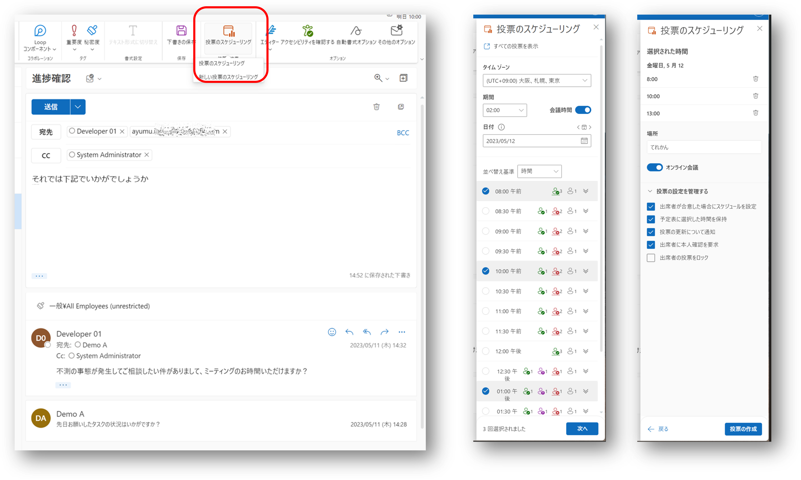
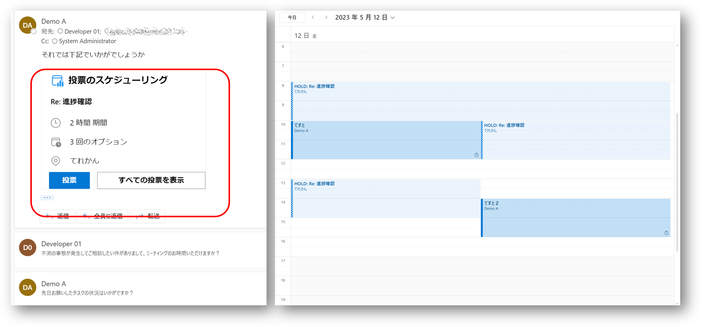
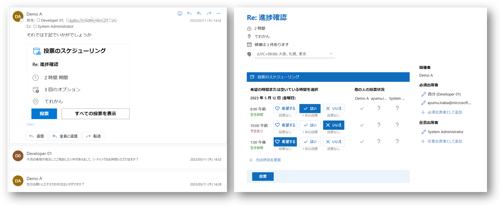
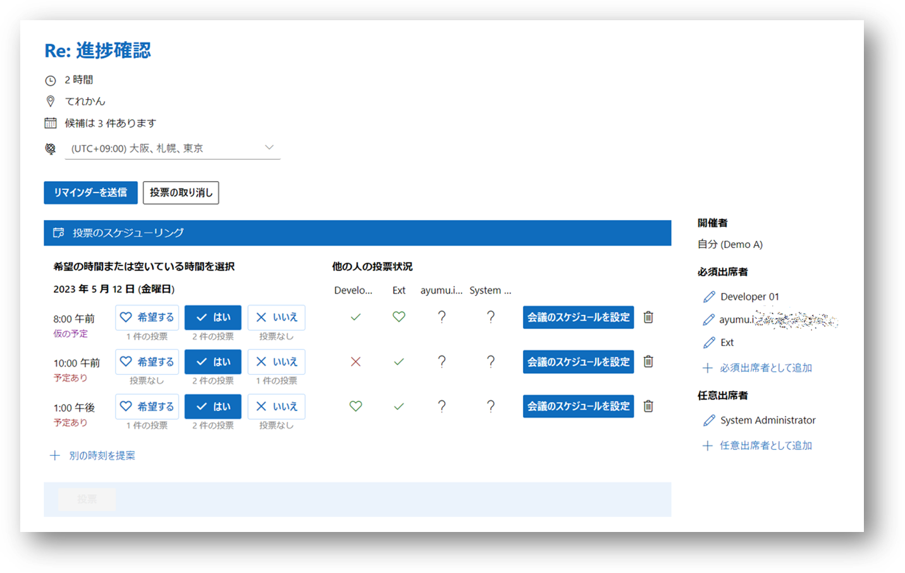
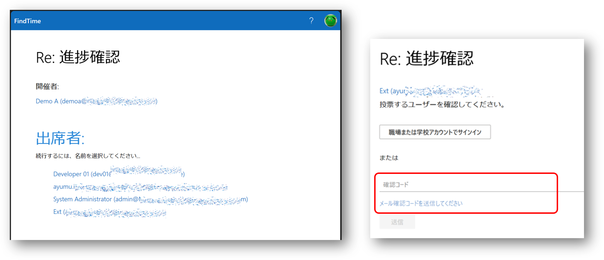

# はじめに

会議の日程調整って大変ですよね。
特に関係者の人数が多ければ多いほど調整は難航しがちです。
社内の人であれば空き時間状況も確認できますが、空いているからと言って勝手に時間を確保するわけにもいきません。
社外の人であれば空き時間状況も確認できないわけですから猶更です。

そこで良くやるのが、以下のようなメールでの日程調整です。

- 主催者になる人が候補日時をリストアップして参加者にお伺いを立てる
- 各参加者は自分の都合の良い日時を選択、返信する
- 主催者は参加者の回答を集計して、最適な日時を決定する
- 最終的な会議日時を参加者に通知する

ちなみに弊社無いですと、候補日をメール内でリストアップするのではなくて、会議通知をその件数分送ったりします。
その会議通知に対する承諾状況を見て最終日時を決定するのですが、仮の会議通知を沢山つくらないといけないですし、個々の会議通知の集計状況は横断的にみられないので、それはそれで怠いわけです。

調整と集計作業に関してはそれ専門のツールやサービス使いたいわけですが、外部ツールを使う場合は情報漏洩やなりすましなどのセキュリティリスクが気になるわけです。
M365 では投票を行うサービスなんかもありますが、ちょっと汎用的過ぎて会議通知とかと連動してくれるわけじゃないんですよね。
というわけで、そもそも Outlook 標準機能でやってほしいわけです。

まあそんなわけで、Outlook には FindTime というアドインがあります。
割とこれ便利なんですが、公式のドキュメント呼んでもいまいち使い勝手が分かりにくいかなと思ったので、実際の UX をご紹介したいなと思ったと言います。

# じゃあ会議しましょう（主催者）

Outlook でメールの新規作成や編集画面を開いていると、`投票のスケジューリング` という意図の分かりにくいボタンがあります。
英語だと `Schduling Poll` となっているので、日程調整の投票を作成する、的な意味合いだと思うんですよね。

で、このボタンを押すと To や CC ラインのメンバーがスケジュールを確認しつつ、会議日程の候補を選択できるようになります。
各時間枠に対して、参加メンバーの空き状況も見えていますね。

- 緑のチェックマークが 空いている人数
- 紫のチェックマークが 仮の予定が入っている人数
- 赤のチェックマークが 既に予定が入っている人数
- 灰色のチェックマークは組織外のユーザーなのでスケジュールが確認できない人数。

状況を把握しつつ、各時間枠に対して青のチェックマークをつけることで候補日時を選択できます。
そして会議の場所や投票設定を指定して投票を作成すると、投票をお願いするメールになるので送信しましょう。

ちなみにこの時点で主催者のカレンダーには `HOLD` から始まる仮の予定が入っています。
日程候補を出しておきながら、うっかり他の予定を入れてしまって、折角調整したのに主催者が参加できないとか洒落にならないですからね。

# 参加できる、できない、なるべくここにしてほしい（参加者）

さて参加者側には先ほどのメールが飛んできますので、自分の希望する日時を選択できるわけです。

- 予定が入ってるところはお断りするかと思いきや、実はそれほど重要じゃない予定なのでこっちを優先するよ、とか
- スケジュール上は空いてるように見えるけど、外出中なのでオンライン会議でも参加しにくいからやめて、とか
- 業務時間外だからスケジュール入ってないように見えるだけよ、とか
- 朝が早いよりは、夕方の方がいいなあ、とか

いろいろな状況が考えられますが、それらの気持ちを込めて、`希望する`、`はい`、`いいえ` を選択して投票しましょう

ちなみにここで追加の日程の提案することで、参加者側からも投票の候補を増やすことができます。
あるいは、漏れていた参加者を追加することで、投票に参加してもらうことも出来ます。
このあたりの機能も主催者の手間を減らすためには便利なんじゃないでしょうか。

# 会議の日時を確定しよう（主催者）

さて続々と投票があつまってくれば、その進捗状況の確認が必要ですよね。
主催者もメール内にある`投票`ボタンを押すことで状況を確認出来ます。
投票の集まりが悪ければリマインダーを出すこともできます。

もし日時が迫っていて回答を待てないとかであれば、`会議のスケジュールを設定` してしまっても良いでしょう。
主催者側の HOLD 予定が全てキャンセルされ、正式な会議出席依頼が全メンバーに送信されます。

なお投票作成時のオプションで `出席者が合意した場合にスケジュールを設定` という項目を選択しておくと、必須出席者が全員回答した時点で自動的に会議通知が全員に送付されることになります。
TO に入っている必須出席者の中でも特に必須であるとか職位的な優劣があるとか、そういった場合にはこちらのオプションはオフにしておくといいでしょう。

# 社外の人も参加したい（参加者）

個人的にこの機能が秀逸だなと思うのは、外部の人（＝同じ AzureAD テナントのユーザーじゃない人）も投票に参加できることです。
最初の投票オプションえ `出席者に本人確認を要求` するようにしておくと、各参加者は投票時にユーザー認証されるわけですが、外部の人はそうは行きません。
ユーザー認証できない場合は「あんた誰？」と聞かれることになります。

そこで外部の人は自分の名前を選択して、`確認コード`を入力することで、内部の人と同様に投票に参加できるようになるわけです。
確認コードは`メール確認コードを送信してください` をクリックすると、その名の通りメールで送られてきます。
メールを受信できることが本人性の確認になっているわけですね。

# まとめ

というわけで個人的な最近のお気に入りのご紹介でした。

