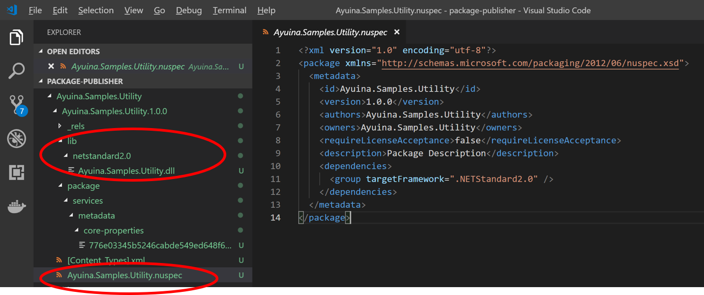
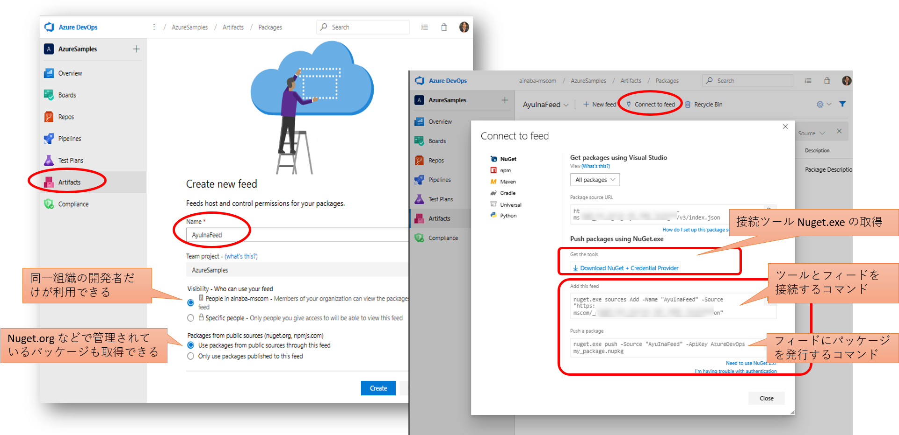
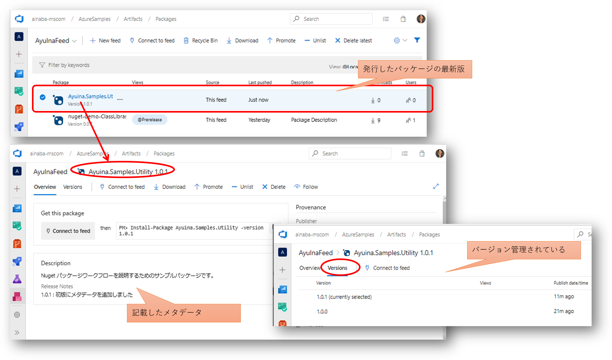
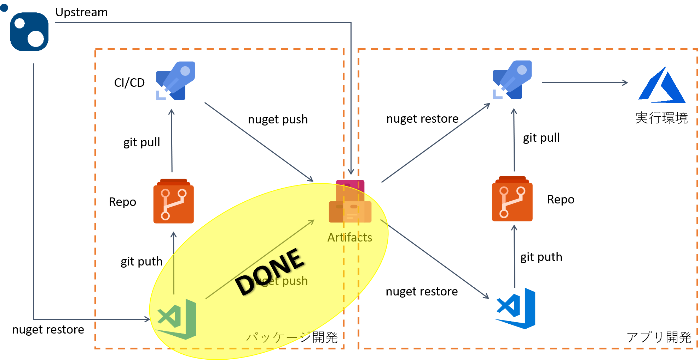

## パッケージの作成と公開

まずローカル開発環境で Nuget パッケージを作る方法です。
ここからは基本的に
[チュートリアル](https://github.com/ayuina/ainaba-csa-blog/blob/package-management-by-azure-artifact/package-management-with-azure-artifacts/index.md)
にそった作業となります。

### 共通部品クラスライブラリの作成

共有するための適当な既存の部品が無い場合は、下記のようなコマンドで C# のクラスライブラリプロジェクトを作ってしまいましょう。
プロジェクト名は適宜書き換えてください。
ここではポータビリティの高い .NET Standard にしてみます。

```pwsh
> dotnet new classlib --name Ayuina.Samples.Utility --framework netstandard2.0
```

出来上がったソースコードにロジックを追加します。ここでまじめに部品を作る必要はないので以下のような感じで良いでしょうか。

```csharp
using System;

namespace Ayuina.Samples.Utility
{
    public class Class1
    {
        public static string Hello(string name)
        {
            return $"Hello {name} !";
        }
    }
}
```

ではビルドしてアセンブリを作成します。
ビルドに成功したら生成物を確認してみましょう。
拡張子 `dll` のファイルができていればとりあえず良しとします。

```pwsh
PS > dotnet build
PS > dir .\bin\Debug\netstandard2.0

Mode                LastWriteTime         Length Name
----                -------------         ------ ----
-a----       2019/05/15     17:52           1465 Ayuina.Samples.Utility.deps.json
-a----       2019/05/15     17:52           4096 Ayuina.Samples.Utility.dll
-a----       2019/05/15     17:52            512 Ayuina.Samples.Utility.pdb
```

### パッケージを生成する

ではシンプルにこのまま NuGet パッケージを生成してみます。
.NET Core SDK の dotnet.exe には NuGet を扱えるコマンド 
[dotnet nuget](https://docs.microsoft.com/ja-jp/nuget/tools/dotnet-commands) 
も同梱されてますので、それを利用してしまいます。
プロジェクトルートフォルダ（csproj ファイルがあるフォルダ）にて下記のコマンドを実行してみます。

```pwsh
PS > dotent pack
```

成功するとビルド出力ディレクトリに拡張子 nupkg のファイルが出来ていると思います。

```pwsh
PS > dir .\bin\Debug

Mode                LastWriteTime         Length Name
----                -------------         ------ ----
d-----       2019/05/15     17:52                netstandard2.0
-a----       2019/05/15     17:57           3461 Ayuina.Samples.Utility.1.0.0.nupkg
```

### パッケージの中身を確認する

これでパッケージとしては出来上がりなのですが、一応中身を見てみましょう。
この `nupkg` ファイルは ZIP 形式のファイルの拡張子を変えただけなので、ZIP を解凍できるツールがあれば中身を見ることができます。

```pwsh
PS > cp .\Ayuina.Samples.Utility.1.0.0.nupkg .\Ayuina.Samples.Utility.1.0.0.zip
PS > Expand-Archive .\Ayuina.Samples.Utility.1.0.0.zip
```

中身を見てみるとごちゃごちゃっと入っていますが、ポイントは以下の2点でしょうか。
- lib > target_framework 配下に共有したいアセンブリが格納されている
- ルートに nuspec というファイルが生成され、中にはバージョン番号など管理用のメタデータが含まれている



この `nuspec` はプロジェクトの出力ディレクトリである `bin` ではなく、中間生成ファイルなどが格納される `obj` にも出力されています。
こちらはパッケージの中に含めるファイルレイアウトなども記載されており、 `nupkg` に含まれている `nuspec` とは若干中身が異なります。
実は `dotnet pack` コマンドを実行した段階で、プロジェクトファイル `csproj` からメタデータやファイルレイアウトを決めるためのマニフェストファイルとして `nuspec` が `obj` ディレクトリ生成されています。
それを元に実際のパッケージング処理が行われ　`nupkg` が  `bin` に生成されていたわけです。
この際にファイルレイアウトは不要になるのでメタデータだけが `nuspec` ファイルに残る、といった感じでしょうか。
逆に言えば、ちゃんとしたメタデータを記載したいならば `csproj` を編集すればよいわけです。

### プロジェクトファイルにパッケージメタデータを付与する

それではプロジェクトファイル `csproj` を下記のように修正してみます。
ここではメタデータを付与すると同時に、一応中身が変わったので 1.0.0 から 1.0.1 にバージョンを上げています。
また利用者にこの部品の内容を説明するための Readme も追加しています。 

```xml
<Project Sdk="Microsoft.NET.Sdk">
    <PropertyGroup>
        <TargetFramework>netstandard2.0</TargetFramework>

        <PackageId>Ayuina.Samples.Utility</PackageId>
        <Version>1.0.1</Version>
        <Authors>ayuina</Authors>
        <Title> Ayuina's awesome utilities </Title>
        <PackageDescription> Nuget パッケージワークフローを説明するためのサンプルパッケージです。 </PackageDescription>
        <PackageReleaseNotes> 1.0.1   : 初版にメタデータを追加しました </PackageReleaseNotes>
    </PropertyGroup>
    <ItemGroup>
        <Content Include="readme.txt">
        <Pack>true</Pack>
        <PackagePath>.</PackagePath>
        </Content>
    </ItemGroup>

</Project>
```

メタデータに使用できる要素は
[リファレンス](https://docs.microsoft.com/ja-jp/dotnet/core/tools/csproj#nuget-metadata-properties)
を参照ください。

プロジェクトファイルの修正が終わったら再度 `dotnet pack` を実施すると、ビルド出力ディレクトリ配下に 2 つ目の `nupkg` ファイルが生成されていると思います。


### その他のパッケージの作り方

ここまで紹介してきた手順は MSBuild のプロジェクトシステムに依存したパッケージの作り方なわけですが、究極的には `nuspec` ファイルを別途手書きしてしまっても良いことになります。
最終的に `nupkg` に含めたいディレクトリ構造を適宜作成してしまい、メタデータを `nuspec` に記載して、NuGet のツールを使ってパッケージングしてしまうことも可能です。
この方法であれば任意のファイルを含んだパッケージを生成することが可能です。
パッケージ作成の様々なワークフローに関しては
[こちら](https://docs.microsoft.com/ja-jp/nuget/create-packages/overview-and-workflow)
をご参照ください。

## 作成したパッケージの提供

パッケージの準備ができたので、次はパッケージリポジトリを準備して、そこにパッケージを発行していきます。
ここからの手順は 
[Azure Artifacts のドキュメント](https://docs.microsoft.com/ja-jp/azure/devops/artifacts/get-started-nuget?view=azure-devops) 
を参照すると良いでしょう。

### リポジトリとフィードを作成する

Azure Artifacts の画面からフィードを新規作成すると、フィードへの接続情報を取得できます



接続情報の画面ではコマンドラインのサンプルだけではなく、コマンドラインツール（NuGet.exe）もダウンロードできます。
ダウンロードする zip ファイルには Azure DevOps に接続するための認証モジュールが含まれていて便利ですので、こちらを使いましょう。

### フィードにパッケージを発行する

まずは作成したフィードを開発環境における NuGet のソースレポジトリとして追加します。この操作は各環境で１回だけやれば大丈夫です。
初回実行時には認証ダイアログが表示されますので、その場合は Azure Artifacts にアクセス可能なユーザーアカウントで認証してください。

```pwsh
PS > .\nuget.exe sources Add -Name "AyuInaFeed" -Source "https://pkgs.dev.azure.com/orgnizationName/_packaging/AyuInaFeed/nuget/v3/index.json"
```

次に作成済みのパッケージ `nupkg` をフィードに発行（Push）します。
パッケージは２つ出来ているので両方とも発行してしまいましょう。
`NuGet.exe` のパス、`nupkg` のパス、フィード名やレポジトリの URL などはご自身の環境に合わせて

```pwsh
PS > .\NuGet.exe push -Source "AyuInaFeed" -ApiKey AzureDevOps .\bin\Debug\Ayuina.Samples.Utility.1.0.0.nupkg
PS > .\NuGet.exe push -Source "AyuInaFeed" -ApiKey AzureDevOps .\bin\Debug\Ayuina.Samples.Utility.1.0.1.nupkg
```

発行が完了した後に Azure Artifacts のフィードを確認すると、同じ名前で 2 つのバージョンのパッケージが登録されていることが確認できます。



### .NET Core SDK を使用して発行する

ビルド、パッケージに使用した dotnet コマンドを使用して、Azure Artifacts への発行まで一気通貫にやってしまいたい場合には、
[Azure Artifacts Credential Provider](https://docs.microsoft.com/ja-jp/azure/devops/artifacts/nuget/dotnet-exe?view=azure-devops)
が必要になります。

発行用のコマンドは以下のようになります。

```pwsh
PS > dotnet nuget push .\bin\Debug\Ayuina.Samples.Utility.1.0.3.nupkg  --source https://pkgs.dev.azure.com/orgName/_packaging/feedName/nuget/v3/index.json --api-key AzureDevOps --interactive
```

初回など認証情報キャッシュが存在しない場合は認証が必要になるので --interactive オプションを使用してください。
認証が必要な場合にはコマンドの出力に「ブラウザを使用して認証しろ」という指示が出ますので、そちらの指示に従って Azure Artifacts フィードにアクセス可能なユーザー情報を使用して認証を受けてください。

```pwsh
log  :     [CredentialProvider]DeviceFlow: https://pkgs.dev.azure.com/orgName/_packaging/AyuInaFeed/nuget/v3/index.json
log  :     [CredentialProvider]ATTENTION: User interaction required.
log  :
log  :     **********************************************************************
log  :
log  :     To sign in, use a web browser to open the page https://microsoft.com/devicelogin and enter the code XXXYYYZZZ to authenticate.
log  :
log  :     **********************************************************************
info :     [CredentialProvider]VstsCredentialProvider - Acquired bearer token using 'ADAL Device Code'
info :     [CredentialProvider]VstsCredentialProvider - Attempting to exchange the bearer token for an Azure DevOps session token.
```

### API KEY は？

前述のドキュメント中にもありますが、NuGet クライアントの仕様としてパッケージを PUSH する際には api key が必要になります。
ただ Azure Artifacts の場合にはこの api key を使用しませんので、任意の文字列を入力して構いません。
サンプルでは `AzureDevOps` と指定していますが、この値に意味はありません。

## ここまでのまとめ

ここまででやりたいことの 1/4 くらいが終わりました。


次は[発行したパッケージの利用方法](./contents2.md)です。
