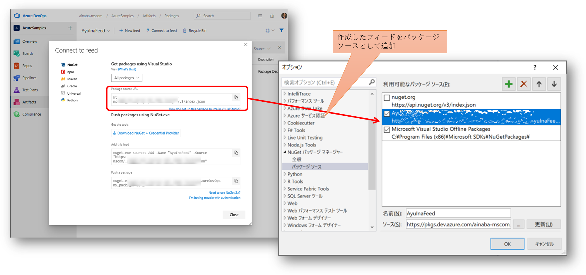
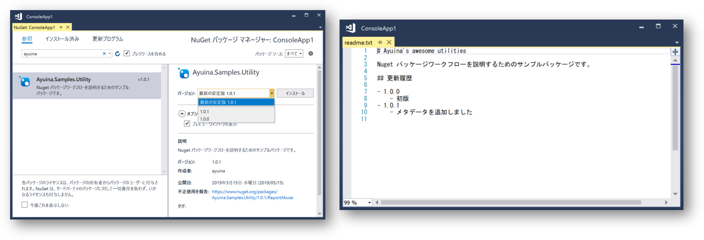
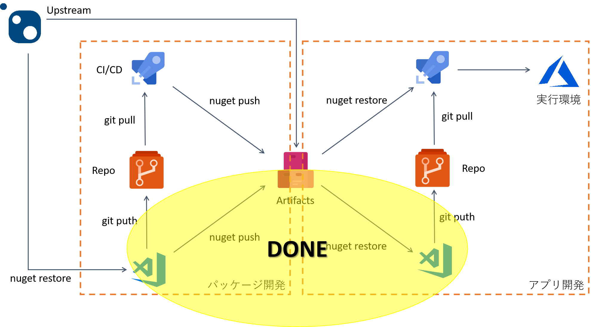

## 開発環境でのパッケージの利用

今度は発行したパッケージを利用してみましょう。
前回紹介した[共有ライブラリを開発](./contents1.md)した人とは別の人間になった気持ちで進めます。

### .NET Core CLI を使用する

まずパッケージを利用する側のコンソールアプリケーションを開発しましょう。

```pwsh
PS > dotnet new console --name ConsoleApp1 --framework netcoreapp2.1
```

次に Azure Artifacts のフィードにアクセスしてパッケージを取得したいわけですが、dotnet コマンドはそのままでは Azure Artifacts のフィードに認証を通すことができません。
まず 
[こちら](https://docs.microsoft.com/ja-jp/azure/devops/artifacts/nuget/dotnet-exe?view=azure-devops)
の手順に従って `Azure Artifacts Credential Provider` をインストールしてください。

そして下記のコマンドを実行します。コマンドに指定する URL は前述のフィード作成時と同様に、Azure Artifacts の画面から確認できます。初回は認証画面が表示されると思いますので、開発側と同じ Artifacts にアクセスできる ID でログインしてください。

```pwsh
PS > dotnet add package Ayuina.Samples.Utility -s
https://pkgs.dev.azure.com/org-name/_packaging/AyuInaFeed/nuget/v3/index.json --interactive
```

すると下記のようにプロジェクトファイルに対して依存するパッケージへの参照が記録されます。

```xml
<Project Sdk="Microsoft.NET.Sdk">

  <PropertyGroup>
    <OutputType>Exe</OutputType>
    <TargetFramework>netcoreapp2.1</TargetFramework>
  </PropertyGroup>

  <ItemGroup>
    <PackageReference Include="Ayuina.Samples.Utility" Version="1.0.1" />
  </ItemGroup>

</Project>
```

あとはパッケージされたライブラリを呼び出すようにコードを修正します。

```csharp
    static void Main(string[] args)
    {
        string message = Ayuina.Samples.Utility.Class1.Hello("NUGET");
        Console.WriteLine(message);
    }
```

実行してライブラリが呼び出せていることを確認しましょう。
ライブラリ側で実装したメッセージが表示されるはずです。

```pwsh
PS > dotnet run
```

### Visual Studio の場合

Visual Studio を使用する場合（以下は VS2017 を使用）には、オプション画面からフィードの URL をパッケージソースとして登録してやる必要があります。



なお今回フィードの作成時にパブリックソースを有効にしているため、nuget.org で管理されているパッケージも作成したフィード経由で取得することができます。
このため Visual Studio 側では nuget.org のチェックを外しておくとよいでしょう。
このような Upstream ソースの管理については
[こちら](https://docs.microsoft.com/en-us/azure/devops/artifacts/how-to/set-up-upstream-sources?view=azure-devops)
をご参照ください。

その後は NuGet.org 等で公開されている標準的なパッケージと同様の使い方になります。



パッケージマネージャーの画面から必要なライブラリを検索してプロジェクトの依存関係に追加することができます。
今回は複数バージョンのパッケージを発行していますので、ユーザー側で適切なバージョンを選択することが可能です。
また今後新しいバージョン(1.0.2 など)がフィードに発行された場合、利用側からはパッケージマネージャー画面で「更新プログラム」で確認することができます。

なおパッケージの依存関係が解決され正常に取得すると、開発側がパッケージに含めておいた readme.txt が自動的に表示されます。
このため開発側は利用側に知っておいてほしい内容を記載しておくと良いでしょう。
更新履歴、サンプルコード、問い合わせ先、FAQ、べからず集、などが書かれていると親切だと思います。

## ここまでのまとめ

使うだけなら簡単ですね。
ここまでで下図の丸で囲まれたあたりまでがカバーできたことになります。



これまでは手動でのパッケージ開発・利用のワークフローを紹介してきました。
ここからはこれらのワークフローを自動化していきたいと思います。

- [パッケージ生成とカスタムフィードへの発行を自動化する](./contents3.md)
- [カスタムフィードを利用したアプリケーションを自動デプロイする](./contents4.md)
