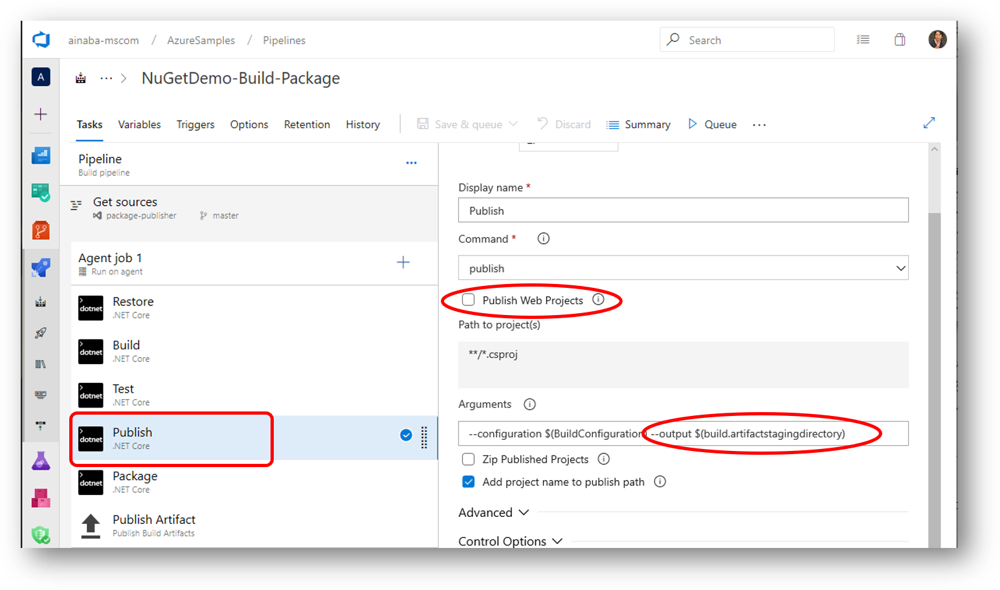
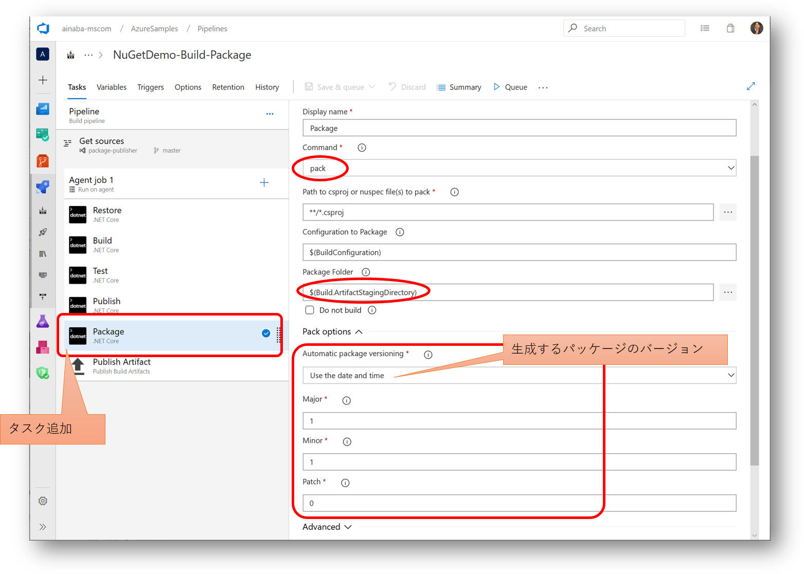
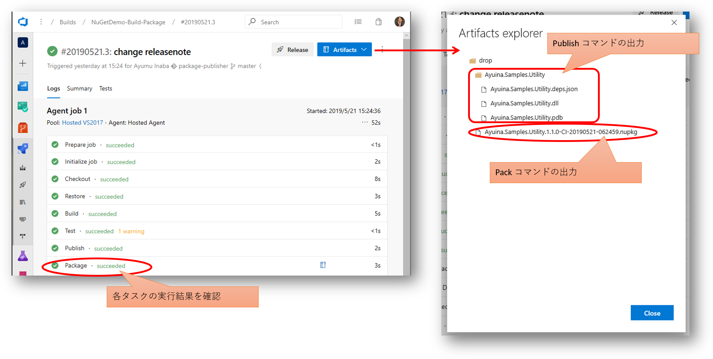

## ソースコードリポジトリの作成

既にパッケージ開発側のライブラリができていますので、まずは Azure Repos を作成して格納してしまいましょう。
Git のリポジトリを作成したら [その１](./contents2.md) で作成したプロジェクトを Push しておきます。


コマンドラインは以下のような感じです。

```pwsh
PS > git clone https://org-name@dev.azure.com/org-name/projectName/_git/repository-name
PS > cd repository-name
PS > # ソースコードのコピー
PS > git add .
PS > git commit -m "コメント"
PS > git push
```


## ビルドパイプライン

次に格納したソースコードをビルドして、成果物を自動生成します。
この段階ではまだフィードへの公開を行わず、 **NuGet パッケージが取得できる** ところまでを目指します。 

### ビルドパイプライン定義の作成

ビルドパイプラインは YAML 形式で定義するのが新しいやり方なのですが、
初めての場合は若干わかりにくいので、視覚的なクラシックパイプラインを使用します。


ビルドのソースとして先ほど作成したレポジトリを指定し、ビルドテンプレートとして ASP.NET Core を指定します。
[その１](./contents1.md) で作成したソースコードは ASP.NET Core アプリケーションではなくクラスライブラリなのですが、
コンソールアプリ用のテンプレートが提供されていないので、ASP.NET Core 用をカスタマイズして使います。



使用したテンプレートは Web アプリケーション用なので、`publish` コマンドのタスクでは `Publish Web Projects` にチェックされています。
今回はクラスライブラリですので、このオプションはオフにします。
また `--output` オプションが `Build.ArtifactsStagingDirectory` 環境変数に設定されています。
ここにファイルを出力しておくと、後段の `Publish Artifact` タスクにて成果物として発行され、ビルド完了後に取得できるようになります。

これだけではあくまでもクラスライブラリが取得できるようになるだけなので、dotnet タスクを追加して pack コマンドを実行します。



`pack` コマンドでも出力先を `Build.ArtifactsStagingDirectory` に設定しておくことで、生成された `nupkg` ファイルがビルドの成果物として取得できるようになります。
またこのタイミングでパッケージのバージョンを指定することもできます。

## ビルドの実行と成果物の取得

ビルド定義が完成したら保存してビルドを実行します（`save & queue` )。
ビルドが完了すると `publish` や `pack` コマンドで出力した成果物が確認できます。



それでは生成されたパッケージ `nupkg` の中身を見てみましょう。


基本的には [その１](./contents1.md) で生成したものと中身は同じですが、`nuspec` に記載されたバージョン番号が書き換わっていることがわかります。

## リリースパイプライン

ここでのゴールは前述の自動ビルドで生成した NuGet パッケージが **フィードで公開されていること** となります。
フィードは [その１](./contents1.md) で作成したものを使用します。