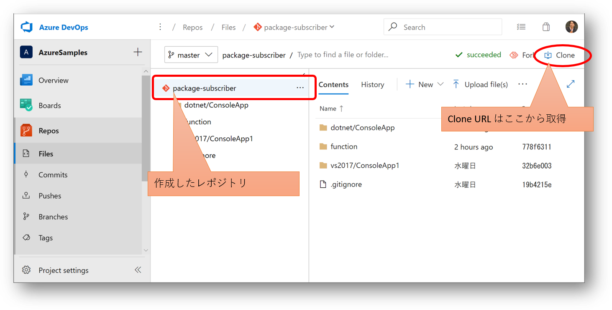
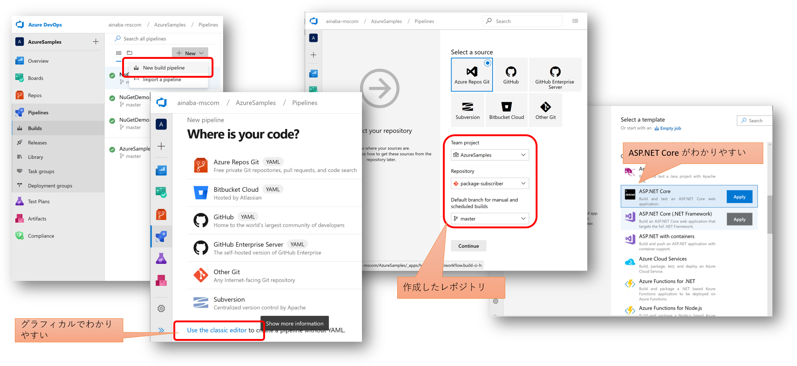

## ソースコードリポジトリの作成

既にパッケージ開発側のライブラリできていますので、まずは Azure Repos を作成して格納してしまいましょう。
Git のリポジトリを作成したら [その１](./contents2.md) で作成したプロジェクトを Push しておきます。


コマンドラインは以下のような感じです。

```pwsh
PS > git clone https://org-name@dev.azure.com/org-name/projectName/_git/repository-name
PS > cd repository-name
PS > # ソースコードのコピー
PS > git add .
PS > git commit -m "コメント"
PS > git push
```



## ビルドパイプライン

次に格納したソースコードをビルドして、成果物を自動生成します。
ここでは **NuGet パッケージが取得できること** がゴールになります。
この段階ではまだフィードへの更改を行いません。

### ビルドパイプライン定義の作成

ビルドパイプラインは YAML 形式で定義するのが新しいやり方なのですが、
初めての場合は若干わかりにくいので、視覚的なクラシックパイプラインを使用します。



ビルドのソースとして先ほど作成したレポジトリを指定し、ビルドテンプレートとして ASP.NET Core を指定します。
[その１](./contents1.md) で作成したソースコードは ASP.NET Core アプリケーションではなくクラスライブラリなのですが、
コンソール用のテンプレートは提供されていないので、ASP.NET Core 用をカスタマイズして使います。


## リリースパイプライン

ここでのゴールは前述の自動ビルドで生成した NuGet パッケージが **フィードで公開されていること** となります。
フィードは [その１](./contents1.md) で作成したものを使用します。