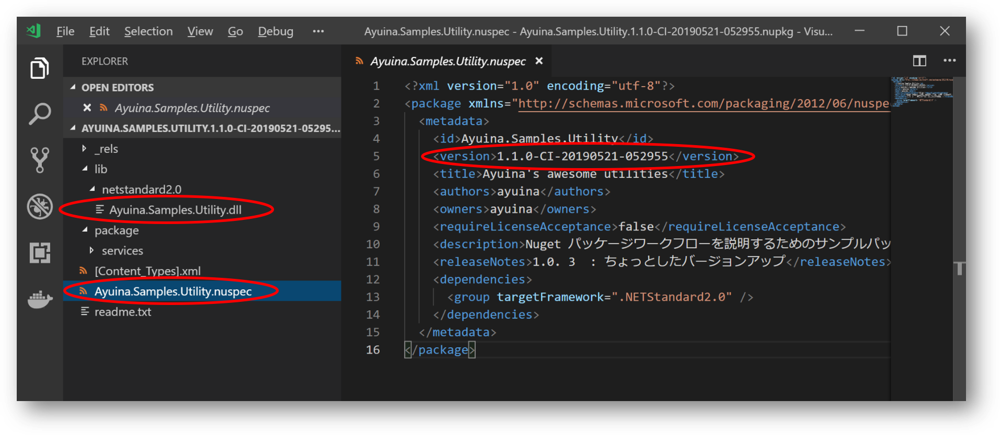
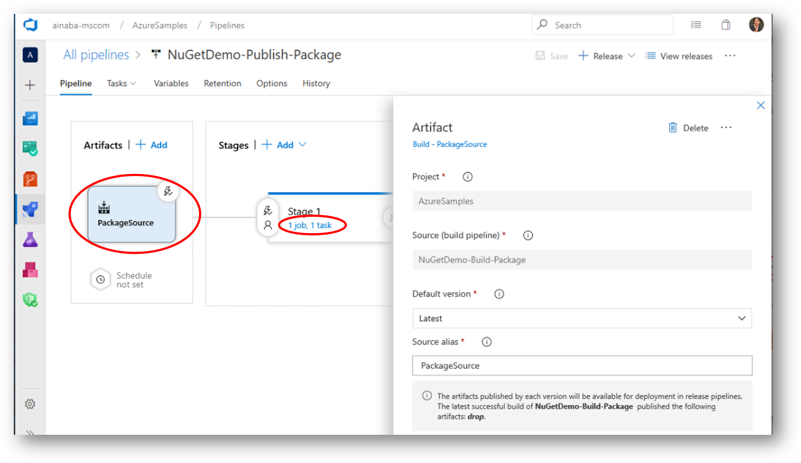
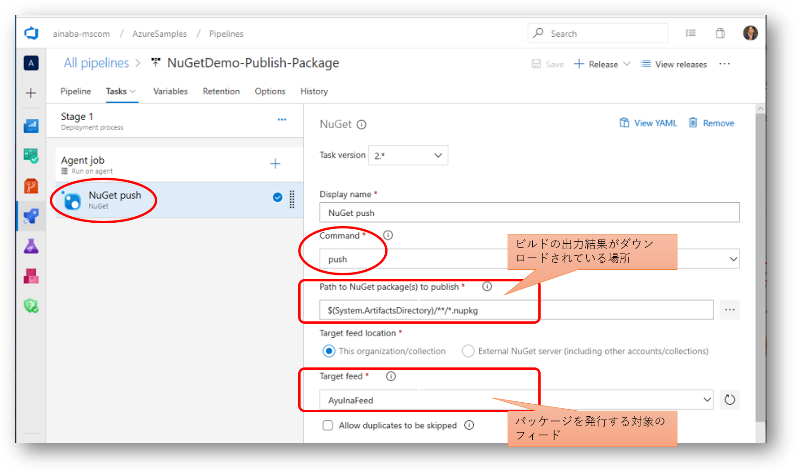
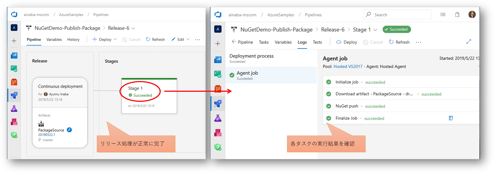
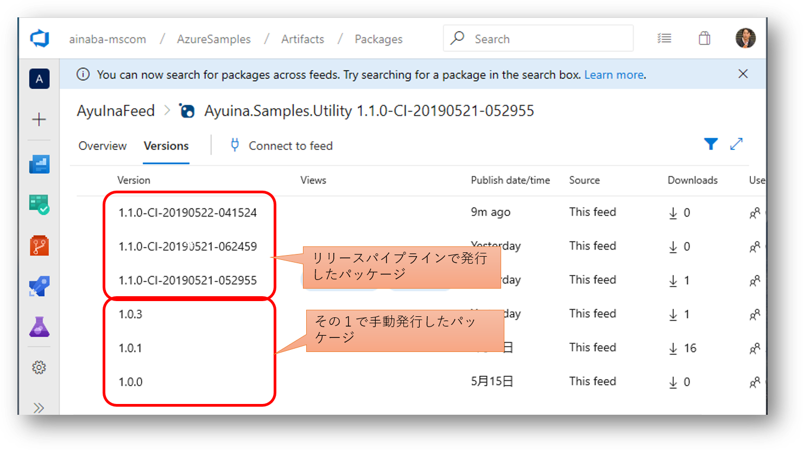
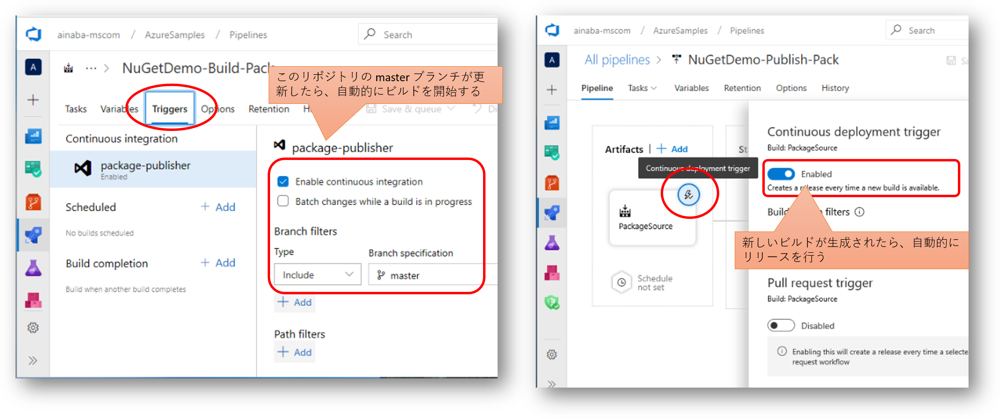

## パッケージの自動生成と発行

[その１](./contents1.md) では主にコマンドラインツールを使用して手動でのパッケージ作成と発行を行いましたが、
ここでは Azure Pipeline を使用して自動化してみたいと思います。
共通部品のソースコードを書き換え、ソースコード リポジトリとなる Azure Repos にプッシュされたことをトリガーに、
自動的に NuGetパッケージを生成して、Azure Artifacts フィードに発行まで行います。

## ソースコードリポジトリの作成

既にパッケージ開発側のライブラリができていますので、まずは Azure Repos を作成して格納してしまいましょう。
Git のリポジトリを作成したら [その１](./contents1.md) で作成したプロジェクトを Push しておきます。


コマンドラインは以下のような感じです。

```pwsh
PS > git clone https://org-name@dev.azure.com/org-name/projectName/_git/repository-name
PS > cd repository-name
PS > # ソースコードのコピー
PS > git add .
PS > git commit -m "コメント"
PS > git push
```


## ビルドパイプライン

次に格納したソースコードをビルドして、成果物を自動生成します。
この段階ではまだフィードへの公開を行わず、 **NuGet パッケージが取得できる** ところまでを目指します。 

### ビルドパイプライン定義の作成

ビルドパイプラインは YAML 形式で定義するのが新しいやり方なのですが、
初めての場合は若干わかりにくいので、視覚的なクラシックパイプラインを使用します。


ビルドのソースとして先ほど作成したレポジトリを指定し、ビルドテンプレートとして ASP.NET Core を指定します。
[その１](./contents1.md) で作成したソースコードは ASP.NET Core アプリケーションではなくクラスライブラリなのですが、
コンソールアプリ用のテンプレートが提供されていないので、ASP.NET Core 用をカスタマイズして使います。


使用したテンプレートは Web アプリケーション用なので、`publish` コマンドのタスクでは `Publish Web Projects` にチェックされています。
今回はクラスライブラリですので、このオプションはオフにします。
また `--output` オプションが `Build.ArtifactsStagingDirectory` 環境変数に設定されています。
ここにファイルを出力しておくと、後段の `Publish Artifact` タスクにて成果物として発行され、ビルド完了後に取得できるようになります。

これだけではあくまでもクラスライブラリが生の状態で取得できるようになるだけなので、dotnet タスクを追加して pack コマンドを実行して `nupkg` を生成します。


`pack` コマンドでも出力先を `Build.ArtifactsStagingDirectory` に設定しておくことで、生成された `nupkg` ファイルがビルドの成果物として取得できるようになります。
またこのタイミングでパッケージのバージョンを指定することもできます。

### ビルドの実行と成果物の取得

ビルド定義が完成したら保存してビルドを実行します（`save & queue` )。
ビルドが完了すると `publish` や `pack` コマンドで出力した成果物が確認できます。


Publish の結果はアセンブリ `dll` やデバッグシンボル `pdb` などがそのままの状態で確認できますが、
それとは別に Pack の結果として `nupkg` が生成されていることが確認できます。
それでは生成されたパッケージ `nupkg` をダウンロードして拡張子を `zip` に変更して解凍、その中身を見てみましょう。



基本的には [その１](./contents1.md) で生成したものと中身は同じですが、`nuspec` に記載されたバージョン番号が書き換わっていることがわかります。
バージョン番号にはビルドした日時が設定されていますので、ビルドが実行されるたびに新しいバージョンのパッケージが生成されることがわかります。

## リリースパイプライン

次に前述の自動ビルドで生成した NuGet パッケージを **フィードに発行する** ことを目指します。
発行先となるフィードも [その１](./contents1.md) で作成したものを使用します。

リリースパイプライン定義は前述のビルド結果画面にて `Release` ボタンをクリックすると作成できます。

### ビルド成果物のダウンロード

まずリリース処理で利用する成果物 `Artifact` を設定します。
`Source` として前述のビルドパイプラインが指定されていることを確認し、その成果物を参照するためのエイリアス名を設定します。



次にその成果物を実際にリリースする `job` と　`task` を定義します。
エージェントで実行される job の先頭で `Artifact Download` を設定することで、エージェントの実行環境に対して成果物（＝ビルドの出力結果）がダウンロードされますので、このあとのタスクで利用することができます。



リリースパイプラインの中に `NuGet` タスクを追加し、コマンドを `push` に設定します。
ダウンロードした成果物は `System.ArtifactsDirectory` 変数の場所に出力されているはずですので、
ここでは乱暴にその配下にある全ての拡張子 `nupkg` ファイルを対象にしています。
発行先となるフィードは [その１](./contents1.md) で作成したものを使用します。
同じプロジェクトに設定された Azure Artifacts のフィードであればドロップダウンで選択するだけなので便利です。

### リリースの実行と結果の確認

リリース定義が完成したら実際に実行し（）ましょう。
リリースパイプラインの画面の右上の `+ Release` から `Create release` を選択します。
実行時に指定できるオプションが表示されますが、そのまま `Create` をクリックしてください。
＃＃
リリースの処理が正常に完了すると下記のような画面になります。
最新のビルド結果が Artifact として設定され、リリースのタスクがすべて完了していることがわかります。



このリリースパイプラインでは Azure Artifacts のフィードへのパッケージ発行を行っていますので、
リリースの結果をフィードで確認します。
ここで発行したクラスライブラリは [その１](./contents1.md) で作成したソースコードとプロジェクトファイルをそのまま使用しています。
このためパッケージの名前が変わっておらず、バージョンだけがリリースパイプラインで指定されたものになっていることが確認できます。



### CI/CD : 継続的インテグレーションとデプロイの実装

ここまでの手順ではビルド処理およびリリース処理そのものは自動化できましたが、そのトリガーは手動で実行しています。
ビルド定義を編集してソースコードの Push をトリガーに設定し、リリース定義を編集してビルド結果をトリガーに設定すると
ソースコードを修正するために自動的にパッケージが生成されるようになります。




