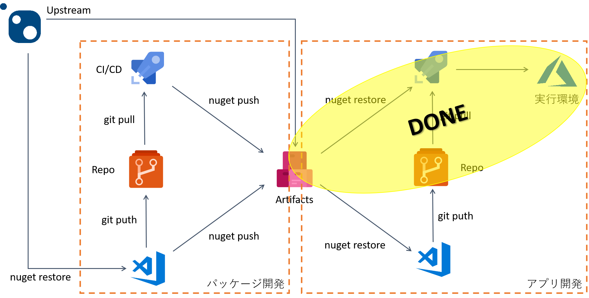

## CICDパイプラインからパッケージを利用する

それでは最後にパッケージを利用するアプリケーションの CI/CD を実現してみましょう。

## ソースコードリポジトリの作成

まずは Azure Repos を作成します。
ライブラリ開発側とは開発ライフサイクルも異なりますし要件も独立しますので別の Azure Repos を作成します。


次にリポジトリを利用するアプリケーションを作成します。
[その２](./contents2.md) で作成したプロジェクトはコンソールアプリケーションであるため、
自動リリースといってもどこかのフォルダに実行可能ファイルを配置するだけで面白くありません。
ここでは Azure Functions を作成し、そこに[その３](./contents3.md)で発行したライブラリを利用する関数を配置してみましょう。

## 利用側アプリケーションの作成

Visual Studio 等を使用して Azure Functions のアプリケーションを作成します。
次に [その２](./contents2.md) で紹介したように NuGet パッケージマネージャでフィードを参照すると、
[その１](./contents1.md) や [その３](./contents2.md) で発行した各バージョンのパッケージが参照できます。


ここで設定したパッケージとバージョン番号はプロジェクトファイルに記載され、ビルド時に適切なバージョンのインストールを行います。

```xml
<Project Sdk="Microsoft.NET.Sdk">
  <PropertyGroup>
    <TargetFramework>netcoreapp2.1</TargetFramework>
    <AzureFunctionsVersion>v2</AzureFunctionsVersion>
    <RootNamespace>hello_function</RootNamespace>
  </PropertyGroup>
  <ItemGroup>
    <PackageReference Include="Ayuina.Samples.Utility" Version="1.1.0-CI-20190522-041524" />
    <PackageReference Include="Microsoft.NET.Sdk.Functions" Version="1.0.28" />
  </ItemGroup>
  <ItemGroup>
    <None Update="host.json">
      <CopyToOutputDirectory>PreserveNewest</CopyToOutputDirectory>
    </None>
    <None Update="local.settings.json">
      <CopyToOutputDirectory>PreserveNewest</CopyToOutputDirectory>
      <CopyToPublishDirectory>Never</CopyToPublishDirectory>
    </None>
  </ItemGroup>
</Project>
```

このパッケージを利用した関数のコードは以下のようになります。

```csharp
       [FunctionName("Function1")]
        public static async Task<IActionResult> Run(
            [HttpTrigger(AuthorizationLevel.Function, "get", "post", Route = null)] HttpRequest  req, 
            ILogger log)
        {
            string name = req.Query["name"];
            if(name == null)
            {
                return new BadRequestObjectResult("Please pass a name on the query string or in the request body");
            }

            var message = $"{Ayuina.Samples.Utility.Class1.Hello(name)}";
            return (ActionResult)new OkObjectResult(message);
        }
    }
```

この Functions アプリをソースコード レポジトリに Push しておきます。

```pwsh
PS > git add .
PS > git commit -m "コメント"
PS > git push
```

## ビルドパイプライン

次に格納したソースコードをビルドして、成果物を自動生成します。
ここでは **共有ライブラリを利用する Azure Function アプリ** が成果物として得られることがゴールになります。

### ビルドパイプライン

ビルドパイプラインの定義方法は [その３](./contents3.md) をご参照いただければと思いますが、Azure Functions の場合は専用のビルドテンプレートが用意されていますのでそちらを利用します。


残念ながらこのテンプレートではカスタムフィードを設定する箇所がないので、このまま実行してもエラーになってしまいます。
このためプロジェクトファイル `csproj` に記載された独自の共有ライブラリを含んだパッケージを、パブリックの NuGet.org に探しに行ってしまいます。
当然 NuGet.org にはパッケージを発行してませんので、見つからずにビルドエラーになってしまうわけです。

さてどうしましょう。

`dotnet` タスクの `restore` コマンドであればフィードが指定できます。
このタスクを実行してプロジェクトファイルに記載されたパッケージをビルドエージェント環境に取得し、
その後で `build` コマンドを実行すると、既にパッケージのキャッシュがある状態ですのでビルドを実行することができます。


ビルドを実行して正常に完了したら、成果物として出力されている ZIP ファイルを解凍して中身を確認します。
この中身が Azure Functions に配置できるレイアウトになっていればリリース処理に進むことができます。


.NET Core ベースの Azure Functions アプリではアセンブリが bin フォルダ配下に配置されています。
この中には利用側 Functions アプリ `hello-function.dll` と一緒に共有ライブラリ `Ayuina.Samples.Utility.dll` が含まれていることが確認できます。

なお Azure Functions アプリの ZIP 形式での展開する方法についての詳細は
[こちら](https://docs.microsoft.com/ja-jp/azure/azure-functions/deployment-zip-push)
をご参照ください。

### リリースパイプライン定義の作成

ビルド成果物ができたらそれを Azure Function にデプロイします。
リリースパイプラインの定義方法は [その３](./contents3.md) をご参照いただければと思いますが、
Azure Functions の場合は専用のデプロイタスクが用意されていますのでそちらを利用します。


まずは [その３](./contents3.md) と同様にリリースエージェントの実行環境にビルド成果物をダウンロードしておき、
Functions デプロイ用のタスクでデプロイ先と対象となるアプリ（zip）を指定します。

リリースを実行して正常に完了したら Function アプリを実行してみましょう。
前述のサンプルコードでは HTTP トリガーになっていますので、URL のクエリ文字列に名前を入力すると、
共有ライブラリ内に実装されたメッセージが返ってくるはずです。


## ここまでのまとめ

以上でカスタムフィードを使用したビルドパイプラインが実装できました。


