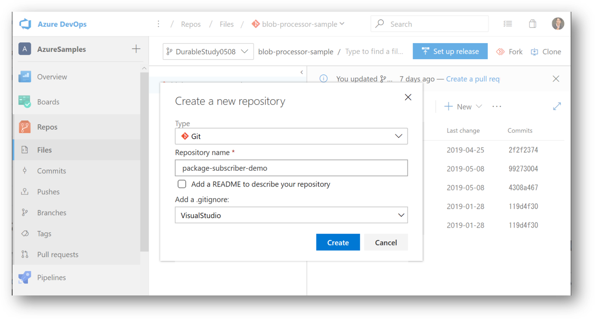

![]---
layout: default
title: その４ - Azure Artifacts に格納された NuGet パッケージを Azure Pipeline から取得する
---

## ソースコードリポジトリの作成

さて既に利用側のアプリケーション（コンソールアプリ）ができていますので、まずは Azure Repos を作成して格納してしまいましょう。
Git のリポジトリを作成したら [その２](./contents2.md) で作成したプロジェクトを Push しておきます。



コマンドラインは以下のような感じです。

```pwsh
PS > git clone https://org-name@dev.azure.com/org-name/projectName/_git/repository-name
PS > cd repository-name
PS > # ソースコードのコピー
PS > git add .
PS > git commit -m "コメント"
PS > git push
```


