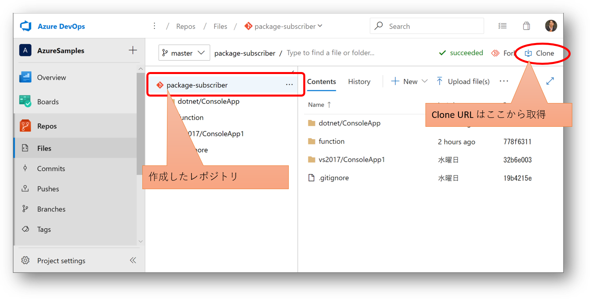

## ソースコードリポジトリの作成

さて既に利用側のアプリケーション（コンソールアプリ）ができていますので、まずは Azure Repos を作成して格納してしまいましょう。
Git のリポジトリを作成したら [その２](./contents2.md) で作成したプロジェクトを Push しておきます。


コマンドラインは以下のような感じです。

```pwsh
PS > git clone https://org-name@dev.azure.com/org-name/projectName/_git/repository-name
PS > cd repository-name
PS > # ソースコードのコピー
PS > git add .
PS > git commit -m "コメント"
PS > git push
```



## ビルドパイプライン

次に格納したソースコードをビルドして、成果物を自動生成します。
ここでは `共有ライブラリを利用するコンソールアプリケーション` が成果物として得られることがゴールになります。

### ビルドパイプライン定義の作成

ビルドパイプラインは YAML 形式で定義するのが新しいやり方なのですが、
初めての場合は若干わかりにくいので、視覚的なクラシックパイプラインを使用します。


ビルドのソースとして先ほど作成したレポジトリを指定し、ビルドテンプレートとして ASP.NET Core を指定します。
[その２](./contents2.md) で作成したのは ASP.NET Core ではなく Console アプリケーションなのですが、
コンソール用のテンプレートは提供されていないので、ASP.NET Core 用をカスタマイズして使います。

ポイントは `dotnet` タスクの `restore` コマンドです。
パラメータで指定しているプロジェクトファイルには、PackageReference セクションに共有ライブラリのパッケージ名とバージョンが記載されているはずです。
`dotnet restore` を実行するとそのパッケージを探しに行くのですが、既定のパッケージ リポジトリである NuGet.org には発行していないため見つかりません。
しかし `dotnet` タスクの `restore` コマンドでは、同じプロジェクトに作成されたフィードであればドロップダウンで簡単に指定できます。


ちなみに [その１](./contents1.md) で作成したフィードは Upstream が有効になっていますので、NuGet.org で管理されたパッケージもまとめて取得できる設定になっています。
このため NuGet.org からのパッケージは使用しないようにチェックを外しています。

次の `dotnet` タスクの `build` コマンドもプロジェクトファイルに記載された共有ライブラリを探しに行くのですが、既に前段の `restore` にてパッケージのキャッシュに共有ライブラリが取得されていますので、パッケージ取得はスキップされて実際のビルド処理が実行されます。


その後 Publish コマンドでは配置用の資源を生成するのですが、今回は Web プロジェクトではないのでチェックを外しておく必要があります。
こちらは共有ライブラリを利用するアプリケーションに合わせて設定ください。


### ビルドパイプラインの実行

パイプラインの定義が完了したら手動でビルドを開始してみましょう。
キューに入れると少ししてビルドが開始され、完了すると成果物がダウンロードできるようになります。


成果物は ZIP で圧縮された状態でダウンロードできますので、回答して中身を確認してみましょう。