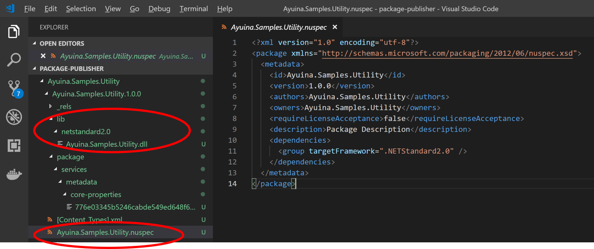

## はじめに

Azure Artifacts をちゃんと使ったことが無かったので検証した際の備忘録です。
下記は大まかなワークフローというか、やりたいことを整理するための図になります。


大きく共有ライブラリや便利ツールなどの「他の人に使ってもらう」ための部品となるパッケージを開発する側と、それらの部品を利用して実際にエンドユーザーに使ってもらうアプリケーション開発側に大きく分かれます。
これらの２つの立場で開発のライフサイクルが大きく異なるため、そのパッケージを受け渡すための中間地点となるリポジトリが必要になってくるわけです。

なお Azure Artifacts は様々種類の言語とパッケージを扱えるのですが、以下ではプログラミング言語は C# (.NET Core)、パッケージ形式は Nuget を題材にしています。

### ちょっと個人的な昔話（組織内における共通部品の管理について）

古来からのやり方ですと、自分が C# で作った「部品」はソースコードとして丸ごとコピーしてもらう、ビルド済みバイナリ形式であるアセンブリ（通常は dll）をコピーしてもらうことが多かったかと思います。
前者の方法では部品としての完全性が保てず、利用側で改変しやすいために亜種が発生しやすく、結果的にメンテナンスが困難になりやすいため、後者のバイナリでの配布形式をとられていたことが多いのではないでしょうか。
ただバイナリ形式の場合でも、配布の方式がまちまちであること、利用側へのアップデートの伝達が困難であること、その結果として古代のバージョンが延々と使われ続けてしまう、などといった問題が往々にして発生しました。

なんだかんだいって「共有フォルダに置かれた DLL を勝手に使っていくスタイル」が蔓延っていたなあなどと懐かしく思うわけです。
組織内でのパッケージ管理の仕組みをちゃんと運用すれば良いわけですが、その仕組み自体をだれがサポート・保守・運用するのさ？ ということで誰もやらないパターンでした。
が、Azure DevOps などの SaaS サービスを使ってしまえばその問題は発生しにくくなりますので、改めて勉強してみようと思った次第です。

## パッケージの作成と公開

まずローカル開発環境で Nuget パッケージを作る方法です。前提として「共有したい部品」である DLL が既にあるモノとします。
ここからは基本的に
[チュートリアル](https://github.com/ayuina/ainaba-csa-blog/blob/package-management-by-azure-artifact/package-management-with-azure-artifacts/index.md)
にそった作業となります。

### 共通部品クラスライブラリの作成

が、適当なものが無い場合は下記のようなコマンドで C# のクラスライブラリプロジェクトを作ってしまいましょう。ポータビリティの高い .NET Standard にしてみます。

```pwsh
> dotnet new classlib --name Ayuina.Samples.Utility --framework netstandard2.0
```

出来上がったソースコードにロジックを追加します。まじめに作る気はないので以下のような感じで良いでしょうか。

```csharp
using System;

namespace Ayuina.Samples.Utility
{
    public class Class1
    {
        public static string Hello(string name)
        {
            return $"Hello {name} !";
        }
    }
}
```

ではビルドしてアセンブリを作成します。ビルドに成功したら生成物を確認してみましょう。拡張子 `dll` のファイルができていればとりあえず良しとします。

```pwsh
PS > dotnet build
PS > dir .\bin\Debug\netstandard2.0

Mode                LastWriteTime         Length Name
----                -------------         ------ ----
-a----       2019/05/15     17:52           1465 Ayuina.Samples.Utility.deps.json
-a----       2019/05/15     17:52           4096 Ayuina.Samples.Utility.dll
-a----       2019/05/15     17:52            512 Ayuina.Samples.Utility.pdb
```

### パッケージを生成する

ではシンプルにこのまま Nuget パッケージを生成してみます。プロジェクトルートフォルダ（csproj ファイルがあるフォルダ）にて下記のコマンドを実行してみます。

```pwsh
PS > dotent pack
```

成功するとビルド出力ディレクトリに拡張子 nupkg のファイルが出来ていると思います。

```pwsh
PS > dir .\bin\Debug

Mode                LastWriteTime         Length Name
----                -------------         ------ ----
d-----       2019/05/15     17:52                netstandard2.0
-a----       2019/05/15     17:57           3461 Ayuina.Samples.Utility.1.0.0.nupkg
```

### パッケージの中身を確認する

これで出来上がりなのですが、中身を見てみましょう。この `nupkg` は ZIP 形式のファイルの拡張子を変えただけなので、ZIP を解凍できるツールがあれば中身を見ることができます。

```pwsh
PS > cp .\bin\Debug\Ayuina.Samples.Utility.1.0.0.nupkg .\bin\Debug\Ayuina.Samples.Utility.1.0.0.zip
PS > Expand-Archive .\bin\Debug\Ayuina.Samples.Utility.1.0.0.zip
```

中身を見てみるとごちゃごちゃっと入っていますが、ポイントは以下の2点でしょうか。
- lib > target_framework 配下に共有したいアセンブリが格納されている
- ルートに nuspec というファイルが生成され、中にはバージョン番号など管理用のメタデータが含まれている



この `nuspec` はプロジェクトの出力ディレクトリである `bin` ではなく、中間生成ファイルなどが格納される `obj` にも出力されていますが、こちらはパッケージの中に含めるファイルレイアウトなども記載されており若干中身が異なります。
`dotnet pack` コマンドを実行した段階で、プロジェクトファイル `csproj` からメタデータやファイルレイアウトを決めるためのマニフェストファイルとして `nuspec` が `obj` ディレクトリ生成され、それを元に実際のパッケージング処理が行われ　`nupkg` が生成されます。
この際にファイルレイアウトは不要になるのでメタデータだけが `nuspec` ファイルに残る、といった感じでしょうか。

逆に言えば、ちゃんとしたメタデータを記載したいならば `csproj` を編集するか、`nuspec` ファイルを別途手書きする必要があります。
あるいは MSBuild のプロジェクトシステムを使わずに、最終的に `nupkg` に含まれるべきディレクトリ構造だけ適宜作成してしまい、メタデータだけ `nuspec` に記載してパッケージングしてしまうといったやり方が考えらえます。

### プロジェクトファイルにパッケージメタデータを付与する

それではプロジェクトファイル `csproj` を下記のように修正します。
ここではメタデータを付与すると同時に、一応中身が変わったのでバージョンを上げています。
また利用者にわかりやすいように Readme も追加しています。

```xml
<Project Sdk="Microsoft.NET.Sdk">
    <PropertyGroup>
        <TargetFramework>netstandard2.0</TargetFramework>

        <PackageId>Ayuina.Samples.Utility</PackageId>
        <Version>1.0.1</Version>
        <Authors>ayuina</Authors>
        <Title> Ayuina's awesome utilities </Title>
        <PackageDescription> Nuget パッケージワークフローを説明するためのサンプルパッケージです。 </PackageDescription>
        <PackageReleaseNotes> 1.0.1   : 初版にメタデータを追加しました </PackageReleaseNotes>
    </PropertyGroup>
    <ItemGroup>
        <Content Include="readme.txt">
        <Pack>true</Pack>
        <PackagePath>.</PackagePath>
        </Content>
    </ItemGroup>

</Project>
```

メタデータに使用できる要素は
[リファレンス](https://docs.microsoft.com/ja-jp/dotnet/core/tools/csproj#nuget-metadata-properties)
を参照ください。

プロジェクトファイルの修正が終わったら再度 `dotnet pack` を実施すると、ビルド出力ディレクトリ配下に 2 つ目の `nupkg` ファイルが生成されていると思います。

### パッケージリポジトリとフィードを作成する

発行するパッケージの準備ができたので、次はパッケージリポジトリを準備します。
Azure Artifacts の画面からフィードを新規作成し、フィードへの接続情報を取得します。


フィードが作成出来たらこれまでの操作で作成してきた `nupkg` をフィードに発行します。
この後の操作はこれまで使ってきた dotnet コマンドでも出来るのですが、
接続情報の画面でダウンロードできる zip には nuget.exe だけでなく Azure DevOps に接続する用の認証モジュールが含まれていて便利なので、
以降ではこちらを使用します。

まずは作成したフィードを開発環境における NuGet のソースレポジトリとして追加します。この操作は各環境で１回だけやれば大丈夫です。
初回実行時には認証ダイアログが表示されますので、その場合は Azure Artifacts にアクセス可能なユーザーアカウントで認証してください。

```pwsh
PS > .\nuget.exe sources Add -Name "AyuInaFeed" -Source "https://pkgs.dev.azure.com/orgnizationName/_packaging/AyuInaFeed/nuget/v3/index.json"
```

次に作成済みのパッケージ `nupkg` をフィードに発行（Push）します。
パッケージは２つ出来ているので両方とも発行してしまいましょう。
`NuGet.exe` のパス、`nupkg` のパス、フィード名やレポジトリの URL などはご自身の環境に合わせて

```pwsh
PS > .\NuGet.exe push -Source "AyuInaFeed" -ApiKey AzureDevOps .\bin\Debug\Ayuina.Samples.Utility.1.0.0.nupkg
PS > .\NuGet.exe push -Source "AyuInaFeed" -ApiKey AzureDevOps .\bin\Debug\Ayuina.Samples.Utility.1.0.1.nupkg
```

発行が完了した後に Azure Artifacts のフィードを確認すると、同じ名前（）で 2 つのバージョンのパッケージが登録されていることが確認できます。


## パッケージの自動リリースパイプライン

## 開発環境でのパッケージの利用

## アプリケーションのリリースパイプラインでの利用


### 参考情報

- [NuGet](https://docs.microsoft.com/ja-jp/nuget/what-is-nuget)
