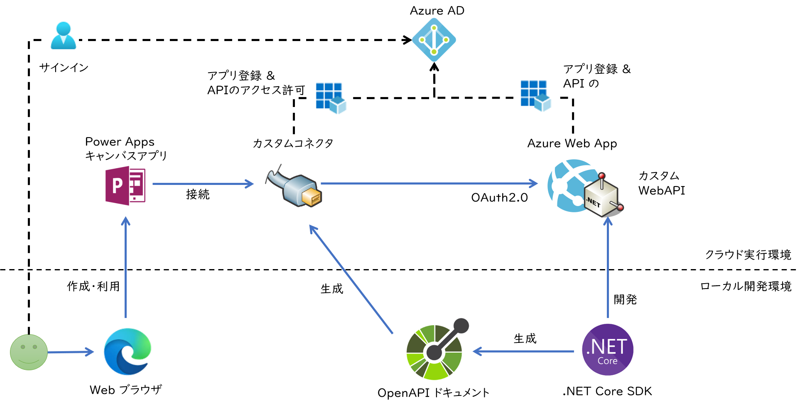
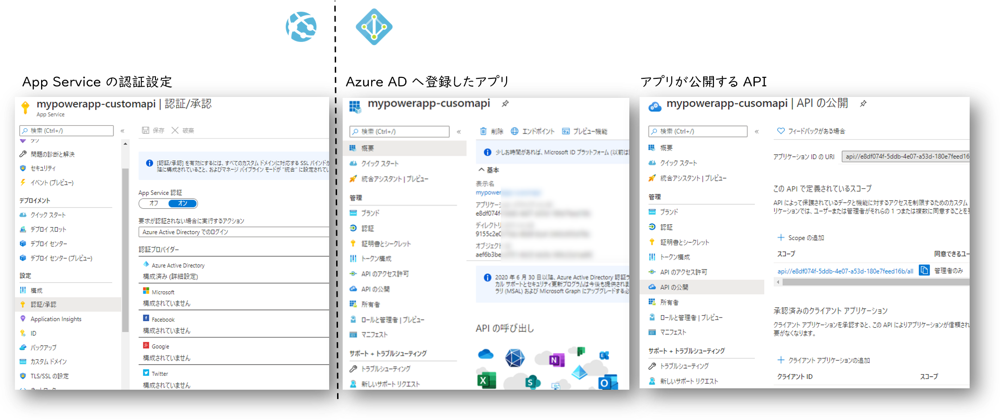

## はじめに

[前回](../powerapp-call-rest-api) の記事では無事に PowerApps キャンバスアプリから Azure 上でホストしたカスタム API を呼び出すことができましたが、
API 自体は公衆インターネットに全公開で世界中の誰からも呼び出し可能な状態です。
この記事ではカスタム API 側に Azure AD 認証を設定することで、同一組織内のユーザーのみが使える状況に設定していきます。




## Web API 側

まずはバックエンド側である API を構築・保護します。
Azure Web Apps の場合は Azure AD 認証を有効化すると Azure AD にアプリ登録が行われます。
この登録されたアプリの設定を変更して API を公開します。



公開といっても誰でも呼び出せるようにするという意味ではなく、ここでは「このアプリはこういう API を持っているよ」という定義をすることで、同じ Azure AD テナント内の別のアプリから参照できるようにする、といった意味合いになります。

Web API 側の設定は公式ドキュメントでは[こちら](https://docs.microsoft.com/ja-jp/azure/app-service/configure-authentication-provider-aad)
をご参照ください。


### API の作成

ASP.NET Core での API の作り方は[前回](../powerapp-call-rest-api)の記事などを参考にしていただければと思います。
ただ今回はユーザー認証を行いますので、API は乱数を返すのではなくて、サインインしたユーザー情報を元に挨拶をする下記のようなコードにしておきます。

```csharp
[ApiController]
[Route("[controller]")]
public class GreetingController : ControllerBase
{
    /// <summary>
    /// Hello World !
    /// </summary>
    [HttpGet(Name="HelloWorld")]
    public GreetingResult Get()
    {
        string name = HttpContext.Request.Headers["X-MS-CLIENT-PRINCIPAL-NAME"];
        if(string.IsNullOrEmpty(name))
        {
            return new GreetingResult() { Message = $"Please Login !" };
        }
        return new GreetingResult() { Message = $"Hello {name} !" };
    }
}
```

このあと Azure Web Apps で Azure AD 認証を有効にすると、`X-MS-CLIENT-PRINCIPAL-NAME` リクエスト ヘッダーに認証済みユーザーが設定されるようになります。
認証情報からユーザー名を取得してメッセージ文字列を作成するコードですね。

### App Service で Azure AD 認証を有効化して API を保護する

次に API をホストしている Web App の Azure AD 認証を有効化します。
前述の画像のとおり Azure Portal で App Service の `認証/承認` の設定画面を開き、
Azure Active Directory を認証プロバイダーとする設定をしてください。
また匿名アクセスを拒否するために、 `要求が認証されない場合に実行するアクション` で Azure ADへのログインを強制します。 

### Azure AD に登録された API アプリの情報を取得する

App Service で認証を有効化すると Azure Active Directory にアプリが自動的に登録されます。
Azure Portal で登録されたアプリを開き、アプリケーション ID や ディレクトリ ID を控えておきます。
また `証明書とシークレット` の設定画面からシークレットが生成できますので、こちらも控えておきます。

### アプリが公開する API の定義を Azure AD に登録する

アプリの `API の公開` 設定画面ではこのアプリが公開する予定の API を定義します。
App Service の設定画面で簡易設定を行った場合は、ほぼ入力済みになっているはずです。
PowerApps カスタムコネクタはこの API を呼び出す許可をユーザーないしは管理者から得る必要があるわけです。


## PowerApps 側

次はフロント側のキャンバスアプリ側を構成していきます。
こちらの手順ではコネクタを表すアプリを Azure AD に登録し、そのコネクタアプリが API のアプリを呼び出すことを宣言しておきます。
その登録情報を使用して PowerApps でカスタムコネクタを作成していくことになります。


なお以下の手順に関しては
[公式ドキュメント](https://docs.microsoft.com/ja-jp/connectors/custom-connectors/create-custom-connector-aad-protected-azure-functions)
の手順をほぼなぞっていく形になります。

### Azure AD にカスタムコネクタを表すアプリを登録する

まずPowerApps カスタムコネクタを表すアプリを登録します。（真ん中の図）
ここで生成される アプリケーションID（クライアントID）、ディレクトリ ID、シークレットを控えておきます。
この段階ではリダイレクト URI は登録できませんので、ここではそのままにしておきます。

### カスタムコネクタがカスタム API を呼び出すことを設定する

このアプリが呼び出す API へのアクセス許可を設定する必要があります（右の図）。
ここには `API の公開` で定義した内容が出てくるはずです。
カスタムコネクタがユーザーの代理として API にアクセスするためにはユーザーの同意が必要です。
何についての同意を求めるべきかを定めているのが、この `委任されたアクセス許可` になります。

なおディレクトリによってはユーザーが個別の同意を与えることが出来ない場合があります。
その場合には管理者にお願いして代表で同意してもらう必要があります。

### カスタムコネクタの作成

こちらも[前回](../powerapp-call-rest-api)と同様に `Open API ドキュメント(swagger.json)`からカスタムコネクタを作成していますが、
セキュリティタブで Azure AD 認証用の情報を設定していきます。（左の図）
カスタムコネクタを表すアプリの情報だけでなく、このコネクタを使用してアクセスする API の情報も登録します。

なおこの記事の執筆時点では Resource URL は URL 形式ではなく API のアプリケーション ID をそのまま入力し、スコープは空欄のままにすることで動作しました。

### リダイレクト URI の設定

セキュリティタブの値を入力後、コネクタを保存するとリダイレクト URL （ここでは https://global.consent.azure-apim.net/redirect）が表示されるようになります。
これを控えておいてカスタムコネクタのアプリ登録情報に追加設定します。