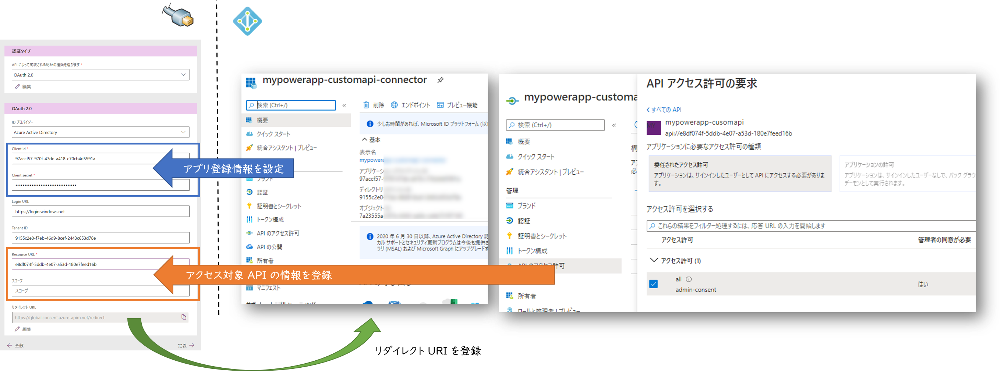

## はじめに

[前回](../powerapp-call-rest-api) の記事では無事に PowerApps キャンバスアプリから Azure 上でホストしたカスタム API を呼び出すことができましたが、
API 自体は公衆インターネットに全公開で世界中の誰からも呼び出し可能な状態です。
この記事ではカスタム API 側に Azure AD 認証を設定することで、同一組織内のユーザーのみが使える状況に設定していきます。


## Web API 側

まずはバックエンド側である API を構築・保護します。
Azure Web Apps の場合は Azure AD 認証を有効化すると Azure AD にアプリ登録が行われます。
この登録されたアプリの設定を変更して API を公開します。


公開といっても誰でも呼び出せるようにするという意味ではなく、ここでは「このアプリはこういう API を持っているよ」という定義をすることで、同じ Azure AD テナント内の別のアプリから参照できるようにする、といった意味合いになります。

### API の作成

API 側の作り方は[前回](../powerapp-call-rest-api)の記事を参考にしていただければと思います。
今回はユーザー認証を行いますので、API は乱数を返すのではなくて、サインインしたユーザー情報を元に挨拶をする下記のようなコードにしておきます。

```csharp
[ApiController]
[Route("[controller]")]
public class GreetingController : ControllerBase
{
    /// <summary>
    /// Hello World !
    /// </summary>
    [HttpGet(Name="HelloWorld")]
    public GreetingResult Get()
    {
        string name = HttpContext.Request.Headers["X-MS-CLIENT-PRINCIPAL-NAME"];
        if(string.IsNullOrEmpty(name))
        {
            return new GreetingResult() { Message = $"Please Login !" };
        }
        return new GreetingResult() { Message = $"Hello {name} !" };
    }
}
```

このあと Azure Web Apps で Azure AD 認証を有効にすると、`X-MS-CLIENT-PRINCIPAL-NAME` リクエスト ヘッダーに認証済みユーザーが設定されるようになります。
認証情報からユーザー名を取得してメッセージ文字列を作成するコードですね。

### Azure AD 認証の有効化

次に API をホストしている Web App の Azure AD 認証を有効化し、Azure に登録されたアプリが公開する API を定義します。
[詳細な手順はこちら](https://docs.microsoft.com/ja-jp/azure/app-service/configure-authentication-provider-aad)
をご参照ください。


## PowerApps 側

次はフロント側のキャンバスアプリ側を構成していきます。
こちらの手順ではコネクタを表すアプリを Azure AD に登録し、そのコネクタアプリが API のアプリを呼び出すことを宣言しておきます。
その登録情報を使用して PowerApps でカスタムコネクタを作成していくことになります。



なお以下の手順に関しては
[公式ドキュメント](https://docs.microsoft.com/ja-jp/connectors/custom-connectors/create-custom-connector-aad-protected-azure-functions)
の手順をほぼなぞっていく形になります。

### アプリ登録

PowerApps カスタムコネクタを表すアプリを登録します。
ここで生成される アプリケーションID（クライアントID）、ディレクトリ ID、シークレットを控えておきます。
この段階ではリダイレクト URI は登録できませんので、ここではそのままにしておきます。

またこのアプリが呼び出す API へのアクセス許可を設定する必要があります。
ユーザーが PowerApps を利用するためにサインインすると、キャンバスアプリが API を呼び出す際にはユーザーの代理として API にアクセスすることになります。
このための設定が `委任されたアクセス許可` になります。

### カスタムコネクタの作成

こちらも[前回](../powerapp-call-rest-api)と同様に `Open API ドキュメント(swagger.json)`からカスタムコネクタを作成していますが、
セキュリティタブで Azure AD 認証用の情報を設定していきます。
カスタムコネクタを表すアプリの情報だけでなく、このコネクタを使用してアクセスする API の情報も登録します。

### リダイレクト URI の設定

セキュリティタブの値を入力後、コネクタを保存するとリダイレクト URL （ここでは https://global.consent.azure-apim.net/redirect）が表示されるようになります。
これを控えておいてカスタムコネクタのアプリ登録情報に追加設定します。