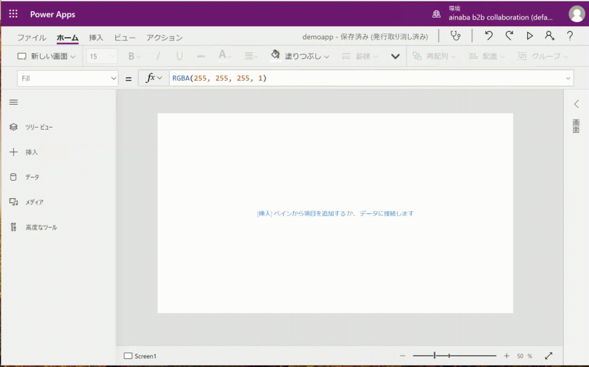

## はじめに

基本的に Power Apps は **本業のアプリケーション開発者でなくても API の利活用による業務効率の改善ができる** ことを主眼としており、コードを記述することなく GUI アプリケーションを作成することができるようになっているため、ノーコード（No Code）、あるいはローコード（Low Code）と言う面が着目されているかと思います。
とはいえ、実際の現場では要件にばっちりフィットする API があるとも限りませんし、開発者と協力して API 自体を作成しなければならないシーンもあるのではないでしょうか。

ということで[前回](../powerapp-campus-submit-button) は画面項目に設定された式の挙動と、 Power Apps のボタンを押した際の挙動を試しただけですので、今回は REST API を作成しキャンバスアプリから呼び出す一連の流れを紹介したいと思います。

大まかな作業の流れは以下のようになります。

1. Web API を作成する
1. OpenAPI ドキュメントを生成する
1. Web API を実行環境にホストする
1. OpenAPI ドキュメントからカスタムコネクタを作成する
1. キャンバスアプリを作成して接続を追加する
1. キャンバスアプリから API を呼び出して結果を表示する

## アーキテクチャ


Web API の作成方法、OpenAPI ドキュメントの作成方法、Web API をホストする実行環境の選択肢はいろいろありますが、ここでは下記の技術を採用しています。

|項目|技術|
|---|---|
|API の作成|[ASP.NET Core Web API](https://docs.microsoft.com/ja-jp/aspnet/core/web-api/?view=aspnetcore-3.1)|
|OpenAPI ドキュメントの作成|[Swashbuckle](https://docs.microsoft.com/ja-jp/aspnet/core/tutorials/getting-started-with-swashbuckle?view=aspnetcore-3.1&tabs=visual-studio-code)|
|API のホスト|[Azure WebApp](https://docs.microsoft.com/ja-jp/aspnet/core/host-and-deploy/azure-apps/?view=aspnetcore-3.1)|

## Web API を作成する

まず初めに [.NET Core SDK](https://dotnet.microsoft.com/download) を使用して Web API を作成しましょう。
Web API の実装方法の詳細は本題ではないので、ここではテンプレートで自動生成できる範囲で済ませてしまいます。

```bash
# 作業フォルダの作成
mkdir myapi1
cd myapi1

# 利用する SDK のバージョンを固定しておく
dotnet new globaljson --sdk-version 3.1.301

# ASP.NET Core Web API のテンプレートからプロジェクトを自動生成する
dotnet new webapi
```

これで Web API 自体は出来上がってしまうのですが、開発者用の証明書を使用して HTTPS が強制される実装になっているので、
`Startup.cs` を修正してコメントアウトしておきます。

```csharp
public void Configure(IApplicationBuilder app, IWebHostEnvironment env)
{
    //app.UseHttpsRedirection();
}
```

それでは動作確認です。
JSON 形式のレスポンスデータが帰ってくることを確認して下さい。
これが後ほど Power Apps から呼び出す API になります。

```bash
# 開発用 Web サーバーを起動（既定ではポート 5000 で待機しているはず）
dotnet run

# テンプレートで実装済みの WeatherForecast API を呼び出す。
curl http://localhost:5000/weatherforecast
```

ブラウザで動作確認してみれば以下のように表示されるはずです。
リフレッシュするたびに値が変動することもご確認ください。


## OpenAPI ドキュメントを生成する

Web API としては出来上がりなのですが、このままでは外部からこの API の仕様を確認する術がないので、使いにくい状態です。
OpenAPI 形式にのっとった仕様書を生成すると、 Power Apps に限らず各種クライアントアプリから呼び出しやすくなります。
ASP.NET Core では [Swashbuckle.AspNetCore](https://www.nuget.org/packages/Swashbuckle.AspNetCore/) というパッケージを追加することで、
実装済みの API の情報から OpenAPI ドキュメントを自動生成させることが出来ます。

まず下記のコマンドでパッケージをプロジェクトに追加しておきます。

```bash
dotnet add package Swashbuckle.AspNetCore
```

Swashbuclke は C# のソースコードに記載されたドキュメントコメントを元に生成される XML ファイルの情報を利用しますので、
プロジェクトファイル(csproj) を修正して XML 出力を有効にします。
下記のように `GenerateDocumentationFile` 要素を追加するとビルド時に XML ファイルが生成されます。
その時に大量に警告が表示されがちなのですが、それを抑止したい場合は必要に応じて `NoWarn` 要素も追加しておいてください。

```xml
<PropertyGroup>
    <TargetFramework>netcoreapp3.1</TargetFramework>
    <GenerateDocumentationFile>true</GenerateDocumentationFile>
    <NoWarn>$(NoWarn);1591</NoWarn>
</PropertyGroup>
```

`Startup.cs` を書き換えて、Swashbuclke サービスを組み込みます。
ここでは OpenAPI ドキュメントのメタデータを追加するとともに、ビルド時に一緒に出力されているはずのドキュメントコメントファイルを読み込むように指示しています。

```csharp
public void ConfigureServices(IServiceCollection services)
{
    services.AddControllers();
    services.AddSwaggerGen(c => {
        c.SwaggerDoc("v1", new OpenApiInfo() { 
            Version = "v1",
            Title = "My API",
            Description = "This API is the sample of backend service for PowerApps and custom connector."
        });

        var xmlFile = $"{Assembly.GetExecutingAssembly().GetName().Name}.xml";
        var xmlPath = Path.Combine(AppContext.BaseDirectory, xmlFile);
        c.IncludeXmlComments(xmlPath);
    });
}
```

実装した WebAPI と同様に、OpenAPI のユーザーインタフェースだけでなく、ドキュメントを特定のエンドポイントでホストするようにミドルウェアを組み込みます。
なおここで V2 を指定している理由は、現在 Power Apps のカスタムコネクタが 
[OpenAPI 2.0 のみをサポートしている](https://docs.microsoft.com/ja-jp/connectors/custom-connectors/faq#other)
からです。

```csharp
public void Configure(IApplicationBuilder app, IWebHostEnvironment env)
{
    app.UseSwagger(c => {
        c.SerializeAsV2 = true;
    });
    app.UseSwaggerUI(c => {
        c.SwaggerEndpoint("/swagger/v1/swagger.json", "My API v1");
    });

    //以下略
}
```

ここまででミドルウェアとしての準備が終わりましたので、各 WebAPI のメタデータを付与していきます。
テンプレートには API の操作が１つだけ含まれておりますので、Operation の記述を追加しておきます。

```csharp
[HttpGet(Name="Get_WeatherForecast")]
public IEnumerable<WeatherForecast> Get()
{
    //省略
}
```

改めて Web API を動作させて OpenAPI UI とドキュメントを確認してみましょう。
ブラウザーから `http://localhost:5000/swagger` にアクセスします。


画面上部に `swagger.json` のリンクがありますので、ここからファイルをダウンロードして保存しておきます。
これがカスタムコネクタの元ネタになります。

## Web API を実行環境にホストする

それでは作成した Web API を Azure Web Apps でホストしてみましょう。
ポータルでポチポチ作成してももちろん構いませんが、ここでもコマンドラインで実行していきます。

```bash
# Azure CLI からログインして使用するサブスクリプションを選択
az login 
az account set --subscription guid-of-your-subscription

# Web App を作成する（リソース名などは適宜書き換えてください）
az group create --name powerapp-customapi-demo-rg --location WestUS2
az appservice plan create --name mypowerapp-customapi-plan --resource-group powerapp-customapi-demo-rg
az webapp create --name mypowerapp-customapi --plan mypowerapp-customapi-plan --resource-group powerapp-customapi-demo-rg --runtime "DOTNETCORE|3.1"
```

ASP.NET Core で作成した Web API を配置出来るようにパッケージングし、Azure Web App に配置します。
ここでは [Zip Deploy](https://docs.microsoft.com/ja-jp/azure/app-service/deploy-zip) 方式を採用していますが、
実際には CI/CD Pipeline 等を構成することになるでしょう。

```bash
# 作成した Web API をビルドして publish フォルダに発行する
dotnet publish -o publish
cd publish

# Zip に固める
zip -r publish.zip .

# Azure Web App に配置する
az webapp deployment source config-zip --src publish.zip --resource-group powerapp-customapi-demo-rg --name mypowerapp-customapi 

# 動作確認
curl http://mypowerapp-customapi.azurewebsites.net/weatherforecast 
curl http://mypowerapp-customapi.azurewebsites.net/swagger/v1/swagger.json
```

この状態ではインターネットに全公開している状態ですので、本来は認証等をかける必要がありますがそれは次回移行で紹介します。

## OpenAPI ドキュメントからカスタムコネクタを作成する

やっと Web API の準備が整いました。
ここからはカスタムコネクタを作成して Power App から利用する手順です。
画面操作が中心となりますので、アニメーションで紹介していきます。


1. Web ブラウザで [https://powerapps.microsoft.com/](https://powerapps.microsoft.com/) を開いてサインイン
1. 左のメニューで **データ** を展開して **カスタムコネクタ** を選択
1. 右上にある **カスタムコネクタの新規作成** から **OpenAPI ファイルをインポートします** を選択
1. コネクタ名を入力して、先ほど生成しておいた OpenAPI ドキュメント(swagger.json)を **インポート** して **続行** 
1. **全般** タブでは Web API をホストしている Azure Web App のホスト名 `webappname.azurewebsites.net` を入力
1. 先ほどホストした Web API は特に認証をかけていませんので **セキュリティ** タブでは **認証なし** のまま進む
1. **定義** タブではインポートした OpenAPI ドキュメントの記載内容をカスタマイズせずにそのまま進む
1. （テストに進む前に）このタイミングで一度チェックマークをクリックしてコネクタを保存
1. **テスト** タブで作成したカスタムコネクタに対する **新しい接続** を作成
1. 接続の管理画面に遷移してしまうので、左のメニューから **カスタムコネクタ** に戻る
1. 最初に着けた名前のカスタムコネクタが表示されるので **鉛筆マーク（編集）** を選択
1. **テスト** タブまで進むと **テスト操作** がアクティブになっているので選択して API が呼び出して正しい結果が帰ることを確認

既存の Web API に対応したコネクタが提供されていなくとも、その仕様が定義された OpenAPI ドキュメントが入手できれば上記のようにカスタムコネクタが作成可能です。
この OpenAPI ドキュメントにはリクエストパラメータやレスポンスデータの構造など Web API を利用するために必要な様々な情報が記載されているので、
 PowerApps から簡単に API を呼び出すことが可能になるわけです。

## キャンバスアプリを作成して接続を追加する

先ほどの手順でテスト操作を行った際と同様に、キャンバスアプリからカスタムコネクタを利用する際にも **接続** を作成してアプリに追加してやる必要があります。



1. 新規にキャンバスアプリを作成し、左のメニューで  **データ** を展開
1. 先ほど作成したカスタムコネクタ名を **検索**
1. カスタムコネクタが表示されたら **接続の追加** を選択
1. 画面右側にカスタムコネクタの情報が表示されるので **接続** を作成
1. **アプリ内** に接続が追加されると利用することが可能な状態

既にコネクタまで提供されている場合はここの手順から開始することになります。

## キャンバスアプリから API を呼び出して結果を表示する


https://docs.microsoft.com/ja-jp/connectors/custom-connectors/define-openapi-definition