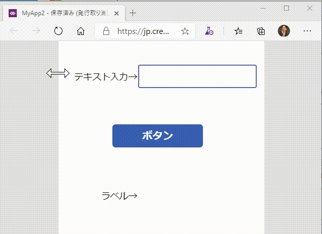

## はじめに

個人的に PowerApps のキャンパスアプリを作り始めて HelloWorld レベルでいきなり躓いてしまったので、ここに記録しておきます。
GUI アプリケーションの実装には .NET Framework で Windows Form ばかりやっていたのが仇になった気がします。
WPF でデータバインディングをちゃんとやってきた人の方が親しみやすいのかも。

## 入力したテキストの処理結果をリアルタイムに表示したい

まずはアプリケーションで期待する動きを動画で確認してみましょう。
画面上部のテキストボックスに入力した値に、画面下部のラベルにリアルタイムに反映される、という挙動です。
ここではただ値を反映するだけではなく、条件分岐や文字列結合も行っています。

この場合は計算結果を表示するラベルコントロールの方に式を記載します。
Excel で計算したことがある方であればイメージがわきやすいと思いますが、計算結果を表示したいセルに、元データとなるセルの参照を含んだ式を入力するのと同じ考え方になります。

Windows Form でアプリケーションを作っていた方は、テキストボックスの値が変わったことを表すイベントのイベントハンドラで、対象コントロールのプロパティに値をセットするロジックを書きたくなってしまうわけですが、そこがちょっと違います。

## 入力の完了を待って結果を処理したい

前述の動きだとアプリケーションによっては問題が発生する場合があります。
先の例では入力文字列から出力文字列を演算する処理が PowerApps 上で行われていたのですが、これがコネクタを使用した API 呼び出しだったらどうでしょう。
1文字1文字入力あるいは削除するたびにネットワーク経由で API コールが行われ、途中でタイムミスした文字列も送信されてしまうわけで、無駄極まりないわけですね。
よくあるような「ボタンを押したら確定したとして送信する」という挙動をさせたい場合はどうでしょう。

前述のようにラベルのプロパティに代入する式でテキストボックスの値を直接参照すると常に値が更新されてしまいますので、間に変数を挟んでやります。
ボタンが押下された際の処理（OnSelect）で出力文字列を演算し、 `Set` 関数を試用して変数 `textbuffer` に値をセットします。
表示したいラベルからはこの変数 `textbuffer` にバインドしておけば、変数の値が変更されると同時に表示がアップデートされるわけです。

この方式であれば API 呼び出しのタイミング制御や、送信前のデータチェックと確認などが実装しやすいのではないでしょうか。

なおこの変数、特にどこかで宣言するなどということは必要なく、式の中でいきなり記載してしまえば使えるようになります。
暗黙的かつグローバルな変数になりますので、変数が多くなってロジックが複雑になれば確実にバグの温床になります。
利用は最小限にとどめ、別途一覧として整理しておくなどの工夫は必要かと思います。

### 補足

関数一覧の中には `SetProperty` というそれっぽい関数もあるにはあるのですが、残念ながらこれはテスト用途のことで、
ボタンコントロールの `OnSelect` から呼び出すことは出来ません。残念。