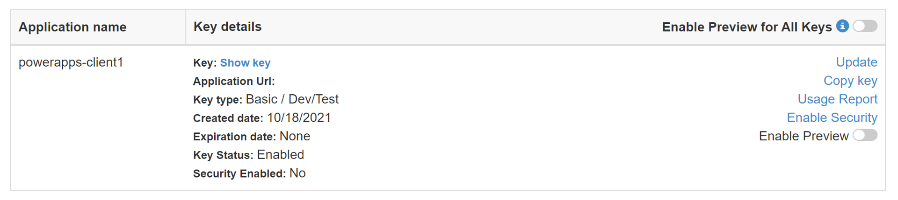
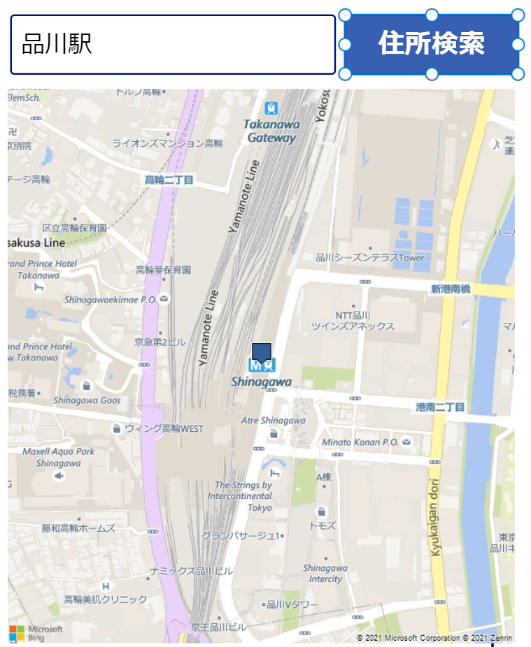

## はじめに

既に様々な記事で記載されていることではありますが、現状 Power Apps で地図を活用する比較的簡単な方法が以下の２つになります。

- Bing Maps コネクタと Image コントロールを使用する方法
- 対話型マップコンポーネントを使用する方法

ただこの記事を書いている現時点（2021年10月）では過渡期かなという状況です。
今後もう少しマシな状況になるかもしれませんので、適宜最新情報をご確認いただければと思います。


## Bing Maps コネクタを使用する方法

地図情報を取得する API といえば [Bing Maps REST Service API](https://docs.microsoft.com/ja-jp/bingmaps/rest-services/) が提供されているわけですが、
Power Platform から活用するための [Bing Maps コネクタ](https://docs.microsoft.com/en-us/connectors/bingmaps/) を利用することで簡単に呼び出すことが可能です。
この２つのドキュメントを見比べていただけるとわかるのですが、オリジナルの API が提供している機能に比べると、コネクタ経由で利用できる範囲がかなり限られます。
また現時点でコネクタ自体が Preview の状態ですので、これは過渡期だろうなあという状況です。

REST API を頑張って呼び出してもいいのですが、ここはまずコネクタでできる範囲を確認しておきましょう。

- Get location by address - 住所から位置情報を取得する
- Get location by point - 緯度・経度から位置情報を取得する
- Get route - ２地点の移動経路を計算する
- Get static map - 指定した緯度・経度の周辺地図の画像を取得する

つまり地図を表示したければ何らかの緯度と経度を指定して Get static map を呼び出し、得られた画像データを Image コントロールにセットすればよさそうです。

### 下準備

Bing Maps API は好き勝手に呼び出せるものではないので、まずは API キーを取得しましょう。

- [Bing maps Dev Center](https://www.bingmapsportal.com/) にサインイン
- Basic キーを発行し、キー文字列を控える（下図の `Show key` を押すと表示される）



次にこのキーを使用する接続を作成します。

- 左のメニューで`データ`を選択
- `データの追加`を選択して Bing Maps コネクタを検索
- `接続の追加`を選択して控えておいた API キーを入力して `接続`

### 現在地の周辺地図を表示する

さて現在地の周辺地図を表示したいのであれば、Power Apps キャンバスアプリでは現在地の緯度と経度は Location オブジェクトから取得できます。
つまりその値を用いて Get static map を呼び出せばよいわけですね。
Image コントロールの Image プロパティに以下の式を入力しておけば、現在地の地図が表示されるというわけです。

```VB
BingMaps.GetMapV2(
  "Road",       ' 6 種類の地図の種類から選択できます。下記の画像サンプルを参考にしてください
  18,           ' ズームレベルを 0 から 21 の整数で指定します。地図に表示される範囲はこの値で調整
  Location.Latitude,    ' 地図の中心の緯度
  Location.Longitude,   ' 地図の中心の経度
  {
    pushpinLatitude: Location.Latitude,     ' 地図中に表示するプッシュピンの緯度（ここでは現在地である地図の中心を指定）
    pushpinLongitude: Location.Longitude,   ' 地図中に表示するプッシュピンの経度（ここでは現在地である地図の中心を指定）
    pushpinLabel: "you",        ' プッシュピンに表示するテキスト（あまり見やすくはない）
    pushpinIconStyle:78,        ' プッシュピンのアイコン番号
    mapSize: Concatenate(Text(Image1.Width),",", Text(Image1.Height))   ' 地図の画像サイズ。イメージコントロールの大きさと合わせると綺麗
  }   
)
```

プッシュピンのアイコンを指定する番号は[こちら](https://docs.microsoft.com/ja-jp/bingmaps/rest-services/common-parameters-and-types/pushpin-syntax-and-icon-styles)に記載があります。
第1引数を変えることで下記のような様々な地図画像が取得できます。
ここでは品川駅(北緯 35.6301498413086, 東経 139.74040222168) 近辺を表示しています。


### ボタン押下時など特定のタイミングで地図を表示する

上記は Image コントロールが表示されるタイミングで取得した地図が表示されっぱなしになります。
繰り返し表示するとか、画像取得のタイミングを制御したいのであれば、ボタンのクリック(OnSelect)などのイベントで地図データを変数に格納するようにしておくとよいでしょう。
Image コントロールの Image プロパティにはその変数を設定しておけば、地図画像が取得される度に表示を切り替えることが可能です。

```VB
'Image コントロールの Image プロパティを mapImage 変数にセットしておく
Set( mapImage, BingMaps.GetMapV2(...内容省略...) )
```

### 特定地点の周辺地図を表示する

緯度・経度がもともと分かっているのであれば、現在地(Location オブジェクト)の代わりに固定値を指定してやれば良いことになります。
もし地名程度しか分かっていないのであれば、その位置情報を取得するためには Get location by address が使用できます。
`by address` とありますが、正確な住所でなく `品川駅` 程度の指定でも位置情報を返してくれるので便利です。

例えば下図のように検索用の TextInput と Button を設置します。



Button の OnSelect で以下のようなコードを記載します。

```VB
' 検索条件は複数の組み合わせが可能ですが、ここでは Country Region と Address Line （`品川駅` のような検索文字列）だけ指定しています。
' 取得した結果は currentLocaiton 変数に格納しています
Set(currentLocation, 
    BingMaps.GetLocationByAddress(
      {countryRegion: "JP", addressLine: addressLineText.Text}
    )
); 

' currentLocation 変数の中に緯度・経度の情報が入っていますのでそちらを使用して地図情報を表示します
' 取得した地図画像を mapImage 変数に格納しますので、表示する Image コントロールにセットしておきます
Set(mapImage,     
    BingMaps.GetMapV2("Road", zoomLevelSlider2.Value, 
       currentLocation.point.coordinates.latitude, 
       currentLocation.point.coordinates.longitude, 
       {
          pushpinLatitude: currentLocation.point.coordinates.latitude, 
          pushpinLongitude: currentLocation.point.coordinates.longitude,
          mapSize: Concatenate(Text(Image2.Width),",", Text(Image2.Height))
        } 
    )
)
```

なお GetLocationByAddress では結果が１つしか帰ってきません（該当がなければ空になります）
このためいきなり地図画像を表示すると想定外の場所の地図になるかもしれません。
GetLocationByAddress の結果には緯度・経度だけでなく（英語表記ですが）住所情報も入っていますので、まずは住所情報を画面表示し、期待した位置情報が取れているかを文字で確認させると親切かもしれません。


## 対話型マップコンポーネントを使用する方法


