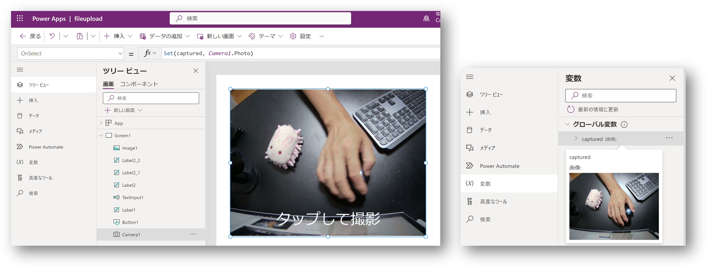

# はじめに

Power Apps でキャンバスアプリを作成していると、割と良く出てくる要件が「スマホで撮影した画像をアップロードしたい」というものです。
これはまあ当然と言えば当然なのですが、サンプルを探してみるとアップロード先の大半が SharePoint ばかりです。
SharePoint は Power Apps の標準コネクタから接続できますし、サーバーサイドの実装が不要なので、そういうサンプルが多いのは当然と言えば当然です。

ただ Azure 屋さんとしては各種 Computing サービスでホストした Web API や Azure Blob Storage にアップロードしたい、という気持ちもあるわけです。
ところが Blob でも SharePoint でもキャンバスアプリから出来るのはアップロードまでで、アップロード後の画像に対する「何らかの処理結果」を受け取るには非同期処理の結果を受け取るための作りこみが必要です。

というわけで ASP.NET Core を使用して Web API を作成、そこに接続するためのカスタムコネクタを作成、キャンバスアプリから画像をアップロードする方法を整理してみます。

# ファイルをアップロードするための ASP.NET Core Web API

[ASP.NET Core でファイルをアップロードする](https://learn.microsoft.com/ja-jp/aspnet/core/mvc/models/file-uploads?view=aspnetcore-7.0) 場合、それほど大きなサイズのファイルでなければ `IFormFile` を使用します。
リンク先では Web アプリとしての実装が紹介されていますが、Web API としても同じように実装できます。
非常に大雑把にいえば、Web API のメソッドの引数を `IFormFile` にしておくことで、`multipart/form-data` でリクエストを受け取ることが出来るわけです。

具体的な実装イメージは以下のようになります。
詳細な解説は後述します。

```csharp
[ApiController]
[Route("api/files")]
public class FilesController : ControllerBase
{
    private readonly ILogger<FilesController> _logger;

    public FilesController(ILogger<FilesController> logger)
    {
        _logger = logger;
    }

    [HttpPost(Name = nameof(UploadFile))]
    [SwaggerOperation(Summary = "Upload file sample", Description = "Upload single file with comment.")]
    [Consumes("multipart/form-data")]
    [Produces("application/json")]
    [ProducesResponseType(StatusCodes.Status200OK, Type=typeof(FileUploadResult))]
    public async Task<FileUploadResult> UploadFile(IFormFile fileInfo, [FromForm]string uploadComment)
    {
        _logger.LogInformation("{filename} length is {length} bytes", fileInfo.FileName, fileInfo.Length);

        using (var output = System.IO.File.OpenWrite(Path.Combine(@"C:\Work", fileInfo.FileName)))
        {
            await fileInfo.CopyToAsync(output);
        }

        return new FileUploadResult() { Message = $"{fileInfo.Name} is successfully uploaded." };
    }
}
```

ここではとりあえずファイルを受け取れることが確認できればいいので、メソッドの中身は適当です。
アップロードされたファイルが壊れたりしていないかを確認するために、Web サーバー上のローカルファイルとして保存しているだけですね。

# Web API のコードから OpenAPI 2.0 仕様を生成する

作成した Web API を Power Apps から呼び出すためにはカスタムコネクタを作成するのですが、PowerApps の画面でデータ構造や操作を定義するのはとても大変です。
このため OpenAPI 仕様を出力してカスタムコネクタを自動生成させるのがおススメなのですが、とっても残念なことに 2023 年 5 月現在においても [OpenAPI 3.0 に対応していません。](https://learn.microsoft.com/ja-jp/connectors/custom-connectors/define-openapi-definition)
よって OpenAPI 2.0 に対応した Swagger ドキュメントを生成するように若干のカスタマイズが必要になってきます。
また前述のサンプルコードに示した通り、ある程度しっかりアノテーションをつけておかないと、カスタムコネクタ生成時の関数が使いにくいものになってしまいます。

## OpenAPI 2.0 に対応するためのカスタマイズ

まずは生成する OpenAPI 仕様のバージョンを 2.0 （Swagger）形式に変更します。
現在 Visual Studio や `dotnet new webapi` コマンドなどで生成した Web API プロジェクトは [Swashbuckle](https://learn.microsoft.com/ja-jp/aspnet/core/tutorials/getting-started-with-swashbuckle?view=aspnetcore-7.0&tabs=visual-studio) が使用されていますので、
これをカスタマイズしていくのが簡単でしょう。

この場合、スタートアップコードのミドルウェアを構成する際に下記のように設定してあげれば OK です。

```csharp
app.UseSwagger( c => {
    c.SerializeAsV2 = true;
});
app.UseSwaggerUI();
```

## 各種アノテーションを付与するための設定

OpenAPI 仕様でいうところの `Operation` はコントローラで実装された Web API の各メソッドに該当し、この情報を元にカスタムコネクタの関数として生成されます。
ここでしっかりとアノテーションをつけてあげると良いでしょう。
また複数のコントローラーからからなる Web API を作成している場合には、それらをひとつの OpenAPI 仕様にまとめることになるので、全体レベルでのアノテーションも必要になります。

よって、`Startup.cs` に下記のようなコードを追加しておきます。
2 つ目の `EnableAnnotations` 拡張メソッドを利用するためには、[Swashbuckle.AspNetCore.Annotations](https://www.nuget.org/packages/swashbuckle.aspnetcore.annotations/)が必要になりますので、依存関係に追加しておきます。

```csharp
builder.Services.AddEndpointsApiExplorer();
builder.Services.AddSwaggerGen(c => {
    c.SwaggerDoc("v1", new() { Title = "File Upload Web API", Version = "v1" });
    c.EnableAnnotations();
});
```

ちなみに [こちら](https://stackoverflow.com/questions/52883466/how-to-add-method-description-in-swagger-ui-in-webapi-application) にあるように、アノテーションのつけ方もいろいろあって悩ましいところですが、個人的には上記の Attribute で記述する方法が後述の OpenAPI 仕様の記述に近いと思うのでやりやすいと思います。

## 生成される OpenAPI 2.0 仕様の確認

上記で生成される OpenAPI 仕様を確認すると以下のようになります。
ポイントとしては `multipart/form-data` 形式で Consume する Operation で `formData` として `file` を受け取るように構成されていることです。
この辺りの設定に関しては [OpenAPI 2.0 の仕様](https://swagger.io/specification/v2/) を参照いただければと思いますが、
要はこれを生成するための Web API 定義を C# でしていたということです。

```json
{
    "swagger": "2.0",
    "info": {
        "title": "File Upload Web API",
        "version": "v1"
    },
    "paths": {
        "/api/files": {
            "post": {
                "tags": [
                    "Files"
                ],
                "summary": "Upload file sample",
                "description": "Upload single file with comment.",
                "operationId": "UploadFile",
                "consumes": [
                    "multipart/form-data"
                ],
                "produces": [
                    "application/json"
                ],
                "parameters": [
                    {
                        "in": "formData",
                        "name": "fileInfo",
                        "type": "file"
                    },
                    {
                        "in": "formData",
                        "name": "uploadComment",
                        "type": "string"
                    }
                ],
                "responses": {
                    "200": {
                        "description": "Success",
                        "schema": {
                            "$ref": "#/definitions/FileUploadResult"
                        }
                    }
                }
            }
        }
    },
    "definitions": {
        "FileUploadResult": {
            "type": "object",
            "properties": {
                "message": {
                    "type": "string"
                }
            },
            "additionalProperties": false
        }
    }
}
```

なお SwaggerUI ミドルウェアを有効にしていますので、このファイルは下記のリンクからダウンロードできます。


# OpenAPI 2.0 仕様からカスタムコネクタの生成

先ほどの Swagger ドキュメントを元にカスタムコネクタを生成すると、下記のようになります。
ここで入力する `ホスト` 名の URL に対して API が呼び出されることになりますので、インターネット経由でアクセスできる場所にデプロイしておく必要があります。


Azure App Service などを利用していただくのも良いですが、開発している最中にそれは若干手間が大きいですし、デバッグもしずらいので、後述のトンネルなどを利用すると良いでしょう。

## カスタムコネクタの仕様確認

ここで説明文や操作の ID (operationId) が自動生成されていることがわかります。


ちなみにこの画面では multipart/form-data 形式でのデータ型定義が出来ません。
API 実装側でしっかり OpenAPI 仕様を定義せずにカスタムコネクタを作成しようとすると、下記のような Yaml を手書きする羽目になるので辛いことになると思います。

```yaml
swagger: '2.0'
info:
  title: File Upload Web API
  version: v1
host: 9xczn34t-7234.asse.devtunnels.ms
basePath: /
schemes:
  - https
paths:
  /api/files:
    post:
      tags:
        - Files
      summary: Upload file sample
      description: Upload single file with comment.
      operationId: UploadFile
      consumes:
        - multipart/form-data
      produces:
        - application/json
      parameters:
        - in: formData
          name: fileInfo
          type: file
        - in: formData
          name: uploadComment
          type: string
      responses:
        '200':
          description: Success
          schema:
            $ref: '#/definitions/FileUploadResult'
definitions:
  FileUploadResult:
    type: object
    properties:
      message:
        type: string
    additionalProperties: false
```

## ファイルアップロードのテスト（不可）

さてカスタムコネクタの生成ウィザードにはテスト機能が付いているのですが、下記のとおりファイルアップロードのテストが出来ません。


よって、ここで作成したカスタムコネクタを利用するアプリケーションを作成してテストする必要があります。
このためにも、少なくとも API 実装とコネクタで「仕様がズレていない」ことが非常に重要になりますので、先ほどのように OpenAPI 仕様から生成するというプロセスが重要なわけです。

# 写真の撮影とアップロードのテスト

## 写真の撮影

さて PowerApps では [Camera コントロール](https://learn.microsoft.com/ja-jp/power-apps/maker/canvas-apps/controls/control-camera) を使用することで、撮影機能をアプリに組み込むことができます。
キャンバスに Camera コントロールを張り付けるとプレビューとして表示されているデータを `Photo` プロパティで取得することでできます。
OnSelect イベントで下記のように記述することで、画像のタップ時に変数に撮影データを格納することが出来ます。

```
Set(capturedImage, Camear1.Photo)
```

変数に格納された画像データは変数メニューから確認できます。



## 写真データのアップロード

さてカスタムコネクタを呼び出すためには `データ` メニューからコネクタと接続を追加しておけば、保存ボタン等のイベントに応じて呼び出すことが可能です。
関数名は _{ApiTitle}.{OpearationId}_ の形式になりますので、先ほどの Annotation を付与する際には PowerApps から呼び出すことも意識して名前付けしてあげると良いでしょう。


## 開発中の API のホストとデバッグ

さて前述の通りこのコネクタが呼び出す API は基本的にインターネットからアクセス可能な位置でホストされている必要があります。インターネット環境から開発環境で動作中のアプリを直接呼び出すためのトンネルを作成するためのツールとして [ngrok](https://ngrok.com/) というツールを利用することが多いです。

なお Visual Studio 2022 で ASP.NET Core アプリを開発している場合には [開発トンネルという機能が便利です。](https://learn.microsoft.com/ja-jp/aspnet/core/test/dev-tunnels?view=aspnetcore-7.0)
こちらを利用することで、コードを修正してデバッグ実行（F5）しつつトンネルを空け、Power Apps からコネクタ経由で API を呼び出してブレークポイントで止める、という作業がシームレスに行えるようになります。


また Linux で動作するアプリのソースコードを GitHub で管理して開発している場合には [GitHub Codespaces のポート転送という機能も便利です。](https://docs.github.com/ja/codespaces/developing-in-codespaces/forwarding-ports-in-your-codespace)
こちらを利用する場合には （ASP.NET Core に限らず） Web サーバーが起動して待機しているポートに対して、Port Forward するための URL を生成することが可能です。
こちらもデバッガでブレークできるので便利です。


# アップロード時のリクエストの確認

Web API と言うとつい JSON 形式で考えてしまい、画像をアップロードするなら base64 でエンコードして文字列で転送すればいいかな、とか考えてしまうのですが、データサイズが約 1.5 倍になってしまうので、通信量的に大変もったいないことになります。
実はこの記事は Power Apps からもちゃんとバイナリ形式のままでアップロード出来ることを確認したかったのが目的でした。
うっかり動作してしまっただけの可能性があるので、念のため Web サーバーのログを確認してみましょう。

ASP.NET Core 6.0 からは Kestrel に対する [HTTP アクセスログ](https://learn.microsoft.com/ja-jp/aspnet/core/fundamentals/http-logging/?view=aspnetcore-7.0)を出力することが可能です。

まずスタートアップコードで HTTP ログ出力のためのミドルウェアを有効にします。

```csharp
app.UseHttpLogging();
```

そして `appsettings.json` で `Microsoft.AspNetCore.HttpLogging` カテゴリのログを出力するように設定を追加します。

```json
{
  "Logging": {
    "LogLevel": {
      "Default": "Information",
      "Microsoft.Hosting.Lifetime": "Information",
      "Microsoft.AspNetCore.HttpLogging": "Information"
    }
  }
}
```

この状態で Visual Studio の出力ウィンドウを見ていると以下のようなログ（一部抜粋）が流れてきますので、HTTP リクエストのサイズと API
 コード内で受け取ったファイルストリーム（バイナリ）のサイズがほぼ一致することが確認出来ました。

```
Microsoft.AspNetCore.HttpLogging.HttpLoggingMiddleware: Information: Request:
Content-Type: multipart/form-data; boundary="38787c01-e71b-4671-bb59-cc32ef07855c"
Content-Length: 512529

uploadfile_from_powerapp.Controllers.FilesController: Information: file_946b7456-0282-47c2-96f1-d7738439767c.png length is 512201 bytes
```