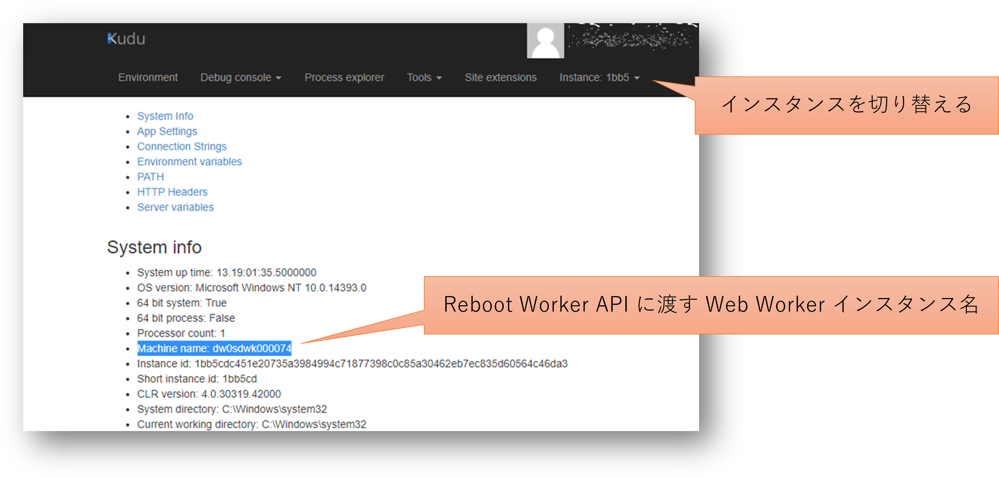
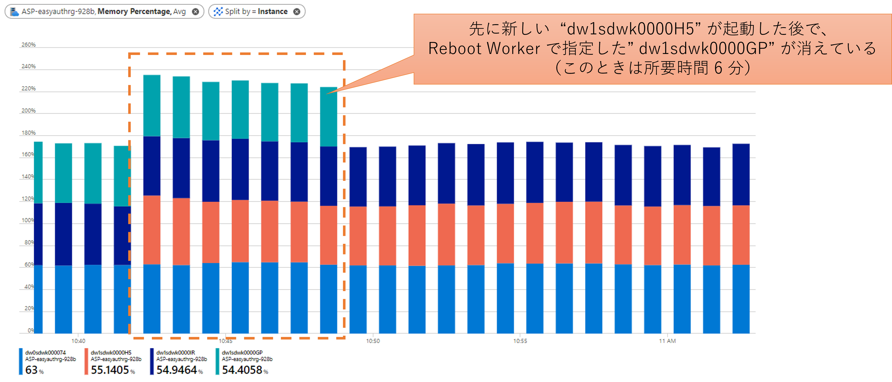

## はじめに

Azure Web Apps を使用していると特定の Web Worker インスタンスのみで問題が発生し、該当インスタンスだけを狙って再起動をかけたい場合がたまにあります。
そのために [App Service Plan - Reboot Worker](https://docs.microsoft.com/en-us/rest/api/appservice/app-service-plans/reboot-worker) という API が一応用意されているので、その利用方法を紹介します。

## 注意事項

この Reboot Worker API なのですが、１時間に１回しか呼び出せないというキツめの制限があるので、少なくとも現状では通常運用に組み込めるような手段ではないと思います。
トラブルシュートや暫定対処としてアドホックにご利用いただくのが良いかなと思います。

## Reboot Worker API の利用方法

Reboot Worker API はその引数に対象となる Web Worker を含む App Service Plan の情報に加え、Web Worker のインスタンス名を必要とします。
この値は Azure Portal や CLI などを使用した通常の方法では取得できないので、Kudu を使用するか [Web Apps - List Instance Identifiers](https://docs.microsoft.com/ja-jp/rest/api/appservice/web-apps/list-instance-identifiers) という API を使用します。

```bash
subscriptionId="your-subscription-id-guid"
resourceGroupName="your-webapp-rg"
webappName="your-webapp"
listinstance="https://management.azure.com/subscriptions/${subscriptionId}/resourceGroups/${resourceGroupName}/providers/Microsoft.Web/sites/${webappName}/instances?api-version=2019-08-01"

az rest --method get --uri $listinstance --query 'value[].properties.machineName'
[
  "dw0sdwk000074",
  "dw1sdwk0000GP",
  "dw1sdwk0000IR"
]
```

この中から再起動をかけるインスタンスを選択して Reboot Worker API に渡してやれば良いわけです。
ただ Reboot Workker は App Service Plan の API ですので、先に Web App が動作する App Service Plan の情報を取得しておきます。

```bash
workerName="dw1sdwk0000GP"
appserviceplanId=`az webapp show --resource-group $resourceGroupName --name $webappName --output tsv --query "appServicePlanId"`
rebootWorker="https://management.azure.com${appserviceplanId}/workers/${workerName}/reboot?api-version=2019-08-01"

az rest --method post --uri $rebootWorker
```

なお正常終了のレスポンスは HTTP 204 No Content なので成功すると**何も表示されない**ので不安になります。
また再起動は即座に完了するわけではないので、コマンド実行直後はまだ結果が反映されていません。
このため間をおいて List Instance Identifire API を何度か実行して確認しましょう。

```bash
# Reboot Worker 実行直後でまだ結果が反映されていない（実行前と変化なし）
az rest --method get --uri $listinstance --query 'value[].properties.machineName'
[
  "dw0sdwk000074",
  "dw1sdwk0000GP",
  "dw1sdwk0000IR"
]
# しばらくすると workerName で指定したインスタンスが消えて別のインスタンスが割り当てられる
az rest --method get --uri $listinstance --query 'value[].properties.machineName'
[
  "dw0sdwk000074",
  "dw1sdwk0000IR",
  "dw1sdwk0000H5"
]
```

どうも挙動としては再起動ではなく別インスタンスとして割り当てられるみたいですね。
なお前述の通りこの API は実行回数の制限がありますので、直後にもう一度別インスタンスに対して Reboot Worker を呼び出してもエラーになります。

```bash
workerName="dw0sdwk000074"
rebootWorker="https://management.azure.com${appserviceplanId}/workers/${workerName}/reboot?api-version=2019-08-01"

az rest --method post --uri $rebootWorker
Bad Request({"Code":"BadRequest","Message":"Cannot modify this web hosting plan because another operation is in progress. Conflicting operation details: Another reboot operation is still in progress for server farm with id 'appserviceplanName'.\r\nProcedure: runtime.workers_requestWorkerReboot_v106","Target":null,"Details":[{"Message":"Cannot modify this web hosting plan because another operation is in progress. Conflicting operation details: Another reboot operation is still in progress for server farm with id 'appserviceplanName'.\r\nProcedure: runtime.workers_requestWorkerReboot_v106"},{"Code":"BadRequest"},{"ErrorEntity":{"ExtendedCode":"11008","MessageTemplate":"Cannot modify this web hosting plan because another operation is in progress. Conflicting operation details: {0}","Parameters":["Another reboot operation is still in progress for server farm with id 'appserviceplanName'.\r\nProcedure: runtime.workers_requestWorkerReboot_v106"],"Code":"BadRequest","Message":"Cannot modify this web hosting plan because another operation is in progress. Conflicting operation details: Another reboot operation is still in progress for server farm with id 'appserviceplanName'.\r\nProcedure: runtime.workers_requestWorkerReboot_v106"}}],"Innererror":null})
```

## GUI での確認方法

Reboot Worker の呼び出し自体は REST API を呼び出す必要があるのですが、インスタンス名の確認や Reboot の状況などは GUI で確認することができます。

### Web Worker Instance の名前を Kudu で確認する

Kudu の `Environment` タブを開き、対象とする Web Worker インスタンスを右上の `Instance` ドロップダウンで切り替えると、System Info の `Machine name` で確認できます。



### Azure Monitor Metric でインスタンスの切り替え状況を確認する

App Service Plan でメトリックを開き、`Memory Percentage` などのインスタンス単位のディメンジョンを持つメトリックを表示すると、下記のように切り替え状況が確認できます。


