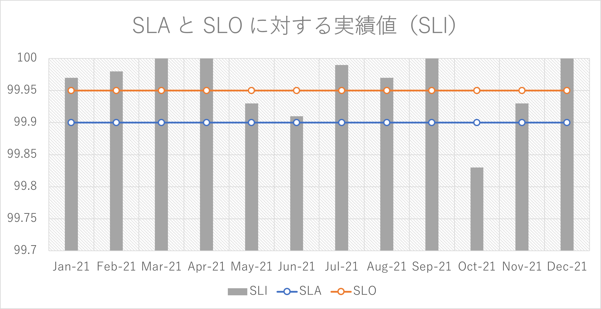
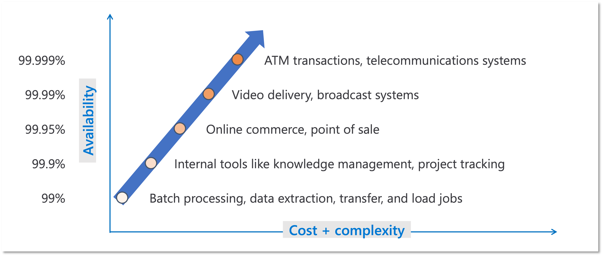
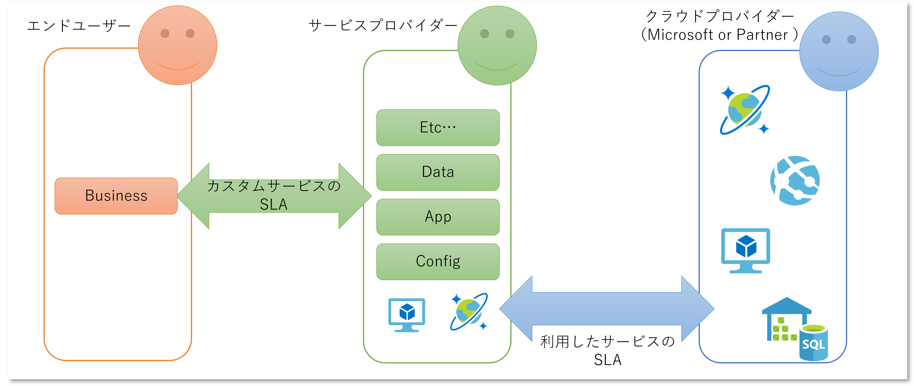
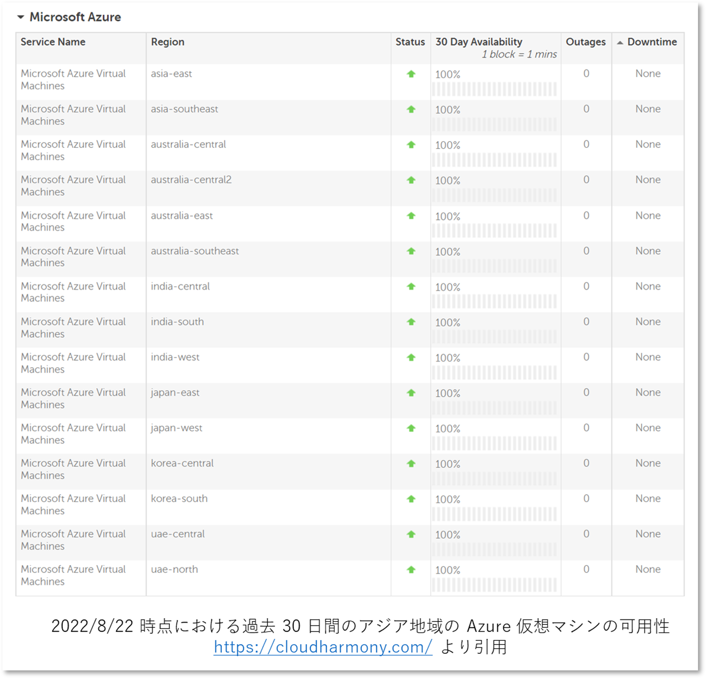

# はじめに

Microsoft Azure に限りませんが、有償のクラウドサービスを利用する場合には SLA : Service Level Agreement が定義されていることが多いです。
クラウドが普及し始めた初期の頃こそ「えすえるえー？ 何それおいしいの？」という会話も割と多かったのですが、最近では減ってきて利用者の側でも SLA を意識されるようになってきたなあという印象があります。
とはいえ会話を進めていくと "SLA" という言葉の捉え方、その数値（99.9%とか）の解釈、違反が発生したらどうなるか？などがすれ違いを起こしていることも割とよくあります。
というわけで、この記事では私がお客様と「SLA」について会話する際にトピックになりがちな内容をつらつらと書いて行こうと思います。

一部には私の独断と偏見が含まれていますのでご注意ください。

# SLA / SLI / SLO を区別する

言葉の定義だけを振り回すのはあまり好きではないですし、会社やサービスによって SLA で設定されているものが異なったりするので、
差し当たり [Microsoft Azure の SLA](https://azure.microsoft.com/ja-jp/support/legal/sla/) をみてみましょう。

> SLA をお読みになり、マイクロソフトの稼働時間の保証およびダウンタイムのクレジット ポリシーについてご確認ください。

保証及びクレジット（返金）のポリシー、すなわちお金を支払ってご利用いただいたサービスに対して、保証した稼働率を下回った場合の罰則規定を定めたものです。
誤解されがちですが SLA の **A** は稼働率や可用性の実績（Availability）ではないのです。
ユーザーさんがサービスの利用にあたってご確認および同意（Agreement）いただくものです。

当然クラウドプロバイダーとしては返金などしたくありません。
つまり実稼働率である SLI : Service Level Indicator は SLA を上回っているのが普通の状態です。
もちろん一時的に下回ることはありえますが、だいたいのクラウドサービスでは多くの月において SLA は達成しているのではないでしょうか。
じゃないと商売にならないわけですし。
ただ残念ながら Microsoft は Azure における各サービスの実稼働率を公表していませんので、具体的な数値をここで示すことは出来ません。

また SLI が常に SLA を上回るように、運用目標である SLO : Service Level Objective も高く設定されています。
SLA を満たしていたとしても障害が発生すればクラウドプロバイダーとしての信頼性が問われます。
そのために日々の運用や機能の改善が継続的が行われているわけです。
この取り組みについては少し古い記事になりますが [Microsoft Azure の信頼性をさらに高める](https://azure.microsoft.com/ja-jp/blog/advancing-microsoft-azure-reliability/) が参考になるでしょうか。
ここでいう信頼性とは可用性だけではなく、セキュリティなどの要素も含んでいます。

検索していただくといろいろなサイトで SLA、SLI、SLO の違いについて様々な情報が得られます。
用語の定義ももちろん重要ですが、人によって異なるニュアンスで使われることが割と多いので、今話しているのは SLA なのか、SLI なのか、SLO なのか、共通認識を持って会話することが重要だと考えます。

# 具体的なメトリックと活用方法

少しイメージをつけるために架空のシステムに対して SLA / SLO / SLI をプロットしてみました。 

- SLA は 99.9% を約束しているが、内部的な運用目標として SLO を 99.95% に設定
- ほとんどの月は SLI > SLA となっており、有償サービスとして必要な品質を提供できている
- ただし 10 月だけは SLI < SLA となっている、すなわち SLA 違反が発生しているため事前に定義した罰則対応が必要になっている
- 5, 6, 11 月は SLA < SLI < SLO となっており、機能追加よりも安定運用のための改善活動を優先すべき

さてシステムの稼働中には２つの観点でエンジニアリソースが投入されています。
保守チーム（Dev）は新規機能の開発は既存機能の改修を主眼としており、その成果物を早く多くリリースして利益を増やしたいわけです。
一方運用チーム（Ops）は安定稼働を主眼としており、新規機能の追加や回収といったリスクを伴う行為にメリットがありません。
もちろんビジネスオーナーにとってはどちら重要ですが、保守や運用といった活動に充てるエンジニアリソースは有限なので、なんでもかんでもやればいいというわけではありません。

SLA 違反に関しては対応が明確に事前定義されている（はず）ですし、契約違反を起こしているわけですから、関係者全員が最優先で対応しなければならない緊急事態なので、ある意味ではわかりやすい状況です。
ただ通常の SLA を満たしている状態では前述の三者三様の価値観に折り合いをつけ、優先度をつけて対応していく必要があります。
こういった異なる価値観を持つステークホルダー同士で合意を取るために SLO を明確にして（保守・運用チームとしてではなく）エンジニアリソース配分の優先度を切り替えるための閾値として扱います。

SRE 界隈ではこの SLI と SLO の差を「エラーバジェット」と呼ぶようです。
既存システムに対する変更はリスクを伴いますので、そういったチャレンジはバジェット（予算）に余裕がある時に実施します。
予算を使い果たしてしまって赤字になっているときには開発の手を止めて、システムの安定運用のための活動に注力する、といった具合です。

~~もしかしたら従来は社内政治的な力関係、担当者の勘と経験、経営者の鶴の一声で決めていたのかもしれないですが~~
エンジニアリソースの配分といったバランス感覚を必要とされる難し判断から属人性を排除するためのものと言えます。

# 適切な SLO ってどれくらい？

ビジネス的には何かしら必要性があるためお金を払ってでもシステムが構築され運用されているわけですから、落ちてもいいシステムというのは基本的には無いと思います。
とはいえどうしたって事故は起こりますので、可用性 100％ というのは現実的ではなく、リスクは常にあるという意識が必要でしょう。
また可用性を高く保とうとすればするほど設計・構築・運用に必要なコストもどんどん高くなりますので、闇雲に理想を高く持つのはよろしくありません。
可用性とその必要なコストに対して、システムから得られる利益のバランスが重要です。

では、どれくらいに設定するのがいいのでしょうか。
これは一律の答えがあるわけでは無いのですが、例えば以下が参考になりますでしょうか。
なおこれは縦軸が Availability であること、つまり必ずしも Agreement であることを意味していません。

SLO を下回れば目標未達ということで改善活動が必要になりますが、SLA として設定するということは前述の通り罰則規定を伴い、そして違反時には返金などの義務が発生することになります。

# 高すぎる SLA/SLO は身を滅ぼす（かもしれない）

おそらくシステムに関わるほぼ全ての人間の気持ちとしては SLO は 100% です。
ただ 100% というほどではないにしても SLO を高くすればするほど様々な弊害が出てきます。
前述の例で出てきた ATM transactions に求められるような超高可用性の世界ではファイブ・ナイン(99.999%)を求められることがあります。
ただこれはシステムの改修における「余裕の無さ」も表しています。

具体的にどういうことになるか、ここでは可用性をシステムが利用可能な「時間」として、各 SLO における許容可能なダウンタイムを算出すると以下のようになります。

|SLO|週間許容ダウンタイム|月間許容ダウンタイム|年間許容ダウンタイム|
|---|--:|--:|--:|
|99.0%|100 分 48 秒|7 時間 12 分 0 秒|3 日 15 時間 36 分 0 秒|
|99.9%|10 分 4 秒|43 分 12 秒|8 時間 45 分 36 秒|
|99.95%|5 分 2 秒|21 分 36 秒|4 時間 22 分 48 秒|
|99.99%|1 分 1 秒|4 分 19 秒|52 分 34 秒|
|99.999%|6 秒|26 秒|5 分 15 秒|
|99.9999%|0.6 秒|2.6 秒|31.5 秒|

例えば SLO を 99.99%（フォー・ナイン） に設定した場合でも、全く障害などが発生しなかった場合にも月間のエラーバジェットは 4 分 19 秒しかありません。
これは障害が発生した際に人間の判断や操作が関与した時点で実現不可能な数値と言えます。
つまりシステム構成としては十分に多重化され、かつ障害発生時にも自動的に復旧するような運用設計が重要になってきます。
もし SLO ではなく SLA を 99.99% に設定した場合はどうなるでしょう。
SLO は SLA よりも高い水準を求められますので SLO は 99.999%（ファイブ・ナイン）などになり、月間のエラーバジェットは 26 秒しかありません。
もはや想定外など許されないレベルでの運用設計が求められることになり、きわめて厳しい要求といえます。

バジェットに余裕がないということは、少しでもダウンタイムが発生すればバジェットはすぐに無くなるということです。
こうなってくると組織として機能追加や回収などを行う余裕はほぼないでしょうし、極めてリスクの高い行為となりますのでそのスピードも鈍化し、大きな工数が必要になります。
ダウンタイムが発生するほどでもない軽微なバグの修正、操作性やパフォーマンス劣化など起因するユーザーの改善要望、セキュリティパッチや更新プログラムの適用などは放置されがちになります。
現実的には「塩漬け」などと呼ばれる腫物を扱うような方針が取られ、時間経過に伴って技術的負債が増えていくことにもなりかねません。

~~どこかで聞いたことがある話ですが、落ちないようにお祈りしましょう~~

# Azure Cosmos DB の SLA 99.999% を見てみよう

さてここでは具体的に [Cosmos DB の SLA](https://azure.microsoft.com/ja-jp/support/legal/sla/cosmos-db) を見てみましょう。
下記は 2022 年 8 月時点の version 1.4 の内容（この時点での最終更新は 2021 年 5 月）から抜粋したものです。
正確な内容は是非リンク先をご自身の目でご確認ください。

> Azure Cosmos DB は、データベース アカウント用の書き込み可能なエンドポイントとして複数の Azure リージョンの構成を可能にします。
> この構成では、Azure Cosmos DB は、読み取りと書き込みの両方において 99.999% SLA の可用性を提供します。

ファイブ・ナインというやつです、素晴らしい。
SLA に関する会話をしていると、この `99.999%` という数値が着目されるのですが（別にそれは間違いではないのですが）解釈に注意する必要があります。

そもそもこの SLA と呼ばれる数値、百分率で表されているということは確率や割合を表すはずなんですが、分子と分母は何でしょう？

SLA ドキュメントの中の「SLA の詳細」を展開してみると詳細な記載があるのですが、これは Cosmos DB に対して行われた「読み取りや書き込みの総数及びエラーになった回数」で算出されます。
正常に接続できる **時間ではない** のです。

これはあくまでも例え話になりますが、ある月のある１時間の間にずっと満遍なくエラーが出ていた、ただし要求の一部だけがエラーになるのであって、正常に完了した要求はたくさんあるものとします。
エラーは１秒間に１回（1 時間で 3,600 回）出ていて、ただ並行して正常に処理された要求も 1,000,000 回あったとしましょう。
つまりこの時間のエラー率は 0.3587 % です。
正常に処理できている割合は 99.65 % です。
割とダメな感じです。

$$
エラー率 = \frac{3600}{1 000 000 + 3600} = 0.3587 \%
$$

ただし、Cosmos DB の SLA における **月間稼働率** は請求月間内の各時間における平均エラー率から算出されます。
わかりにくいですね。
上記はあくまでも「とある１時間」における話なので、他の時間帯は全て正常に要求を処理できていた、すなわちエラー率が 0 % だとしたらどうでしょう。
１ヶ月を 30 日とすると 720 時間ですので、平均エラー率は 0.000498% になります。

$$
平均エラー率 = \frac{ 3.47\% + 0\%+ 0\%+ 0\% + ...}{30 \times 24} = 0.000498 \%
$$

つまり月間稼働率は 99.9995 % ですので、SLA を達成していることになります。
もちろん返金対象にはなりません。

$$
月間稼働率 = 100 \% - 0.000498 \% = 99.9995 \% > 99.999 \%
$$

ちなみに前述のエラーが出ていた時間帯以外に全く要求がない、つまり要求数がゼロなのでエラーも正常もない場合には、その時間帯のエラー率は 0% になります。
月に一回だけ実行する一時間で完結する月次バッチ処理とかだとこういうこともあり得ます。

納得いきますか？
私は「SLA 99.999% という表現から受ける印象とは大分異なるな？」と感じました。
しかし SLA の定義からは上記のような計算も可能になってしまうわけです。

# SLA は面倒だけど避けられない

前述の Cosmos DB でも少し触れていますが、SLA のドキュメントでは細かく測定方法や条件と計算式が定められており、極めて難解なドキュメントになっています。
私もつい面倒なのでうっかり数値だけ見て「このサービスの SLA は XX% ですよ！」とか言ってしまいがちなのですが、良く読み込んでみるといろいろと引っ掛かりそうな項目も出てきます。
（この記事を含む）様々な解説、営業担当やパートナーの説明なども多々ありますが鵜吞みにせず、必ずご自身の目でオリジナルのドキュメントを、最初の一部だけでなく全文を読んでいただくことをお勧めします。

面倒であっても料金や可用性を重視するならば避けて通ることは出来ないのです。
是非ご一読を。

## Cosmos DB の SLA は稼働率だけではない

前述の例であげた SLA は可用性に関して稼働率で定められてました。
ただ実際には Cosmos DB では待機時間、一貫性、スループットに対する SLA も定められています。
これらは当然要求数ではないメトリックから計測されることになりますし、その評価方法や計算式も、そして SLA の値も異なります。

> - このサービスは、5 つの一貫性レベルのいずれかで構成された単一 Azure リージョンにスコープされている Azure Cosmos DB データベース アカウント、または 4 つの緩やかな一貫性レベルのいずれかで構成されている複数リージョンにまたがるデータベース アカウントに対して、スループット、一貫性、可用性、レイテンシの保証をカバーする 99.99% の包括的な SLA を提供します。
> - Azure Cosmos DB は、データベース アカウント用の書き込み可能なエンドポイントとして複数の Azure リージョンの構成を可能にします。この構成では、Azure Cosmos DB は、読み取りと書き込みの両方において 99.999% SLA の可用性を提供します。

任意の SLI について同じ SLA が提供されるわけではないことにご注意ください。

是非ご一読を。

## ユーザー設定によって SLA の値は異なることがある

Cosmos DB 意外では代表的なものは[仮想マシンの SLA](https://azure.microsoft.com/ja-jp/support/legal/sla/virtual-machines/v1_9/)だと思います。
以下は 2020 年 7 月に更新された Version 1.9 のドキュメントから抜粋しています。
仮想マシンの可用性オプションやディスクの構成によって 5 段階の SLA が定義されていることが分かります。

> - すべての仮想マシンに、同じ Azure リージョン内の 2 つ以上の可用性ゾーンにまたがりデプロイした 2 つ以上のインスタンスがある場合、マイクロソフトは、99.99% 以上の時間において少なくとも 1 つのインスタンスに対する仮想マシン接続が確保されることを保証します。
> - すべての仮想マシンに、同じ可用性セットまたは同じ専用ホスト グループにデプロイした 2 つ以上のインスタンスがある場合、マイクロソフトは、99.95% 以上の時間において少なくとも 1 つのインスタンスに対する仮想マシン接続が確保されることを保証します。
> - すべてのオペレーティング システム ディスクおよびデータ ディスクについて Premium SSD または Ultra ディスクを使用する単一インスタンス仮想マシンについては、マイクロソフトは 99.9% 以上の時間において仮想マシン接続が確保されることを保証します。
> - オペレーティング システム ディスクおよびデータ ディスクについて Standard SSD Managed Disks を使用する単一インスタンス仮想マシンについては、マイクロソフトは 99.5% 以上の時間において仮想マシン接続が確保されることを保証します。
> - オペレーティング システム ディスクおよびデータ ディスクについて Standard HDD Managed Disks を使用する単一インスタンス仮想マシンについては、マイクロソフトは 95% 以上の時間において仮想マシン接続が確保されることを保証します。

是非ご一読を。

## SLA の適用には制限事項もある

SLA はいついかなる時のどんな状況においても必ず保証されるわけではなく、いくつかの例外事項が存在します。
このあたりは「一般条件」の中の「制限事項」に書かれています。
ここではいくつかピックアップして紹介します。

> マイクロソフトが合理的な方法で制御不能な要因によるもの (自然災害、戦争、テロ行為、暴動、政府機関の行為、またはマイクロソフトのデータ センター外部のネットワーク障害やデバイス障害など。お客様のサイトにおけるもの、またはお客様のサイトとマイクロソフトのデータ センターとの間におけるものを含む)

Azure は日本国内に２つのリージョンを持つことで、データを国外に持ち出すことなく広域災害対策構成が取れることで有名です。
が、これはあくまでもユーザー判断によって利用するオプションです。
もし単一リージョンしか使っておらず、大地震等の自然災害によって利用不可になったとしても SLA としての保証は行われません。

> 誤った入力、命令、または引数に起因するもの (存在しないファイルに対するアクセス要求など)

当たり前といえば当たり前かもしれませんがユーザー様の操作によってシステムがダウンしたとしても Azure の SLA では保証されません。
SLA の話には限りませんが権限制御や誤操作の防止に留意してください。

> ダウンタイムが発生し、稼働率の計算から除外される再開、停止、開始、フェールオーバー、スケール計算、スケール ストレージなどお客様が開始した操作。

仮想マシンなどではコスト節約のため夜間の停止運用などが行われ、使いたい時だけ使った分だけお金を払うという、クラウドならではの利用スタイルも一般的になってきました。
ただこちらにあります通りこういったケースにおいてシステムが動かなかったとしても、SLA で保証されるわけではありません。

是非ご一読を。

## サービスごとに SLI/SLA の定義は異なる

「Azure の SLA」といったような漠然とした SLA というものは定義されておらず、前述の Cosmos DB や仮想マシンのようにサービス個別に SLI / SLA が定義されています。
１つ１つ確認していくことは大変なので
[Azure サービスの SLA 概要](https://azure.microsoft.com/ja-jp/support/legal/sla/summary/)
というページが大変便利なのですが、こちらには前述良ような諸条件や例外事項などの詳細が記載されていませんので、ここだけしか読まないと落とし穴にハマりがちです。
利用する個々のサービスの中身までご確認ください。

## 返金には申し立てが必要です

もし大規模障害などが発生して、ダウンタイムが発生したとしても自動的に返金（サービスクレジットが適用される）わけではありません。
ユーザー様が主導してその内容とともに申し立てを行っていただく必要があります。
また申し立て自体はカスタマーサポートで受け付けており、営業担当者にご相談いただいてもアドバイスは受けられますが、手続きの代行などは行うことが出来ません。
カスタマーサポートにご連絡頂かないとプロセスが始まりませんのでご注意ください。

是非ご一読を。

## どれくらい返金されるの？

とある月の稼働率などが SLA を下回ったとしても、必ずしもその月の利用金額の全額が返金対象になるとは限りません。
実際の稼働率に応じてクレジットの敵うよう割合が定められていますのでご確認ください。

また、利用料が 10,000 円なら、返金額の最大値はその 100% である 10,000 円です。
このサービスの障害等の影響によって 10,000,000 円の損害が出たとしても、その賠償責任までは SLA に含まれておりません。

> 特定の本サービスまたはサービス リソースについて 1 請求月に付与されるサービス クレジットは、いかなる場合も、その請求月における当該本サービスまたはサービス リソースについてのお客様の月額サービス料金を超えることはありません。

# その SLA は誰と誰が同意するの？

そもそも Agreement （同意）というからには、何かに同意した甲と乙の２つの主体がいます。
ここまでは Azure の SLA を題材に様々なトピックや考え方を紹介してきましたので、一方はマイクロソフト（ないしはその商流となるリセラー様やパートナー様）です。
では、もう一方は誰でしょうか？

Azure が提供しているのは IaaS : Infrastructure as a Service か PaaS : Platform as a Service に分類されるクラウドサービスです。
Dynamics 365 のような最終製品としてのサービス（SaaS）ではなく、なんらかの「サービス」を構成するための部品を提供するサービスです。このため Azure の利用者は一般的にはエンドユーザーではなく、Azure を利用して構築・運用を行う誰かです。
つまり Azure の SLA に同意しているのは「クラウドプロバイダー」と「サービスプロバイダー」になります。

サービスプロバイダーはエンドユーザーに提供するためのカスタムサービスの設計を行うときに SLO を設定することになりますが、それはカスタムサービスとしての SLO であり、SLA を定義するならばエンドユーザーとサービスプロバイダー間での Agreement になります。
Azure を利用してサービスを構築するのであれば、Azure の SLA は参考になりますが、それはカスタムサービスの SLA そのものにはなりませんし、エンドユーザーと同意するのは Microsoft ではありません。

極端な例でいえばサービスプロバイダーは「HDD を使用した単一 VM 構成のカスタムサービス」を設計・開発・運用しつつ、フォー・ナイン（99.99%）の SLA をエンドユーザーに提供しても良いわけです。
しかしカスタムサービスの SLA の定義内容（SLI の測定方法や例外条件など）によってはそれもアリえるでしょうし、それによるリスクも許容する（運用コストを極小化しておくことで、罰則規定が適用されても十分ペイする）という戦略も可能といえば可能です。

# 実際のところ可用性ってどうなの？

ちなみに余談ですが [CloudHarmony](https://cloudharmony.com/)というサイトでは、各種パブリッククラウドの可用性に関する計測値を参照することができます。
本記事執筆時点で直近 30 日間のアジア地域の各リージョンにおける仮想マシンの可用性は以下のようになっていました。
だからといって「単一 VM でも大丈夫、安心、安全」なんてことは誰も言ってくれません。
重要なのはサービスプロバイダーとしてどこまでリスクが取れるか、そしてエンドユーザーと何を「同意」するか、です。

# まとめ

この記事は私がこれまで SLA というキーワードを含む会話をしたときに出てきたトピックを羅列しただけなので、まとめるほどのものでもないのですが、以下の 2 点につきると思います。

- 利用するクラウドサービスの SLA はよく読みましょう（書いてないことまで読んではいけません）
- ご自身が提供するサービスの SLA は十分に注意して設定しましょう（明示的に同意することが大事です）

Microsoft Azure Well-Archited Framework の
[信頼性セクション](https://docs.microsoft.com/ja-jp/azure/architecture/framework/resiliency/)
にはベストプラクティスとして高可用性設計のための冗長化構成が紹介されていますが、別にこれは必須ではありません。
「ビジネス上重要ではなくとりあえず動いてくれれば良い」というお金をかけられないタイプのシステムというのは実際にかなり存在します。
ただどんなに重要度の低いシステムでも、使おうと思ったときに使えなければユーザーは不満に思うでしょう。
発生した問題にどこまで対応するか（しないのか）を明確にするうえで、高すぎず低すぎない SLA を設定しておくことが重要だと考えます。

