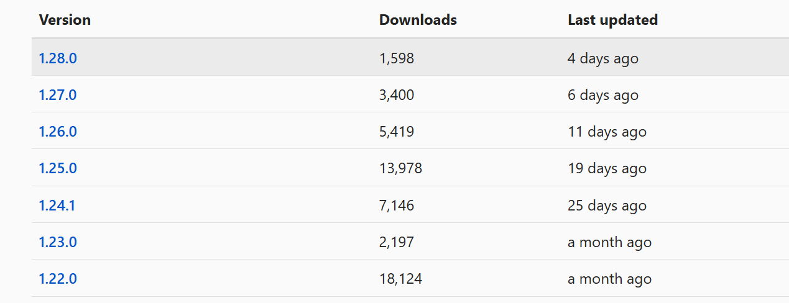

# はじめに

例によって今更な話ですが [Semantic Kernel](https://learn.microsoft.com/ja-jp/semantic-kernel/overview/) を勉強してみることにしました。
Semantic Kernel の大きなメリットの１つプラグインの仕組みを使うことで、モデルが学習していない知識や備えていない機能を付加することが可能なことだと思います。
ドキュメントやサンプルコードをいろいろつまみ食いしていたところ、プラグインの「作り方」とプラグインの「呼び出し方」がごっちゃになって混乱したので、
この記事では後者のプラグインの「呼び出し方」を中心に記述しています。


## サンプルコードについて

以降で記載しているサンプルコードは Visual Studio Code の [Polyglot Notebooks Extension](https://code.visualstudio.com/docs/languages/polyglot) を使用して検証しています。
Polyglog Notebook のどきゅメンツについては[こちら](https://github.com/dotnet/interactive/blob/main/docs/README.md)を、
私が検証に使用したサンプルコードのノートブックは[こちら](./sample.ipynb)をご参照ください。

## プラグインの作り方について

本記事では触れませんが、公式ドキュメントにもある通り[プラグインは様々な形式で作成することができます](https://learn.microsoft.com/ja-jp/semantic-kernel/concepts/plugins/?pivots=programming-language-csharp)。
しかしながら実際にはそのすべての手法がドキュメントとしては網羅されておらず、全体感が分かりにくいのが現状です。
ざっと見た限りでは以下のような方法を見かけました。
これもそのうち整理したいなあとは思っているのですが。

- C# クラスとメソッドで定義する方法（本記事ではこれを採用）
- メソッド単体で定義する方法
- プロンプトから作成する方法
- 所定のディレクトリに保存したテキストファイルから定義する方法
- OpenAPI 仕様から定義する方法

## バージョン問題

Semantic Kernel は本記事執筆時点(2024 年 11 月 12 日)では直近の 1 か月で 6 回もアップデートが行われているような状況です。
まだまだ試験中の機能があったり、ちょっと前の機能が使えなくなったりと、割と使う側からすると悩ましい状況です。
ライブラリとしては preview や RC 扱いではないのですが、ライブラリに含まれる一部の機能がまだ試験中だったりするのでご注意ください。

[](https://www.nuget.org/packages/Microsoft.SemanticKernel#versions-body-tab)


# サンプルコード解説

以下のサンプルでは Azure OpenAI Service の GPT-4o モデルを使用する前提で記載しています。
実際に試される場合にはご自身の Azure サブスクリプションにて作成しておいてください。

## まずは Azure OpenAI の情報を構成情報から読み込む

ノートブックやソースコードに設定情報を書き込むわけにもいかないので。最初に構成ファイルから設定値を読み込むようにします。

まず構成ファイル `appsettings.json` を以下のように用意して、ノートブック `.ipynb` と同じディレクトリに配置おきます。

```json
{
    "AOAI_ENDPOINT": "https://yourOpenAiResourceName.cognitiveservices.azure.com",
    "MODEL_DEPLOY_NAME": "your-gpt4o-modeldeploy-name"
}
```

こちらを `Microsoft.Extensions.Configuration` を使用して読み込んでいきます。

```csharp
#r "nuget: Microsoft.Extensions.Configuration"
#r "nuget: Microsoft.Extensions.Configuration.Json"

using System.IO;
using Microsoft.Extensions.Configuration;

var config = new ConfigurationBuilder()
    .AddJsonFile( Path.Combine(Environment.CurrentDirectory, "appsettings.json"))
    .Build();
var endpoint = config["AOAI_ENDPOINT"];
var modelDeploy = config["MODEL_DEPLOY_NAME"];
```

## Semantic Kernel と周辺ライブラリを読み込む

とりあえず必要なものは以下のあたりです。

```csharp
#r "nuget: Microsoft.SemanticKernel, 1.28.0"
#r "nuget: Azure.Identity"
#r "nuget: Microsoft.Extensions.DependencyInjection"
#r "nuget: Microsoft.Extensions.Logging"
#r "nuget: Microsoft.Extensions.Logging.Console"
```

前述のようにアップデートが頻繁過ぎて将来的には後方互換性を失う可能性があるので、Semantic Kernel のみバージョンを固定しています。
~~本来は他のものもバージョン固定すべきですが、ちょっと面倒だったので・・・~~


## プラグインを用意する

ここでは簡単なプラグインをクラスとして作成しています。
機能としては「現在の日付」や「天候」など、GPT-4o では処理できず外部のデータに頼らなければいけない部分を Kernel Function として提供している想定です。

```csharp
using Microsoft.SemanticKernel;
using Microsoft.Extensions.Logging;
using System.ComponentModel;

public class MyPlugin(ILogger<MyPlugin> logger)
{
    [KernelFunction("get_today")]
    [Description("今日の日付を取得します")]
    [return: Description("今日の日付")]
    public DateTimeOffset GetToday()
    {
        logger.LogInformation("getting today");
        return DateTimeOffset.UtcNow;
    }

    [KernelFunction("get_weather")]
    [Description("指定の日付の天気を回答します。過去日付の場合は履歴を、未来日付の場合は予報をこたえます。")]
    [return: Description("天気")]
    public string GetWeater(DateTimeOffset date)
    {
        logger.LogInformation("getting weather on {date}", date);
        var weather = new string[]{"晴れ", "曇り", "雨", "雪"};
        return weather[new Random().Next(0, weather.Length)];
    }
}
```

ポイントとしては以下のようになるでしょうか。

- Dependency Injection を使用してプラグイン生成時に `ILogger` を取得し、プラグイン動作時のログを出せるようにしている
- `Microsoft.SemanticKernel.KernelFunction` や `System.ComponentModel.Description` 属性を使用してプラグインのメタデータを設定している

上記で実装しているメソッド（KernelFunction）は単なるダミーコードですが、外部の DB や Web API を利用する場合などは、それらの Service を挿入してもらえるように実装することになると思います。

## KernelBuilder を使用して組み立てる

あとは Azure OpenAI と作成したプラグインを組み込むわけですが、ここでログの設定をしておくと内部的に OpenAI の ChatCompletion を呼び出した時のログなどもセットで確認できます。
以降では標準の `LogLevel.Information` までで確認していますが、詳細情報まで取りたい場合はログレベル フィルターを調整してください。

```csharp
using Microsoft.Extensions.DependencyInjection;
using Azure.Identity;

// Azure OpenAI
var builder = Kernel.CreateBuilder()
    .AddAzureOpenAIChatCompletion(modelDeploy, endpoint, new DefaultAzureCredential());

// ログを標準出力に
builder.Services.AddLogging( lb => {
    //lb.AddFilter("Microsoft.SemanticKernel", LogLevel.Trace);
    lb.AddSimpleConsole(opt => { 
        opt.TimestampFormat = "[hh:mm:ss.fff] "; 
        opt.SingleLine = true;});
});

// プラグインの組み込み
builder.Plugins.AddFromType<MyPlugin>("myplugin");
```

## プラグインを呼び出す

さてここからが本題です。
私が確認できてる範囲では、プラグインの呼び出し方法は以下の 4 つになります。
おそらく今後もっともメインで使われと思われる 3 番目の [Function Calling](https://learn.microsoft.com/ja-jp/azure/ai-services/openai/how-to/function-calling) を使用する方法だと思います。
以前は 4 番目の [Planner](https://learn.microsoft.com/ja-jp/semantic-kernel/concepts/planning?pivots=programming-language-csharp) を使用する話題が多かったように思うのですが、現在の Semantic Kernel は Function Calling を使用する方法になっているみたいなので、今後使われなくなっていくのでしょう。
本記事でも触れていません。

- プラグインのみを呼び出す
- テンプレートエンジンから呼び出す
- Function Calling の指示に従って呼び出す
- Planner の指示に従って呼び出す

### プラグインのみを呼び出す

プラグインだけ呼び出してもあまり実用性は無いと思いますが、作成したプラグインの動作確認などのシチュエーションではわざわざ OpenAI を経由するのも大変でしょう。
作成した `Kernel` の [InvokeAsync](https://learn.microsoft.com/ja-jp/dotnet/api/microsoft.semantickernel.kernel.invokeasync?view=semantic-kernel-dotnet) メソッドでプラグインを使用することで直接呼び出すことが可能です。

ここではプラグインと KernelFunction を名前で指定していますが、プラグインの作成方法によっては KernelFunction オブジェクトを参照できる場合もありますので、その場合はそちらの InvokeAsync オーバーロードを使用するとよいでしょう。
KernelFunction が引数を取る場合は `KernelArguments` というディクショナリで指定します。

```csharp
var kernel = builder.Build();

// 現在時刻を取得するプラグイン
var ret1 = await kernel.InvokeAsync<DateTimeOffset>("myplugin", "get_today");
ret1.Display();

// 天気を取得するプラグインを呼び出す
var args = new KernelArguments(){
    {"date", DateTimeOffset.UtcNow.AddDays(1)}
};
var ret2 = await kernel.InvokeAsync<string>("myplugin", "get_weather", args);
ret2.Display();
```

これを実行すると以下のようになります。
AI らしさのかけらもありませんが、これはまず下準備ということで。

```log
[12:24:27.858] info: Microsoft.SemanticKernel.KernelFunction[0] Function myplugin-get_today invoking.
[12:24:27.861] info: Submission#2.MyPlugin[0] getting today
[12:24:27.862] info: Microsoft.SemanticKernel.KernelFunction[0] Function myplugin-get_today succeeded.
[12:24:27.866] info: Microsoft.SemanticKernel.KernelFunction[0] Function myplugin-get_today completed. Duration: 0.003047s
2024-11-12 03:24:27Z

[12:24:27.870] info: Microsoft.SemanticKernel.KernelFunction[0] Function myplugin-get_weather invoking.
[12:24:27.871] info: Submission#2.MyPlugin[0] getting weather on 11/13/2024 03:24:27 +00:00
[12:24:27.871] info: Microsoft.SemanticKernel.KernelFunction[0] Function myplugin-get_weather succeeded.
[12:24:27.871] info: Microsoft.SemanticKernel.KernelFunction[0] Function myplugin-get_weather completed. Duration: 0.0014962s
雨
```

### テンプレート エンジンを使用して呼び出す



プロンプト テンプレートの中で 2 重中括弧 `{{}}` を使用することで、プラグインの出力結果をプロンプトに埋め込むことが可能です。

```csharp
var promptText = """
小学生らしい文体で指定された日付の日記を書いてください。

今日の日付 : {{myplugin.get_today}}
""";



var kernel = builder.Build();
var ret3 = await kernel.InvokePromptAsync(promptText);
ret3.GetValue<string>().Display();
```

これを実行すると以下のようになります。
1. 最初に上記のプラグイン単体で実行したときと同じログが `Microsoft.SemanticKernel.KernelFunction` から出ています
1. その後 Azure OpenAI の Chat Completion を呼び出しています
1. 日付に応じた日記が返ってきています

```log
[12:38:46.476] info: Microsoft.SemanticKernel.KernelFunction[0] Function (null)-InvokePromptAsync_187bc6e6b6364049a4c07789468856a1 invoking.
[12:38:46.477] info: Microsoft.SemanticKernel.KernelFunction[0] Function myplugin-get_today invoking.
[12:38:46.477] info: Submission#2.MyPlugin[0] getting today
[12:38:46.477] info: Microsoft.SemanticKernel.KernelFunction[0] Function myplugin-get_today succeeded.
[12:38:46.477] info: Microsoft.SemanticKernel.KernelFunction[0] Function myplugin-get_today completed. Duration: 2.08E-05s
[12:39:34.609] info: Microsoft.SemanticKernel.Connectors.AzureOpenAI.AzureOpenAIChatCompletionService[0] Prompt tokens: 46. Completion tokens: 404. Total tokens: 450.
[12:39:34.609] info: Microsoft.SemanticKernel.KernelFunction[0] Function (null)-InvokePromptAsync_187bc6e6b6364049a4c07789468856a1 succeeded.
[12:39:34.609] info: Microsoft.SemanticKernel.KernelFunction[0] Function (null)-InvokePromptAsync_187bc6e6b6364049a4c07789468856a1 completed. Duration: 48.
1325867s

2024年11月12日　火曜日

今日は学校が休みの日だったので、朝はゆっくり寝ていました。おひさまが明るくて、お部屋の中がぽかぽかでした。起きてから、まずは朝ごはんを食べました。ママが作ってくれたトーストと、ボクの好きなイチゴジャムをぬりました。すごくおいしかったです。

朝ごはんのあとは、近くの公園に遊びに行きました。秋の葉っぱがいっぱい落ちていて、友だちといっしょにかけっこしたり、葉っぱを集めて山を作ったりしました。なんだか、かさかさした音が楽しかったです。

お昼ごはんは、おうちに帰ってからスパゲッティを食べました。パパが作ってくれたミートソースが最高でした。デザートにリンゴも食べて、お腹いっぱいになりました。

午後はおうちで宿題をしました。算数の問題がちょっとむずかしかったけど、ママが手伝ってくれたので、なんとか全部解けました。そのあと、少しテレビを見てから、弟と一緒にブロックで遊びました。大きなお城ができて、大満足でした。

夕ご飯のあと、お風呂に入ってさっぱりして、もう眠たくなってきました。明日は学校があるので、今日のうちにランドセルの用意をしておこうと思います。

今日はとっても楽しい一日だったので、いい夢が見られそうです。また明日も楽しい一日になりますように。

おやすみなさい。

```

ユーザーからのプロンプトも動的にテンプレートに埋め込むことは出来るのですが、
呼び出すプラグインが（日付を動的にとってきているとはいえ）プロンプトの中にがっちり組み込む形になりますので、
テンプレートで記載している AI への指示がほぼ固定になってしまうのが難点です。

### Function Calling を使用して呼び出す（1. クリスマスまでの日数計算）

さてこちらが本命でしょう。
ユーザーの指示に応じてどのプラグインが必要かを AI に判断させるのが Function Calling です。
Semantic Kernel を使用すると実際の Function の呼び出しも自動実行させることが可能です。

まずプロンプトの振る舞いとして、必要な Function を自動判定させるように設定します。

```csharp
#pragma warning disable SKEXP0001

// プラグインの自動判定
var execSetting = new PromptExecutionSettings(){
    FunctionChoiceBehavior = FunctionChoiceBehavior.Auto()
};
```

これを Chat Completion 呼び出しの際にオプションとして渡してあげてください。

```csharp
using Microsoft.SemanticKernel.ChatCompletion;

// チャット履歴を作成
var history = new ChatHistory();
history.AddSystemMessage("あなたはユーザー補助エージェントです。ユーザーの質問に答えてください。");
history.AddUserMessage("クリスマスまであと何日？");

// チャット補完サービスを利用
var kernel = builder.Build();
var ccsvc = kernel.GetRequiredService<IChatCompletionService>();
var ret5 = await ccsvc.GetChatMessageContentAsync(history, execSetting, kernel);
history.Add(ret5);

// チャット履歴を出力
dumpChatHistory(history);
```

これを実行すると以下のようになります。

1. 最初に「クリスマスまであと何日？」と Azure OpenAI の ChatCompletion に問いかけています
1. あと何日かを計算するには現在日付が必要なので、Assistant から Function Caling の指示（`myplugin-get_today`を使え）が来ます。
1. これに従って プラグイン `myplugin-get_today` を呼び出して日付を取得しています。
1. こちらをチャット履歴に含めて再度 ChatCompletion を呼んでいます
1. 結果としてクリスマスまであと 43 日であることを教えてもらいました。楽しみですね。

```log
[12:39:44.860] info: Microsoft.SemanticKernel.Connectors.AzureOpenAI.AzureOpenAIChatCompletionService[0] Prompt tokens: 127. Completion tokens: 12. Total tokens: 139.
[12:39:44.860] info: Microsoft.SemanticKernel.KernelFunction[0] Function myplugin-get_today invoking.
[12:39:44.860] info: Submission#2.MyPlugin[0] getting today
[12:39:44.860] info: Microsoft.SemanticKernel.KernelFunction[0] Function myplugin-get_today succeeded.
[12:39:44.860] info: Microsoft.SemanticKernel.KernelFunction[0] Function myplugin-get_today completed. Duration: 1.37E-05s
[12:39:56.731] info: Microsoft.SemanticKernel.Connectors.AzureOpenAI.AzureOpenAIChatCompletionService[0] Prompt tokens: 171. Completion tokens: 26. Total tokens: 197.

system : あなたはユーザー補助エージェントです。ユーザーの質問に答えてください。
user : クリスマスまであと何日？
Assistant : 
    function_calling: get_today 
tool : "2024-11-12T03:39:44.8605962+00:00"
Assistant : 今日は2024年11月12日です。クリスマス（12月25日）まであと43日あります。
```

なお上記で実行結果の表示に使用している `dumpChatHistory` メソッドは以下のような実装にしています。
以降のサンプルでも同じものを使用しています。

```csharp
// チャット履歴をダンプする(再利用するためにデリゲートにしておく)
var dumpChatHistory = (ChatHistory history) => {
    #pragma warning disable SKEXP0001
    foreach(var msg in history)
    {
        Console.WriteLine($"{msg.Role} : {msg.Content}");
        var functionCalling = FunctionCallContent.GetFunctionCalls(msg);
        if(functionCalling.Any())
        {
            foreach(var fc in functionCalling)
            {
                var funcArgs = fc.Arguments.Count() == 0 ? "" : fc.Arguments.Select(fa => fa.Value).Aggregate((x, y) => $"{x}, {y}");
                Console.WriteLine($"    function_calling: {fc.FunctionName} {funcArgs}");
            }
        }
    }
};
```

### Function Calling を使用して呼び出す（2. 明日の天気予報）

ここまで全く使っていなかった天気を教えてくれる KernelFunction も使ってみましょう。
明日の天気を知るには「今日の日付」を取得した後に「翌日の天気」を取得する２段階の処理が必要なはずです。
が、コードとしてはユーザーメッセージ以外は特に変える部分はありません

```csharp
using Microsoft.SemanticKernel.ChatCompletion;

// チャット履歴を作成
var history = new ChatHistory();
history.AddSystemMessage("あなたはユーザー補助エージェントです。ユーザーの質問に答えてください。");
history.AddUserMessage("明日の天気を教えて。明日の日付と服装の注意も教えて。");

// チャット補完サービスを利用
var kernel = builder.Build();
var ccsvc = kernel.GetRequiredService<IChatCompletionService>();
var ret5 = await ccsvc.GetChatMessageContentAsync(history, execSetting, kernel);
history.Add(ret5);

// チャット履歴を出力
dumpChatHistory(history);
```

これを実行した結果は以下のようになります。

1. 最初に「明日の天気を教えて。明日の日付と服装の注意も教えて。」と Azure OpenAI の ChatCompletion に問いかけています
1. 明日の日付を知るには今日の日付が必要なので、Assistant から Function Caling の指示（`myplugin-get_today`を使え）が来ます。
1. これに従って プラグイン `myplugin-get_today` を呼び出して日付を取得しています。
1. この結果をチャット履歴に含めて再度 ChatCompletion を呼んでいます
1. 明日の天気を知る必要があるので、Assistant から Function Caling の指示（`myplugin-get_weather`を使え）が来ます。
1. これに従って プラグイン `myplugin-get_weather` を呼び出して明日の天気を取得しています（ちゃんと日付も翌日 11/13 になってますね）
1. この結果をチャット履歴に含めて再度 ChatCompletion を呼んでいます。
1. 明日は晴れだけど朝晩は冷え込むから重ね着しろと教えてくれています。親切ですね。


```log
[12:40:13.526] info: Microsoft.SemanticKernel.Connectors.AzureOpenAI.AzureOpenAIChatCompletionService[0] Prompt tokens: 140. Completion tokens: 12. Total tokens: 152.
[12:40:13.526] info: Microsoft.SemanticKernel.KernelFunction[0] Function myplugin-get_today invoking.
[12:40:13.526] info: Submission#2.MyPlugin[0] getting today
[12:40:13.526] info: Microsoft.SemanticKernel.KernelFunction[0] Function myplugin-get_today succeeded.
[12:40:13.526] info: Microsoft.SemanticKernel.KernelFunction[0] Function myplugin-get_today completed. Duration: 1.39E-05s
[12:40:28.642] info: Microsoft.SemanticKernel.Connectors.AzureOpenAI.AzureOpenAIChatCompletionService[0] Prompt tokens: 184. Completion tokens: 51. Total tokens: 235.
[12:40:28.642] info: Microsoft.SemanticKernel.KernelFunction[0] Function myplugin-get_weather invoking.
[12:40:28.642] info: Submission#2.MyPlugin[0] getting weather on 11/13/2024 00:00:00 +00:00
[12:40:28.642] info: Microsoft.SemanticKernel.KernelFunction[0] Function myplugin-get_weather succeeded.
[12:40:28.642] info: Microsoft.SemanticKernel.KernelFunction[0] Function myplugin-get_weather completed. Duration: 5.79E-05s
[12:40:38.402] info: Microsoft.SemanticKernel.Connectors.AzureOpenAI.AzureOpenAIChatCompletionService[0] Prompt tokens: 231. Completion tokens: 91. Total tokens: 322.
system : あなたはユーザー補助エージェントです。ユーザーの質問に答えてください。
user : 明日の天気を教えて。明日の日付と服装の注意も教えて。
Assistant : 
    function_calling: get_today 
tool : "2024-11-12T03:40:13.5268125+00:00"
Assistant : 
    function_calling: get_weather 2024-11-13T00:00:00.0000000+00:00
tool : 晴れ
Assistant : 明日、2024年11月13日の天気は「晴れ」です。

晴れの日は、一般的に日中は暖かくなりますが、朝晩は冷え込むことがあるので、重ね着をして調節できるようにすると良いでしょう。また、紫外線対策に注意してください。帽子やサングラスを持参するのもおすすめです。
```

このように必要に応じて問題が解決するまで AI が頑張ってくれるわけです。
トータル３回も ChatCompletion を呼び出すのでとっても時間がかかりますが。

### Function Calling を使用して呼び出す（3. ホワイトクリスマスって本当にあるの？）

最後の例ですが、こちらもユーザーメッセージだけ違うパターンですので、プロンプト（`ChatHistory`）だけ記載します。
雪が降った過去 10 年分のクリスマスの天候を調べないとですね。

```csharp
var history = new ChatHistory();
history.AddSystemMessage("あなたはユーザー補助エージェントです。ユーザーの質問に答えてください。");
history.AddUserMessage("過去10年でクリスマスに雪が降った年を教えて");
```

実行した結果は以下のようになります。
最初に日付を取得するのは一緒ですが、その後 10 年分のクリスマスの天候データをよこせ、という Function Calling 10 回分の指示が来ています。
（なぜか 2023 年ではなく 2022 年以前になってしまいましたが、このあたりはプロンプトの調整が必要そうです）

```log
[12:34:43.648] info: Microsoft.SemanticKernel.Connectors.AzureOpenAI.AzureOpenAIChatCompletionService[0] Prompt tokens: 136. Completion tokens: 12. Total tokens: 148.
[12:34:43.649] info: Microsoft.SemanticKernel.KernelFunction[0] Function myplugin-get_today invoking.
[12:34:43.649] info: Submission#2.MyPlugin[0] getting today
[12:34:43.649] info: Microsoft.SemanticKernel.KernelFunction[0] Function myplugin-get_today succeeded.
[12:34:43.649] info: Microsoft.SemanticKernel.KernelFunction[0] Function myplugin-get_today completed. Duration: 1.78E-05s
[12:35:13.407] info: Microsoft.SemanticKernel.Connectors.AzureOpenAI.AzureOpenAIChatCompletionService[0] Prompt tokens: 180. Completion tokens: 226. Total tokens: 406.
[12:35:13.408] info: Microsoft.SemanticKernel.KernelFunction[0] Function myplugin-get_weather invoking.
[12:35:13.408] info: Submission#2.MyPlugin[0] getting weather on 12/25/2013 00:00:00 +09:00
[12:35:13.408] info: Microsoft.SemanticKernel.KernelFunction[0] Function myplugin-get_weather succeeded.
[12:35:13.408] info: Microsoft.SemanticKernel.KernelFunction[0] Function myplugin-get_weather completed. Duration: 8.16E-05s
[12:35:13.408] info: Microsoft.SemanticKernel.KernelFunction[0] Function myplugin-get_weather invoking.
[12:35:13.408] info: Submission#2.MyPlugin[0] getting weather on 12/25/2014 00:00:00 +09:00
[12:35:13.408] info: Microsoft.SemanticKernel.KernelFunction[0] Function myplugin-get_weather succeeded.
[12:35:13.408] info: Microsoft.SemanticKernel.KernelFunction[0] Function myplugin-get_weather completed. Duration: 1.35E-05s

///途中省略///

[12:35:13.408] info: Microsoft.SemanticKernel.KernelFunction[0] Function myplugin-get_weather invoking.
[12:35:13.408] info: Submission#2.MyPlugin[0] getting weather on 12/25/2022 00:00:00 +09:00
[12:35:13.408] info: Microsoft.SemanticKernel.KernelFunction[0] Function myplugin-get_weather succeeded.
[12:35:13.408] info: Microsoft.SemanticKernel.KernelFunction[0] Function myplugin-get_weather completed. Duration: 9.6E-06s
[12:35:24.926] info: Microsoft.SemanticKernel.Connectors.AzureOpenAI.AzureOpenAIChatCompletionService[0] Prompt tokens: 492. Completion tokens: 48. Total tokens: 540.
system : あなたはユーザー補助エージェントです。ユーザーの質問に答えてください。
user : 過去10年でクリスマスに雪が降った年を教えて
Assistant : 
    function_calling: get_today 
tool : "2024-11-12T03:34:43.6490725+00:00"
Assistant : 
    function_calling: get_weather 2013-12-25
    function_calling: get_weather 2014-12-25
    function_calling: get_weather 2015-12-25
    function_calling: get_weather 2016-12-25
    function_calling: get_weather 2017-12-25
    function_calling: get_weather 2018-12-25
    function_calling: get_weather 2019-12-25
    function_calling: get_weather 2020-12-25
    function_calling: get_weather 2021-12-25
    function_calling: get_weather 2022-12-25
tool : 晴れ
tool : 雨
tool : 晴れ
tool : 晴れ
tool : 晴れ
tool : 曇り
tool : 雪
tool : 晴れ
tool : 曇り
tool : 雨
Assistant : 過去10年でクリスマス（12月25日）に雪が降ったのは、2019年の年です。他の年は晴れや曇り、または雨が降っていました。
```

10 件分の Function Calling 指示が来ますが、ChatCompletion 呼び出し自体は同様に 3 回で終わっていますね。

# まとめ

まとめというほどのことは無いのですが、RAG : Retrieval Augumented Generation の場合でもそうですが、結局のところ AI が出来ないこと知らないことはプロンプトにデータとして追加してあげるしかありません。

RAG の仕組みは雑に言えば、最初にまずユーザープロンプトに対してデータベース等を「検索」することで AI の知らないデータを取得、プロンプトとしてまとめて AI に投げつけるという形になります。
つまり AI やデータ検索のシーケンスをアプリ側で制御してあげる形になりますが、インターネット検索ならともかく、複数のドメイン知識を持つ異なるデータベースが存在する場合にはその使い分けもアプリ側の責務になります。

Function Calling の場合は上記のケースで悩みどころの「どのデータベースを検索する必要があるか？」を AI に判断させることが出来るようになります。
もちろん最終的には単なる API 呼び出しになるだけなので、検索だけでなく実際の処理（電気をつけるとか、商品を注文するとか）まで実行させることが出来るというのは可能性が広がります。

ただこの Function Calling、Azure OpenAI の SDK をライブラリを直接使う場合には、Assistant メッセージが Function Calling の指示なのか通常のメッセージなのかを判定し、実際の Function を呼び出し、その結果を履歴に追加して再度呼び出し、そして結論が出るまでループして繰り返す、といった制御を自力で頑張らないといけません。
また ChatCompletion を呼び出すときに利用可能な Function のメタデータを指定するのですが、これを実際の Function（今回の場合はメソッド）のシグネチャと合わせたり変数の型を変換したりと割と面倒な実装になります。

Semantic Kernel を使うことで制御処理をブラックボックス化して 1 回のメソッドコールにまとめられますし、Function の登録処理も通常のプログラミングと同様に書いておけば良いので、この手間減らせるというのは大きなメリットかなと思います。

~~僕個人としてはなんだか食わず嫌いでしばらく Semantic Kernel から逃げていたのですが、やっと便利さが少しわかってきたような気がします。~~
