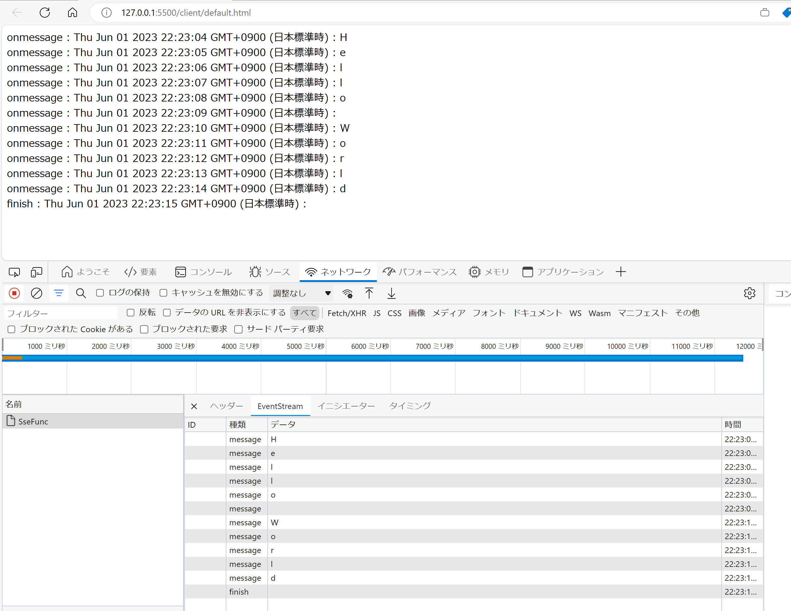

# はじめに

Azure OpenAI Service を触っていると大規模言語モデル : LLM の名に恥じることなく、応答データが非常に大きくなりがちで、かつ生成にも時間がかかります。
一般的な Web API の感覚的には致命的な遅さだと思いますし、この対策として Server-Sent Event を使用した Streaming に対応しているようです。

で、調査していたところ、下記の記事に触発されてしまいまして

- [ChatGPTをぬるぬるにする🐌Server-Sent Eventsの基礎知識](https://zenn.dev/chot/articles/a089c203adad74)

この Server-Sent Event のプロトコルを調べていたら、これ Azure Functions で実装するのも簡単そうだなあと思ったので試してみたところ、
それなりに簡単に出来てしまい、また微妙にハマるポイントもあったので、記録しておこうと思った所存です。
つまり Azure OpenAI は関係ないです。ごめんなさい。

ただ Azure OpenAI の API を直接ユーザーインタフェースから直接呼び出すシナリオっておそらく少ないんじゃないかと思っていまして、
何らかのラッパー API なり API Gateway が介在することになるんじゃないかと考えています。
そうするとユーザービリティ的にはこの Server Sent Event を中継することになるので、ここを勉強しておくのも悪くないなと思った次第です。


# Server-Sent Event とは

Server-Sent Event は名前の通りサーバーからクライアントに向けて、イベントをストリーミングするためのプロトコルです。
ここではざっくり概要のみ紹介します。

## HTTP プロトコルの観点から

HTTP 1.1 で定義されているので、HTTP 1.1 が使える環境であればおおむね利用できそうです。
HTTP として特徴的なのは以下のポイントでしょうか。

- レスポンスデータの形式として `Content-Type: text/event-stream` になる
- レスポンス開始時には総データ量が決まらないため `Content-Length` ヘッダーは付与されない
- そして `Transfer-Encoding: chunked` ヘッダーが付与され、チャンク（塊）の連続で送信されることが示される

リクエスト側は特に既定が無さそうです。
ただいきなり Streaming が始まっても困りますから、`Accept` ヘッダーで受け取れる `Content-Type` を指定すると良さそうですかね。

ちなみに OpenAI の API では Request Body のプロパティに `stream` というプロパティがあるので、これを `true` にすると Streaming になるようです。
アプリケーション的にはこっちの方が分かりやすい。

## 流れるデータ構造の観点から

HTTP としてだけではなくペイロード部分（Reponse Body）においても Server-Sent Event としてのストリームの形式が既定されています。
サーバーサイドからクライアントに向けて送信するイベントデータは、テキストの塊なら何でもよいわけではなく、ちゃんとお作法に従う必要があるわけです。
構造としては極めて簡単で、コロン区切りの名前と値の組み合わせを、改行で区切ったものが１つのイベントになります。
イベントの区切りは2つの改行文字で区切られるとのことです。

```
フィールド名:フィールドの値[改行]
フィールド名:フィールドの値[改行]
フィールド名:フィールドの値[改行]
[改行]
フィールド名:フィールドの値[改行]
フィールド名:フィールドの値[改行]
フィールド名:フィールドの値[改行]
[改行]

以下省略
```

形式だけだとちょっと分かりにくいので、具体例を考えてみます。

```
data: 最もシンプルなメッセージ形式で、 message という名前の既定のイベントとして処理する。この１行が１つのイベントになる[改行]
[改行]

data: {"severity": "normal", "message": "複雑なデータ構造なら JSON で送ると処理しやすいが、必須ではない。" }[改行]
[改行]

event: namedEvent[改行]
data: 名前付きイベントで、この場合は namedEvent という名前のイベントとして処理する。こちらは2行でまとめて１つのイベント[改行]
[改行]
```

## クライアントから利用する方法の観点から

さて、クライアント側では HTTP レスポンスストリームを流れてくる上記のデータを順次読み取っていって、各イベントおよびのメッセージを処理していくことになります。
上記の通りプロトコルとデータフォーマットが決まっているので、ライブラリも用意されています。
ブラウザで受けとるのであれば JavaScript では `EventSource` インタフェースを利用することになります。
例えば上記の Server-Sent Event を処理するなら以下のような記述になります。

```javascript
const eventSource = new EventSource('https://example.com/stream');

// 上記の例で１つめのイベントを処理するハンドラを登録
eventSource.onmessage = (event) => {
  console.log(event.data);
};

// 上記の例で２つめの名前付きのイベントを処理するハンドラを登録
eventSource.addEventListener("namedEvent", (event) => {
  console.log(event.data);
};

// エラー発生時のハンドラ
eventSource.onerror = (event) => {
  console.log(event);
  eventSource.close();
};
```

微妙なハマりポイントとして、接続が切れると自動的に再接続するそうです。
エラーで落ちた場合にも再接続がかかります。この場合は上記のように明示的に `close` することになります。
またサーバー側から送りたいデータが無くなって接続を終了しても、クライアントは再接続をしようとします。
このためデータフォーマットとしてサーバー側から「もう終わりですよ、続きは無いですよ」を明示的に示す必要があるということですね。


もう少し詳細は下記に詳しく紹介されていますので、参考にしてみた下さい。

[サーバー送信イベントの使用](https://developer.mozilla.org/ja/docs/Web/API/Server-sent_events/Using_server-sent_events)


# Server-Sent Event を実装してみる

さて本題の実装方法のご紹介です。

## サーバーサイドの実装

まず Functions での実装方針ですが、その前に普通の HTTP Trigger のテンプレなコードを確認してみましょう。
ここでは応答の内容が単なる `Hello World` という１つの文字列だけですが、この生成に時間がかかるようなら最後の return に至るまでに時間がかかるということで、それは全てクライアント側の待ち時間に反映されます。

```c#
[FunctionName("hoge")]
public static async Task<IActionResult> Run(
    [HttpTrigger(AuthorizationLevel.Function, "get", "post", Route = null)] HttpRequest req,
    ILogger log)
{
    string responseMessage = "Hello World";
    return new OkObjectResult(responseMessage);
}
```

なので、応答する結果が部分的であっても、レスポンスに随時書き込んじゃえばいいわけですね（乱暴）。
ここでは手を抜いて `Hello World` を 1 秒間に 1 文字ずつ返しています。

```c#
[FunctionName("SseFunc")]
public static async Task<IActionResult> Run(
    [HttpTrigger(AuthorizationLevel.Function, "get", "post", Route = null)] HttpRequest req,
    ILogger log)
{
    
    var response = req.HttpContext.Response;
    response.Headers.Add(HeaderNames.ContentType, "text/event-stream");
    response.Headers.Add(HeaderNames.CacheControl, CacheControlHeaderValue.NoCacheString);

    string returnMsg = "Hello World";
    string dataformat = "data: {0}\r\n\r\n";
    for (int i = 0; i < returnMsg.Length; i++)
    {
        await response.WriteAsync(string.Format(dataformat, returnMsg[i]));
        await response.Body.FlushAsync();
        await Task.Delay(1000);
    }

    await response.WriteAsync("event: finish\r\n");
    await response.WriteAsync(string.Format(dataformat, string.Empty));
    await response.Body.FlushAsync();
    return new EmptyResult();
}
```

ポイントとしてはこんなところでしょうか。

- レスポンスヘッダーで明示的に `Content-Type: text/event-stream` に指定
- 同時にキャッシュされても意味が無いのでないように `Cache-Control: no-cache` を指定
- レスポンスは IActionResult のボディとして返すのではなく、HttpContext.Response に直接書き込む
- 書き込む内容は Server-Sent Event のフォーマット（前述のコロン区切りとか改行区切りとか）に従う
- サーバー側でバッファしないでさっさとクライアントに送りつけるために、イベントの終わりで `Flush` する
- 「もうこれ以上まっててもイベントは発生しないよ」を伝えるために名前付きイベント（`finish`）を送信

最後に EmptyResult を返しているのは、これをやってあげないとメソッドが終わった後に「レスポンス返し始めてからヘッダーは変えちゃだめよ」という例外が出てしまわないようにするためです。
この辺りの詳細は下記などが詳しいでしょうか。

- https://stackoverflow.com/questions/72143938/azure-functions-statuscode-cannot-be-set-because-the-response-has-already-start
- https://stackoverflow.com/questions/67301743/how-to-return-stream-of-data-from-azure-function-http


まずは手元で試してみましょう。

```bash
func start

Azure Functions Core Tools
Core Tools Version:       4.0.4915 Commit hash: N/A  (64-bit)
Function Runtime Version: 4.14.0.19631

[2023-06-01T12:16:59.417Z] Found C:\source\sse-funcion\server\sse-funcion.csproj. Using for user secrets file configuration.

Functions:
        hoge: [GET,POST] http://localhost:7071/api/hoge
        SseFunc: [GET,POST] http://localhost:7071/api/SseFunc
```

## とりあえず簡易的に読んでみる

Functions が起動したら curl などから呼んでみるのが手っ取り早いでしょうか。

```bash
curl http://localhost:7071/api/SseFunc --verbose

*   Trying 127.0.0.1:7071...
* Connected to localhost (127.0.0.1) port 7071 (#0)
> GET /api/SseFunc HTTP/1.1
> Host: localhost:7071
> User-Agent: curl/8.0.1
> Accept: */*
> 
< HTTP/1.1 200 OK
< Content-Type: text/event-stream
< Date: Thu, 01 Jun 2023 13:15:31 GMT
< Server: Kestrel
< Cache-Control: no-cache
< Transfer-Encoding: chunked
< 
data: H

data: e

data: l

data: l

data: o

data:  

data: W

data: o

data: r

data: l

data: d

event: finish
data:

* Connection #0 to host localhost left intact
```

分かりにくいですが、実際にコマンドを動かすと 1 文字ずつ表示されていきます。
ただこの時点では Server-Sent Event というより単なるストリーミングですね。

## ブラウザで Server-Sent Event を受信する

ブラウザで受信するには、`EventSource` というインタフェースを使用します。
大したコード量でもないのでべたっと。
既定のメッセージイベントが来たら画面に書き込み、`finish` イベントや `error` 発生時にはイベントソースを閉じるようにしています。

```html
<!DOCTYPE html>
<html lang="en">
<head>
    <meta charset="UTF-8">
    <meta http-equiv="X-UA-Compatible" content="IE=edge">
    <meta name="viewport" content="width=device-width, initial-scale=1.0">
    <title>Document</title>
</head>
<body>
    <input type="button" onclick="btnclick()" value="click">
    
    <script>
        function btnclick() {
            const evtsrc = new EventSource("http://localhost:7071/api/SseFunc");
            evtsrc.onmessage = (event) => {
                document.writeln("onmessage : " + new Date() + " : " + event.data);
                document.writeln("<br>");
            };
            evtsrc.addEventListener("finish", (event) => {
                document.writeln("finish : " + new Date() + " : "+ event.data);
                document.writeln("<br>");
                evtsrc.close();
            });
            evtsrc.onerror = (event) => {
                console.log(event);
                document.writeln("onerror : " + new Date() + " : " + event);
                document.writeln("<br>");
                evtsrc.close();
            };
        }
    </script>
</body>
</html>
```

適当な Web サーバーでホストして開いてボタンクリックすると、おそらく CORS のエラーが出ると思いますので、Functions の local.settings.json で許可してあげてください。
ここでは面倒なので `*` で許可しています。

```json
{
    "IsEncrypted": false,
    "Values": {
        "AzureWebJobsStorage": "UseDevelopmentStorage=true",
        "FUNCTIONS_WORKER_RUNTIME": "dotnet"
    },
    "Host": {
        "LocalHttpPort": 7071,
        "CORS": "*"
    }
}
```

正常に動作すると以下のような形になります。
動きは分かりにくいですが、今回はタイムスタンプも出しているので、1 文字ずつ表示されていく雰囲気は伝わるでしょうか。
curl の場合と違うのは HTTP の生のペイロードは見えず、イベント名やデータをちゃんと処理出来ている点ですね。




# Azure Functions で動かそう

ここまで来たら Functions のコードをビルドして Azure Functions に、クライアント側の HTML は Azure Blob Storage にでもおいていただいて動かしてみましょう。
特に目新しいことはないので詳細は割愛します。

ただ注意点としては `local.settings.json` は Azure Functions にはデプロイされません。
つまりまた CORS のエラーが出てしまいますので、改めて [Azure Functions の設定でドメインを許可](https://learn.microsoft.com/ja-jp/azure/azure-functions/security-concepts?tabs=v4#restrict-cors-access) してあげてください。
この場合のドメインは HTML を配置しているサイドのドメインですね。

# 余談

Azure からクライアントサイドににリアルタイムでデータをプッシュすることが要件ならば、Web PubSub とか SignalR とかがありますので、この記事がそのまま役に立つことは無いんだろうなあと、書いてから気が付いてしまいましたが、せっかくなので公開しておきます。

