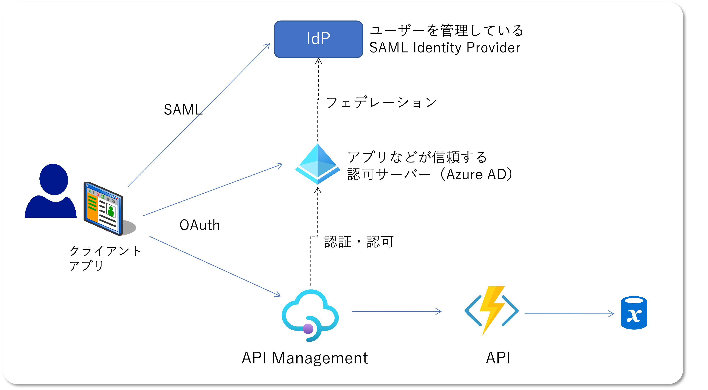

# Web　API　を利用するユーザーを SAML　で認証したい

昨今の Web な世界では認証といえば Open ID Connect で、認可と言えば OAuth 2.0 が主流になっています。
もちろん Azure の各種サービスも対応しており、
[Azure Active Directory はこれらのプロトコルの認証・認可サーバーとして](https://docs.microsoft.com/ja-jp/azure/active-directory/develop/active-directory-v2-protocols)利用できますし、
[Azure App Service の EasyAuth でユーザー認証](https://docs.microsoft.com/ja-jp/azure/app-service/overview-authentication-authorization)したり、
[API Management の validate-jwt ポリシー等を駆使して認可](https://docs.microsoft.com/ja-jp/azure/api-management/policies/authorize-request-based-on-jwt-claims)することもできます。

ですが、従来エンタープライズの世界ではユーザー認証といえば SAML だったこともあり、現在でも往々にしてユーザー認証は SAML を利用したい需要が一定数あると思います。
ところが前述の App Service は SAML プロトコルに対応していません。
もちろんアプリケーションに SAML が喋れる認証モジュールやミドルウェアを組み込んでしまえば良いので、あえて App Service などのプラットフォーム機能に頼る必要はな訳ですが、API Management のようなサービスではそういった対応ができません。
また、アプリによって認証プロトコルを使い分けたり、複数の Identity Provider を使い分けたりとなると、割とカオスな世界が待っている予感がします。

そこで [Azure Active Directory External Identities](https://docs.microsoft.com/ja-jp/azure/active-directory/external-identities/external-identities-overview) の出番です。
これを利用すると、アプリケーションからは Azure AD と Open ID Connect や OAuth 2.0 を使用した認証・認可だけ構成しておけばよく、Azure AD からはフェデレーションした外部 IdP に認証を任せることが可能です。
前置きが長くなりましたが、こういう↓ことがしたいのです。　

# [補足] Azure AD B2B コラボレーションについて

最も一般的な Azure AD 認証といえば、Azure AD の当該テナントに登録されたローカルユーザー、あるいは、そのテナントと接続されたオンプレミス Active Directory のユーザー認証です。
つまりその Azure AD テナントは認可だけではなくユーザー認証を行う IdP としての役割を持っています。

ただ認可サーバーとなる Azure AD のテナントが、別の Azure AD テナントに所属するユーザーに対して認可を行うことは従来からも可能でした。
これが [B2B コラボレーション](https://docs.microsoft.com/ja-jp/azure/active-directory/external-identities/what-is-b2b)
と呼ばれる機能になります。
これは認可サーバーとなるテナントに対して、外部のテナントに登録されているユーザーを「ゲストとして」登録することで、ローカルユーザーと同じように認可することができるわけです。

例えば、とあるテナント（contoso.com）に対して、外部の Azure AD テナント（fabrikam.com）のユーザー（bbbb@fabrikam.com）をゲストとして招待しておきます。
この状況であるアプリケーションが Azure AD テナント（contoso.com）による認証を要求したとします。
通常であれば当該テナントに所属するユーザー（aaaa@contoso.com）としてサインインするわけですが、
ここで外部テナントのユーザー ID（bbbb@fabrikam.com）を入力すると、fabrikam.com 側の認証画面にさらに転送され、そちらでユーザー認証を行うことができます。
外部テナント側で認証が完了すると元のテナントに戻され、contoso.com は fabrikam.com の認証結果を信頼し、その情報をもとに認可を行うことになります。
この仕組みによって、fabrikam.com のユーザーは普段から使っている自身のユーザー ID （bbbb@fabrikam.com）を使用して contoso.com テナントで管理される API などの各種リソースへのアクセスができるわけです。

この外部テナントは従来 Azure AD である必要があった、つまり fabrikam.com が Azure AD テナントのドメインとして登録されている必要があったわけですが、これが SAML IdP のドメインだと Azure AD にはわかりません。
当然ゲストとしての招待もできません。
ところが External Identities を使用してこの SAML IdP　のドメインを登録しておくことで、その SAML IdP に所属するユーザーを招待、リソースアクセスさせてあげることが出来るわけです。

つまり、App Service や API Management の標準機能を使用しつつ、SAML 認証を実現することが出来るわけです。

# まずは SAML IdP を構築する

こちらに関しては [Simple SAML php による IdP の構築方法](../simplesamlphp-on-appservice/) を別途記事にしておりますので、そちらをご参照ください。
以降ではこの SAML IdP を使用します。
もちろん SAML の実装によって手順は大きく異なってくると思いますが、全ての SAML 実装を網羅していくのは現実的ではないので、サンプルとしてご参照いただければと思います。

