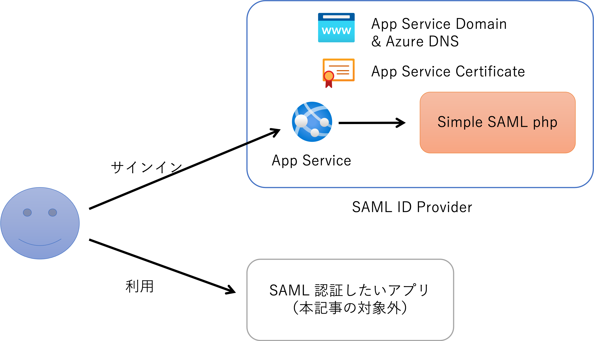
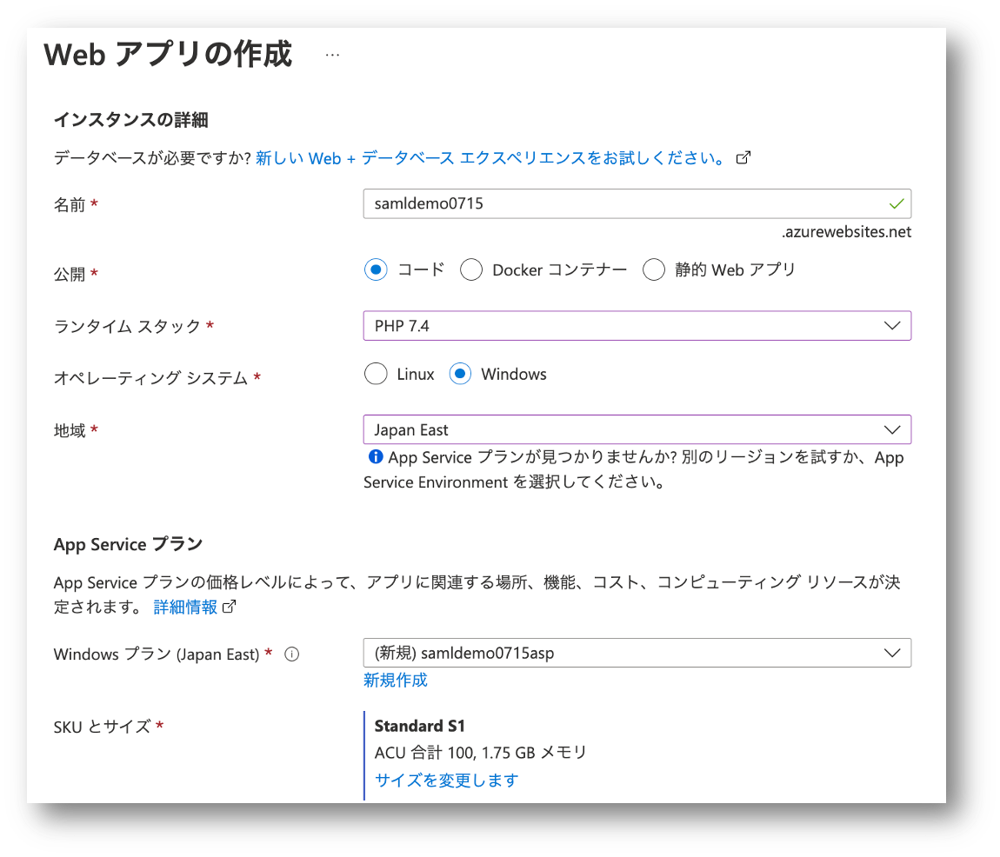
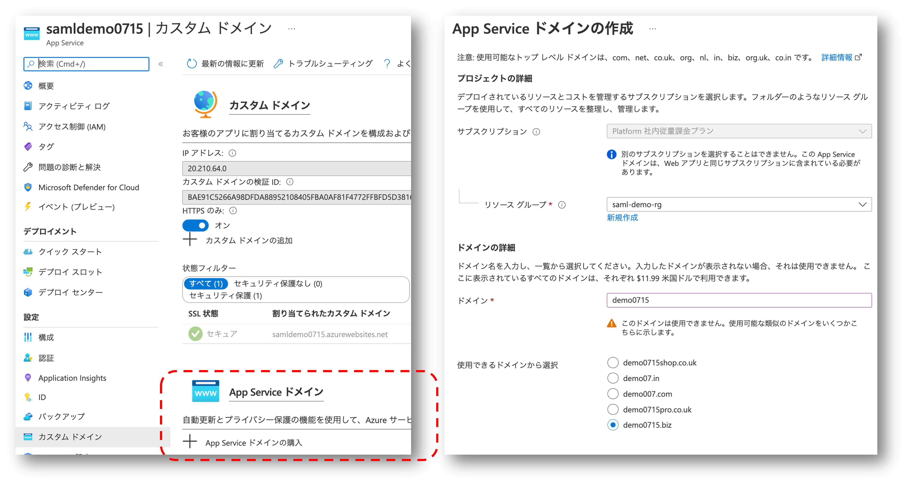
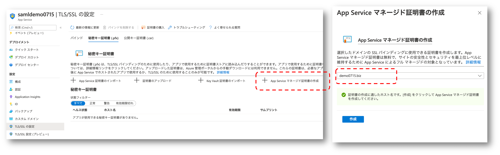
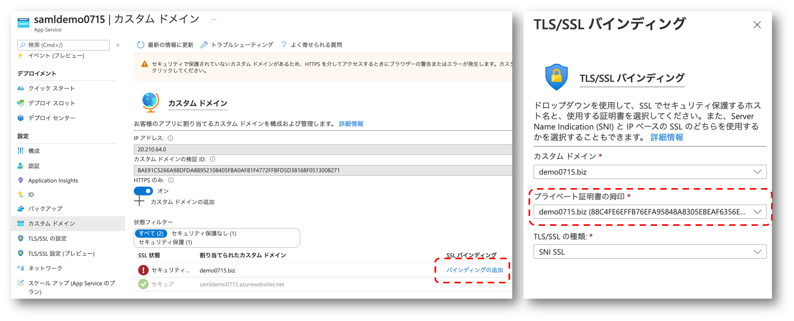
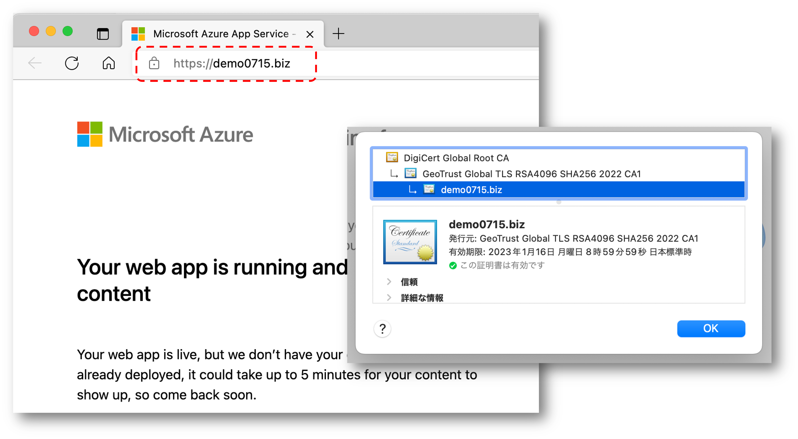
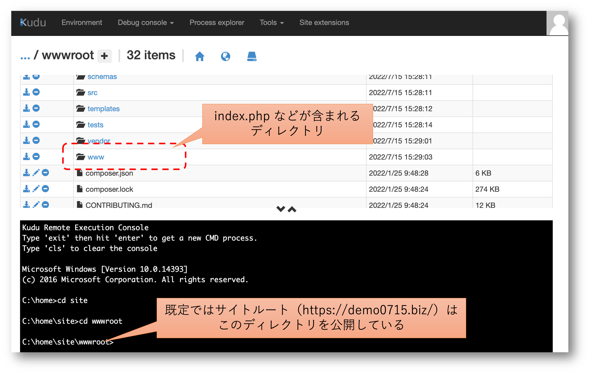
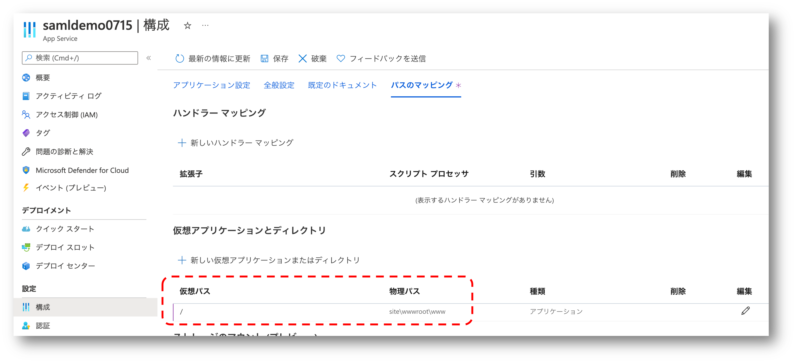
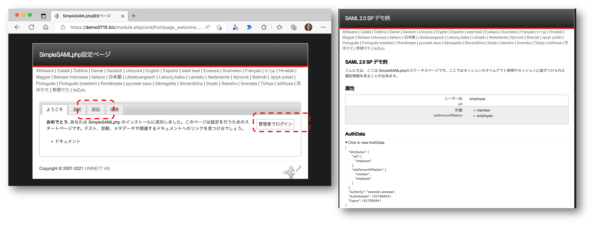

# はじめに

諸般の事情から SAML IdP を構築する必要があり、色々調べた結果 [Simple SAML php](https://simplesamlphp.org/) を使用することにしました。
PHP アプリケーションなので Azure 仮想マシン上に建ててもよかったのですが、SAML IdP として構築する以上、独自ドメインを割り当てた HTTPS を喋れる Web サーバーである必要があります。
だったら Azure App Service 使えば PHP も入ってるり楽できるんじゃないか？と思いついてしまったら出来てしまったので、その方法をご紹介したいと思います。



# Simple SAML php の動作プラットフォームとなる Azure App Service を作成する

Simple SAML php の[インストールマニュアル](https://simplesamlphp.org/docs/stable/simplesamlphp-install.html) を確認すると、
Nginx や Apache の手順を見ると、要は PHP で動く Web アプリの手前に HTTPS が喋れる Web サーバーがあれば良さそうです。
ドメインやその TLS 証明書が必要になるわけですが、App Service ならちょっと構成すれば出来上がりそうですね。
細かい手順は [Docs のこの辺り](https://docs.microsoft.com/ja-jp/azure/app-service/manage-custom-dns-buy-domain)を参照いただくとして、
ここではポイントだけ紹介していきます。



- 後述のパスマッピングを使うため Windows 版の App Service を使用する
- ランタイムスタックは PHP 7.4 を選択する（8.0 は Linux しかないため）
- カスタムドメインと SSL の構成が可能な Basic 以上のプランを選択

# 作成した App　Service　にカスタムドメインを割り当てて TLS　を有効にする

検証用に使えるこだわりのドメインをお持ちの方は飛ばしてもいいですが、ここではドメインを新規に購入します。
[App Serivce ドメイン](https://docs.microsoft.com/ja-jp/azure/app-service/manage-custom-dns-buy-domain)を購入してしまうのが手っ取り早いでしょう。
作成が完了すると App Service ドメインだけでなく、そのドメインを管理するための [DNS ゾーン](https://docs.microsoft.com/ja-jp/azure/dns/dns-overview) も出来上がりますので、ドメイン周りの色々な設定を試すこともできます、便利。



App Service にカスタムドメインが割り当てられたら HTTPS で通信するための証明書が必要です。
こだわりの証明機関がある場合はそちらで発行しても良いですが、ここでは 
[App Service マネージド証明書](https://docs.microsoft.com/ja-jp/azure/app-service/configure-ssl-certificate?tabs=apex%2Cportal#create-a-free-managed-certificate)
を作成して使うことにします、タダですし。



証明書が出来上がったら App Service に既に割り当ててあるカスタムドメインとバインドしてあげてください。



バインドできたら Web ブラウザから作成したカスタムドメインにアクセスして、HTTPS でアクセスできてることを確認しておきます。
まだアプリをデプロイしてないので初期ページが表示されるはずです。



# Simple SAML php の準備

App Service が出来上がったら、デプロイするアプリケーションを準備していきます。
詳細は [公式ドキュメント](https://simplesamlphp.org/docs/stable/simplesamlphp-install.html#configuring-php) を参照してください。
ここではかいつまんで。

## Simple SAML php のダウンロードと構成

まずはパッケージをダウンロードして展開します。
上記のサイトからは最新版が取れますが、[Github のリポジトリ](https://github.com/simplesamlphp/simplesamlphp) に行くと過去のバージョンを落としてくることも可能です。

```powershell
$NAME = 'simplesamlphp'
$VERSION = '1.19.5'
$DOWNLOAD_URL = "https://github.com/simplesamlphp/simplesamlphp/releases/download/v${VERSION}/simplesamlphp-${VERSION}.tar.gz"

Invoke-WebRequest -Uri $SIMPLE_SAML_PHP_DOWNLOAD -OutFile "${NAME}.tar.gz" 
mkdir ${NAME}
tar -xzf "${NAME}.tar.gz" -C ${NAME} --strip-components 1
```

次に展開した中身に含まれる構成ファイル（`config/config.php`）を編集していきます。
（以下は抜粋）

```php
$config = [

   /* baseurlpath を App Service に割り当てたカスタムドメインの URL に合わせます */
   'baseurlpath' => 'https://demo0715.biz/',

   /* 管理者パスワードを設定します */
   'auth.adminpassword' => 'your-password-or-password-hath',

   /* Secret Salt を設定します */
   'secretsalt' => 'your-own-secret-salt',

   /* Time Zone を指定します */
   'timezone' => 'Asia/Tokyo',
]
```

## Simple SAML php を Identity　Provider　として構成する

次に Identity Provider としての設定をしていきます。
詳細は[公式ドキュメント](https://simplesamlphp.org/docs/stable/simplesamlphp-idp.html#configuring-the-idp)を参照してください。
ここではかいつまんで。

まずは引き続き構成ファイル（config/config.php）を編集していきます。

```php
$config = [
   /* Identity Provider としての機能を有効にします */
   'enable.saml20-idp' => true,

   /* exampleauth モジュールを有効にします */
   'module.enable' => [
      'exampleauth' => true,
      'core' => true,
      'saml' => true
   ],
]
```

次に認証ソースの構成ファイル（`config/authsouces.php`）を修正していきます。
（以下は抜粋）

```php
$config = [
   /* example-userpass を有効化（既定ではコメントアウトされていたものを解除しただけ） */
   'example-userpass' => [

      'student:studentpass' => [
         'uid' => ['test'],
         'eduPersonAffiliation' => ['member', 'student'],
      ],
      'employee:employeepass' => [
         'uid' => ['employee'],
         'eduPersonAffiliation' => ['member', 'employee'],
      ],
   ],
]
```

SAML アサーションに署名するための証明書を作成して `cert` ディレクトリに保存しておきます。

```bash
openssl req -newkey rsa:3072 -new -x509 -days 3652 -nodes -out cert/example.org.crt -keyout cert/example.org.pem
```

生成した証明書ファイルの名前を `metadata/saml20-idp-hosted.php` に記載、NameFormat属性も指定します。

```php
$metadata['__DYNAMIC:1__'] = [
   'host' => '__DEFAULT__',

   /* cert ディレクトリに保存したファイル名を指定 */
   'privatekey' => 'example.org.pem',
   'certificate' => 'example.org.crt',

   'auth' => 'example-userpass',

   'authproc' => [
      100 => ['class' => 'core:AttributeMap', 'name2oid'],
   ],

];
```

## ログ出力ディレクトリ

Simple SAML php が出力するログファイルは `log` ディレクトリに出力されるのですが、既定では空の状態です。
この後の手順で App Service にデプロイすると空のディレクトリが消えてしまうため、ダミーファイルを生成しておきます。

```powershell
echo hoge > dummy.log
```

# Simple SAML php を App Service　にデプロイする

出来上がったコンテンツを Azure App Service にデプロイします。

```powershell
$SUBSCRIPTION = 'db56efb3-bda6-4fd8-af0e-7841585fe607'
$RG = 'saml-demo-rg'
$WEBAPP = 'samldemo0715'

az login
# パッケージ（tar.gz）を展開したディレクトリで実行する
az webapp up --subscription $SUBSCRIPTION -n $WEBAPP -g $RG --os-type windows --runtime "PHP:7.4"
```

`az webapp up` を実行したディレクトリのコンテンツはそのまま、App Service の `C:\home\site\wwwroot` にデプロイされるのですが
PHP で作られたアプリケーションは `www` ディレクトリに格納されています。
Kudu で確認すると以下のようになっています。



`index.php` などが含まれる `www` ディレクトリが App Service のサイトルート `/` でホストされるように、物理パスへのマッピングを既定の `\site\wwwroot` から `\site\wwwroot\www` に変更します。




# SAML 認証の動作確認

アプリのデプロイが完了したので動作確認です。
割り当てたカスタムドメイン名を使用してブラウザにアクセスすると、Simple SAML php の画面が表示されます。
`config/config.php` で設定した管理者ユーザーとして、あるいは `config/authsources.php` で設定したユーザーとしてサインインできることを確認してください。



これで SAML 認証をする Identity Provider としての準備が完了しました。
アプリケーション（Service Provider）が SAML 認証するには、さらに追加の構成が必要になってきますが、それは別記事でご紹介したいと思います。

