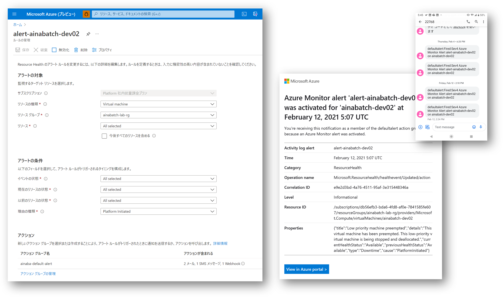

## はじめに

最近はちょっとした検証に利用する仮想マシンはなるべく
[スポット VM ](https://docs.microsoft.com/ja-jp/azure/virtual-machine-scale-sets/use-spot) 
を使うようにしているんですが、
最近ついに（？）リアルタイムで強制排除される場面に遭遇できたので記録を残してみます。
いきなりリモートデスクトップ接続が切断されたようにしか見えなかったので、おっとこれは障害か？！と慌ててみたのですが、調査してみればちゃんと記録が残っているわけですね。
スポット VM を使っていたこと自体を忘れていたとも言います。
というわけでスポット VM が正しく仕様通りに排除されたのか（あるいは障害なのか）を確認するポイントを整理してみました。
まあ障害だったとしても SLA のないサービスなのでどうしようも無いといえば無いのですが。

## まずはリソース正常性を確認しよう

Azure リソースが正常に動いていないな、となればまず確認すべきは
[Resource Health](https://docs.microsoft.com/ja-jp/azure/service-health/resource-health-overview)
ですよね。
実際私の作業マシンの Resource Health を覗いてみれば下記の記録が残っていました。
ここで **preempted** と出ているように、他から割り込みをうけて強制的に召し上げになっているのがわかりますね。
私は排除ポリシーを削除ではなく割当解除にしていたので、後で再起動して事なきを得ました。


## アクティビティログでも確認しよう

Resource Health が出ているので同じ内容が
[アクティビティログ](https://docs.microsoft.com/ja-jp/azure/azure-monitor/platform/activity-log)
でも確認できます。
複数のスポット VM を使っていて横断的に見たい場合はこちらの方が便利でしょうか。
 
 

中身の JSON を見ていくと、カテゴリが `ResourceHealth` 、リソース種別が `MICROSOFT.COMPUTE/VIRTUALMACHINES` 、プロパティ種別が `Downtime` あたりを条件にしてやればクエリなり通知なりが仕掛けられそうですね。

```json
{
    "channels": "Admin, Operation",
    "correlationId": "2d4e74bc-1aaf-4190-97e7-f53bb1baeff7",
    "description": "",
    "eventDataId": "afec3347-9ac5-49f5-adc1-3f93c0a022ca",
    "eventName": {
        "value": "",
        "localizedValue": ""
    },
    "category": {
        "value": "ResourceHealth",
        "localizedValue": "リソース正常性"
    },
    "eventTimestamp": "2021-01-27T01:44:41.008Z",
    "id": "/subscriptions/{subscription-guid}/resourceGroups/{resource-group}/providers/Microsoft.Compute/virtualMachines/{vmname}/events/afec3347-9ac5-49f5-adc1-3f93c0a022ca/ticks/637473086810080000",
    "level": "Critical",
    "operationId": "",
    "operationName": {
        "value": "Microsoft.Resourcehealth/healthevent/Activated/action",
        "localizedValue": "Health Event Activated"
    },
    "resourceGroupName": "{resource-group}",
    "resourceProviderName": {
        "value": "Microsoft.Resourcehealth/healthevent/action",
        "localizedValue": "Microsoft.Resourcehealth/healthevent/action"
    },
    "resourceType": {
        "value": "MICROSOFT.COMPUTE/VIRTUALMACHINES",
        "localizedValue": "MICROSOFT.COMPUTE/VIRTUALMACHINES"
    },
    "resourceId": "/subscriptions/{subscription-guid}/resourceGroups/{resource-group}/providers/Microsoft.Compute/virtualMachines/{vmname}",
    "status": {
        "value": "Active",
        "localizedValue": "アクティブ"
    },
    "subStatus": {
        "value": "",
        "localizedValue": ""
    },
    "submissionTimestamp": "2021-01-27T01:47:46.3868819Z",
    "subscriptionId": "{subscription-guid}",
    "tenantId": "",
    "properties": {
        "title": "Low priority machine preempted",
        "details": null,
        "currentHealthStatus": "Unavailable",
        "previousHealthStatus": "Available",
        "type": "Downtime",
        "cause": "PlatformInitiated"
    },
    "relatedEvents": []
}
```

## Azure Monitor Log (Log Analytics)で分析

さて後日分析するとなると、アクティビティログを Azure Portal でそのまま見るとちょっと調べづらいので、
[診断設定をして Log Analytics ワークスペースに送信](https://docs.microsoft.com/ja-jp/azure/azure-monitor/essentials/activity-log#send-to-log-analytics-workspace)
しておきます。

で、何度か強制排除されたころに分析してみます。
クエリは以下のようになるでしょうか。

- ここでは常時起動している仮想マシンじゃないのでクエリ期間を長くとっています。
- キーワードは `preempted` が良さそうなので全てのログから `search` していきましょう。
- 全フィールドの中から検索すると遅いので本当はもう少しちゃんと条件したほうが良いのですがとりあえず。
- 大本のイベントデータ部分がネストしたJSON文字列に入っているのでちょっとややこしい構造になってしまっています。

```kusto
AzureActivity
| where TimeGenerated > ago(90d)
| search 'preempted'
| order by TimeGenerated asc 
| project Level, prop=Properties_d, evt=parse_json(tostring(Properties_d.eventProperties))
| project prop['eventSubmissionTimestamp'], Level, prop[resourceGroup], prop['resource'], evt['title'], evt['details'], evt['type'], evt['cause']
```

というわけで使っているときに **たまたま** 運悪く割り込まれた時だけになるので件数は少ないのですが、結果は以下のようになりました。

|"prop_eventSubmissionTimestamp"|Level|"prop_resource"|"evt_title"|"evt_details"|"evt_type"|"evt_cause"|
|:--|:--|:--|:--|:--|:--|:--|
|"2021-02-01T03:00:51.5920000Z"|Information|"ainabatch-dev02"|"Low priority machine preempted"|"This virtual machine has been preempted. This low-priority virtual machine is being stopped and deallocated."|Downtime|PlatformInitiated|
|"2021-02-01T03:00:57.0400000Z"|Critical|"ainabatch-dev02"|"Low priority machine preempted"||Downtime|PlatformInitiated|
|"2021-02-04T09:21:52.7280000Z"|Information|"ainabatch-dev02"|"Low priority machine preempted"|"This virtual machine has been preempted. This low-priority virtual machine is being stopped and deallocated."|Downtime|PlatformInitiated|
|"2021-02-04T09:21:54.4750000Z"|Critical|"ainabatch-dev02"|"Low priority machine preempted"||Downtime|PlatformInitiated|
|"2021-02-12T05:07:11.0100000Z"|Information|"ainabatch-dev02"|"Low priority machine preempted"|"This virtual machine has been preempted. This low-priority virtual machine is being stopped and deallocated."|Downtime|PlatformInitiated|
|"2021-02-12T05:07:32.1490000Z"|Critical|"ainabatch-dev02"|"Low priority machine preempted"||Downtime|PlatformInitiated|
|"2021-02-18T03:50:49.5920000Z"|Information|"ainabatch-dev02"|"Low priority machine preempted"|"This virtual machine has been preempted. This low-priority virtual machine is being stopped and deallocated."|Downtime|PlatformInitiated|
|"2021-02-18T03:50:52.8690000Z"|Critical|"ainabatch-dev02"|"Low priority machine preempted"||Downtime|PlatformInitiated|

Information Level で情報が入った直後の数秒後に Critical Level のログが記録されており、もう排除されてしまっています。
まあ Spot VM ってそういうものなので、これはこういうものとして諦めましょう。

## Alert も仕掛けてみる

アラートルールも仕掛けてみました。
SMS の方はそっけないですが、メールの方は必要な情報がほぼ記載されていそうです。




## Next Action

In-VM Metadata Service でもイベント検知はできるのですが、それでもやはり猶予は 30 秒なので、まあ大したことは出来なさそうですね。
- [Azure Metadata Service: Windows VM のスケジュールされたイベント](https://docs.microsoft.com/ja-jp/azure/virtual-machines/windows/scheduled-events)

