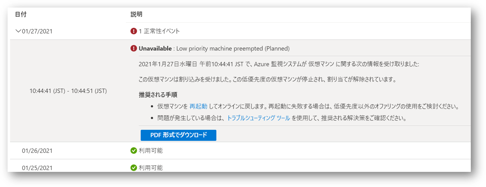
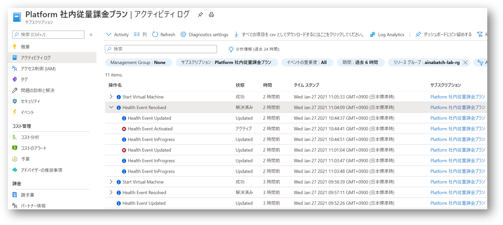

## はじめに

最近はちょっとした検証に利用する仮想マシンはなるべく
[スポット VM ](https://docs.microsoft.com/ja-jp/azure/virtual-machine-scale-sets/use-spot) 
を使うようにしているんですが、
最近ついに（？）リアルタイムで強制排除される場面に遭遇できたので記録を残してみます。
いきなりリモートデスクトップ接続が切断されたようにしか見えなかったので、おっとこれは障害か？！と慌ててみたのですが、調査してみればちゃんと記録が残っているわけですね。
スポット VM を使っていたこと自体を忘れていたとも言います。
というわけでスポット VM が正しく仕様通りに排除されたのか（あるいは障害なのか）を確認するポイントを整理してみました。
まあ障害だったとしても SLA のないサービスなのでどうしようも無いといえば無いのですが。

## まずはリソース正常性を確認しよう

Azure リソースが正常に動いていないな、となればまず確認すべきは
[Resource Health](https://docs.microsoft.com/ja-jp/azure/service-health/resource-health-overview)
ですよね。
実際私の作業マシンの Resource Health を覗いてみれば下記の記録が残っていました。
ここで **preempted** と出ているように、他から割り込みをうけて強制的に召し上げになっているのがわかりますね。
私は排除ポリシーを削除ではなく割当解除にしていたので、後で再起動して事なきを得ました。




## アクティビティログでも確認しよう

Resource Health が出ているので同じ内容が
[アクティビティログ](https://docs.microsoft.com/ja-jp/azure/azure-monitor/platform/activity-log)
でも確認できます。
複数のスポット VM を使っていて横断的に見たい場合はこちらの方が便利でしょうか。
 
 

中身の JSON を見ていくと、カテゴリが `ResourceHealth` 、リソース種別が `MICROSOFT.COMPUTE/VIRTUALMACHINES` 、プロパティ種別が `Downtime` あたりを条件にしてやればクエリなり通知なりが仕掛けられそうですね。

```json
{
    "channels": "Admin, Operation",
    "correlationId": "2d4e74bc-1aaf-4190-97e7-f53bb1baeff7",
    "description": "",
    "eventDataId": "afec3347-9ac5-49f5-adc1-3f93c0a022ca",
    "eventName": {
        "value": "",
        "localizedValue": ""
    },
    "category": {
        "value": "ResourceHealth",
        "localizedValue": "リソース正常性"
    },
    "eventTimestamp": "2021-01-27T01:44:41.008Z",
    "id": "/subscriptions/{subscription-guid}/resourceGroups/{resource-group}/providers/Microsoft.Compute/virtualMachines/{vmname}/events/afec3347-9ac5-49f5-adc1-3f93c0a022ca/ticks/637473086810080000",
    "level": "Critical",
    "operationId": "",
    "operationName": {
        "value": "Microsoft.Resourcehealth/healthevent/Activated/action",
        "localizedValue": "Health Event Activated"
    },
    "resourceGroupName": "{resource-group}",
    "resourceProviderName": {
        "value": "Microsoft.Resourcehealth/healthevent/action",
        "localizedValue": "Microsoft.Resourcehealth/healthevent/action"
    },
    "resourceType": {
        "value": "MICROSOFT.COMPUTE/VIRTUALMACHINES",
        "localizedValue": "MICROSOFT.COMPUTE/VIRTUALMACHINES"
    },
    "resourceId": "/subscriptions/{subscription-guid}/resourceGroups/{resource-group}/providers/Microsoft.Compute/virtualMachines/{vmname}",
    "status": {
        "value": "Active",
        "localizedValue": "アクティブ"
    },
    "subStatus": {
        "value": "",
        "localizedValue": ""
    },
    "submissionTimestamp": "2021-01-27T01:47:46.3868819Z",
    "subscriptionId": "{subscription-guid}",
    "tenantId": "",
    "properties": {
        "title": "Low priority machine preempted",
        "details": null,
        "currentHealthStatus": "Unavailable",
        "previousHealthStatus": "Available",
        "type": "Downtime",
        "cause": "PlatformInitiated"
    },
    "relatedEvents": []
}
```

## Next Action

今回は通知も何も仕掛けてない状態っだったので、ログを確認することくらいしか出来なかったですが、
ログの内容が分かってきたので通知をだすなりもう少し仕掛けが出来そうです。
狙ってやれないので次の機会で更新してみますね。
