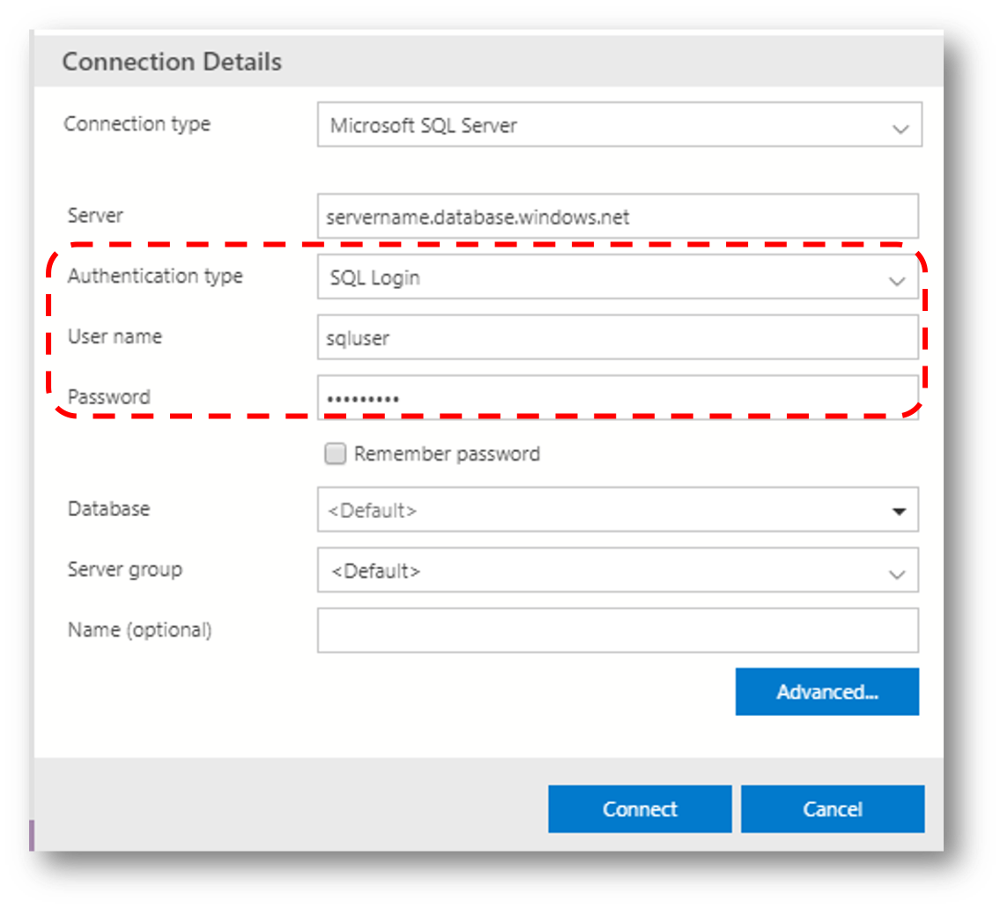

## はじめに

本記事は .NET Core なアプリケーションから SQL 認証ではなく 
[Azure Active Directory (Azure AD) の ID を使用して Azure SQL Database（SQL DB） にアクセスする](https://docs.microsoft.com/ja-jp/azure/sql-database/sql-database-aad-authentication)
方法を個人的に整理したものです。
[こちら](https://docs.microsoft.com/en-us/azure/sql-database/sql-database-aad-authentication-configure)
のドキュメントなども参考になります。

## Azure SQL Database の作成

まず初めに
[こちらの手順](https://docs.microsoft.com/ja-jp/azure/sql-database/sql-database-single-database-get-started?tabs=azure-portal)
などにしたがって単一データベースの SQL DB を作成します。
この時点でも SQL 認証が有効になっていますので、SQL Server Management Studio や 
[Azure Data Studio](https://docs.microsoft.com/ja-jp/sql/azure-data-studio/what-is?view=azuresqldb-current) 
などを使用してアクセスすることができます。



もちろん .NET Core を使用したアプリケーションでも SQL 認証を使用したアクセスは可能です。
`dotnet` コマンドを使用してコンソールアプリ用のプロジェクトを作成し、SQL Database にアクセスするためのクラスライブラリとして
[Microsoft.Data.SqlClient](https://www.nuget.org/packages/Microsoft.Data.SqlClient/)
を追加します。

```bash
dotnet new console
dotnet add package Microsoft.Data.SqlClient
```

C# の実装は以下のようになります。

```csharp
using Microsoft.Data.SqlCient

public SqlConnection CreateSqlAuthConnection()
{
    var constr = "Server=tcp:servername.database.windows.net,1433;Initial Catalog=dbname;"
               + "User ID=sqluserName;Password=yourPassword;";
    return new SqlConnection(constr);
}
```

しかし、以降ではこの認証情報および接続方式は使用せず、Azure AD で管理されるセキュリティプリンシパルを使用してアクセスして行きたいと思います。

## 管理ユーザーの作成と登録

まずは SQL DB のユーザー管理に使用する Azure AD ユーザーを登録します。
もし適当なユーザーが存在しない場合には
[こちらの手順](https://docs.microsoft.com/ja-jp/azure/active-directory/fundamentals/add-users-azure-active-directory)
にしたがってユーザーを作成します。
このユーザーは SQL DB を作成したサブスクリプションが信頼する AAD テナントと同一テナント上のユーザーとして作成してください。

例えば以下のようなユーザーを作成したとします。

|項目|値|
|---|---|
|ユーザー名|sqladmin@tenantname.onmicrosoft.com|
|パスワード|P@ssw0rd!|

このユーザーに対して SQL DB の管理権限を付与します。


まずは Azure Data Studio を使用して、SQL DB に対して Azure AD 認証でアクセスしてみましょう。
接続情報画面で認証の種類として Azure Active Directory を選択します。
接続に使用するアカウント選択のドロップダウンで `Add an account` を追加するとブラウザが起動して認証画面が表示されますので、
先ほど SQL DB の管理者として登録した Azure AD ユーザーでサインインします。
データベースには（master ではなく）SQL DB 作成時のデータベースを選択してください。


接続できたら適当な SQL を投げてみましょう。
例えば以下のクエリで現在接続しているユーザーの名前を確認できます。


```sql
select suser_name()
```

以降ではこの管理ユーザーを使用して、ユーザーやアプリケーションの登録をしていきますので、この画面はこのまま維持しておいてください。

## Azure AD ユーザーによる SQL Database へのアクセス

先ほど登録した管理ユーザでは権限が強すぎますので、実際の保守・運用に使用するユーザーは別途登録すると良いでしょう。
例えば先ほどと同様の手順で以下のようなユーザーを Azure AD に作成したとします。

|項目|値|
|---|---|
|ユーザー名|sqlapp@tenantname.onmicrosoft.com|
|パスワード|P@ssw0rd!|

この Azure AD ユーザーを SQL DB のユーザーとして登録し、かつ、データベースロールのメンバーに追加することで、実際のアクセスが可能になります。
先ほどの管理ユーザーの Azure Data Studio の画面で以下のクエリを実行します。

```sql
CREATE USER [sqlapp@tenantname.onmicrosoft.com] FROM EXTERNAL PROVIDER;
ALTER ROLE db_owner ADD MEMBER [sqlapp@tenantname.onmicrosoft.com];
```

ポイントは以下のようになります。
- CREATE USER で Azure AD 上のユーザー名を指定する（その際に四角括弧で特殊文字をエスケープ）
- FROM EXTERNAL PROVIDER 句を追加して、外部で管理されているユーザー（この場合 Azure AD）であることを明示する
- 作成したユーザーを必要な権限を持つデータベースロール（ここでは db_owner）のメンバーとして追加する

これで接続できるようになりましたので、Azure Data Studio で接続してみてください。
接続方法は先の管理者ユーザーの場合と同様です。

このユーザーを使用して C# アプリからアクセスするための実装は以下のようになります。
接続文字列で認証種別 `Authentication` として `Active Directory Password` を使用しています。 

```csharp
using Microsoft.Data.SqlClient;

public SqlConnection CreateAadUserConnection()
{
    var constr = "Server=tcp:servername.database.windows.net,1433;Initial Catalog=dbname;"
               + "Authentication=Active Directory Password;User ID=sqlapp@tenantname.onmicrosoft.com;Password=P@ssw0rd!";
    return new SqlConnection(constr);
}
```

## Azure AD アプリケーションによる SQL Database へのアクセス

前述の方法では GUI はともかくとして、アプリケーションが誰かのユーザー ID を使用して SQL DB にアクセスし続けることになりますので、
パスワードが変更された場合は多要素認証が有効になっている場合には不便でしょう。
せっかく Azure AD 認証を使用しているのでアプリケーションようのアクセストークンを使用したいところです。

### サービスプリンシパルとキーを使用したトークンの取得とアクセス

まずは
[こちらの手順](https://docs.microsoft.com/ja-jp/azure/active-directory/develop/howto-create-service-principal-portal)
にしたがって Azure AD にアプリケーションを登録します。
ただこの手順は本記事で扱う内容に対して若干内容が多く不要な部分が多いので、以下の項目 **だけ** 実施すれば十分です。

- `Azure Active Directory アプリケーションを作成する`を実施しますが、Redirect URL の登録は不要です
- `サインインするための値を取得する` でディレクトリ ID とアプリケーション ID を控える
- `新しいアプリケーション シークレットを作成する` で作成したシークレットを控える

|項目|値|
|---|---|
|クライアント名 |sqlapp_sp|
|アプリケーション ID|guid-of-your-application-id|
|ディレクトリ ID|guid-of-your-azuread-directory-id|
|クライアントシークレット|key-secret-generated|


このサービスプリンシパルの情報を用いると Azure AD で認証を受けることはできますが、このままでは SQL Database にアクセスすることはできません。
先ほどの管理ユーザーの Azure Data Studio の画面で以下のクエリを実行してユーザーの追加およびデータベースロールへの追加を行います。

```sql
CREATE USER [sqlapp_sp] FROM EXTERNAL PROVIDER;
ALTER ROLE db_owner ADD MEMBER [sqlapp_sp];
```

アプリケーションコードからはサービスプリンシパルの情報を使用してアクセストークンを取得し、そのトークンを SqlConnection オブジェクトにセットすれば接続可能です。
トークンの取得には 
[MSAL.NET](https://www.nuget.org/packages/Microsoft.Identity.Client/) 
ライブラリを使用しますので、以下のコマンドでパッケージ参照を追加してください。

```bash
dotnet add package Microsoft.Identity.Client
```

実際の C# コードは以下のようになります。
アクセストークンの取得方法は
[従来の ADAL.NET と現在の MSAL.NET では若干異なります](https://docs.microsoft.com/en-us/azure/active-directory/develop/msal-net-migration)
のでご注意ください。
SqlConnection オブジェクトを作成する際に、前述のコードと大きく異なるのは、接続文字列からユーザー ID やパスワードがバッサリなくなっており、代わりにアクセストークンを設定するようになります。

```csharp
using Microsoft.Data.SqlClient;
using Microsoft.Identity.Client;

private static SqlConnection GetAadSpTokenConnection()
{
    // Getting Access Token
    var directoryid = "guid-of-your-azuread-directory-id";
    var applicatonid = "guid-of-your-application-id";
    var clientkey = "key-secret-generated";
    var scopes = new[] { "https://database.windows.net/.default" };
    var app = ConfidentialClientApplicationBuilder
                .Create(applicationid)
                .WithAuthority(new Uri($"https://login.microsoftonline.com/{directoryid}"))
                .WithClientSecret(clientkey)
                .Build();
    var authresult = app.AcquireTokenForClient(scopes).ExecuteAsync().Result;

    // Creating SqlConnection
    var constr = @"Server=tcp:ainaba-aadauth-sqlsvr.database.windows.net,1433;Initial Catalog=ainaba-aadauth-sqldb;";
    var connection = new SqlConnection(constr);
    connection.AccessToken = authresult.AccessToken;

    return connection;
}
```

### システムアサイン管理 ID を使用したトークンの取得とアクセス

要はアクセストークンが取得できれば良いわけですので、このアプリケーションが Azure 上で動作しているのであれば 
[マネージド ID](https://docs.microsoft.com/ja-jp/azure/active-directory/managed-identities-azure-resources/overview)
が使用できます。
例えば Azure 仮想マシンであれば下記のようにシステム割り当てマネージド ID を有効にすると、仮想マシンと同名のアプリケーションが自動的に登録され、サービスプリンシパルも作成されます。

|システム割り当てマネージド ID|サービスプリンシパル|
|:---:|:---:|
|||

このサービスプリンシパルを SQL DB のユーザーとして追加し、データベースロールに追加すれば良いわけです。

```sql
CREATE USER [virtual-machine-name] FROM EXTERNAL PROVIDER;
ALTER ROLE db_owner ADD MEMBER [virtual-machine-name];
```

仮想マシン内で SQL DB 用のアクセストークンを取得し、SqlConnection を作成する C# コードは以下のようになります。
In-VM Meatadata Service へのアクセスには 
[System.Net.Http](https://docs.microsoft.com/ja-jp/dotnet/api/system.net.http.httpclient?view=netcore-3.1) ライブラリを、
JSON の処理には 
[Json.NET](https://www.nuget.org/packages/Newtonsoft.Json/) を使用しています。
下記のコマンドを使用して Json.NET パッケージの参照を追加してください。

```bash
dotnet add package Newtonsoft.Json
```

```csharp
using Microsoft.Data.SqlClient;
using System.Net.Http;
using Newtonsoft.Json.Linq;

private static SqlConnection GetSystemAssignedManagedIdTokenConnection()
{
    //Getting Access Token
    var token = null;
    using (var hc = new HttpClient())
    {
        var resourceuri = "https%3A%2F%2Fdatabase.windows.net%2F";
        var imds = $"http://169.254.169.254/metadata/identity/oauth2/token?api-version=2018-02-01&resource={resourceuri}";
        hc.DefaultRequestHeaders.Add("Metadata", "true");
        var ret = hc.GetStringAsync(imds).Result;
        dynamic j = JObject.Parse(ret);
        token = j["access_token"].ToString();
    }

    //Creating SqlConnection Object
    var constr = @"Server=tcp:ainaba-aadauth-sqlsvr.database.windows.net,1433;Initial Catalog=ainaba-aadauth-sqldb;";
    var connection = new SqlConnection(constr);
    connection.AccessToken = token;
    return connection;
}

```

### システムアサイン管理 ID を使用したトークンの取得とアクセス（その２）

マネージド ID を使用したトークン取得コードは
[Microsoft.Azure.Services.AppAuthentication](https://www.nuget.org/packages/Microsoft.Azure.Services.AppAuthentication)
ライブラリを使用するとより簡便に記述することができます。

まずは下記のコマンドでパッケージを追加します。

```bash
dotnet add package Microsoft.Azure.Services.AppAuthentication
```

次に `AzureServiceTokenProvider` クラスを使用してアクセストークンを取得、SqlConnection オブジェクトにセットします。

```csharp
using Microsoft.Data.SqlClient;
using Microsoft.Azure.Services.AppAuthentication;

private static SqlConnection GetMiTokenConnection2()
{
    Console.WriteLine("Creating SQL Auth Connection for System Assigned Managed Identity by Microsoft.Azure.Services.AppAuthentication ");

    //Getting Access Token
    var provider = new AzureServiceTokenProvider();
    var token = provider.GetAccessTokenAsync("https://database.windows.net/").Result;

    //Creating SQL Connection
    var constr = @"Server=tcp:ainaba-aadauth-sqlsvr.database.windows.net,1433;Initial Catalog=ainaba-aadauth-sqldb;";
    var connection = new SqlConnection(constr);
    connection.AccessToken = token;

    return connection;
}
```

トークンを取得するためのコードがかなりすっきりしました。

参考情報
: [チュートリアル:Windows VM のシステム割り当てマネージド ID を使用して Azure SQL にアクセスする](https://docs.microsoft.com/ja-jp/azure/active-directory/managed-identities-azure-resources/tutorial-windows-vm-access-sql)
: [Azure VM 上で Azure リソースのマネージド ID を使用してアクセス トークンを取得する方法](https://docs.microsoft.com/ja-jp/azure/active-directory/managed-identities-azure-resources/how-to-use-vm-token)

### ユーザー割り当て管理 ID を使用したトークンの取得とアクセス

- UAIDの作成
- SQL DB のユーザー作成とアクセス権の付与
- Connection String

## 備考

### 発行されたトークンの確認

### グループ登録によるアクセス権限


## まとめ