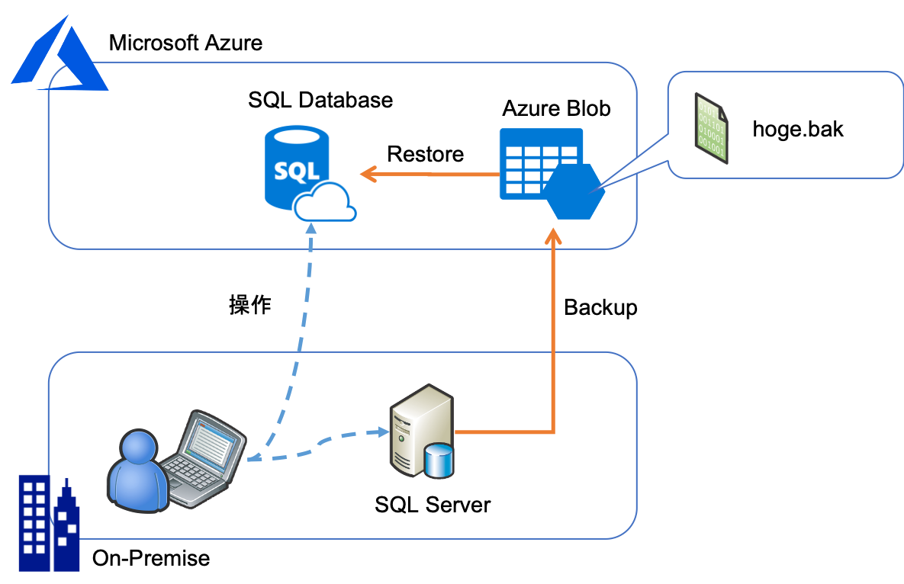
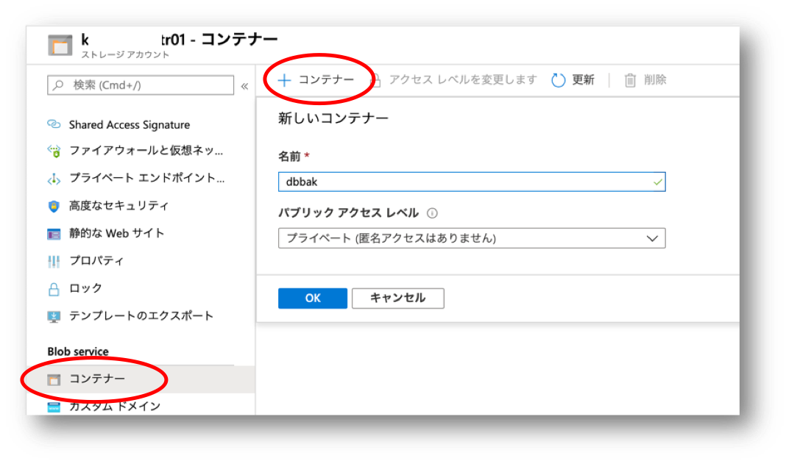
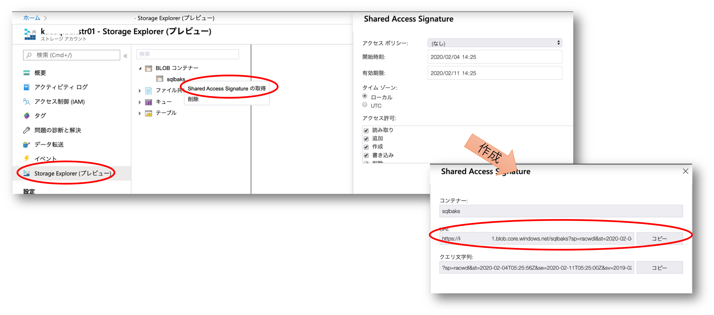
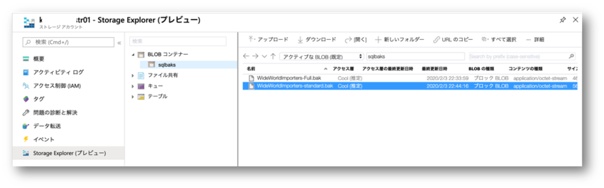

## はじめに

SQL Server から Azure SQL Database Managed Instance へのデータ移行手段はいろいろ考えられるのですが、
移行時のシステムダウンタイムが許容できるならバックアップ・リストアでやってしまうのが一番手っ取り早いかと思います。
その際のバックアップデータ（*.bak）を一時的に保持するストレージに Blob を使ってしまえば手順もシンプルです。
手順を確認する必要があったのでメモ書きも兼ねて。



## バックアップ ストレージ

まず [Azure Storage Account](https://docs.microsoft.com/ja-jp/azure/storage/blobs/storage-blobs-introduction) を汎用 v2 で作成します。
ここは特に工夫するところはないのですが、オリジナル側（バックアップ元）であるオンプレミスのデータセンターに近いリージョンか、ターゲット側（リストア先）となる Azure SQL Database が配置されるリージョンを選択すると良いでしょう。

作成できたらバックアップファイル（*.bak）を配置するための Blob コンテナーを作成します。


このコンテナーに対してオリジナル側の SQL Szerver やターゲット側の SQL DB Managed Instance がアクセスできる必要がありますので、
[SAS トークン](https://docs.microsoft.com/ja-jp/azure/storage/common/storage-sas-overview?toc=%2fazure%2fstorage%2fblobs%2ftoc.json)
を発行します。この作業は Azure Portal 上の Storage Explorer でやってしまうと簡単です。
ここではオリジナル側とターゲット側両方で使えるようにフルにアクセス許可を付与していますが、実運用環境ではもう少し細かく制限をかけた方が良いでしょう。



出来上がったら URI の部分をコピーしておいてください。

## オリジナル側

次に バックアップ元となる SQL Server に対して SSMS : SQL Server Management Studio 等のクライアントツールで接続します。
普段 SQL Server の運用操作をしている端末であれば、問題なく利用できるかと思います。

接続できたら SQL Server に先ほどの Blob に接続するためのクレデンシャルを登録しておきます。
```sql
CREATE CREDENTIAL [https://accountName.blob.core.windows.net/containerName] 
    WITH IDENTITY='Shared Access Signature', 
    SECRET='作成した SAS キー（コピーした URI の？より後ろの部分）'
GO

SELECT * FROM sys.credentials
GO
```

そしてバックアップコマンドの出力先として Blob の URL を指定します。
この URL が先ほどクレデンシャルとして登録したコンテナ配下の Blob ファイルであれば、自動的に SAS が使われるということになります。

```sql
BACKUP DATABASE databaseName
    TO URL = 'https://accountName.blob.core.windows.net/containerName/filename.bak';  
```
コマンドが無事に終了したら Storage Explorer 等で確認しましょう。



## ターゲット側

先ほど Blob に保存したバックアップファイルを、今度は移行先でリストアします。
こちらでもまずリストア先となる SQL Database Managed Instance に対して SSMS : SQL Server Management Studio 等のクライアントツールで接続します。
今度は新しい環境ですので、操作端末に SSMS がインストールされていない可能性があります。
この場合は
[Azure Data Studio](https://github.com/Microsoft/azuredatastudio)
などをインストールして利用すると良いでしょう。

接続できたら SQL DB Managed Instance に対して先ほどの Blob に接続するためのクレデンシャルを登録しておきます。（コマンドは全く一緒です）
```sql
CREATE CREDENTIAL [https://accountName.blob.core.windows.net/containerName] 
    WITH IDENTITY='Shared Access Signature', 
    SECRET='作成した SAS キー（コピーした URI の？より後ろの部分）'
GO

SELECT * FROM sys.credentials
GO
```

そしてリストアコマンドの入力として Blob の URL を指定します。
この URL が先ほどクレデンシャルとして登録したコンテナ配下の Blob ファイルであれば、自動的に SAS が使われるということになります。

```sql
RESTORE FILELISTONLY FROM URL = 'https://accountName.blob.core.windows.net/containerName/filename.bak'

RESTORE DATABASE databaseName
    FROM URL = 'https://accountName.blob.core.windows.net/containerName/filename.bak';  
```

リストアが完了したら適宜クエリを実行して、正常に移行できているかを確認してください。

## 参考情報

ここに記載されているような内容は全部こちらに書いてあるわけですが、若干読み解くのが面倒だったので簡略版を作ってみた、というのが本音でした。
- [SQL Server Backup to URL](https://docs.microsoft.com/ja-jp/sql/relational-databases/backup-restore/sql-server-backup-to-url)
- [データベースをマネージド インスタンスに復元する](https://docs.microsoft.com/ja-jp/azure/sql-database/sql-database-managed-instance-get-started-restore)