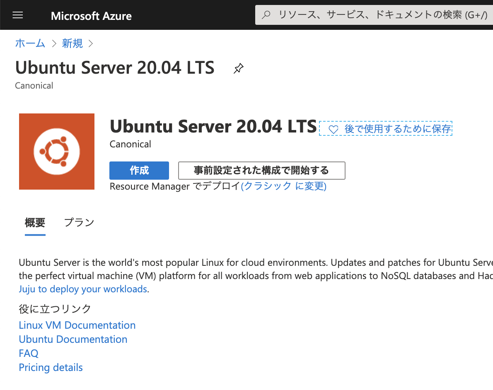
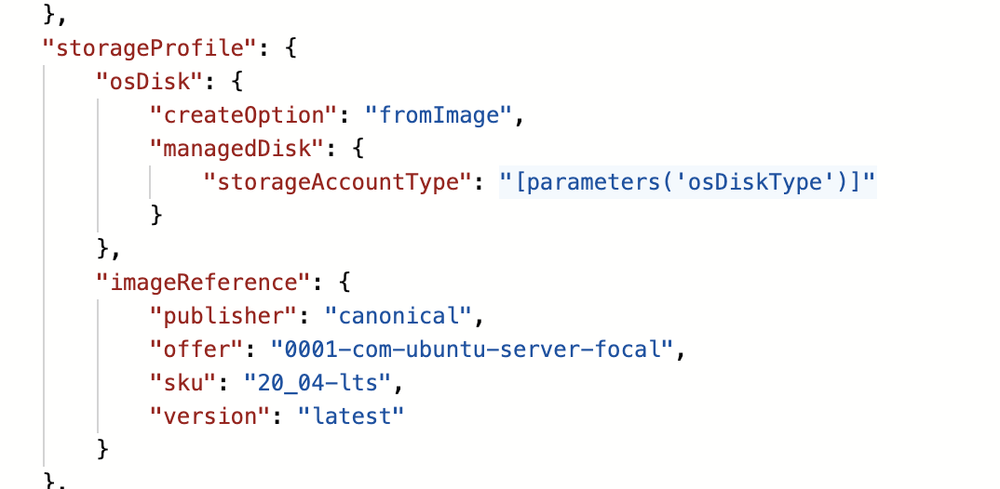

## はじめに

つらつらと Azure マーケットプレイスを眺めていたら Ubuntu 20.04 が出ていたのでバージョンを確認してみました。
GUI は便利なのでついこれに頼ってしまうんですが、本番環境のときは多少面倒でも ARM テンプレートとか CLI 使うのをお勧めします。

## Azure Portal で確認

マーケットプレイスで [Ubuntu Server 20.04](https://portal.azure.com/#blade/Microsoft_Azure_Marketplace/MarketplaceOffersBlade/selectedMenuItemId/home/searchQuery/ubuntu%20server) と検索するとあっさり出てきますね。



で、ここから仮想マシンの作成作業を進めていくわけですが、最後の `作成` ボタンを押す前に `Automation のテンプレートをダウンロードする` リンクをクリックすると、今から作ろうとしているリソースが確認できます。
仮想マシンリソースの中を見ていくと `storageProfile` というプロパティがあります。
この中の `imageReference` 要素に VM の作成に使用するイメージ情報が記載されています。



バージョンが `latest` となっているので、いくつかあるうちの最新版が使われていると言うことですね。

## Azure CLI で確認

ではコマンドラインで細かく確認してみましょう。

```bash
$ az vm image list --location japaneast --publisher canonical --offer UbuntuServer --output table

Offer         Publisher    Sku        Urn                                      UrnAlias    Version
------------  -----------  ---------  ---------------------------------------  ----------  ---------
UbuntuServer  Canonical    18.04-LTS  Canonical:UbuntuServer:18.04-LTS:latest  UbuntuLTS   latest
```

あれ、18.04 になってますね。オフラインのリストだからでしょうか。
と思って先ほどのコマンドで --all オプションをつけても 20.04 が出てきませんでした。

```bash
$ az vm image list --location japaneast --publisher canonical --offer UbuntuServer --output table --all | grep '20.04'

(結果無し)
```

そういえばマーケットプレイスから作成したときの ARM テンプレートでは Offer 名が違っていましたね。

```bash
$ az vm image list-offers --location japaneast --publisher canonical --output table

Location    Name
----------  ------------------------------------
japaneast   0001-com-ubuntu-minimal-focal-daily
japaneast   0001-com-ubuntu-minimal-groovy-daily
japaneast   0001-com-ubuntu-pro-advanced-sla
japaneast   0001-com-ubuntu-pro-bionic
japaneast   0001-com-ubuntu-pro-focal
japaneast   0001-com-ubuntu-pro-trusty
japaneast   0001-com-ubuntu-pro-xenial
japaneast   0001-com-ubuntu-pro-xenial-fips
japaneast   0001-com-ubuntu-server-eoan
japaneast   0001-com-ubuntu-server-focal
japaneast   0001-com-ubuntu-server-focal-daily
japaneast   0001-com-ubuntu-server-groovy-daily
japaneast   0002-com-ubuntu-minimal-bionic-daily
japaneast   0002-com-ubuntu-minimal-disco-daily
japaneast   0002-com-ubuntu-minimal-focal-daily
japaneast   0002-com-ubuntu-minimal-xenial-daily
japaneast   0003-com-ubuntu-minimal-eoan-daily
japaneast   0003-com-ubuntu-server-trusted-vm
japaneast   test-ubuntu-premium-offer-0002
japaneast   Ubuntu15.04Snappy
japaneast   Ubuntu15.04SnappyDocker
japaneast   UbunturollingSnappy
japaneast   UbuntuServer
japaneast   Ubuntu_Core
```

Canonical さんから提供されている Offer の中には UbuntuServer 以外もたくさんあることがわかります。
ARM テンプレートに記載されていた `0001-com-ubuntu-server-focal` という Offer があるので確認してみましょう。
Ubuntu 20.04 LST の開発コードネームが
[Focal Fossa](http://releases.ubuntu.com/focal/)
らしいので、ここに入っているんでしょう。

```bash
$ az vm image list --location japaneast --publisher canonical --offer 0001-com-ubuntu-server-focal --output table　--all

Offer                               Publisher    Sku                   Urn                                                                                Version
----------------------------------  -----------  --------------------  ---------------------------------------------------------------------------------  ---------------
0001-com-ubuntu-server-focal        Canonical    20_04-lts             Canonical:0001-com-ubuntu-server-focal:20_04-lts:20.04.202004230                   20.04.202004230
0001-com-ubuntu-server-focal        Canonical    20_04-lts             Canonical:0001-com-ubuntu-server-focal:20_04-lts:20.04.202005010                   20.04.202005010
0001-com-ubuntu-server-focal        Canonical    20_04-lts             Canonical:0001-com-ubuntu-server-focal:20_04-lts:20.04.202005130                   20.04.202005130
0001-com-ubuntu-server-focal        Canonical    20_04-lts             Canonical:0001-com-ubuntu-server-focal:20_04-lts:20.04.202005250                   20.04.202005250
0001-com-ubuntu-server-focal        Canonical    20_04-lts             Canonical:0001-com-ubuntu-server-focal:20_04-lts:20.04.202006100                   20.04.202006100
0001-com-ubuntu-server-focal        Canonical    20_04-lts-gen2        Canonical:0001-com-ubuntu-server-focal:20_04-lts-gen2:20.04.202005130              20.04.202005130
0001-com-ubuntu-server-focal        Canonical    20_04-lts-gen2        Canonical:0001-com-ubuntu-server-focal:20_04-lts-gen2:20.04.202005250              20.04.202005250
0001-com-ubuntu-server-focal        Canonical    20_04-lts-gen2        Canonical:0001-com-ubuntu-server-focal:20_04-lts-gen2:20.04.202006100              20.04.202006100
0001-com-ubuntu-server-focal-daily  Canonical    20_04-daily-lts       Canonical:0001-com-ubuntu-server-focal-daily:20_04-daily-lts:20.04.202006170       20.04.202006170
0001-com-ubuntu-server-focal-daily  Canonical    20_04-daily-lts       Canonical:0001-com-ubuntu-server-focal-daily:20_04-daily-lts:20.04.202006180       20.04.202006180
0001-com-ubuntu-server-focal-daily  Canonical    20_04-daily-lts       Canonical:0001-com-ubuntu-server-focal-daily:20_04-daily-lts:20.04.202006220       20.04.202006220
0001-com-ubuntu-server-focal-daily  Canonical    20_04-daily-lts-gen2  Canonical:0001-com-ubuntu-server-focal-daily:20_04-daily-lts-gen2:20.04.202006170  20.04.202006170
0001-com-ubuntu-server-focal-daily  Canonical    20_04-daily-lts-gen2  Canonical:0001-com-ubuntu-server-focal-daily:20_04-daily-lts-gen2:20.04.202006180  20.04.202006180
0001-com-ubuntu-server-focal-daily  Canonical    20_04-daily-lts-gen2  Canonical:0001-com-ubuntu-server-focal-daily:20_04-daily-lts-gen2:20.04.202006220  20.04.202006220
（量が多いので割愛）
```
ちょっと Daily Build が混じっちゃいましたが、この記事の執筆時点（2020年6月25日）では 5 つのバージョンがリリースされていました。
ということは先ほどの ARM テンプレートでデプロイすれば 2020年6月10日版をベースイメージとして仮想マシンが作られたはず。
2週間おきくらいにイメージが生成されている様子なので、もう少し待ってれば最新版が使えたんでしょうか。

## まとめ

ポータルからの仮想マシン作成は便利ではありますが、操作するタイミングによっては厳密にはバージョンの異なる OS が出来上がることがわかります。
このことが具体的にどの程度の問題を発生するのかは未知数ですが、構成管理上はリスクがあるといえるでしょう。
本番環境ではスクリプトないしは ARM テンプレートを保存し、バージョンまで含めて構成管理していくことをお勧めします。

## 参考情報
[Azure CLI を使用して Azure Marketplace の Linux VM イメージを見つける](https://docs.microsoft.com/ja-jp/azure/virtual-machines/linux/cli-ps-findimage)
