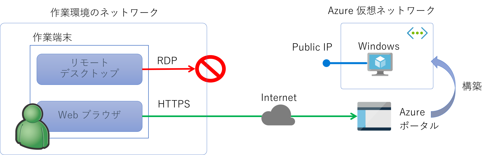
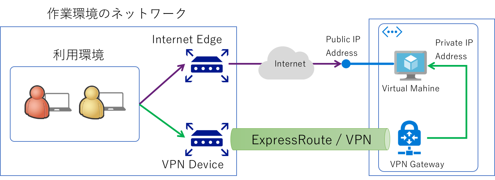
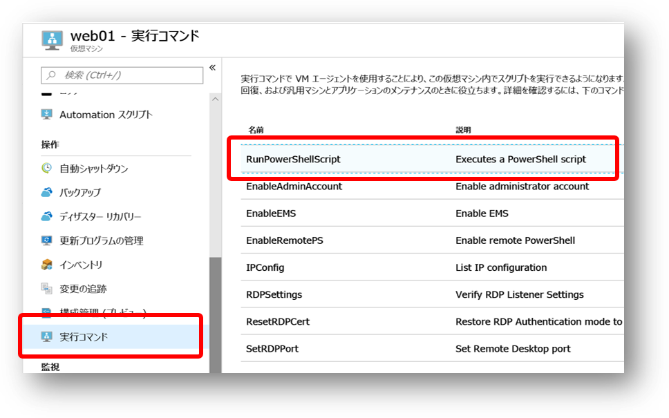
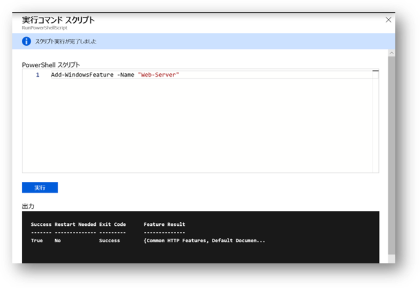
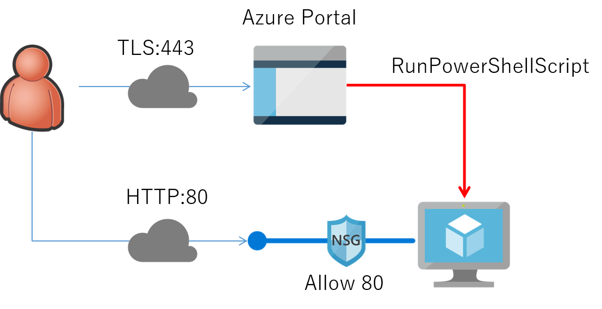

## インターネット環境から Azure 仮想マシンにリモートデスクトップ接続できない場合の回避策

Azure ポータルから仮想マシンを作成すると、同時に Public IP アドレスが付与されます。
Windows 仮想マシンの場合は NSG で RDP(3389) を受信許可していればリモートデスクトップ接続ができるわけです。
しかしながら企業の一般的なネットワーク環境ではそもそも HTTP/HTTPS 以外のプロトコルがインターネットに対して使えることは稀だと思います。
つまり、仮想マシンが出来たはいいけど何も操作できずに課金だけが発生する Windows の出来上がりです。



このようなケースでは ExpressRoute なり Internet VPN なりを使用して仮想ネットワークと自身のネットワーク環境を地続きにし、
Private IP アドレスを使用して接続するのが通常のやり方になります。
ただまあ、時間もかかるし面倒だし余計にお金もかかるわけです。
ちょっと検証用途に使いたいとか、ちょっとお勉強に使いたいとか、そういったシチュエーションには不向きです。



回避策をいろいろ調べていたのですが、残念ながら Windows らしく GUI を操作するには至っていません。
が、とりあえずここまで調べた内容も TIPS 的には役に立ちそうなので少し紹介したいと思います。

### スクリプトをバッチ的に実行する

Azure ポータルで仮想マシンのメニューを見ていくと **実行コマンド** という素敵なメニューがありますね。
この中の RunPowerShellScript を選ぶと、仮想マシン内部で PowerShell スクリプトを実行することができます。



詳しい使い方は
[正式なドキュメント](https://docs.microsoft.com/ja-jp/azure/virtual-machines/windows/run-command)
に譲りますが、ここでは例として IIS のセットアップ方法を紹介しておきます。

```powershell

PS > Add-WindowsFeature -Name web-server

```

PowerShell スクリプトの入力画面に上記のスクリプトを入力して実行すると、以下のように標準出力の結果が表示されます。



実行イメージは以下のような形でしょうか。ユーザーは Azure ポータルにさえアクセスできれば良いので HTTPS が使用できれば問題ありません。またポータルから VM の拡張機能を経由してスクリプトが実行されますので、NSG に対して RDP 用のポートを受信許可する必要もありません。IIS であれば 80 ポートだけ空いていれば通信ができるわけです。
もう少しまともな Web ページやアプリケーションをインストールしたり、HTTPS を使用した通信を実現するならば証明書のインストール等をごにょごにょしなければならないのでもうちょっと面倒になりそうですが。




#### 留意事項
ここで注意したいのは **インタラクティブシェル** として使えるわけではないということです。
入力した一連の PowerShell コードが VM 拡張機能を使用して内部に送り込まれ、実行結果をまとめてポータルに返してきます。
このため単純・確実な処理であれば問題ないのですが、ある程度の長さのスクリプトを実行したり、
トラブルシュートのように Try & Error をしたい場合には不向きですのでご注意ください。


