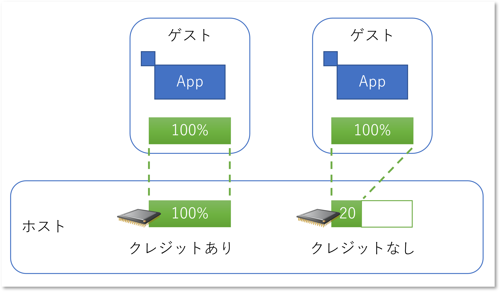
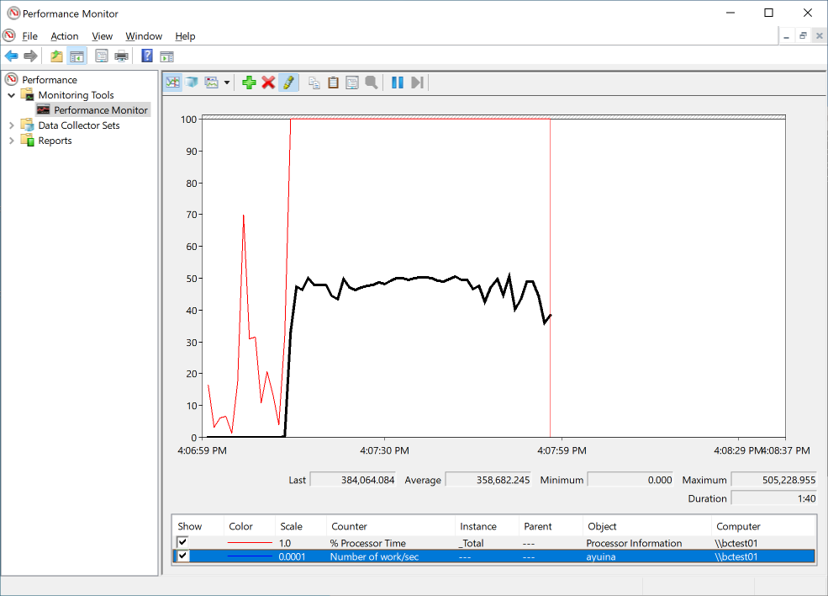
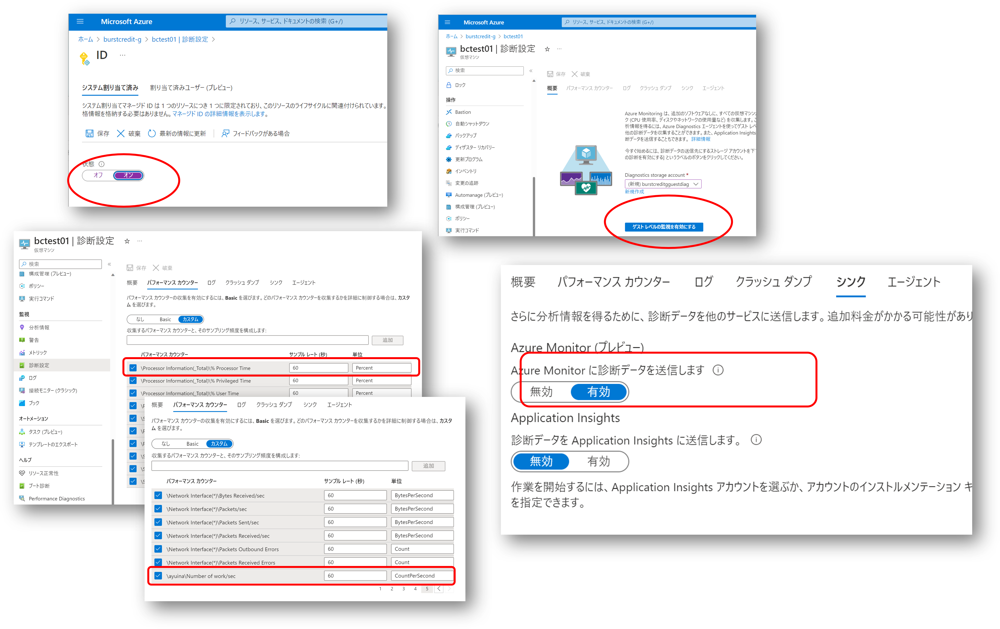
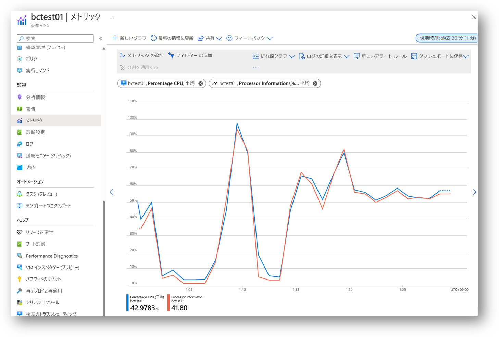
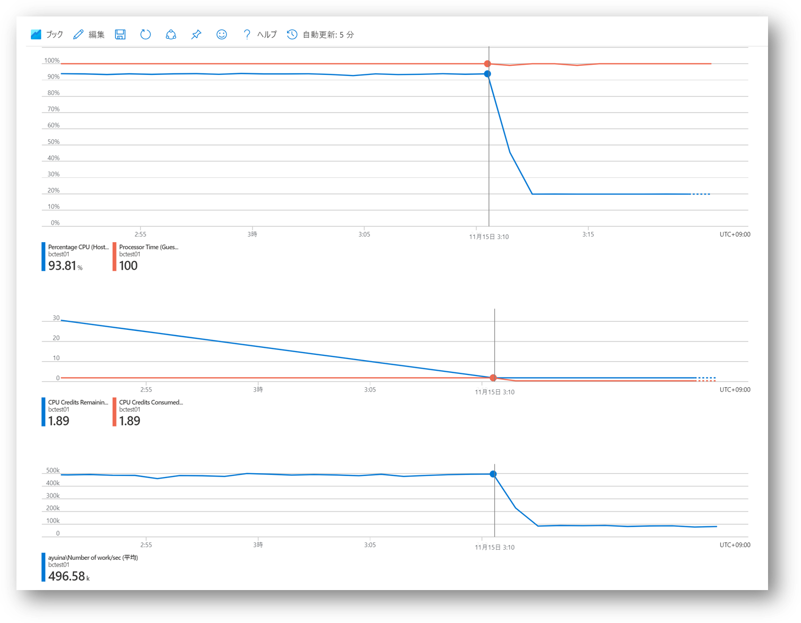

# はじめに

Azure B シリーズ VM のドキュメントには [負荷の急増に対応できる](https://learn.microsoft.com/ja-jp/azure/virtual-machines/sizes-b-series-burstable) と記載がありますが、
これは裏を返せば **常に仮想マシンスペック通りの性能が出るわけでは無い** という意味でもあります。
普段はベースラインパフォーマンス以下の CPU 使用率の時にクレジットを蓄積しておき、いざ負荷が高まったときにそのクレジットを消費することで全力を出すことが出来る、というちょっと特殊な VM シリーズになっています。
つまりクレジットがたまってない状況では負荷が急増しても対応できないということです。

この挙動が分かりにくいという声も良く聞きますので、サラリーマンの生活に例えてみましょう。
サラリーマンな日常生活でも基本的には毎月の給与の範囲で生活していくと思います。
毎月の収入をきっちり使い切る江戸っ子な生活をしていれば常に貯金はゼロですし、月収を超えるような買い物は出来ないわけです。
でもそれでは高いものは買えないので、地道にコツコツ貯金して貯金して貯金して、いざ欲しいものが出来たときに一気に放出したりしますよね。
（ここでローンを組むとかいう選択肢は無視します）

B シリーズはそのような「時々贅沢する」スタイルで使う仮想マシンです。
あまり分かりやすい例にはならなかったので仮想マシンに話を戻します。



仮想マシン内で CPU を全力で使うアプリケーションが動いていた場合、Standard_D2s のような仮想マシンサイズであれば、ホストの 2 vCPU が全力で処理してくれます。
ところが仮想マシンサイズが Standard_B2s でクレジットが不足している場合、ホストからは 2 vCPU が割り当てられていますがその 40% （1 vCPU あたり 20%）しか処理能力を割り当ててもらえません。
アプリケーションから見れば、ゲスト OS は CPU 使用率 100% なのに、なぜか実際の仕事量が 4 割程度まで落ち込んでいる状況になるわけです。

この挙動を理解していないと「なんかいきなり性能が劣化したぞ？！？！」と慌てることになりますので、バーストクレジットの残量や消費状況、仮想マシンの挙動などを整理してみました。

# CPU に負荷をかけるアプリ for Windows の実装

この挙動を試すにはとにかく CPU をぶん回すアプリケーションが必要です。
というわけで .NET Framework 4.8 で下記のような Console アプリケーションを作成します。
処理内容としては 4 スレッドで 1024 byte の乱数生成をループしているだけですが、2 vCPU 程度の仮想マシンであれば CPU 使用率を 100% 近くに張り付けることは可能でしょう。
ただ実際に仕事している量を図るために「単位時間あたりに乱数を生成できた回数」を記録するためのカスタム パフォーマンスカウンターを実装しています。
RateOfCountsPerSecound32 の
[定義およびサンプル](https://learn.microsoft.com/ja-jp/dotnet/api/system.diagnostics.performancecountertype)
はドキュメントをご参照ください。
これをビルドして実行可能ファイル（exe）を生成しておきます。

```csharp
private const string counterCategoryName = "ayuina";
private const string counterName = "Number of work/sec";

static void Main(string[] args)
{
    var counter = SetupCounter();

    var tasks = new Task[]
    {
        Task.Run(() => DoWork(counter)),
        Task.Run(() => DoWork(counter)),
        Task.Run(() => DoWork(counter)),
        Task.Run(() => DoWork(counter))
    };
    Task.WaitAll(tasks);
}

private static PerformanceCounter SetupCounter()
{
    if (!PerformanceCounterCategory.Exists(counterCategoryName))
    {
        var cntdefs = new CounterCreationDataCollection();
        cntdefs.Add(
            new CounterCreationData()
            {
                CounterName = counterName,
                CounterType = PerformanceCounterType.RateOfCountsPerSecond32,
                CounterHelp = "Number of work per second"
            });
        PerformanceCounterCategory.Create(
            counterCategoryName, 
            "my custom counter category", 
            PerformanceCounterCategoryType.SingleInstance, 
            cntdefs);
    }

    return new PerformanceCounter(counterCategoryName, counterName, false);
}

private static void DoWork(PerformanceCounter countPerSec)
{
    Console.WriteLine("Thread {0} started", System.Threading.Thread.CurrentThread.ManagedThreadId);
    long count = 0;
    do
    {
        byte[] random = new byte[1024];
        var rng = System.Security.Cryptography.RandomNumberGenerator.Create();
        rng.GetBytes(random);
        countPerSec.Increment();
    } while (++count > 0);
}
```

このアプリを実行してパフォーマンスモニターで様子を見ると以下のようになります。
CPU 使用率は 100% に張り付き、1 秒あたり 50 万回くらい乱数が生成できていることが分かります。



# B シリーズ仮想マシンの作成と監視の設定

次に Standard_B2s の仮想マシンを作成します。
リモートデスクトップで接続して
[.NET Framework 4.8 をダウンロード](https://dotnet.microsoft.com/ja-jp/download/dotnet-framework/net48)してインストール、
先ほど作成したアプリを持ち込み実行します。
あとは仮想マシンゲストから確認できる Windows パフォーマンスモニターの値と、Azure Monitor で仮想マシンホスト側から見えるメトリックと比較すればよいのですが、このゲスト側のメトリックも Azure Monitorで見えた方が便利です。
[設定方法の詳細](https://learn.microsoft.com/ja-jp/azure/azure-monitor/agents/diagnostics-extension-windows-install)に関しては公式ドキュメントを参照していただければと思いますが、おおざっぱな手順としては以下のようになります。

- 仮想マシンの Managed ID を有効化する
- 診断設定でゲストレベルの診断を有効にする
- 監視したい Windows パフォーマンスカウンターを設定する
- 診断データの送信先（シンク）に Azure Monitor を指定する



このように設定しておくと、仮想マシンのメトリック画面にてホスト側のメトリックと同様にパフォーマンスカウンターのデータを表示できるようになります。
例えばメトリックに下記の２つを指定することでホスト側とゲスト側から見た CPU 使用率を同時に確認することが可能です。

|メトリック名前空間|メトリック|図中の色|意味|
|---|---|---|---|
|仮想マシン ホスト|Percentage CPU|青|ホスト側から見た CPU 使用率（＝Azure Monitor の標準メトリック）|
|仮想マシンのゲスト|Processor Information\\%Processor Time|橙|ゲスト側から見た CPU 使用率（＝Windows パフォーマンスカウンター）|



これ以外にも下記のメトリックを見たいので、繰り返し計測するようなケースではブックを作っておくと良いでしょう。

|メトリック名前空間|メトリック|意味|
|---|---|---|
|仮想マシン ホスト|CPU Credits Consumed|クレジットの消費量|
|仮想マシン ホスト|CPU Credits Remainings|クレジットの残量|
|仮想マシンのゲスト| ayuina\Number of works/sec |乱数生成の回数（カスタムパフォーマンスカウンター）|

なお VM は起動しているだけでそれなりの処理をしているため、場合によってはウィルススキャンなどが動作することでクレジットを消費したりします。
なので、ここで一度 VM を停止して 1 時間程度放置し、クレジットを貯めておくと良いでしょう。


# バーストしてクレジットを枯渇させてみる

準備が整ったので仮想マシンを起動、作成したアプリを実行し、Azure Metric （ないしはブック）を眺めてみましょう。
下記の計測例では 3:10 を境に大きく挙動が変わっていることが分かります。




- 上段
    - ゲスト OS から見ると CPU 使用率は 100% に張り付いたままだが、ホスト OS から見ると 20% しか使用していない
    - これは Standard_B2s のベースラインパフォーマンス 40% （2 vCPU なので平均は 20%）に一致している
- 中段
    - CPU Credits Remainings は底を打ち、一定して使用していた CPU Credits Consumed もゼロになっている
    - 貯蓄してあったクレジットを使い切ってしまい、これ以上クレジットを利用できなくなっていることを表している
- 下段
    - 乱数の生成回数を表すカスタムカウンターも 500k から 100k に急減している
    - これは Standard_B2s における最大 CPU パフォーマンス(200%) 対 ベースラインパフォーマンス(40%)の比率に一致

このような状況下でゲスト OS のパフォーマンスカウンターだけを見ていると、CPU 使用率は 100% のままなのにも関わらず処理性能（ここでは乱数の生成回数）がガクッと落ちるような挙動に見える、というわけです。

# まとめ

Azure 仮想マシンには様々なシリーズがありますが、今回検証に使用した B2s に比較的スペックの近い 2 vCPU の Windows 仮想マシンの従量課金価格（2022 年 11 月の東日本リージョン）をいくつかピックアップすると以下のようになります。
B シリーズは他に比べて極めて安価であることが分かりますが、これは「常に全力を出せるわけではない」サイズであることトレードオフであることを意味します。

|サイズ|メモリ（GB）|月額（JPY）| 
|---|--:|--:|
|B2s|4|6,651|
|A2 v2|4|18,120|
|D2as v5|8|21,744|
|D2s v5|8|23,023|
|F2s v2|4|21,211|

B シリーズ以外のバーストしない（= クレジットによる性能制限が無い）VM サイズを使用していれば、前述のような挙動をすることはありません。
つまり常に安定した CPU 性能が必要ならば、安さにつられて B シリーズを選択してはならない、ということになります。
一方でアイドル状態になる時間の割合が高いアプリケーションを動作させるのであれば、B シリーズのコストパフォーマンスは高くなりますので、適材適所でご利用ください。


