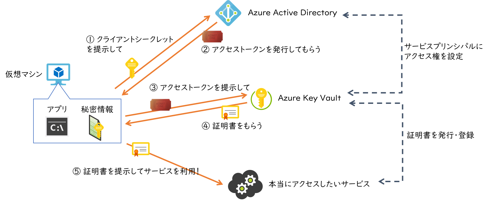
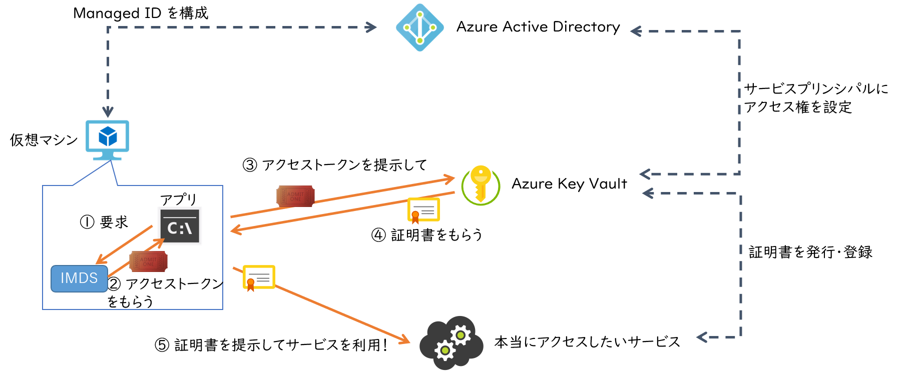
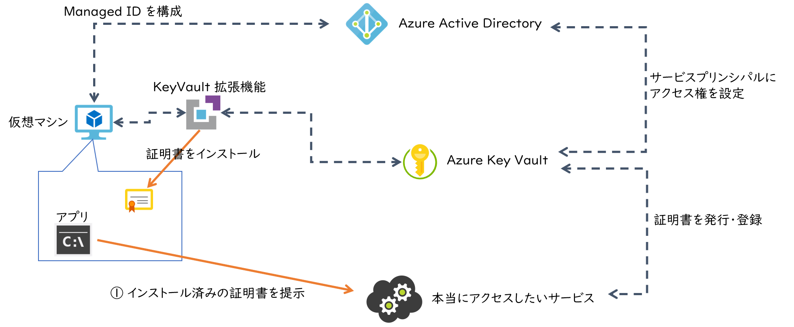
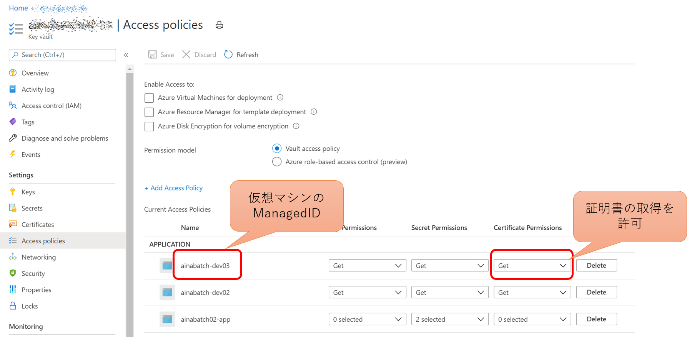
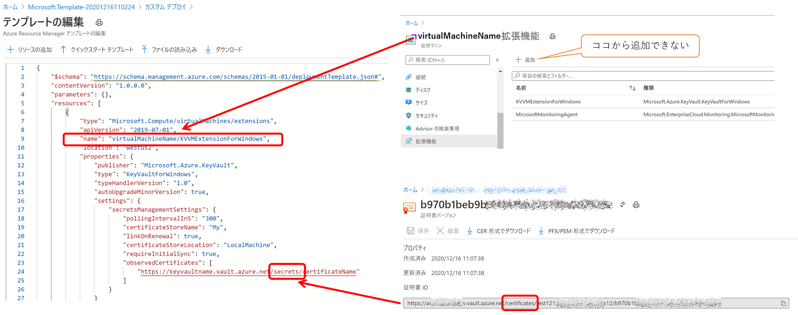
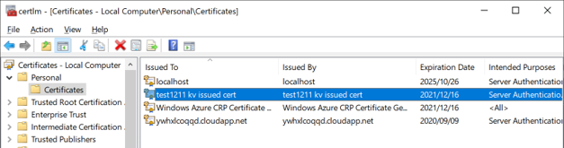

## はじめに

個人的に Azure Key Vault はどうにも敷居が高く、また証明書ってやつもどうも敷居が高くて、なんとなく遠ざけてきたのですが、
最近どうしても使わざるを得ないシチュエーションにはまりいろいろ調べている次第です。
そんななかで 
[Azure Key Vault 仮想マシン拡張機能](https://azure.microsoft.com/ja-jp/updates/azure-key-vault-virtual-machine-extension-now-generally-available/)
なんてものを教えてもらい、何これ便利じゃないですか、ということで How To 記事を書く気になりました。

そもそも Key Vault にアクセスするには Azure AD 認証が必要です。
仮想マシン上で動作するアプリケーションが Key Vault から証明書などの秘密情報を取得したい場合には、
サービスプリンシパルを使用して認証を受け、アクセストークンを取得してから Key Vault にアクセスし、証明書をダウンロードして、
やっと本当にアクセスしたいサービスに証明書を提示することが出来るわけです。
ところでサービスプリンシパルとして Azure AD 認証を受けるためにはやっぱりクライアントシークレットや証明書が必要ですよね。
この証明書やシークレットはどこで管理しましょう。
まさか Key Vault というわけには行きません。
つまり秘密情報を安全に管理するための仕組みとしての Key Vault 、それにアクセスするための秘密情報はやっぱり仮想マシンローカルに持っておく必要があったわけです。



この状況を打破するためのソリューションが私の大好きな Managed ID です。
これを使うことで、Azure 仮想マシン上で動作するアプリケーションは **サービスプリンシパルとして認証を受けるための秘密情報を管理することなく** Azure AD 認証が可能な Azure Key Vault などの各種サービスにアクセスできるわけです。
証明書認証が必要なサービスであれば Azure Key Vault に管理させておいて取り寄せればいいわけです。



とはいえ、これはアプリケーション起動時や外部サービスへのアクセス時に一度 Key Vault を開けにいかなければいけないわけですね。
クライアントシークレットの管理は不要になりましたが、実行時の手数はそれほど変わりないわけで、まだちょっとメンドクサイ。
Key Vault に管理されている証明書が直接仮想マシンからアクセスできれば素敵ですよね。
ということで前置きが長くなりましたが本題の仮想マシン拡張機能が便利です。



なお上記ではクライアント証明書のイメージで記載していますが、TLS サーバー証明書の運用にも利用できますね。

## セットアップ

セットアップ手順は下記に記載されているのですが、私のような証明書初心者には微妙にわかりにくい点もありましたので補足していきます。

- [Windows 用の Key Vault 仮想マシン拡張機能](https://docs.microsoft.com/ja-jp/azure/virtual-machines/extensions/key-vault-windows)
- [Linux 用の Key Vault 仮想マシン拡張機能](https://docs.microsoft.com/ja-jp/azure/virtual-machines/extensions/key-vault-linux)

まず仮想マシンの Managed ID を有効にして、Key Vault に格納された証明書に対するアクセス権を付与します。



次に拡張機能ですが、現状では Azure Portal の拡張機能ブレードに Key Vault 仮想マシン拡張機能が表示されません。
このため Azure CLI か Azure PowerShell を使用してインストールするか、Azure Resource Manager テンプレートを使用します。
下図は Azure Portal から[テンプレートデプロイ](https://portal.azure.com/#create/Microsoft.Template)を使用して、
仮想マシンと同じリソースグループに拡張機能をデプロイするところです。



- 拡張機能のリソース種別 `type` とリソース名 `name` を、設定対象となる仮想マシンの種別と名前の配下にスラッシュ区切りでネストする
    - サブリソースの記述方法は[こちら](https://docs.microsoft.com/en-us/azure/azure-resource-manager/templates/child-resource-name-type)を参照
- インストールしたい証明書の ID を Key Vault から取得して `observedCertificates` 配列に追加する
    - URL のルートディレクトリ部分を `certificates` から `secrets` に書き換える（秘密鍵を含めるため）
    - 証明書のバージョン番号部分は不要

デプロイに成功すると仮想マシン内で動作する拡張機能が「Managed ID を使用して Key Vault から証明書をダウンロードしてインストール」という一連の動作を勝手にやってくれます。
このため仮想マシンに接続すると証明書がインストール済みのように見えるわけです。
`pollingIntervalInS` に指定された秒数間隔で Key Vault をチェックして更新をしているので、
Key Vault 側での証明書の更新がリアルタイムに同期されるわけではないことに注意しましょう。

## 証明書の確認

それでは仮想マシンに接続して証明書を確認してみましょう。
上記では Windows 仮想マシンを使用していたのでリモートデスクトップで接続します。
テンプレートで `certificateStoreLocation` として `localMachine` を使用したので、
スタートメニューから `コンピューター証明書の管理` ツールを実行するか、`certlm.msc` を起動すると、下図のように証明書が確認できます。



あるいは PowerShell を使用して確認することも出来ます。
Key Vault で管理されている証明書と拇印（Thumbprint）が一致していることを確認しておきましょう。


```powershell
$certName = "CN=CertificateName"
dir Cert:\LocalMachine\My\ | where { $_.Subject -eq $certName }

Thumbprint                                Subject              EnhancedKeyUsageList
----------                                -------              --------------------
6F3FE9657B1A438C29409B9E29517C461298C5AD  CN=CertificateName   {Server Authentication, Client Authentication}
```

### 証明書運用でのメリット

なおこの状態で Key Vault 側で新しいバージョンの証明書を追加すると、そちらも仮想マシンに自動的に **追加で** インストールされます。
仮想マシン内部からは同じ Subject で異なる Thumbprint を持つ証明書が複数存在する状態になるわけです。
このためアプリケーションとしてはこの挙動に留意して、適切な証明書を選択するアルゴリズム（例えば最新バージョンを優先して使用するなど）を実装しておくと、
運用中に証明書が更新されても対応する手間がいらないことになります。

### セキュリティ面でのメリット

この方法でセットアップされた証明書は秘密鍵をエクスポートすることが出来ません。
つまりもしこの仮想マシンの管理者特権を保有する保守・運用担当者が悪意を持っていたとしても、この環境から証明書を持ち出されて悪用される心配が無いわけです。


## 証明書の確認 - Linux 編

Linux の場合も基本やり方は同じです。
Managed ID を有効化して、Key Vault 証明書へのアクセス権を付与、
そして下記のような ARM テンプレートを用意して、デプロイすれば適用されます。

```json
{
    "$schema": "https://schema.management.azure.com/schemas/2015-01-01/deploymentTemplate.json#",
    "contentVersion": "1.0.0.0",
    "parameters": {},
    "resources": [
        {
            "type": "Microsoft.Compute/virtualMachines/extensions",
            "apiVersion": "2019-07-01",
            "name": "targetVmName/KVVMExtensionForLinux",
            "location": "westus2",
            "properties": {
                "publisher": "Microsoft.Azure.KeyVault",
                "type": "KeyVaultForLinux",
                "typeHandlerVersion": "1.0",
                "autoUpgradeMinorVersion": true,
                "settings": {
                    "secretsManagementSettings": {
                        "pollingIntervalInS": "300",
                        "linkOnRenewal": true,
                        "certificateStoreLocation": "/var/lib/waagent/Microsoft.Azure.KeyVault",
                        "requireInitialSync": true,
                        "observedCertificates": [
                            "https://keyvaultname.vault.azure.net/secrets/certificate1",
                            "https://keyvaultname.vault.azure.net/secrets/certificate2"
                        ]
                    }
                }
            }
        }
    ]
}
```

Linux の場合は Windows のような証明書ストアではなく、`certificateStoreLocation` にファイルとして配置されます。
証明書名のファイルはシンボリックリンクになっており、実体はバージョン番号などが付与されたファイルになっています。
証明書が更新されるとリンク先の実体が自動的に切り替わる仕組みのようですね。

```bash
root@ainabatch-dev03:/var/lib/waagent/Microsoft.Azure.KeyVault# ls -la
total 24
drwx------  2 root root 4096 Dec 17 06:59 .
drwx------ 11 root root 4096 Dec 17 07:20 ..
lrwxrwxrwx  1 root root  143 Dec 17 06:31 certificate1 -> /var/lib/waagent/Microsoft.Azure.KeyVault/keyvaultname.certificate1.version.aaaaaaaa.bbbbbbbb.PEM
-rw-------  1 root root 2904 Dec 17 06:31 keyvaultname.certificate1.version.aaaaaaaa.bbbbbbbb.PEM
lrwxrwxrwx  1 root root  140 Dec 17 06:31 certificate2 -> /var/lib/waagent/Microsoft.Azure.KeyVault/keyvaultname.certificate2.version.aaaaaaaa.bbbbbbbb.PEM
-rw-------  1 root root 2884 Dec 17 06:31 keyvaultname.certificate2.version.aaaaaaaa.bbbbbbbb.PEM
```

## まとめ

証明書を Key Vault で大事に管理したとしても、結局そこから持ち出して実行環境にインストールするまでの間が危険ですし、証明書を更新する運用の手間もかかります。
こちらの機能をうまくつかっていただくと Key Vault 上の証明書を更新するだけで自動的に反映されますのでいろいろと楽になるのではないでしょうか。
インターネットを調べてもあまりこの機能に言及されている記事も見当たらず、また公式ドキュメントからは読み取れないメリットもありましたので紹介記事にしてみました。
お役に立てば幸いです。

### 補足

Key Vault で管理できる証明書には PEM 形式と PFX 形式があるのですが、Windows / Linux どちらの環境にもインストールできました。
Windows 環境の場合は証明書ストアにインストールされてしまうので特に利用上の区別はありません。
Linux 環境のばあいは自動的に PEM 形式に変換されるようですので
[こちら](../login-aad-with-certificate) で苦労したような証明書変換の手間は不要です。