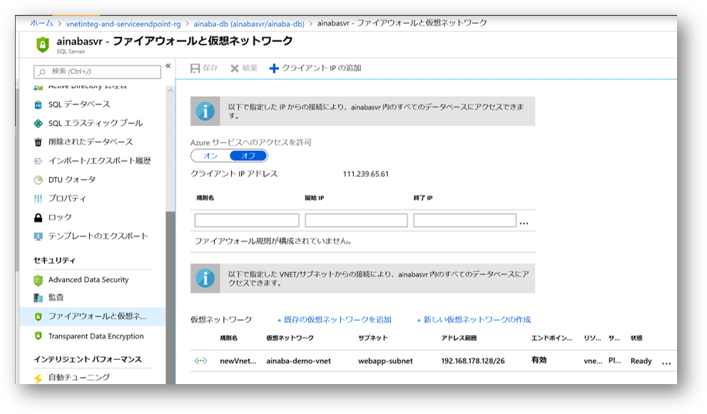

## はじめに

[App Service のネットワーク機能](https://docs.microsoft.com/ja-jp/azure/app-service/networking-features)
が新しくなり、どうやら Web App から SQL Database への接続経路を閉域化することが簡単にできそうなのでやってみました。


本ブログを執筆段階ではまだプレビュー段階の機能ですので本番環境には利用しないようにご注意ください。

## 技術的な背景

通常 Azure の PaaS に分類されるサービスは原則的に Public IP アドレスおよび FQDN を持つことでインターネット経由でアクセス可能です。
これは SQL Database も例外ではありません。
もちろん Azure のネットワークで保護され、各テナント単位で認証によるアクセス制御が行われるとはいえ、
重要な情報が格納されているデータベースの **アタックサーフェスがインターネットに公開されている** よりは、
接続経路が閉域化されているのは多層防御の考え方からすればメリットがあります。

従来は SQL Database のファイアーウオール規則に対して以下を設定するという、かなり大雑把なことしかできませんでした。
- Azure サービスへのアクセスを許可する
- Web App の送信 IP アドレスを許可する

あるいは App Service Environment や SQL Database Managed Instance を使用して Web App や SQL Database そのものを VNET 内に配置することもできましたが、これはこれで高コストであるという問題がありました。

しかし App Service の VNET 統合機能が新しくなったことで低コストで簡易に実現できるようになりましたので、
試してみるとともにご紹介したいと思います。

## 設定方法

ここでは以下の 3 つの機能を使用しています。

- [App Service の `リージョン Vnet 統合`](https://docs.microsoft.com/ja-jp/azure/app-service/web-sites-integrate-with-vnet)
- [VNet サービスエンドポイント](https://docs.microsoft.com/ja-jp/azure/virtual-network/virtual-network-service-endpoints-overview)
- [SQL Database のファイアウォール規則](https://docs.microsoft.com/ja-jp/azure/sql-database/sql-database-vnet-service-endpoint-rule-overview)

細かい設定や概念などはドキュメントを参照いただければと思いますが、
設定そのものは簡単なのでいくつか画面キャプチャを記載しておきます。

### VNET サービスエンドポイント

まず仮想ネットワークと App Service に使用させるためのサブネットを用意しておきます。
作成したサブネットに `Microsoft.Sql` サービスに対するサービスエンドポイントを作成します。


これでこのサブネットから SQL Database への接続は VNET に設定されたプライベート IP アドレスで行われることになります。
通常はこのサブネットに仮想マシンを配置するわけですが、あとでこのサブネットに Web App を統合するわけです。

### SQL Database のファイアウォール規則

VNET 側でサービスエンドポイントを設定しても、あくまでもルーティングの調整が行われるだけですので、
SQL Database のファイアウォール規則で前述のサブネットからのアクセスを明示的に許可してやる必要があります。



ここでは同時にそれ以外の通信経路を切断していますので、Azure ポータルのクエリエディタや、作業端末の SQL Server Management Studio 等からのアクセスができなくなりますのでご注意を。
データベースの設定などは事前に済ませておいてください。

### Web App の VNET 統合

最後に Web App 側から前述のサブネットに対して VNet 統合を設定します。


Web App に SQL Database へアクセスするようなアプリケーションを配置して、正しく SQL Database へアクセスできることを確認しましょう。

なお SQL Database のファイアウォール設定は若干時間がかかることがあります。
うまくいかなくても落ち着いて、少し時間をおいてから試してみてください。
感覚的には長くても数分程度です。

## 本当に閉域化できているのか？

SQL Database のファイアウォール規則で指定したサブネット以外からの通信をすべて排除しているので、
Web App 上のアプリケーションが正常に SQL 接続できていれば大丈夫なはずです。
とはいえ、ちょっと不安なので接続状況を監査してみましょう。


ストレージアカウントに出力した場合には、拡張子 `.xel` のファイルが Blog として出力されますので、SQL Server Management Studio で開くことが可能です。
Azure Monitor Log へ出力した場合には以下のような Kusto クエリで確認できます、

```
AzureDiagnostics
| where TimeGenerated > ago(1h)
| project event_time_t, server_instance_name_s, database_name_s, action_name_s, host_name_s, client_ip_s, statement_s
```


どちらの場合もクライアント IP アドレスが VNET に指定したプライベート IP アドレスになっていることが確認できますね。
