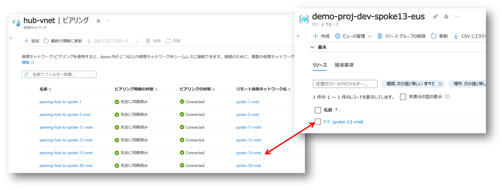

# はじめに

タイトルのような質問を後輩ちゃんからいただいたので、試してみたところ出来たんですが、ドキュメント読んでもこのパターンはちょっと実装方法がわかりにくいなと思ったのでここに記します。
想定としては Hub VNET 側に開発端末としての Dev Box や作業用の端末などが接続されていて、[ADE : Azure Deployment Environment]((https://learn.microsoft.com/ja-jp/azure/deployment-environments/overview-what-is-azure-deployment-environments) ) を使用してSpoke VNET 側に Azure サービスをデプロイしてアプリを開発したいけど、Public Network 経由は嫌なので閉域アクセスしたい、というようなケースになると思います。
つまり、Hub VNET は既にデプロイ済みのものとして、Spoke VNET と Peering の設定だけを ADE でデプロイしたり削除したりしたい、ということですね。


なお、この記事では [Azure Deployment Environment]そのものについて詳しい解説は省きます。
ADE 初心者の方は
[クイックスタート](https://learn.microsoft.com/ja-jp/azure/deployment-environments/quickstart-create-and-configure-devcenter)
等に従って、自作のテンプレートをカタログとして登録、ADE でデプロイする一連の環境を作成してみてください。
また ADE 自体はざっくりいえば Azure の IaC 技術を使用して、カタログ管理された環境をデプロイしてくれるサービスです。
つまり [Azure Resource Manager](https://learn.microsoft.com/ja-jp/azure/azure-resource-manager/management/overview) や [Bicep 言語](https://learn.microsoft.com/ja-jp/azure/azure-resource-manager/bicep/overview?tabs=bicep)の知識が必要です。
さらに、ADE は開発者に代わって Azure リソースのデプロイを代行してくれるサービスですので、
実際の操作を行ってくれる [サービスアカウント](https://learn.microsoft.com/ja-jp/entra/architecture/secure-service-accounts) の知識、
Azure でのアクセス制御の仕組みである [Azure RBAC](https://learn.microsoft.com/ja-jp/azure/role-based-access-control/overview) の知識も重要です。


# Bicep を使用した VNET Peering の作成方法について

まずは VNET Peering を構成する ARM テンプレートないしは Bicep テンプレートが必要です。
参考情報を探していたところ、以下の素敵な記事が見つかりました。

- [Azure仮想ネットワークピアリング実装してみた -Bicep編](https://blog.jbs.co.jp/entry/2023/03/07/130201)

こちらの記事を参考にすると VNET Peering するには ４ つのリソース、すなわち
[VNET](https://learn.microsoft.com/ja-jp/azure/templates/microsoft.network/virtualnetworks?pivots=deployment-language-bicep) 
が２つ、片方の VNET を親として、もう片方を参照する 
[VNET Peering](https://learn.microsoft.com/ja-jp/azure/templates/microsoft.network/virtualnetworks/virtualnetworkpeerings?pivots=deployment-language-bicep)
が２つ必要なことが分かります。


# ADE を使用する場合のリソースグループとリソースの構造

ここで Hub VNET が既に存在している前提で、かつ、ADE で Spoke VNET と Peering だけをデプロイしたいわけなので、以下のようなリソースグループ編成になります。

- 既存のハブ側のリソースグループ（以下では `hub-spoke-rg` とします）
  - 既存のハブとなる VNET （以下 `hub-vnet`）
  - ADE で作成する `hub-vnet` を親として `spoke-xx-vnet` を参照する VNET Peering
- ADE が作成するスポーク側のリソースグループ（ _ProjectName_-_EnvironmentName_ という名前になるはず）
  - ADE で作成するスポーク VNET（`spoke-xx-vnet`）
  - ADE で作成する `spoke-xx-vnet` を親として `hub-vnet` を参照する VNET Peering

つまり ADE で作成したいのは下図の赤字部分が該当します。


ここで気を付けたいのは ADE でデプロイするときは ADE が作成する環境である [右側のリソースグループをスコープとしたデプロイ](https://learn.microsoft.com/ja-jp/azure/azure-resource-manager/bicep/deploy-to-resource-group?tabs=azure-cli) になるということです。
つまり既存のハブ側のリソースグループへの VNET Peering のデプロイを行うためには Bicep ファイルを分離し、
[モジュールとして別スコープのデプロイ](https://learn.microsoft.com/ja-jp/azure/azure-resource-manager/bicep/modules)
をしてあげる必要があります。
というわけで実際の Bicep テンプレートの例は以下のようになります。

- [スポーク側の Bicep](https://learn.microsoft.com/ja-jp/azure/azure-resource-manager/bicep/deploy-to-resource-group?tabs=azure-cli) : ADE で指定するテンプレート
- [ハブ側の Bicep](https://github.com/ayuina/azure-devcenter-demo1/blob/main/catalog/environments/spoke-vnet/hubpeering.bicep) ： スポーク側の Bicep からモジュール参照されるテンプレート


# 環境をデプロイする際のプリンシパルとアクセス制御

さて ADE がデプロイするとき、基本的には以下の操作が行われています。

1. _ProjectName_-_EnvironmentName_ という名前のリソースグループが作成される
1. _ProjectName_/entironmentTypes/_EnvironmentName_ という サービスプリンシパルに上記リソースグループの Owner ロールが付与される
1. デプロイを指示したユーザーに対して「環境作成者ロール」で指定したロールが割り当てられる
1. サービスプリンシパルがリソースグループに対して `environment.yaml` で指定されたテンプレートを使用してデプロイする
1. サービスプリンシパルから上記リソースグループの Owner ロールが剥奪される
1. デプロイを指示したユーザーは、リソースグループのスコープにおいて、環境作成者ロールとして許可された操作が可能な状態が出来上がる

このとき ４ 番目の手順の過程ででハブ側のリソースグループに対してモジュールのデプロイが行われるわけですが、サービスプリンシパルはそちらのリソースグループに対してロールを割り当てられていないので何も出来ません。
つまり事前にサービスプリンシパルに対して必要な操作を含んだ RBAC ロールを割り当てておく必要があるわけですね。
上記の通りサービスプリンシパルの名前さえ分かっていれば通常の RBAC ロール割り当てですので、ハブ側のリソースグループに対して共同作成者でも与えておきましょう。
（ちゃんとやるならスコープとロールはもっと絞り込むべきです）


これでサービスプリンシパルはスコープ側だけでなくハブ側にもいろいろ出来るようになります。

# ユーザー割り当て Managed ID を使用したデプロイ

上記は自動的に作成されるサービスプリンシパルに対してのロールを割り当てていますが、ユーザー割り当て Managed ID を使用してデプロイさせることも可能です。
複数の環境でのデプロイに使用したいとかいう場合にはこちらの方が便利かもしれません。
明示的にリソースが見えるのでわかりやすいというメリットもありますね。


# それではデプロイしてみましょう

それでは準備が整いましたので、マニフェストファイル（ `environment.yaml` ）を作成してデプロイしてみましょう。
実際の[サンプルはこちら](https://github.com/ayuina/azure-devcenter-demo1/blob/main/catalog/environments/spoke-vnet/environment.yaml)をご参照ください。


出来上がったものがこちらです。
VNET と Peering しか作ってませんが、オールグリーンなのできっと大丈夫でしょう。



ここで以下の点に留意してください。

- ハブ側のリソースグループと VNET の名前をパラメータとして正確に渡すこと（これがないと Peering リソースが作れない）
- スポーク VNET のアドレス レンジが、既存のハブやスポークのレンジとぶつからないようにすること（ルーティングが出来ないのでエラーになる）
- アドレスレンジの衝突を自動的に避けることが出来ないので、誰がどのアドレスレンジを使っているか採番と管理を別途行う必要がある（運用回避）

# まとめ

単に ADE でスポーク VNET を生やしたいだけなので Bicep テンプレートはシンプルですが、割と ADE の仕組みに踏み込むことになってしまいました。
ただこの挙動を抑えておくことで、各開発者の専用の環境を簡単にデプロイできるだけでなく、環境全体で共有するインフラ部分に対する各種の設定変更をセットで行うことが出来るような気がします。
実際に試してはいませんが、以下のようなユースケースが思いつきます。

- ADE でデプロイしたリソースの API キーを、共通の Key Vault にシークレットとして登録する
- 共通の ストレージアカウントに Files 共有を作成、ADE でデプロイしたリソースとデータを共有（あとで各 Dev Box から SMB マウントするとか）
- Hub VNET に接続された 共通の Private DNS Zone に A レコードを登録、PaaS リソースの Private Endpoint も設置する

ニッチなケースかもしれませんが、このような使い方もあるんだなということを知っていただければ幸いです。

# Tips

ここでは知らなくても問題ではないけどちょっと Azure に詳しくなれそうな情報をいくつか紹介します。

## VNET Peering リソース

Azure Portal から VNET Peering の設定をポチポチやると VNET Peering 自体は単なる設定情報にしか見えないですが、上記の通り VNET Peering 自体も ARM リソースです。
つまり以下のコマンドで確認することが可能です。

```bash
SUBSC=guid-of-your-subscription-id
RG=hub-spoke-rg
VNET=hub-vnet
PEERING=peering1

az resource show --ids /subscriptions/${SUBSC}/resourceGroups/${RG}/providers/Microsoft.Network/virtualNetworks/${VNET}/virtualNetworkPeerings/${PEERING}

{
  "id": "/subscriptions/guid/resourceGroups/hub-spoke-rg/providers/Microsoft.Network/virtualNetworks/hub-vnet/virtualNetworkPeerings/peering1",
  "resourceGroup": "hub-spoke-rg",
  "type": "Microsoft.Network/virtualNetworks/virtualNetworkPeerings",
  "name": "peering1",
  "properties": {
    "allowForwardedTraffic": true,
    "allowGatewayTransit": false,
    "allowVirtualNetworkAccess": true,
    "doNotVerifyRemoteGateways": false,
    "peerCompleteVnets": true,
    "peeringState": "Connected",
    "peeringSyncLevel": "FullyInSync",
    "provisioningState": "Succeeded",
    "remoteAddressSpace": {
      "addressPrefixes": [
        "10.1.0.0/16"
      ]
    },
    "remoteVirtualNetwork": {
      "id": "/subscriptions/guid/resourceGroups/projectName-environmentName/providers/Microsoft.Network/virtualNetworks/spoke-vnet",
      "resourceGroup": "projectName-environmentName"
    },
    "remoteVirtualNetworkAddressSpace": {
      "addressPrefixes": [
        "10.1.0.0/16"
      ]
    },
    "useRemoteGateways": false
  }
}
```

## ADE デプロイに使用される ID とアクセス権の付与・剥奪

ドキュメントにはあまり詳しく書かれていないのですが、 ADE によるデプロイ中は前述のとおり各プロジェクトの環境名がついたサービスプリンシパルに対するアクセス権の付与と剥奪が動的に行われます。
これによって開発者自身がサブスクリプションに対してアクセス権を持つことなく、様々なリソースのデプロイが可能になっているわけです。
この挙動はデプロイ中には `アクセス制御 (IAM)` の画面で、デプロイ後は `アクティビティログ` でも確認できます。


さてサービスプリンシパルと書いてますが、プロジェクトで環境を構成する際の画面からもわかるとおり、これはシステム割り当て Managed ID です。
これは Entra ID の管理画面 `エンタープライズ アプリケーション` で確認することが出来ます。
フィルターとして `アプリケーションの種類 == マネージド ID` とすると見つけやすいです。


システム割り当てマネージド ID があるということは、このプロジェクトに割り当てた環境も 
[ARM リソース](https://learn.microsoft.com/en-us/azure/templates/microsoft.devcenter/projects/environmenttypes?pivots=deployment-language-bicep) であるということも予想が付きますね。
以下のようなスクリプトを使う環境の種類の設定情報が確認でき、Entra ID の画面で確認したオブジェクト ID と一致するシステム割当マネージド ID が確認できます。
また、この環境が対象とするサブスクリプション(`deploymentTargetId`) や、ADE を利用してデプロイするユーザーに割り当てられるロール（ここでは閲覧者）も確認できます。

```bash
SUBSC=guid
RG=devenv-rg
PROJ=demo-proj
ENV=Dev
az resource show --ids /subscriptions/${SUBSC}/resourceGroups/${RG}/providers/Microsoft.DevCenter/projects/${PROJ}/environmentTypes/${ENV}

{
  "id": "/subscriptions/guid/resourceGroups/rg/providers/Microsoft.DevCenter/projects/proj/environmentTypes/env",
  "type": "microsoft.devcenter/projects/environmenttypes",
  "identity": {
    "principalId": "38445c3e-843a-41fc-87fa-96fdf5c0ccf7",
    "tenantId": "xxxxxxxx-xxxx-xxxx-xxxxxxxxx",
    "type": "SystemAssigned",
    "userAssignedIdentities": null
  },
  "properties": {
    "creatorRoleAssignment": {
      "roles": {
        "acdd72a7-3385-48ef-bd42-f606fba81ae7": {}
      }
    },
    "deploymentTargetId": "/subscriptions/guid",
    "environmentCount": 1,
    "provisioningState": "Succeeded",
    "status": "Enabled"
  }
}
```


