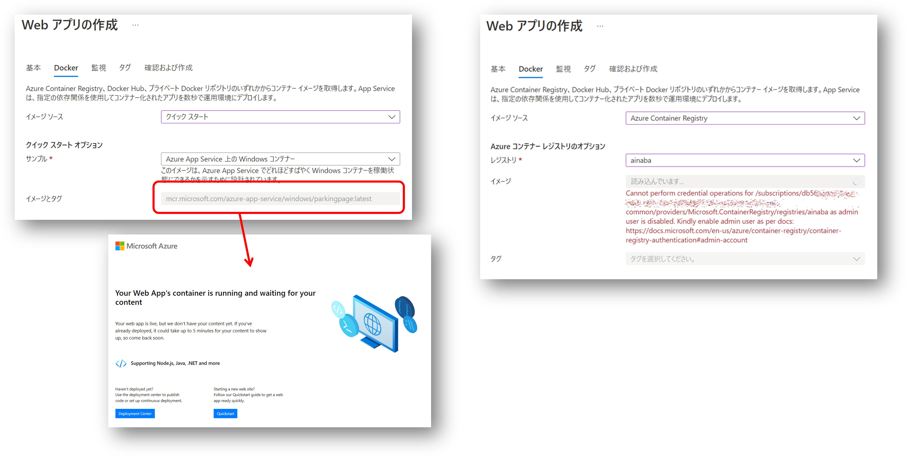
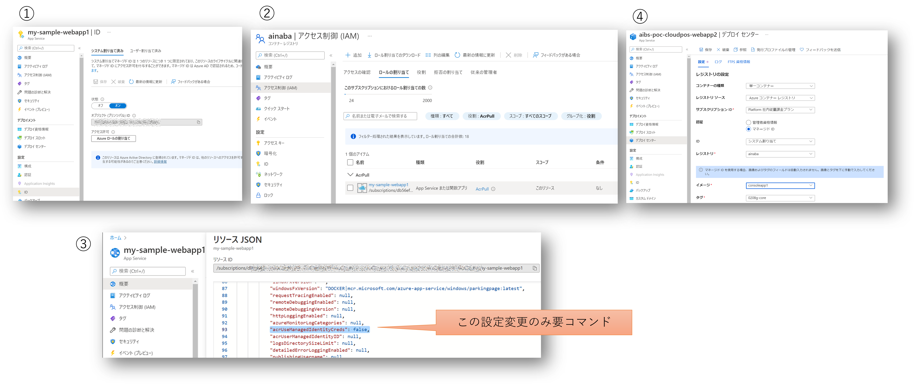
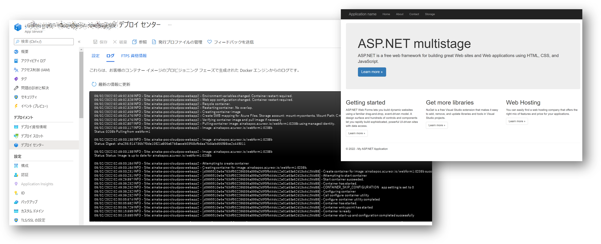

## Web Apps for Container へのコンテナ配置と実行

さてやっと準備が終わったので Web Apps for Container で動かしてみましょう

### Web Apps for Container の作成

まず Web Apps for Container の環境を作ります。
Portal から作成するとわかるのですが、App Service Plan は Premium V3 か Isolated v2 サービスプランである必要があります。
[価格表](https://azure.microsoft.com/ja-jp/pricing/details/app-service/windows/)をご確認いただきたいのですが、比較的お高めのプランになっていますのでご注意ください。


開発や検証用途だと比較的安価な Free/Shared/Basic のサービスプランを利用したくなりますが、残念ながら Windows Container が動作しません。
もし Visual Studio サブスクライバーならば [DevTest 向けの Azure プラン](https://azure.microsoft.com/ja-jp/offers/ms-azr-0148g/)が利用出来ますので、開発や検証フェーズではこちらもご検討いただくと料金が節約できるでしょう。

### 最初はサンプルコンテナで動作させると良い

上記の作成作業の続きになりますが、初期設定するコンテナイメージはクイックスタートなどの、**未認証でアクセスできるレジストリから取得でき、かつ、正常稼働することが確実なもの** をお勧めします。
下記画面キャプチャでいうと `mcr.microsoft.com/azure-app-service/windows/parkingpage:latest` を使っています。



Web Apps for Container は若干動きがもっさりしている（というかアプリ配置が遅い）ので、うまく動いてないのか、待ってればいいだけなのかがわからずやきもきします（私が短気なだけですが）。
また上記画面キャプチャにもあるとおり、このタイミングで ACR から Pull する選択をした場合には管理キーでのアクセスが有効になっている必要があります。
こちらに関しては後で紹介する予定の **Managed ID を利用した ACR からのコンテナイメージの Pull** をさせたい場合には、いったんここはスキップせざるを得ないわけです。

また Web Apps for Contaier を作った後に例えば **VNET 統合してストレージに閉域アクセスする** といったような追加の構成設定をすると想定通りに動かなかったりすることがあると思いますが、
そうした問題解決をする際に、少なくとも自分が開発したコンテナに起因していないだろうというのは精神衛生上にもよろしいかと思います。

### Managed ID を使用して Azure Container Registry からイメージを Pull できるように構成する

Web App の作成が終わったら以下の手順を実施していくことになります。

1. 出来上がった Web App のマネージド ID を有効化する
1. マネージド ID に対して ACR のアクセス許可（ AcrPull ロールの割り当てなど）を行う
1. Web App が ACR にアクセスする際にマネージド ID を使用するように設定する
1. Web App が ACR から Pull するイメージを指定する

詳細な手順は[こちら](https://docs.microsoft.com/ja-jp/azure/app-service/configure-custom-container?pivots=container-windows#use-managed-identity-to-pull-image-from-azure-container-registry)
になります。
なおドキュメント上では全てコマンドラインで実施していますが、3つ目の手順 `Web App が ACR にアクセスする際にマネージド ID を使用するように設定する` 以外は Azure Potal からも実行可能です。



イメージが更新されたことを検知すると Web Apps は自動的にコンテナイメージを Pull して起動、実行中のコンテナと切り替えてくれます。
その進捗状況はデプロイセンターのログタブから参照可能です。
切り替えが完了して開発した Web アプリの画面が表示されれば成功です。
お疲れさまでした。




### コンテナ内のアプリから Managed ID で外部リソースにアクセスする

先ほど有効化したマネージド ID ですが、ACR からのコンテナイメージの Pull だけでなく、コンテナ内部で動作するアプリケーションから利用することもできます。
つまり SQL Database や Blob サービスにも Azure AD 認証を使用してアクセスできるわけです。
使い方自体は[非コンテナの Web App と同様です](https://docs.microsoft.com/ja-jp/azure/app-service/overview-managed-identity?tabs=dotnet)。
.NET Framework であれば [Azure Identity client library for .NET](https://docs.microsoft.com/en-us/dotnet/api/overview/azure/identity-readme?view=azure-dotnet) を使用するのが簡単でしょう。
なお通常の Web App と同様にコンテナにも下記の環境変数が設定されアプリからアクセス可能ですので、REST API として、あるいは他の言語のライブラリを使用しても同様に利用可能でしょう。

|環境変数|値（実行環境ごとに異なる）|
|---|---|
|IDENTITY_ENDPOINT|http://100.64.100.2:41331/MSI/token/|
|IDENTITY_HEADER|889E9580BFDC4BB7BA6F99E73A49E883|

コンテナに限らないのですが、Managed ID はトークンキャッシュの有効期間が長く、ロール割り当て直後などは割と正常に動かないことが多くあります。
おとなしく翌日まで待つか、ユーザー割り当てマネージド ID を別途作成して利用するなどをご検討ください。
以下は公式ドキュメントから引用。
```
マネージド ID のバックエンド サービスは、リソース URI ごとのキャッシュを約 24 時間保持します。 特定のターゲット リソースのアクセス ポリシーを更新し、そのリソースのトークンをすぐに取得した場合、そのトークンの有効期限が切れるまで、期限切れのアクセス許可を持つキャッシュされたトークンを取得し続ける可能性があります。 現在、トークンの更新を強制する方法はありません。
```

### ストレージマウント


Azure Files しか使えない。
パスの指定にちょっと癖がある？
バックスラッシュとか

### スロット

これも最初は Managed IDが割り当てられない、、、


## 監視とか（これは別に分けるかも）

Log Monitor
https://techcommunity.microsoft.com/t5/containers/windows-containers-log-monitor-opensource-release/ba-p/973947
App Service Log 
IIS Log
https://blogs.iis.net/owscott/flush-iis-http-and-ftp-logs-to-disk
HTTP Ping
App Insight は手動インスコ


## 常駐型アプリ（これは別に分けるかも）

Azure Functions が使えない
普通にコンソールアプリ作ってやる感じ
Windows Service なら Service Monitor 使えば良さそう