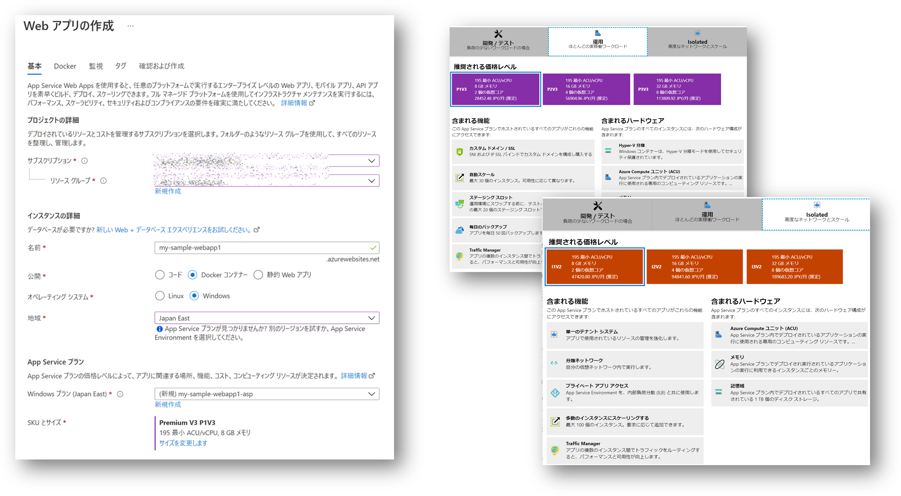

## はじめに

コンテナーといえば Linux コンテナーを扱うことが多いわけですが、 Azure Web Apps 上で Windows Server Container な .NET Framework アプリケーションを動かす機会に恵まれたので、いろいろ調査やらハマったことやらを記録に残しておこうと思います。

## 参考ドキュメント

いきなりのリファレンスですが、おおむね下記に書いてあることではありますので、こちらを適宜ご覧ください。
本エントリではそこから読み取りにくくてハマりそうな（ハマった）ポイントなどをいくつか記載していこうと思います。

- [Azure でカスタム コンテナーを実行する](https://docs.microsoft.com/ja-jp/azure/app-service/quickstart-custom-container?tabs=dotnet&pivots=container-windows)
- [Azure App Service のカスタム コンテナーを構成する](https://docs.microsoft.com/ja-jp/azure/app-service/configure-custom-container?pivots=container-windows)
- [Windows のコンテナーに関するドキュメント](https://docs.microsoft.com/ja-jp/virtualization/windowscontainers/)
- [Azure App Service Team Blob - Windows Containers](https://azure.github.io/AppService/windows-containers/)
- [.NET Framework のアプリケーションの互換性](https://docs.microsoft.com/ja-jp/dotnet/framework/migration-guide/application-compatibility)


## ASP.NET Web アプリケーションの Windows Server コンテナ化

さてクラウドで動かす前にまずは Windows Server コンテナを作っていきたいと思います。

### ベースイメージ選び

さて Windows な Web Apps for Container ではサポートするベースイメージが定められています。
この中でも .NET Framework を動作させられる Windows Server Core のイメージとなると下記の4択となるでしょう。

- [mcr.microsoft.com/windows/servercore:20H2](https://hub.docker.com/_/microsoft-windows-servercore)
- [mcr.microsoft.com/windows/servercore:ltsc2019](https://hub.docker.com/_/microsoft-windows-servercore)
- [mcr.microsoft.com/dotnet/framework/aspnet:4.8-windowsservercore-20H2](https://hub.docker.com/_/microsoft-dotnet-framework-aspnet)
- [mcr.microsoft.com/dotnet/framework/aspnet:4.8-windowsservercore-ltsc2019](https://hub.docker.com/_/microsoft-dotnet-framework-aspnet)

今回は ASP.NET な Web アプリを動かす必要があったので `mcr.microsoft.com/dotnet/framework/aspnet:4.8-windowsservercore-ltsc2019` を使うことにしました。
長期サポートチャネルの方が安心ですしね。

### ベースイメージのスペック調査

Web Apps for Container はユーザーが持ち込むカスタムコンテナーが port 80 で Listen することを想定してます。
このポート番号自体は変更可能なのですが、要は指定したポートで Web アプリが構えていてくれれば、Web Apps がそこにリバースプロキシしてくれるということなのでしょう。
Windows/IIS/.NET Framework な開発をされてきた方なら想像が付くと思いますが、コンテナの中で IIS と ASP.NET をセットアップして、仮想ディレクトリを作ってそこに開発したアプリのコンテンツを置いておけばよさそうですね。

というわけで先ほど選んだイメージがどうなっているか確認します。
Docker Hub のページを参照すると下記の様な記載があります。

```
This image contains:
- Windows Server Core as the base OS
- IIS 10 as Web Server
- .NET Framework (multiple versions available)
- .NET Extensibility for IIS
```

あまりにも都合が良い気がするので、一応該当イメージの Dockerfile も確認してみましょう。
以下は重要そうなところだけ抜き出して加工したものですので、オリジナルは別途ご確認ください。

```Dockerfile
FROM mcr.microsoft.com/dotnet/framework/runtime:4.8-20220111-windowsservercore-ltsc2019

RUN Add-WindowsFeature Web-Server; `
    Add-WindowsFeature NET-Framework-45-ASPNET; `
    Add-WindowsFeature Web-Asp-Net45; `
    Remove-Item -Recurse C:\inetpub\wwwroot\*; `
    Invoke-WebRequest -Uri https://dotnetbinaries.blob.core.windows.net/servicemonitor/2.0.1.10/ServiceMonitor.exe -OutFile C:\ServiceMonitor.exe; `
    &$Env:windir\Microsoft.NET\Framework64\v4.0.30319\ngen update; `
    &$Env:windir\Microsoft.NET\Framework\v4.0.30319\ngen update

EXPOSE 80

ENTRYPOINT ["C:\\ServiceMonitor.exe", "w3svc"]
```

IIS も ASP.NET もセットアップ済みみたいですし、ポート 80 も空いてるみたいなので、*Default Web Site*でおなじみの物理ディレクトリ（C:\inetpub\wwwroot\）にコンテンツをおいてやれば良さそうです。


### ServiceMonitor ってなんぞ？

ENTRYPOINT には何やら見慣れない Exe が指定されていました。
これは [Microsoft IIS Service Monitor](https://github.com/microsoft/IIS.ServiceMonitor) というオープンソースのアプリケーションなのですが、こいつは何者なんでしょうか。
結論から言えば IIS のサービスプロセスの生死とコンテナーの生死を同期するためのモノですね。

そもそも IIS は w3svc という名前の Windows Service として起動されるわけですので、Windows OS が起動すれば勝手に Web サイトがホストされます。
こいつ↓ですね。

```powershell
PS > get-service -Name w3svc

Status   Name               DisplayName
------   ----               -----------
Running  w3svc              World Wide Web Publishing Service
```

つまりコンテナーを起動する際の ENTRYPOINT となる実行可能ファイルなりコマンドなりが存在しないことになります。
このためコンテナー内で IIS を使用したい場合には、この ServiceMonitor.exe を ENTRYPOINT として起動してやると、第一引数で指定された名前のサービス（w3svc）の実行状態を監視してくれるというものになります。
何らかの理由で IIS が停止してしまった際にこの ServiceMonitor.exe も終了するので、結果的にコンテナ自体も終了する、ということになります。
若干の無理やり感が漂ってきますが、従来の Windows 開発と合わせることを考えると、IIS 側の仕組みを変えるよりはこういうラッパー型のアプローチになるのかなというところです。


### コンテナアプリの開発環境を整える

下調べが終わったところでコンテナ開発の環境を整えましょう。
Docker for Windows Desktop を使うのが一番楽ちんではあるのですが、個人的には以下の理由から Azure 上に Windows Server な仮想マシンを立てることにしています。
決してライセンス費用をケチっているわけではありません（VMの方が高額ですし）。

- Windows Server な Docker Image がバカデカいので、我が家の非力な PC と Network 環境では辛い
- 最近は Mac を使って開発することも多いので、リモート開発環境は結局必要になる
- 作ったイメージは Azure Container Registry に Push して Web Apps から Pull するので、 Azure 内で完結させた方が速い
- 開発対象のアプリに合わせたバージョンの Visual Studio をインストールしても他とコンフリクトしない
- Web App を VNET 統合したり Private Link サービスと接続する閉域構成を取ることが多く、どうせ VNET 内に作業マシンが必要になる
- etc...

というわけで Windows Server 2019 な Azure VM を作ることとします。
新しめの Windows Server バージョンでも構わないのですが、バージョンを揃えておくことで以下の様なメリットがあります。

- 互換性のあるバージョンを選択するとプロセス分離モードが利用できるので動きが軽くなる
- ホスト側で同じバージョンの IIS 管理ツールなどを使った確認ができる

さてそれでは Azure 仮想マシンを作成したら（割愛）、リモートデスクトップで接続してコンテナの開発環境を整えていきます。
詳細な手順は[こちら](https://docs.microsoft.com/ja-jp/virtualization/windowscontainers/quick-start/set-up-environment?tabs=Windows-Server)をご参照いただければと思いますが、ざっくり以下の様な感じになります。

```powershell
PS > Install-Module -Name DockerMsftProvider -Repository PSGallery -Force
PS > Install-Package -Name docker -ProviderName DockerMsftProvider
PS > Restart-Computer -Force
```

ちなみに Web Apps for Windows Container 上では [Hyper-V 分離モードで動作する](https://azure.github.io/AppService/2020/09/29/Security-for-Windows-containers-using-Hyper-V-Isolation.html)ことになるので、あまり拘らなくても良いと思います。
もし Hyper-V 分離モードも利用したいのであれば Hyper-V を インストールしてもう一度再起動しておきましょう。

```powershell
PS > Install-WindowsFeature -Name Hyper-V -IncludeManagementTools
PS > Restart-Computer -Force
```

また仮想マシン内で Hyper-V を使うわけですから[入れ子になった仮想化](https://azure.microsoft.com/en-us/blog/introducing-the-new-dv3-and-ev3-vm-sizes/)をサポートする VM サイズである必要があると思われます。
ちなみに私は [Standard_D4ds_v4](https://docs.microsoft.com/ja-jp/azure/virtual-machines/ddv4-ddsv4-series) を使用したところ Hyper-V 分離モードでコンテナ起動が可能でした。

### まずはベースイメージを Pull してくる

さしあたりベースイメージを取り寄せてみましょう。
比較のために Windows Server Core と Nano Server も Pull してみます。

```powershell
PS > docker pull mcr.microsoft.com/dotnet/framework/aspnet:4.8-windowsservercore-ltsc2019 
PS > docker pull mcr.microsoft.com/windows/servercore:ltsc2019 
PS > docker pull mcr.microsoft.com/windows/nanoserver:1809
PS > docker images

REPOSITORY                                  TAG                              IMAGE ID       CREATED       SIZE
mcr.microsoft.com/dotnet/framework/aspnet   4.8-windowsservercore-ltsc2019   7c328b6eebc7   2 weeks ago   8.82GB
mcr.microsoft.com/windows/servercore        ltsc2019                         60d6f56ecebd   3 weeks ago   5.75GB
mcr.microsoft.com/windows/nanoserver        1809                             1b0690f17ad9   3 weeks ago   258MB
```

Web アプリを入れる予定のコンテナサイズは約 9GB あります。
仮想マシンじゃないんですよねコレ。

### アプリケーションコンテナをビルドする

さてここでは ASP.NET WebForm なアプリケーションがすでに開発済みのものとします（既存資産の移行ということにします）。
従来 Visual Studio でビルドして IIS 仮想ディレクトリに配置していたコンテンツを、先ほどのベースイメージに追加してやればいいわけですが、ここでは折角なのでビルドもコンテナでやってしまいましょう。
既存資産の移行とはいえ、新しい実行環境に合わせるために様々な修正等が入ったりもするでしょうから、ビルド～デプロイの一連の流れをコンテナ化しておくと便利ですね。

というわけで Dockerfile です。

```dockerfile
# ビルド用のコンテナ
FROM mcr.microsoft.com/dotnet/framework/sdk:4.7.2-windowsservercore-ltsc2019 AS builder
WORKDIR /work/source
COPY . .
RUN nuget restore -PackagesDirectory ..\packages
RUN msbuild WebForm1.csproj /p:Configuration=Release /p:DeployOnBuild=True \
		/p:DeployDefaultTarget=WebPublish /p:WebPublishMethod=FileSystem /p:DeleteExistingFiles=True /p:PublishUrl=..\publish 

# 実行環境用のコンテナ
FROM mcr.microsoft.com/dotnet/framework/aspnet:4.8-windowsservercore-ltsc2019
WORKDIR /inetpub/wwwroot
COPY --from=builder /work/publish/. .
ENTRYPOINT ["C:\\ServiceMonitor.exe", "w3svc"]
```

まずビルド用のコンテナでは .NET Framework SDK のベースイメージを使用していますが、別途作っておいた ASP.NET アプリのターゲットフレームワークが 4.7.2 だったためバージョンを揃えています。
最新版である .NET Framework 4.8 にターゲットを変更してビルドしてもよいのですが、開発環境である Visual Studio などの設定にも手が入るためバージョンはそのままにしています。
なお、これまで Visual Studio を使用して手動でビルドしていた場合には、コマンドライン(msbuild.exe)を使用してのビルドになるので成功するまでは試行錯誤が必要になるかもしれません。
何らかの自動ビルドシステムを利用していたならば、配置用のビルドバイナリを自動生成するプロセスが既に存在するわけですので、ここは飛ばして後半の実行環境用のコンテナイメージのビルドだけで良いかもしれません。

さて実行環境用のコンテナは Web Apps for Container で動かしたいので、そのサポートの関係から実行環境では .NET Framework 4.8 になります。
前述の通りターゲットフレームワークを変更せずに 4.7.2 向けのビルドバイナリを生成していますので、ここでは .NET Framework の後方互換性に頼ることになります。
今回は 4.7.2 から 4.8 なので比較的バージョンも近く、非互換が発生する可能性は比較的小さいのですが、バージョンの乖離が大きい場合にはもっと手間がかかるかもしれません。

ソースコードをソース管理システムから取り寄せて、上記の Dockerfile を合わせてビルドしていきます。
例えば以下の様な感じでしょうか。
ここでは Web アプリのプロジェクトファイル（.csproj）のあるディレクトリに Dockerfile を置いている想定です。

```powershell
PS > docker build -t webform1:v1 .
PS > docker images

REPOSITORY                                  TAG                                IMAGE ID       CREATED             SIZE
webform1                                    v1                                 da593e58adb4   58 minutes ago      8.85GB
```

### 開発環境でコンテナを動作させる

ビルドが終わったら動作確認しておきましょう。
コンテナ内では IIS が port 80 で待っているはずなので、ホストマシンのポートにマッピングしてやります（ここでは 8888)。
起動したらブラウザ等でアクセスしてみましょう。
（実際にはデータベース等もあるでしょうから、もう少しいろいろとやることはあるかと思いますが）

```powershell
PS > docker run -d -p 8888:80 webform1:v1
PS > start http://localhost:8888
```

### Azure Container Registry にコンテナイメージを Push する

動作確認が終わったら Azure Container Registry に Push しておきます。
下記の $ACRNAME は利用する Azure Container Registry の名前です。

```powershell
PS > docker tag webform1:v1 "${ACRNAME}.azurecr.io/webform1:v1"

PS > az login
PS > az acr login --name $ACRNAME
PS > docker push "${ACRNAME}.azurecr.io/webform1:v1"
```

## Web Apps for Container へのコンテナ配置と実行

さてやっと準備が終わったので Web Apps for Container で動かしてみましょう

### Web Apps for Container の作成

まず Web Apps for Container の環境を作ります。
Portal から作成するとわかるのですが、App Service Plan は Premium V3 か Isolated v2 サービスプランである必要があります。
[価格表](https://azure.microsoft.com/ja-jp/pricing/details/app-service/windows/)をご確認いただきたいのですが、比較的お高めのプランになっていますのでご注意ください。



開発や検証用途だと比較的安価な Free/Shared/Basic のサービスプランを利用したくなりますが、残念ながら Windows Container が動作しません。
もし Visual Studio サブスクライバーならば [DevTest 向けの Azure プラン](https://azure.microsoft.com/ja-jp/offers/ms-azr-0148g/)が利用出来ますので、開発や検証フェーズではこちらもご検討いただくと料金が節約できるでしょう。

### 最初はサンプルコンテナで動作させると良い

作成タイミングでは Managed IDを設定できない

### Managed ID で ACR から Pull する

ACR Pull を Managed ID でやるにはコマンドとか必要

### コンテナ内のアプリから Managed ID で外部リソースにアクセスする

普通に使えるけど、キャッシュが長いのがつらい。ユーザ割り当てMSIDの方が良いかも

### ストレージマウント

Azure Files しか使えない。
パスの指定にちょっと癖がある？
バックスラッシュとか

### スロット

これも最初は Managed IDが割り当てられない、、、


## 監視とか（これは別に分けるかも）

Log Monitor
App Service Log 
IIS Log
HTTP Ping
App Insight は手動インスコ


## 常駐型アプリ（これは別に分けるかも）

Azure Functions が使えない
普通にコンソールアプリ作ってやる感じ
Windows Service なら Service Monitor 使えば良さそう