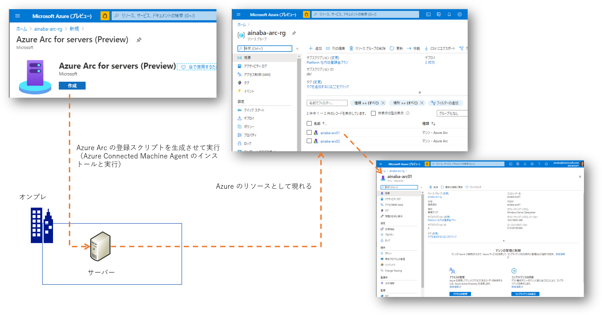
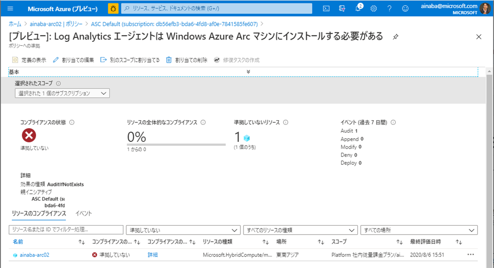
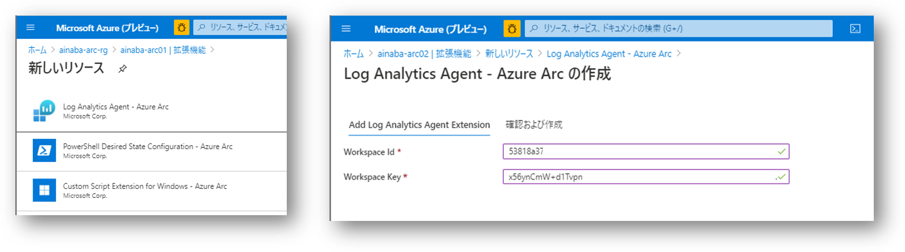
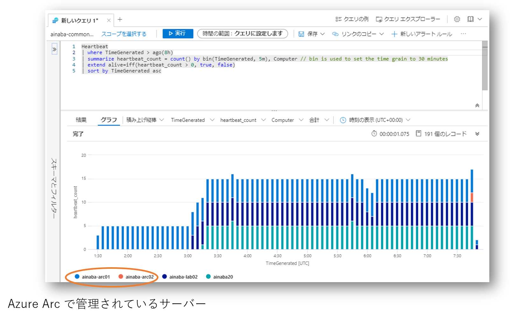
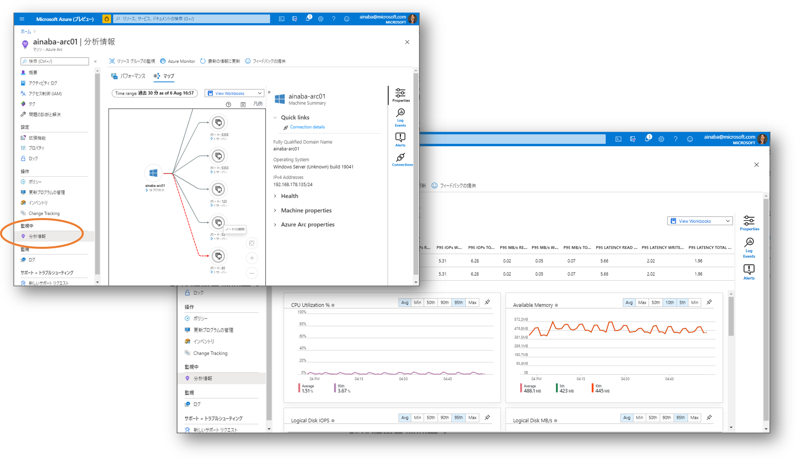
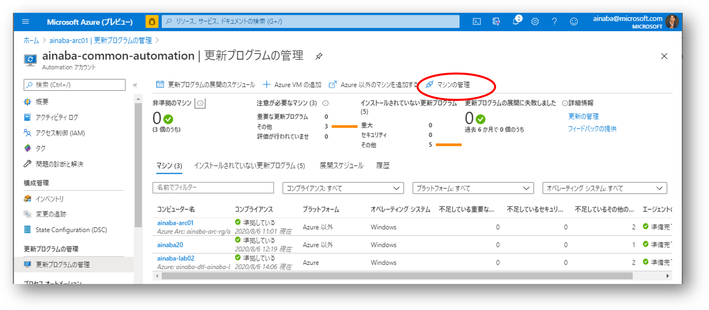
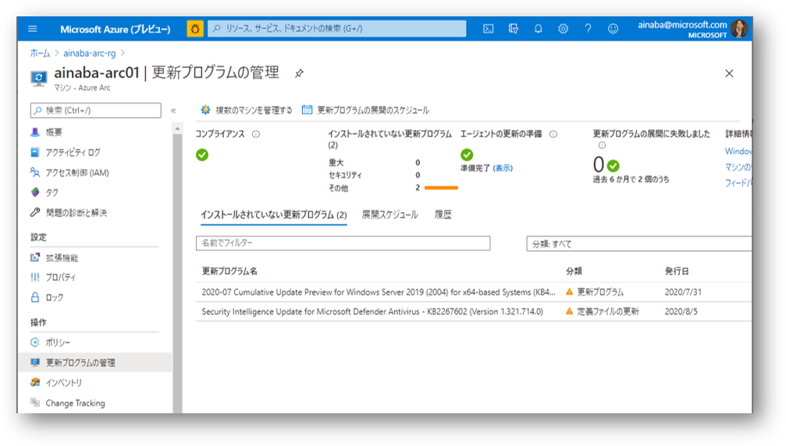
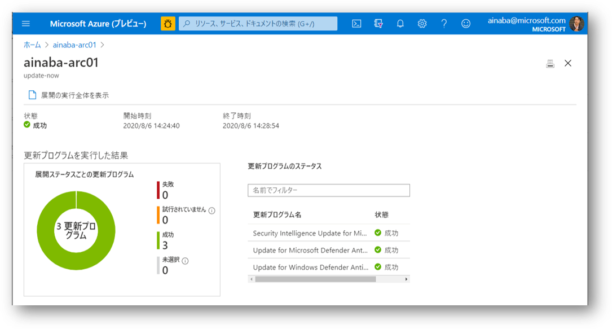

## はじめに

本記事を執筆している 2020 年 8 月段階ではまだまだプレビュー段階の
[Azure Arc for Server](https://docs.microsoft.com/ja-jp/azure/azure-arc/servers/overview)
ですが、なかなかに可能性を感じさせるサービスである一方、結局のところ何がうれしいのかよくわかりません。

お試しする方法としては Azure Portal でサーバーを Arc マシンとして登録するためのスクリプトを生成させて実行するだけです。
そうすると指定したリソースグループ内に Azure Arc のマシンとしてリソースが登録されるのですが、
これを開いても RDP や SSH で接続できるわけでもなくパフォーマンス情報が見えるわけでもありません。
普通の Azure 仮想マシンで期待することはまずは出来なさそうですね、むむむ。

Azure Arc をお試ししていただいた記事はたくさん見かけているのですが（私もそれを参考にしてコレを書いてますが）、
どうもこのあたりで記事そのものは終わっているパターンが多いので、
本記事ではもう少し踏み込んで、オンプレや他社クラウドのサーバーが Azure Portal で管理できることのメリット、を探っていきたいと思います。
まあポータル左側のメニューを見ればいろいろ出来そうなことはわかりますね。

### その１ - Policy で監視する

まずすぐにでも試せることとしては `操作 → 監査` というところですね。
[Azure Policy](https://docs.microsoft.com/ja-jp/azure/governance/policy/overview)
はざっくり言えば Azure Resource が `あるべき姿` になっているか、
すなわち組織のルールにのっとった構成になっているかをチェックしてくれるサービスです。 
例えば「Windows OS のタイムゾーンが日本（UTC+9）になっていること」というようなルールがあったとして、
それに違反した状態のマシンを発見したらコンプライアンス違反として報告してくれるわけです。

既定では何もポリシーが設定されてないのでわかりにくいのですが、
もし [Azure Security Center](https://azure.microsoft.com/ja-jp/services/security-center/) を有効にしていた場合は、
おそらく１つだけコンプライアンス違反として
`Log Analytics エージェントは Windows Azure Arc マシンにインストールする必要がある`
が報告されると思います。

### その２ - Log Analytics で監視する

Azure Arc だけでは各サーバーの情報を収集することができないので Log Analytics が必要になるんですね。
Azure VM も VM エージェントだけでは VM 内部のログを集めたりできなかったですものね。

では Azure Log Analytics ワークスペースに Arc のサーバーを追加していきましょう。
通常のオンプレミスのサーバーでは RDP や SSH で接続してセットアップをしていくわけですが、
Azure Arc の場合は VM と同様に拡張機能が使えます。

Log Analytics エージェントがインストールされてしまえば、あとは Azure VM や普通のサーバーと一緒ですね。
Log Analytics ワークスペースからクエリをかけて一元的に監視データを処理することができます。
例えば以下は収集されたハートビートを可視化したものです。
Azure Arc サーバー以外にも Azure VM や（Log Analyticsをインストールしただけの）普通のサーバーと同様にデータをとることができました。

### その３ - 通信状況やパフォーマンスを監視する

先ほどのように Log Analytics エージェントをインストールしておくと `分析情報` の方も利用できるようになります。
Arc で管理しているサーバーが誰と通信しているのか、CPU/Memory/Disk などをどれほど利用しているのか、なども Azure Portal から管理することができます。

Azure でシステムを構築していると、なんだかんだで「オンプレと連携する」あるいは「外部のクラウドと連携する」なんてシチュエーションは非常に多いわけですが、
そういったシステムを保守・運用していく際にはこういった「複数の環境を横断的に分析・可視化できる」というのは非常に重要ではないでしょうか。

### その４ - 更新プログラムの管理

さて VM やサーバーを運用していて間違いなく問題になるのはパッチ管理です。
ただ既に Log Analytics を使用して各サーバーのログを収集できていますので、パッチの適用情報も収集できるということです。
つまり [Azure Automation Update Management](https://docs.microsoft.com/ja-jp/azure/automation/update-management/update-mgmt-overview) を
使用する準備は整っているわけですね。

さて現在のところ Azure Arc マシンのポータル画面からは Update Management を有効化することができません。
[Log Analytics にリンクされた Automation 側から Update Management を有効にする](https://docs.microsoft.com/ja-jp/azure/automation/update-management/update-mgmt-enable-automation-account)
必要があります。

この図からは下記の３種類のマシンの更新プログラムが管理されていることがわかります。

|コンピュータ名|プラットフォーム|種類|
|---|---|---|
|リソース名が表示されている|Azure 以外|Azure Arc に登録したサーバー|
|リソース名が表示されている|Azure|普通の Azure 仮想マシン|
|リソース名が表示されていない|Azure 以外|Azure Arc に登録されていないサーバー|

右上の方にある `マシンの管理` というところから Azure Arc のサーバーを追加登録することが可能です。
この状態で Arc サーバーの画面に戻ると下記のように不足している更新プログラムやその適用などができるようになります。

適用すべき更新プログラムを検知したら `更新プログラムの展開のスケジュール` から適用するためのジョブを作成します。
現在不足している分のみをインストールする１回限りのジョブを作成するか、あるいは日次・週次など定期的に実行するジョブを作成します。
ジョブの実行結果は以下のようになりました。

Azure Arc for Server の画面からは同様に Change Tracking やインベントリ管理も出来そうなこともわかりますが、ここでは割愛します。

## なにそれおいしいの？

さてここまで紹介してきた内容のほとんどは従来から Log Analytics と Automation を使用すれば出来ていたことではあります。
Azure Arc for Server にはなんの意味があるんでしょうか？

### マネージドリソースとしてのオンプレミスサーバー

Log Analytics は各サーバーにインストールされた Microsoft Monitoring Agent からの収集されたデータに対してクエリ機能を提供しており、
Azure Automation の Update Management などの機能はそれらのクエリから検知されたデータを元に、ジョブを実行します。
つまり Log Analytics にデータをアップロードできる程度にはサーバーやネットワーク環境が正常な状態であることを前提としています。
逆に言えば、何らかの理由からデータをあげることが出来ないサーバーは存在しないことになってしまいますので、管理から漏れる可能性があります。
Azure のリソースとして明示的に登録・管理することで野良サーバーの発生を防ぐ、というのが１つのメリットになると考えます。

### サーバー管理・運用方法の統一

Azure Arc for Server のエージェントさえインストールしてしまえば、Azure 仮想マシンと同様に拡張機能が利用できます。
現時点では Arc に対応している拡張機能は下記の３つと数がとても少ないのですが、
ただこれらを駆使すれば現時点でもサーバーセットアップ作業の大半は Azure ポータルから実行することが出来そうです。

- Log Analytics Agent
- PowerShell Desired State Configuration
- Custom Script Extension

最初に Azure Arc のエージェントをインストールする必要はあるのですが、オンプレのサーバーの利用開始時にはまず最初に Azure に登録することで、
（Azure の仮想マシンと同様に）漏れなく全てのサーバーを管理・運用していくことが出来る基盤となりうるのではないでしょうか。

## まとめ

現時点ではプレビューということもあり、今後の機能改善に期待したいところも多いのですが、いろいろと期待できそうな機能ではあります。
是非お試しいただいて
[フィードバック](https://feedback.azure.com/forums/925690-azure-arc?category_id=375340)
をお寄せいただければ幸いです。

