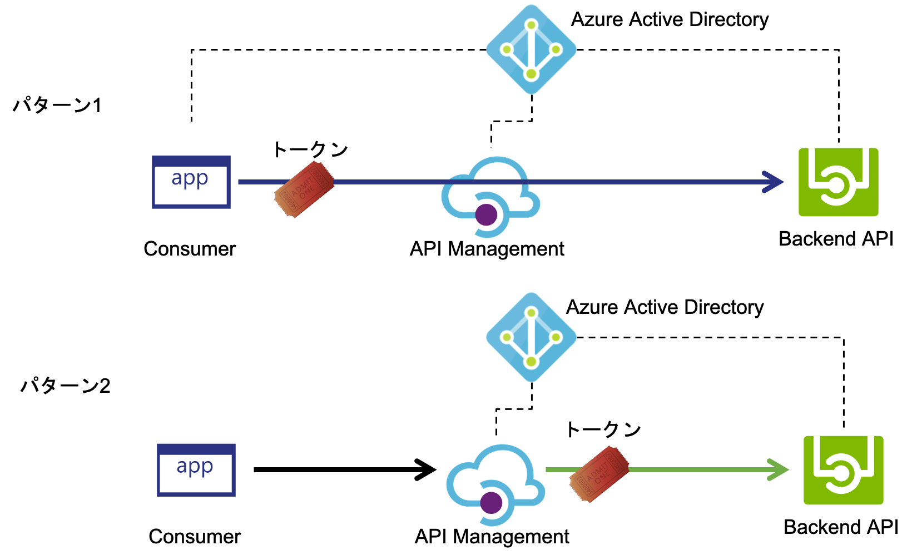
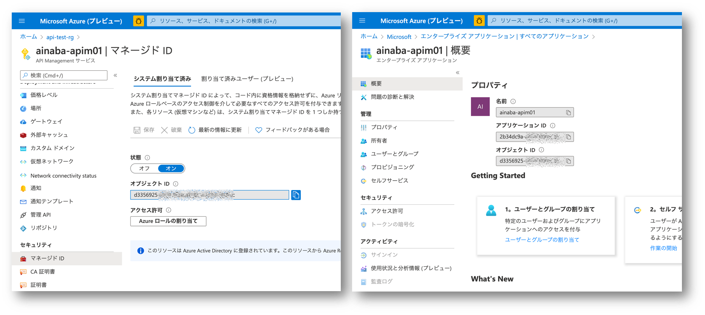
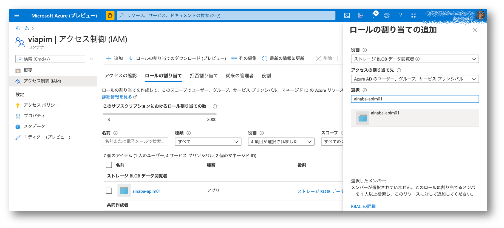
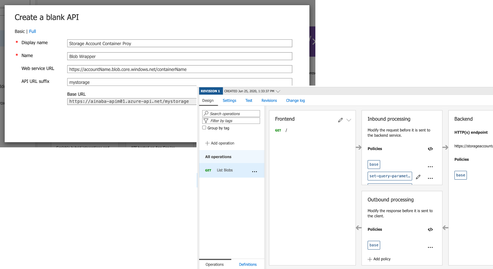
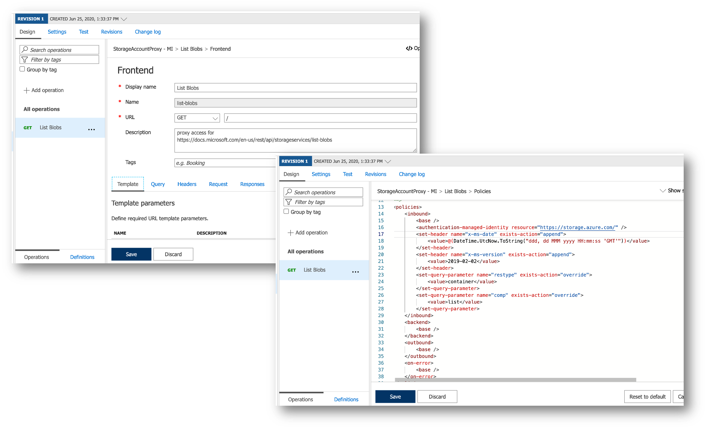
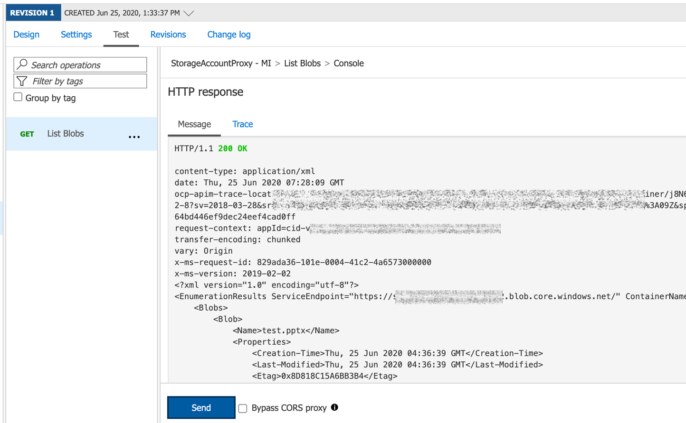

## はじめに

API Management を使用してバックエンドとなる API を保護するように構成したい場合、
各 API は適切な API Management からのリクエストのみを受け付けるように構成・設定する必要があります。
バックエンド API が Azure IaaS やオンプレミスでホストされている場合は、仮想ネットワークへの接続などのオプションが利用可能ですが、
パブリックインターネットで提供されている PaaS や Azure 外部でホストされている API の場合には、
バックエンド API が想定する認証方式に API Management が対応する必要があります。

本記事では Azure AD 認証で保護された API を API Management でラップして利用する方法について紹介します。


## バックエンドの認証パターン

バックエンド API が Azure AD 認証で保護されている場合、認証方式としては以下の2つが考えられます。
1.  呼び出し元が Azure AD からアクセストークンを取得し、API Management はバックエンドに渡すだけ
1.  呼び出し元の認証は API Management が行い、バックエンド API は API Management からのリクエストとして認証を行う



前者のパターンは
[こちらのドキュメント](https://docs.microsoft.com/ja-jp/azure/api-management/api-management-howto-protect-backend-with-aad)
で解説されている方法になりますので、
本記事では後者のパターンについて解説します。
要は API Management がリクエストを中継する際に、Azure AD からアクセストークンを取得し、バックエンド API に渡してあげられれば良いわけです。
API Management は Managed ID に対応していますので、そのトークンを Backend 呼び出しの際に Authorization ヘッダーに埋め込んでやればいいわけですね。

### API Management の Managed ID を有効にする

まず API Management 自体が認証を受ける必要があるので Managed ID を有効にします。
有効にした後 Azure Active Directory のエンタープライズアプリケーション画面で API Management と同じ名前のアプリを検索すると、
同じオブジェクト ID をもったサービスプリンシパルを見つけることが出来ます。



[参考情報](https://docs.microsoft.com/ja-jp/azure/api-management/api-management-howto-use-managed-service-identity)

### バックエンド API の準備

次に Azure AD 認証に対応するバックエンド API を用意する必要がありますが、
ここでは慣れ親しんだ [Azure Blob ストレージ](https://docs.microsoft.com/ja-jp/azure/storage/common/storage-auth-aad) を使用します。

ストレージアカウントを作成したら、適当なコンテナを作成、そのコンテナの RBAC 設定で先の API Management を表すサービスプリンシパルをロールに追加します。
ここでは *ストレージ Blob データ閲覧者* のロールを割り当てていますので、API Management は Blob に対して読み取り系の操作しかできず、書き込みや変更・削除は出来ない（＝そのような機能しか API Management は提供しない）ことになります。


```
ちなみに「アクセスの割り当て先」というドロップダウンから既存のマネージド ID を探すことも出来るのですが、この記事を記載した時点では API Management は表示されなかったのでこのようにしています。
```

### API を定義する

それでは準備が整ったので API Mangement に Blob ストレージのラッパーとなる API を定義していきましょう。
以下では例としてコンテナ内のブログの一覧を表示する操作を作成します。
該当する API である [List Blobs](https://docs.microsoft.com/en-us/rest/api/storageservices/list-blobs) の定義を参考にしていきます。



- API Mangement 上で管理するための API の名前(Display Name, Name)をつける
- バックエンド API となる先ほど作成した Blob コンテナーの URL（Web Service URL）を入力する
- API Management で公開する際のルートパス（API URL suffix）を入力します

詳しくは[変換ポリシー](https://docs.microsoft.com/ja-jp/azure/api-management/api-management-transformation-policies)を参照。

できあがったら List Blobs という名前の Operation を定義していきます。



まずは Frontend の定義です。

- コンテナトップレベルで Blob の一覧を出す予定なので、URL のパスはルート `/` で良いでしょう
- それ以外の入力パラメータは必要なしとします（Template も Query も Headers も設定しない）

次に Inbound の定義です。List Blob の仕様に合わせて各種パラメータを設定していきます。

- `set-query-parameter` を使用して `container` および `list` パラメータを設定します
- `set-header` を使用して `x-ms-date` と `x-ms-version` を設定します

これだけだと認証が通りません。（コンテナを作る際に Private アクセスにしているので）
ここで `authentication-managed-identity` を使用してストレージアカウント（リソース ID が`https://storage.azure/com`）にアクセスするためのトークンを取得します。
これによってバックエンド API にアクセスする際に `Authorization` ヘッダーが設定されます。
先ほど RBAC でアクセス許可しているので認証が通るはず。

詳しくは[認証ポリシー](https://docs.microsoft.com/ja-jp/azure/api-management/api-management-authentication-policies)を参照。

### テスト実行

この API はパラメタ不要で呼び出せるようにしているのでテスト実行画面で `Send` ボタンを押すだけです。
Outbound では特に加工など行っていませんので、オリジナルの List Blob も結果としてコンテナ内のファイル一覧が XML 形式で取得できます。



## まとめ

といわけでファイルの一覧を返すだけの API を提供することができました。
このパターンでは呼び出し元は Blob へのアクセス制御を意識する必要がありませんし、そもそも裏に Blob がいることすらわからない設計にしています。
システム間連携などのパターンでは、バックエンドで呼び出し元を直接認証するのでは無く、API Management を認証ゲートウェイとする方式も多いかなと思います。
ご参考になれば幸いです。

## 補足

なお上記では特に記載も紹介もしていませんが、実際には呼び出し元から API Management へのアクセス制限を行う必要があります。

- [サブスクリプション](https://docs.microsoft.com/ja-jp/azure/api-management/api-management-howto-create-subscriptions)の払い出しを制限する
- [クライアント証明書認証](https://docs.microsoft.com/ja-jp/azure/api-management/api-management-howto-mutual-certificates-for-clients)を要求する
- 各種の [アクセス制限ポリシー](https://docs.microsoft.com/ja-jp/azure/api-management/api-management-access-restriction-policies) を設定する

などのオプションが考えられます。


